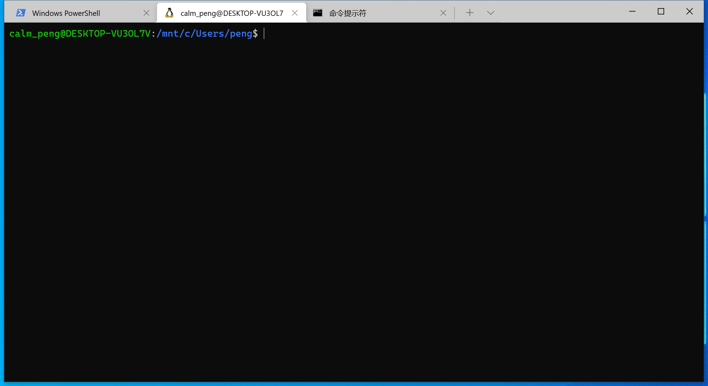

### Blog 搭建

#### 起因

在和朋友交流的时候发现，已经发现自己很久没有写 Blog 了，最近的一次已经以大学期间。出来已经工作将近一年了，在这一方面似乎没有成长。发现自己身边的人都在不断地成长，自己也该努努力，不能再懈怠了。

在经过自我反省后，确定开始重新写 Blog 了，希望通过这种方式来记录生活和工作中涉及的到的技术和疑难。国内的 Blog 平台，大多都用过，发现自己在那些平台上面的文章，数量和质量都不堪入目，有一些水文章的嫌疑，有一点看中粉丝和阅读量。个人觉得目前适合自己的其实就是简简单单的文章记录就好了。所以觉得在 Github 这里记录一下自己的 Blog。

---

#### 搭建过程

首先之间就了解过 一点 Github Page，用来写 Blog 听好的，所以直接查看了一些网络上的教程，这一部分创建仓库和克隆到本地来写文件就十分友好。

但是找一个适合自己的 Jetyll 模板就是一些难了，虽然 Jetyll 的官网有很多推荐，但是感觉都很复杂的 UI,感觉不适合自己的，最后选了 [watery](https://github.com/brennanbrown/watery) 制作的模板，修改一小部分。

其实到这里就可以了，是要正常的写文章，pull 到 Github 就好了。但是如果想要在本地预览的话，就需要本地安装 Ruby 的环境，Jetyll  由 Ruby 编写，而 Ruby 的包管理是 RubyGem （简称 gem），然后管理一个项目的所有的 gem 是有 Bundle 来控制，这里可以参考  [jekyll 中文指南 ](http://jekyllcn.com/) 来安装，在 Window 下不推荐安装，因为实测了一下的确和官网的说的可能存在很多问题。

我这边的操作是，我的环境是 Window 10，首先在应用开启 WSL 系统功能，然后安装自己想要的 Linux 版本的子系统，可在 Window 10 自带的 商店安装，最后也是在商店里面 安装 Window Terminal，不得不提Window Terminal 的 UI 是真的接近 Linux 中对应的 Terminal的，体验很好。在 WSL 中，也就是在 Linux 子系统中，安装 Jekyll 是十分方便的，然后在对应的工程下启用 Jekyll 对应的服务就可以，Window 和 WSL 中文件交互是 Window 中的文件区挂在在 WSL 中的 /mnt 下，端口是共有的，所以启用服务后在 Window中便可直接查看效果。

---

#### 效果图

Window 10 的 Terminal，不管装不装 WSL 都是十分推荐安装了该软件，新增窗口时候可以选择是传统的 CMD 命令窗口、PowerSheel 、WSL 系统。

 

---

参考资料：

[Jekyll 中文指南](https://jekyllcn.com/)

[从安装到基本设置——Win10子系统入门简明教程](https://zhuanlan.zhihu.com/p/35735513)

