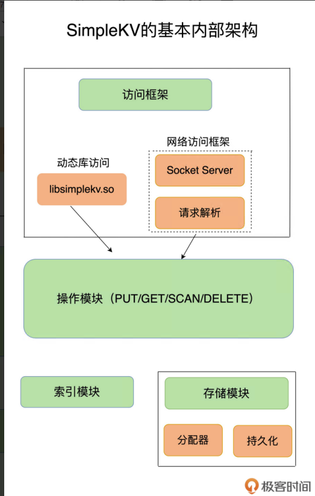
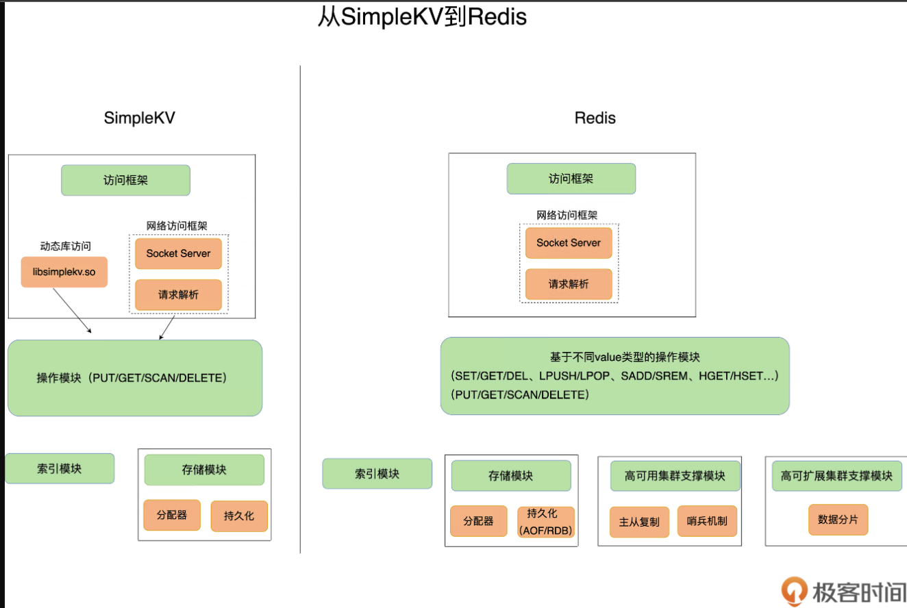

# **01 |** **基本架构：一个键值数据库包含什么？**

## 设计一个简单的键值数据库  SimpleKV

可以**存什么样的数据** （数据模型）

对数据可以做**什么样的操作** （操作接口）

键值对保存在内存还是外存 （储存）

**如何进行设计选择，我们通常需要考虑键值数据库的主要应用场景**

---

一个键值数据库包括了**访问框架、索引模块、操作模块和存储模块**四部分（见下图）

### 访问模式

* 一种是**通过函数库调用的方式供外部应用使用**，比如，上图中的 libsimplekv.so，就是以动态链接库的形式链接到我们自己的程序中，提供键值存储功能；
* 另一种是**通过网络框架以 Socket 通信的形式对外提供键值对操作**，这种形式可以提供广泛的键值存储服务。

### 索引模块

**索引的作用是让键值数据库根据 key 找到相应 value 的存储位置，进而执行操作**

数据库采用的索引并不相同，例如，Memcached 和 Redis 采用哈希表作为 key-value 索引，而 RocksDB 则采用跳表作为内存中 key-value 的索引

## 对比 Redis

* Redis 主要通过**网络框架**进行访问，而不再是动态库了，这也使得 Redis 可以作为一个基础性的网络服务进行访问，扩大了 Redis 的应用范围。
* Redis 数据模型中的 **value 类型很丰富**，因此也带来了更多的操作接口，例如面向列表的 LPUSH/LPOP，面向集合的 SADD/SREM 等。在下节课，我将和你聊聊这些 value 模型背后的数据结构和操作效率，以及它们对 Redis 性能的影响。
* Redis 的**持久化模块**能支持两种方式：日志（AOF）和快照（RDB），这两种持久化方式具有不同的优劣势，影响到 Redis 的访问性能和可靠性。
* SimpleKV 是个简单的单机键值数据库，但是，Redis 支持**高可靠集群和高可扩展集群**，因此，Redis 中包含了相应的集群功能支撑模块。