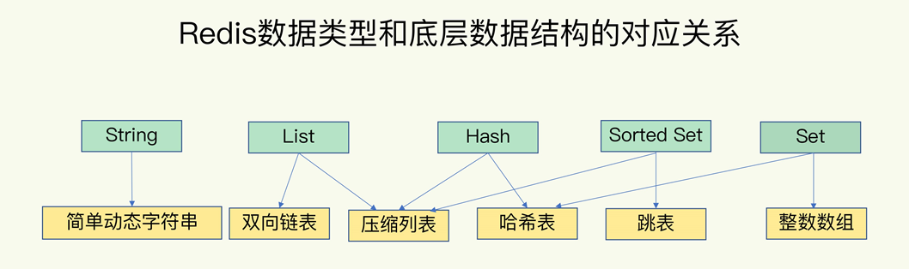
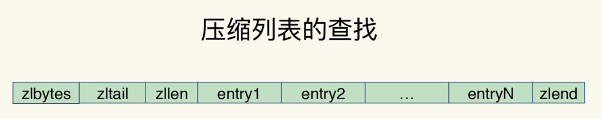
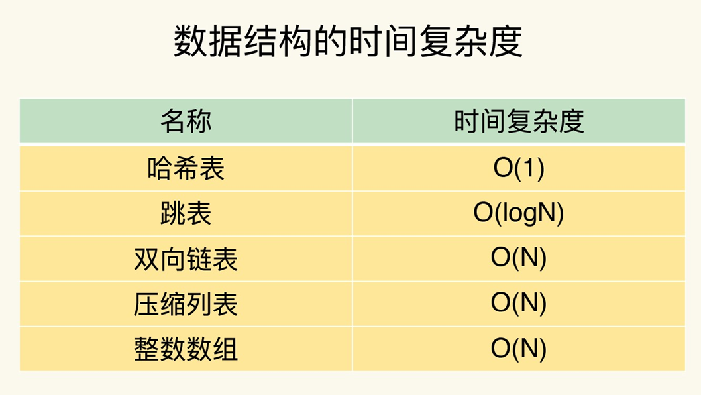
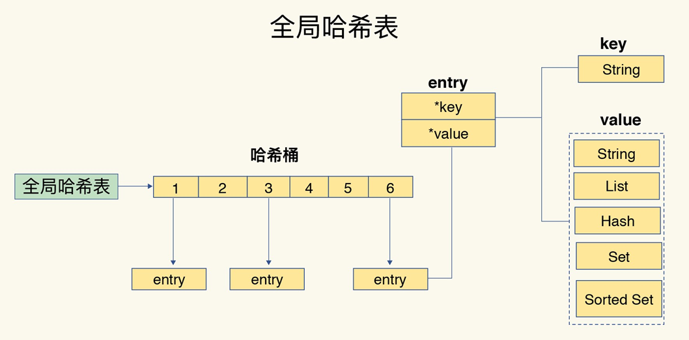
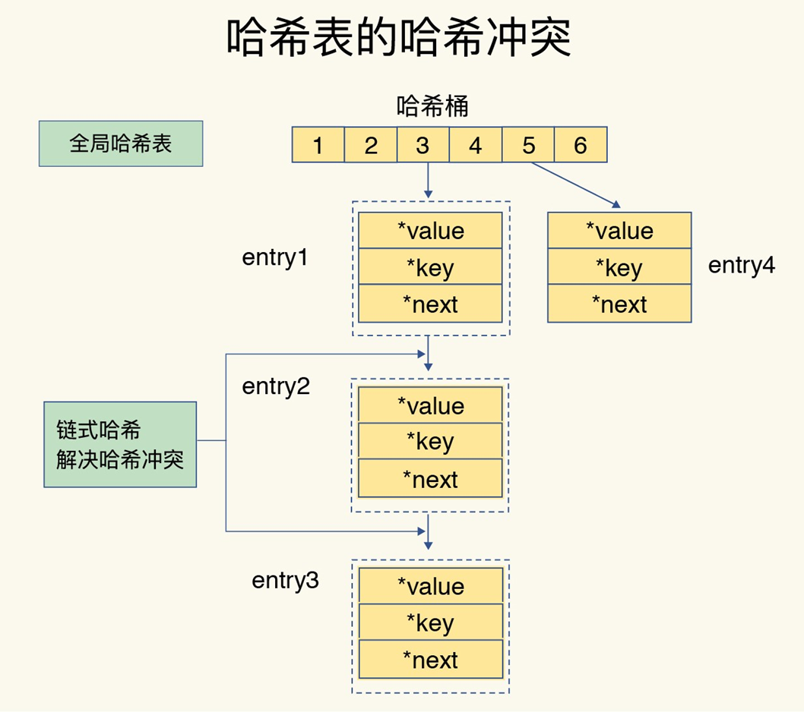
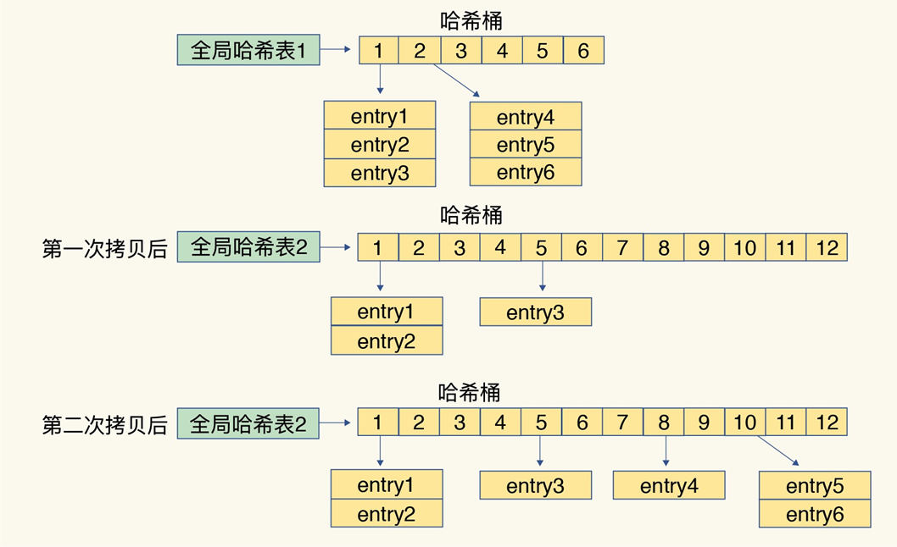

# **02 |** 数据结构：快速的Redis有哪些慢操作？

## 为什么 Redis 那么快

* 一方面，这是因为它是内存数据库，所有操作都在内存上完成，内存的访问速度本身就很快。

* 另一方面，这要归功于它的数据结构。这是因为，键值对是按一定的**数据结构**来组织的，操作键值对 终就是对**数据结构** 进行增删改查操作，所以**高效的数据结构是 Redis 快速处理数据的基础**

  

---

## 数据结构

### 值的数据结构

> Redis 键值对中**值的数据类型**，也就是数据的保存形式 String（字符串）、List（列表）、Hash（哈希）、Set（集合）和 Sorted Set（有序集合）

底层数据结构一共有 6 种，分别是**简单动态字符串、双向链表、压缩列表、哈希表、跳表和整数数组**

我们会把这四种类型称为集合类型，它们的特点是**一个键对应了一个集合的数据**。

> 集合类型的数据，底层数据结构有两种，不是同时使用。
>
> 这些底层实现结构的选择取决于数据类型的特性和使用场景。Redis 根据不同的情况选择最适合的底层实现来提高性能和效率。
>
> 1. 列表(List)数据类型的底层实现结构有两种：压缩列表（ziplist）和双向链表（linkedlist）。压缩列表是一种紧凑且连续存储的数据结构，适用于小型列表。而双向链表则是一个具有灵活插入和删除操作的数据结构，适用于大型列表。
> 2. 哈希(Hash)数据类型的底层实现结构同样有两种：ziplist 和哈希表（hashtable）。哈希表是一种基于数组和链表实现的散列结构，适用于存储键值对较多的情况。而 ziplist 是一种紧凑的数据结构，适用于存储键值对较少的情况。
> 3. 集合(Set)数据类型的底层实现结构也有两种：整数集合（intset）和哈希表。整数集合是一种有序、紧凑并且不可重复的数据结构，适用于只包含整数元素的情况。哈希表同样适用于存储不同类型的元素。
> 4. 有序集合(Sorted Set)数据类型的底层实现也采用了两种结构：跳跃表（zset）和哈希表。跳跃表是一种有序的数据结构，可以支持快速的范围查找操作，适用于按照分数排序的场景。而哈希表同样可以存储带有分数的元素。

#### 压缩列表

压缩列表实际上**类似于一个数组**，数组中的每一个元素都对应保存一个数据。和数组不同的是，**压缩列表在表头有三个字段 zlbytes、zltail 和 zllen**，分别表示列表长度、列表尾的偏移量和列表中的 entry 个数；压缩列表在表尾还有一个 zlend，表示列表结束

#### 跳表

跳表在链表的基础上，**增加了多级索引，通过索引位置的几个跳转，实现数据的快速定位**.

这个查找过程就是在多级索引上跳来跳去， 后定位到元素。这也正好符合“跳”表的叫法。当数据量很大时，跳表的查找复杂度就是 O(logN)。

### 键值的数据结构

Redis 使用了一个哈希表来保存所有键值对。一个哈希表，其实就是一个数组，数组的每个元素称为一个哈希桶。不管值是 String，还是集合类型，哈希桶中的元素都是指向它们的指针。

#### **哈希表的冲突问题和 rehash 可能带来的操作阻塞**

哈希冲突可能也会越来越多，这就会导致某些哈希冲突链过长，进而导致这个链上的元素查找耗时长，效率降低。

所以，Redis 会对哈希表做 **rehash 操作**。rehash 也就是增加现有的哈希桶数量，**让逐渐增多的 entry 元素能在更多的桶之间分散保存**，减少单个桶中的元素数量，**从而减少单个桶中的冲**突。

#### ReHash 实现

Redis 默认使用了**两个全局哈希表**：哈希表 1 和哈希表 2。一开始，当你刚插入数据时，**默认使用哈希表 1**，此时的哈希表 2 并**没有被分配空**间。随着数据逐步增多，Redis 开始执行 rehash，这个过程分为三步：

1. 给哈希表 2 分配更大的空间，例如是当前哈希表 1 大小的两倍；
2. 把哈希表 1 中的数据重新映射并拷贝到哈希表 2 中；
3. 释放哈希表 1 的空间

**第二步涉及大量的数据拷贝，如果一次性把哈希表 1 中的数据都迁移完，会造成 Redis 线程阻塞**

##### 解决方案**渐进式 rehash**

简单来说就是在第二步拷贝数据时，Redis 仍然正常处理客户端请求，每处理一个请求时，从哈希表 1 中的第一个索引位置开始，顺带着将这个索引位置上的所有 entries 拷贝到哈希表 2 中；等处理下一个请求时，再顺带拷贝哈希表 1 中的下一个索引位置的 entries。

> Redis 会执行定时任务，定时任务中就包含了 rehash 操作。 在 rehash 被触发后，即使没有收到新请求，Redis 也会定时执行一次 rehash 操作，而且，每次执行时长不会超过 1ms，以免对其他任务造成影响。

## 慢操作

**集合类型的范围操作**，因为要遍历底层数据结构，复杂度通常是 O(N)。这里，我的建议是：**用其他命令来替代**，例如可以用 SCAN 来代替，避免在 Redis 内部产生费时的全集合遍历操作。

复杂度较高的 List 类型，它的两种底层实现结构：**双向链表和压缩列表的操作复杂度都是 O(N)**。因此，我的建议是：**因地制宜地使用 List 类型**。例如，既然它的 POP/PUSH 效率很高，那么就**将它主要用于 FIFO 队列场景，而不是作为一个可以随机读写的集合**

