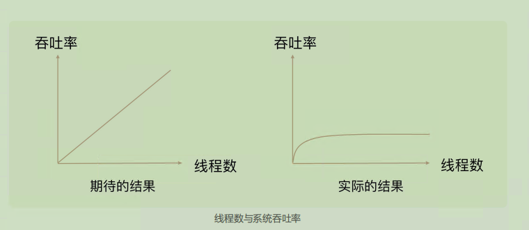
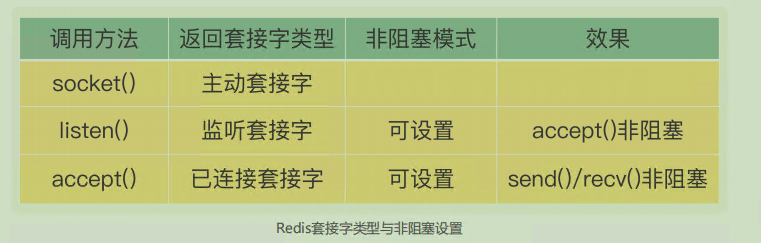
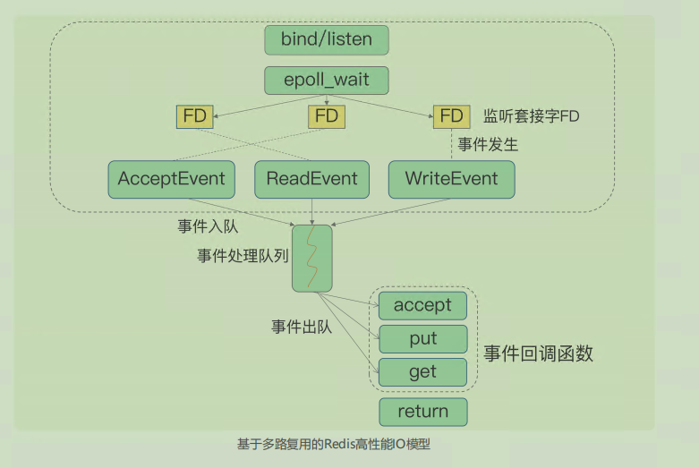

# **03 |** 高性能IO模型：为什么单线程Redis能那么快？

Redis 是单线程，主要是指 **Redis 的网络 IO和键值对读写**是由一个线程来完成的，这也是 Redis 对外提供键值存储服务的主要流程。但 Redis 的其他功能，比如持久化、异步删除、集群数据同步等，其实是由额外的线程执行的

> Redis 6.0 之后 网络IO部分可以设置为 多线程

单线程成可以避免： **多线程编程模式面临的共享资源的并发访问控制问题**  & 也避免了线程上下文切换

采用多线程开发一般会引入**同步原语来保护共享资源的并发访问**，这也会降**低系统代码的易调试性和可维护性**。为了避免这些问题，Redis 直接采用了单线程模式

---

Redis 的大部分操作在内存上完成，再加上它采用了高效的**数据结构**，例如哈希表和跳表，这是它**实现高性能的一个重要原因**。另一方面，就是 Redis 采用了**多路复用机制**，使其在网络 IO 操作中能**并发处理大量的客户端请求**

---

## **基本** **IO** **模型与阻塞点**

处理一个 Get 请求，需要监听客户端请求（bind/listen），和客户端建立连接（accept），从 socket 中读取请求（recv），解析客户端发送请求（parse），根据请求类型读取键值数据（get），最后给客户端返回结果，即向 socket 中写回数据（send）

有潜在的阻塞点，分别是 **accept() 和 recv()**

1. 当 Redis监听到一个客户端有**连接请求**，但一直未能成功建立起连接时，会阻塞在 accept() 函数这里，导致其他客户端无法和 Redis 建立连接
2. 类似的，当 Redis 通过 recv() 从一个客户端**读取数据时**，如果数据一直没有到达，Redis 也会一直阻塞在 recv()

## **非阻塞模式**

Socket 网络模型的非阻塞模式设置。

socket() 方法会返回主动套接字，然后调用 listen() 方法，将主动套接字转化为监听套接字，此时，可以监听来自客户端的连接请求。最后，调用 accept() 方法接收到达的客户端连接，并返回已连接套接字。

**监听套接字，我们可以设置非阻塞模式**：当 Redis 调用 accept() 但一直未有连接请求到达时，Redis 线程可以返回处理其他操作，而不用一直等待。但是，你要注意的是，调用 accept() 时，已经存在监听套接字了。

## **基于多路复用的高性能** **I/O** 模型

Linux 中的 IO 多路复用机制是指一个线程处理多个 IO 流，就是我们经常听到的select/epoll 机制。

在 Redis 只运行单线程的情况下，**该机制允许内核中，同时存在多个监听套接字和已连接套接字**。内核会一直监听这些套接字上的连接请求或数据请求。一旦有请求到达，就会交给 Redis 线程处理，这就实现了一个 Redis 线程处理多个IO 流的效果

多个 FD 就是刚才所说的多个套接字；

select/epoll 提供了**基于事件的回调机制**，即**针对不同事件的发生，调用相应的处理函数**。

> Netty 也是基于 IO 多路复用

这些事件会被放进一个事件队列，**Redis 单线程对该事件队列不断进行处理**。这样一来，Redis 无需一直轮询是否有请求实际发生，这就可以避免造成 CPU 资源浪费。同时，Redis 在对事件队列中的事件进行处理时，会调用相应的处理函数，这就实现了基于事件的回调。

因为 Redis 一直在对事件队列进行处理，所以能及时响应客户端请求，提升Redis 的响应性能

