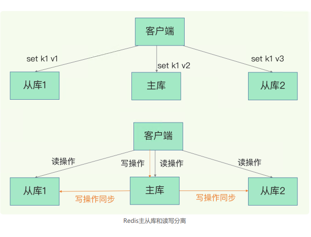
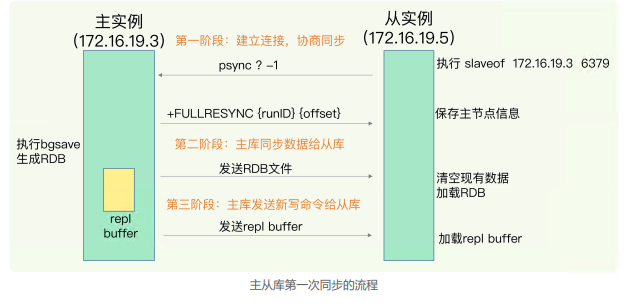
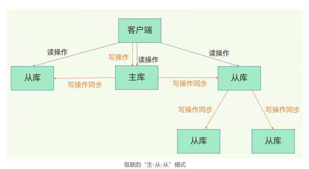
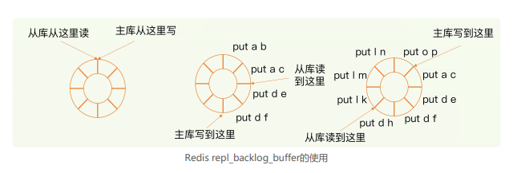
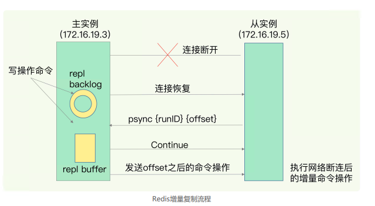
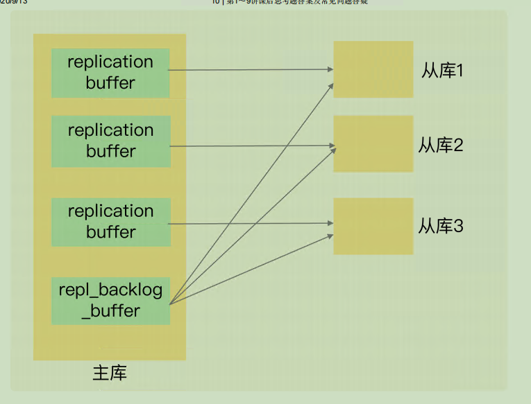

# 06 | 数据同步：主从库如何实现数据一致？

如果 Redis 发生了宕机，它们可以分别通过回放日 志和重新读入 RDB 文件的方式恢复数据，从而保证尽量少丢失数据，提升可靠性。我们在实际使用时 只运行了一个 Redis 实例，那么，如果这个实例宕机了，它在恢复期间，是无法服务新来的数据存取请求。

AOF 和 RDB 保证数据 尽量少丢失；**Redis 增加副本冗余量 保证服务尽量少中断**

这么多副本，它们之间的数据如何保持一致呢？数据读写操作可以发给所有的实例吗

---

Redis 提供了主从库模式，以保证数据副本的一致，主从库之间采用的是读写分离的方式。

1. 读操作：主库、从库都可以接收；
2.  写操作：首先到主库执行，然后，主库将写操作同步给从库

为什么要采用读写分离的方式呢？

* 多个实例都进行写的话，我们要保持这个数据在三个实例上一致，就要涉及到**加锁、实例间协商是否完成修 改等一系列操作**，但这会带来巨额的开销，当然是不太能接受的

主从库模式一旦采用了读写分离，所有数据的修改只会在主库上进行，不用协调三个实例。主库有了最新的数据后，会同步给从库，这样，主从库的数据就是一致的

## **主从库间如何进行第一次同步**

启动多个 Redis 实例的时候，它们相互之间就可以通过 **replicaof**（Redis 5.0 之前 使用 **slaveof**）命令形成主库和从库的关系，之后会**按照三个阶段**完成数据的第一次同步

1. 主从建立连接、协商同步

   1. **从库给主库**发送 **psync 命令**，表示要进行数据同步。主库根据这个命令的参数 来启动复制。psync 命令包含了**主库的 runID 和复制进度 offset 两个参数**

      >  runID，是每个 Redis 实例启动时都会自动生成的一个随机 ID，用来唯一标记这个实 例。当从库和主库第一次复制时，因为不知道主库的 runID，所以将 runID 设 为“？”。 offset，此时设为 -1，表示第一次复制

   2. 主库收到 psync 命令后，会用 **FULLRESYNC 响应命令**带上两个参数：**主库 runID 和主库 目前的复制进度 offset**，返回给从库

      FULLRESYNC 响应表示**第一次复制采用的全量复制**，也就是说， 主库会把当前所有的数据都复制给从库。

2. 主库将所有数据同步给从库。从库收到数据后，在本地完成数据加载。这个 过程依赖于**内存快照生成的 RDB 文件**。

   1. 主库执行 bgsave 命令，生成 RDB 文件，接着将文件发给从库

   2. 从库接收到 RDB 文件后，**会先清空当前数据库**，然后加载 RDB 文件。这是因为**从库在通过 replicaof 命令开始和主库同步前，可能保存了其他数据**。为了避免之前数据的影响，从库需要先把 当前数据库清空。

      >  这里就有可能 发生脑裂后，旧的主节点接受到新数据，然后降为从库，同步的时候数据丢失了。

   3. 在主库将数据同步给从库的过程中，**主库不会被阻塞，仍然可以正常接收请求**。否则， Redis 的服务就被中断了。这些请求中的写操作并没有记录到刚刚生成的 RDB 文件 中。**为了保证主从库的数据一致性，主库会在内存中用专门的 replication buffer，记录 RDB 文件生成后收到的所有写操作**

3. 主库会把**第二阶段执行过程中新收到的写命令，再发送给从库**。具体的操作是，当主库完成 RDB 文件发送后，就会把此时 r**eplication buffer 中的修改操作发给从库**，从库再重新执行这些操作。这样一来，主从库就实现同步了

## 主从级联模式分担全量复制时的主库压力	

一次全量复制中，对于主库来说，需要完成两个耗时的操作：**生成 RDB 文件和传输 RDB 文件**

如果从库数量很多，而且都要和主库进行全量复制的话，就会导致**主库忙于 fork 子进程生 成 RDB 文件**，进行数据全量同步。

**通过“主 - 从 - 从”模式将主库生成 RDB 和传输 RDB 的压力， 以级联的方式分散到从库上**

部署主从集群的时候，可以手动选择一个从库（比如选择内存资源配置 较高的从库），用于级联其他的从库。

一旦主从库完成了全量复制，它们之间就会一 **直维护一个网络连接**，主库会通过这个连接将后续陆续收到的命令操作再同步给从库，这个过程也称为**基于长连接的命令传播，可以避免频繁建立连接的开销**

风险点：最常见的就是**网络断连或阻塞。**

## 主从库间网络断了怎么办

在 Redis 2.8 之前，如果主从库在命令传播时出现了网络闪断，那么，从库就会和主库重 新进行一次全量复制，开销非常大

从 Redis 2.8 开始，网络断了之后，主从库会采用**增量复制的方式继续同步**。全量复制是同步所有数据，而增量复制只会把主从库网络断连期间主库收到的命令，同步给从库。

**repl_backlog_buffer **

当主从库断连后，主库会把断连期间收到的写操作命令，**写入 replication buffer**，**同时**也 会把这些操作命令也写入 r**epl_backlog_buffer** 这个缓冲区。

repl_backlog_buffer 是一个环形缓冲区，主库会记录自己写到的位置，从库则会记录自己已经读到的位置。

主从都有指针标记自己的位置：  master_repl_offset 、slave_repl_offset

**主从库的连接恢复之后**，从库首先会给主库发送 psync 命令，并把自己当前的 slave_repl_offset 发给主库，主库会判断自己的 master_repl_offset 和 slave_repl_offset 之间的差距。

此时，主库只用把 master_repl_offset 和 slave_repl_offset 之间的命令操作同步给从库就行。

因为 repl_backlog_buffer 是一个环形缓冲区，所以在 缓冲区写满后，主库会继续写入，此时，就会覆盖掉之前写入的操作。如果从库的读取速 度比较慢，就有可能导致从库还未读取的操作被主库新写的操作覆盖了，这会导致主从库 间的数据不一致。

> repl_backlog_size 这个参 数。这个参数和所需的缓冲空间大小有关。缓冲空间的计算公式是：缓冲空间大小 = 主库 写入命令速度 * 操作大小 - 主从库间网络传输命令速度 * 操作大小。在实际应用中，考虑 到可能存在一些突发的请求压力，我们通常需要把这个缓冲空间扩大一倍，即 repl_backlog_size = 缓冲空间大小 * 2，这也就是 repl_backlog_size 的最终值。

增量复制时主从库的数据不一致风险就降低了。

不过，如果并发请求量非常大，连两倍的缓冲空间都存不下新操作请求的话，此时，主从库数据仍然可能不一致。一方面，你可以根据 Redis 所在服务器的内存资源再适当增加 repl_backlog_size 值，比如说设置成缓冲空间大小的 4 倍，另一方面，你可以考虑使用切 片集群来分担单个主库的请求压力。

> 总的来说，**replication buffer 是主从库在进行全量复制时**，主库上用于和从库连接的客户端的 buffer，而 repl_backlog_buffer 是为了支持**从库增量复制**，主库上用于持续保存写操作的一块专用 buffer
>
> Redis 主从库在进行复制时，**当主库要把全量复制期间的写操作命令发给从库**时，主库会先创建一个客户端，用来连接从库，然后通过这个客户端，把写操作命令发给从库。
>
> 在内存中，主库上的客户端就会对应一个 buffer，这个 buffer 就被称为 replication buffer。Redis 通过 client_buffer 配置项来控制这个 buffer 的大小。**主库会给每个从库建立一个客户端，所以 replication buffer 不是共享的，而是每个从库都有一个对应的客户端**。
>
> repl_backlog_buffer 是一块专用 buffer，**在 Redis 服务器启动后，开始一直接收写操作命令，这是所有从库共享的**。主库和从库会各自**记录自己的复制进度**，所以，不同的从库在进行恢复时，会把自己的复制进度（slave_repl_offset）发给主库，主库就可以和它独立同步

**小结：**

全量复制虽然耗时，但是对于从库来说，如果是第一次同步，全量复制是无法避免的，所 以，我给你一个小建议：一个 Redis 实例的数据库不要太大，一个实例大小在几 GB 级别 比较合适，这样可以减少 RDB 文件生成、传输和重新加载的开销。

另外，为了避免多个从 库同时和主库进行全量复制，给主库过大的同步压力，我们也可以采用“主 - 从 - 从”这 一级联模式，来缓解主库的压力。

长连接复制是主从库正常运行后的常规同步阶段。在这个阶段中，主从库之间通过命令传播实现同步。（这里会用到 replication buffer）。不过，这期间如果遇到了网络断连，增量复制就派上用场了。

> 为什么主从库间的复制不使用 AOF?
>
> 1. RDB 文件是二进制文件，无论是要把 RDB 写入磁盘，还是要通过网络传输 RDB，IO 效率都比记录和传输 AOF 的高
> 2. 在从库端进行恢复时，用 RDB 的恢复效率要高于用 AOF

