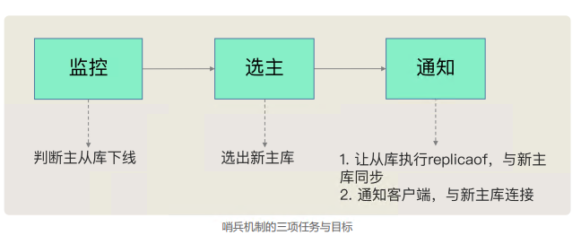
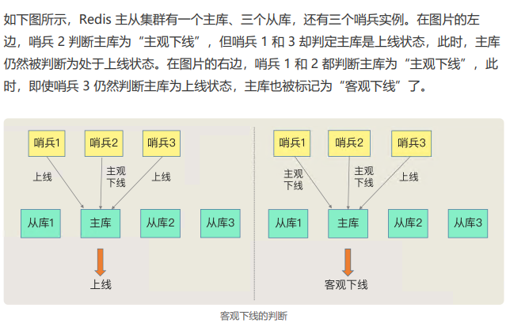
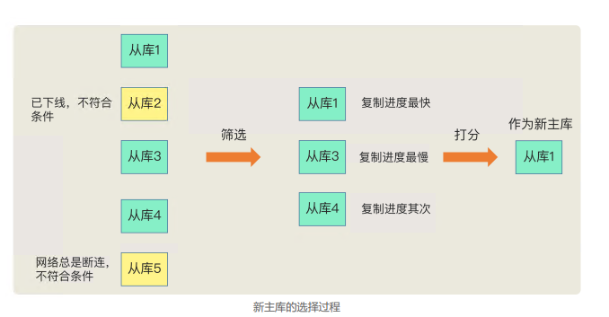

# 07 | 哨兵机制：主库挂了，如何不间断服务？

如果从库发生故障了，客户端可以 继续向主库或其他从库发送请求，进行相关的操作，**但是如果主库发生故障了，那就直接会影响到从库的同步**，因为从库没有相应的主库可以进行数据复制操作了，也**无法进行写操作**。

---

如果主库挂 了，我们就需要运行一个新主库，比如说把一个从库切换为主库，把它当成主库。

**三个问题**

1. 主库真的挂了吗？ 
2. 该选择哪个从库作为主库？ 
3. 怎么把新主库的相关信息通知给从库和客户端呢？

## **哨兵机制的基本流程**

哨兵其实就是一个运行在特殊模式下的 Redis 进程，主从库实例运行的同时，它也在运行。

哨兵主要负责的就是三个任务：**监控、选主（选择主库）和通知**

### **监控**

监控是指哨兵进程在运行时，**周期性地给所有的主从库发送 PING 命令**， 检测它们是否仍然在线运行。如果从库**没有在规定时间内响应哨兵的 PING 命令**，哨兵就 会把它标记为“下线状态”；同样，如果主库也没有在规定时间内响应哨兵的 PING 命 令，**哨兵就会判定主库下线，然后开始自动切换主库的流程**。

### **选主（选择主库）**

主库挂了以后，哨兵就需要从很多个从库 里，**按照一定的规则选择一个从库实例**，把它作为新的主库。这一步完成后，现在的集群 里就有了新主库

### **通知**

在执行通知任务时，哨兵会把新主库的连接信息 发给其他从库，让它们执行 **replicaof** 命令，和新主库建立连接，并进行数据复制。同时， 哨兵会把新主库的连接信息通知给客户端，让它们把请求操作发到新主库上。

---

### 主观下线和客观下线

哨兵进程会使用 PING 命令检测它自己和主、从库的网络连接情况，用来判断实例的状态。如果哨兵发现主库或从库对 PING 命令的响应超时了，那么，哨兵就会先把它标记 为“主观下线”.

如果检测的是主库，那么，哨兵还不能简单地把它标记为“主观下线”，开启主从切换。

因为很有可能存在这么一个情况：那就是**哨兵误判了，其实主库并没有故障**。可是，一旦启动了主从切换，后续的选主和通知操作都会带来额外的计算和通信开销。

主库实际并没有下线，但是哨兵误以为它下线 了。误判一般会发生在**集群网络压力较大、网络拥塞**，或者是主库**本身压力较大**的情况下。

> 哨兵判断主库下线了，就会开始选择新主库，并让从库和新主库进行数据同步，这个 过程本身就会有开销，例如，哨兵要花时间选出新主库，从库也需要花时间和新主库同 步。而在误判的情况下，主库本身根本就不需要进行切换的，所以这个过程的开销是没有 价值的。

**如何减少误判**

哨兵机制也是类似的，它通常会采用多实例组成的集群模式进行部署，这也被称为哨兵集群。引入多个哨兵实例一起来判断，就可以避免单个哨兵因为自身网络状况不好，而误判主库下线的情况。同时，多个哨兵的网络同时不稳定的概率较小，由它们一起做决策，误判率也能降低。

“客观下线”的标准就是，**当有 N 个哨兵实例时，最好要有 N/2 + 1 个实例判 断主库为“主观下线”**，才能最终判定主库为“客观下线”。这样一来，就可以**减少误判的概率**，也能避免误判带来的无谓的主从库切换。

> 有多少个实例做出“主观下 线”的判断才可以，可以由 Redis 管理员自行设定

### 如何选定新主库？

**“筛选 + 打分”**

我们在多个从库 中，先按照一定的筛选条件，把不符合条件的从库去掉。然后，我们再按照一定的规则， 给剩下的从库逐个打分，将得分最高的从库选为新主库

**筛选**

除了要检查从库的**当前在线状态**，还要判断它之前的**网络连接状态**。如果从库总是和主库断连，而且断连次数超出了一定的阈值，我们就有理由相信，这个从库 的网络状况并不是太好，就可以把这个从库筛掉了

> 使用配置项 down-after-milliseconds * 10。其中，down-after-milliseconds **是我们认定主从库断连的最大连接超时时间**。如果在 down-after-milliseconds 毫秒内，主从节点都没有通过网络联系上，我们就可以认为主从节点断连 了。如果发生断连的次数超过了 10 次，就说明这个从库的网络状况不好，不适合作为新主库。

**打分**

我们可以分别按照三个规则依次进行三轮打分，这三个规则分别是**从库优先级、从库复制进度以及从库 ID 号**。**只要在某一轮中，有从库得分最高，那么它就是主库了**，选主过程到此结束。如果没有出现得分最高的从库，那么就继续进行下一轮

1. 第一轮：优先级最高的从库得分高。用户可以通过 slave-priority 配置项，给不同的从库设置不同优先级
2. 第二轮：和旧主库同步程度最接近的从库得分高。主从库同步时有个命令传播的过程。在这个过程中，主库会用 master_repl_offset 记录当前的最新写操作在 repl_backlog_buffer 中的位置，而从库会 用 slave_repl_offset 这个值记录当前的复制进度
3. 第三轮：ID 号小的从库得分高。有一个默认的规定：在优先级和复制进度都相同的情况下，ID 号最小的从库得分最高，会被选为新主库。

