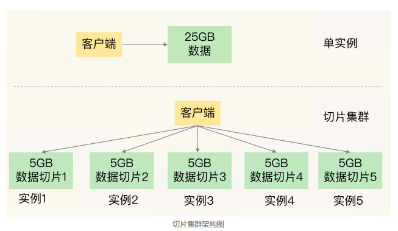
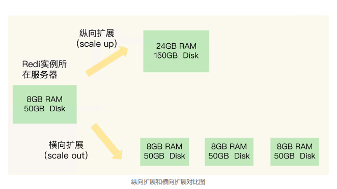
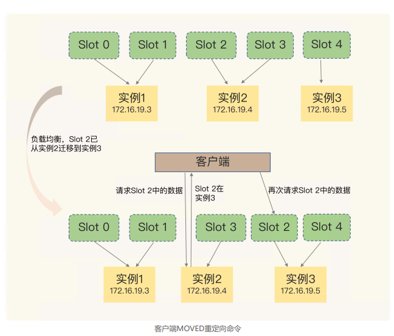

# 09 | 切片集群：数据增多了，是该加内存还是加实例？

曾遇到过这么一个需求：要用 Redis 保存 5000 万个键值对，每个键值对大约是 512B， 为了能快速部署并对外提供服务，我们采用云主机来运行 Redis 实例，那么，该如何选择 云主机的内存容量呢？

我想到的第一个方案就是：选择一台 32GB 内存的云主机来部署 Redis。因为 32GB 的内存能保存所有数据，而且还留有 7GB，可以保证系统的正常运行。同时，我还 采用 RDB 对数据做持久化，以确保 Redis 实例故障后，还能从 RDB 恢复数据。

在使用 RDB 进行持久化时，**Redis 会 fork 子进程来完 成，fork 操作的用时和 Redis 的数据量是正相关的**，而 fork 在执行时会阻塞主线程。数据量越大，fork 操作造成的主线程阻塞的时间越长。所以，**在使用 RDB 对 25GB 的数据 进行持久化时，数据量较大，后台运行的子进程在 fork 创建时阻塞了主线程，于是就导致 Redis 响应变慢了。**

---

切片集群，也叫分片集群，就是指启动多个 Redis 实例组成一个集群，然后按照一定的规则，把收到的数据划分成多份，每一份用一个实例来保存。



在实际应用 Redis 时，随着用户或业务规模的扩展，保存大量数据的情况通常是无法避免 的。而切片集群，就是一个非常好的解决方案。

---

## 如何保存更多数据？

大内存云主机和切片集群两种方法

纵向扩展：升级单个 Redis 实例的资源配置，包括增加内存容量、增加磁盘容量、使用 更高配置的 CPU。就像下图中，原来的实例内存是 8GB，硬盘是 50GB，纵向扩展后， 内存增加到 24GB，磁盘增加到 150GB。

横向扩展：横向增加当前 Redis 实例的个数，就像下图中，原来使用 1 个 8GB 内存、 50GB 磁盘的实例，现在使用三个相同配置的实例。



**纵向扩展**

优

1. 实施起来简单、直接

劣

1. 当使用 RDB 对数据进行持久化时，如果数据量增加，需要的内存也会增加，主线程 fork 子进程时就可能会阻塞。不过，如果你不要 求持久化保存 Redis 数据，那么，纵向扩展会是一个不错的选择。
2. 纵向扩展会受到硬件和成本的限制。这很容易理 解，毕竟，把内存从 32GB 扩展到 64GB 还算容易，但是，要想扩充到 1TB，就会面临硬件容量和成本上的限制了。

**横向扩展**

优

1. 要想保存更多的数据， 采用这种方案的话，只用增加 Redis 的实例个数就行了

   在面向百万、千万级别的用户规模时，横向扩展的 Redis 切片集群会是一个非常好的选择

劣

1. 数据切片后，在多个实例之间如何分布？
2.  客户端怎么确定想要访问的数据在哪个实例上

## 数据切片和实例的对应分布关系

切片集群是一种保存大量数据的通用机制，这个机制可以有不同的实现方案。从 3.0 开始，官方提供了一个 名为 Redis Cluster 的方案，用于实现切片集群。Redis Cluster 方案中就规定了数据和实例的对应规则。

Redis Cluster 方案采用**哈希槽**（Hash Slot，接下来我会直接称之为 Slot）， 来处理数据和实例之间的映射关系

### key 映射到哈希槽

1. 首先根据键值对的 key，按照CRC16 算法计算一个 16 bit 的值；
2. 然后，再用这个 16bit 值对 **16384** 取模，得到 0~16383 范围内的模数，每个模数代表一个相应编号的哈希槽

### 哈希槽映射到具体的Redis实例

1. 可以使用 cluster create 命令创建集群，此时，Redis 会自动把这些**槽平均分布在集群实例**上。例如，如果集群中有 N 个实例，那么，每个实例上的槽个数为 16384/N 个。

2. 也可以使用 **cluster meet 命令手动建立实例间的连接**，形成集群，再使用 **cluster addslots** 命令，指定每个实例上的哈希槽个数

> 假设集群中不同 Redis 实例的内存大小配置不一
>
> 遇到这种情况时，你可以根据不同实例的资源配置情况，使用 cluster addslots 命令手动分配哈希槽


```shell
// 在手动分配哈希槽时，需要把 16384 个槽都分配完，否则Redis 集群无法正常工作
redis-cli -h 172.16.19.3 –p 6379 cluster addslots 0,1
redis-cli -h 172.16.19.4 –p 6379 cluster addslots 2,3
redis-cli -h 172.16.19.5 –p 6379 cluster addslots 4
```

### 客户端如何定位数据

在定位键值对数据时，它所处的哈希槽是可以通过**计算**得到的，这个计算可以在客户端发送请求时来执行。但是，**要进一步定位到实例，还需要知道哈希槽分布在哪个实例上**。

客户端和集群实例建立连接后，实例就会把哈希槽的分配信息发给客户端。但是，在集群刚刚创建的时候，每个实例只知道自己被分配了哪些哈希槽，是不知道其他实例拥有的哈希槽信息的。

**Redis 实例会把自己的哈希槽信息发给和它相连接的其它实例**，来完成哈希槽分配信息的扩散。当实例之间相互连接后，每个实例就有所有哈希槽的映射关系了

客户端收到哈希槽信息后，会把哈希槽信息缓存在本地。当客户端请求键值对时，会先计 算键所对应的哈希槽，然后就可以给相应的实例发送请求了。

实例和哈希槽可能发生变化：

1. 在集群中，实例有新增或删除，Redis 需要重新分配哈希槽；
2. 为了负载均衡，Redis 需要把哈希槽在所有实例上重新分布一遍

实例之间还可以通过相互传递消息，获得最新的哈希槽分配信息，但是，客户端是无法主动感知这些变化的。这就会导致，它缓存的分配信息和最新的分配信息就不一致 了，那该怎么办呢？

**Redis Cluster 方案提供了一种重定向机制**，所谓的“重定向”，就是指，客户端给一个实例发送数据读写操作时，这个实例上并没有相应的数据，客户端要再给一个新实例发送操 作命令。

当客户端把一个键值对的操作请 求发给一个实例时，如果这个实例上并没有这个键值对映射的哈希槽，那么，这个实例就 会给客户端返回下面的 MOVED 命令响应结果，这个结果中就包含了新实例的访问地址

```shell
GET hello:key
(error) MOVED 13320 172.16.19.5:637
```



还有一个中业务情况就是 

Slot 中数据从 实例2 ---> 实例3中，处于中间状态，这时候有请求（迁移部分）

```shell
GET hello:key
(error) ASK 13320 172.16.19.5:6379
```


> 和 MOVED 命令不同，**ASK 命令并不会更新客户端缓存的哈希槽分配信息**
>
> ASK 命令的作用只是让客户端能给新实例发送一次请求，而不像 MOVED 命令那样，会更 改本地缓存，让后续所有命令都发往新实例。


----

> 需要注意的是，Redis 集群的客户端**不需要手动实现一致性哈希算法，因为该算法已经由 Redis 集群内部实现**。客户端只需要使用对应的库或驱动程序，如`redis-py-cluster`库，来连接 Redis 集群，并且直接使用普通的 Redis 命令进行数据操作。**库会自动处理数据的定位和节点间的转发。**
