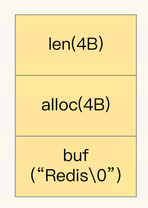
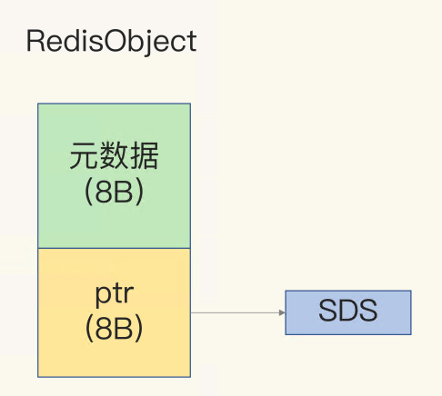
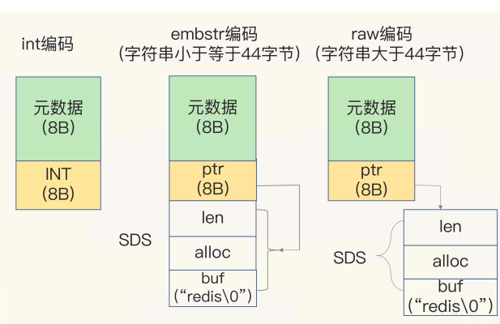
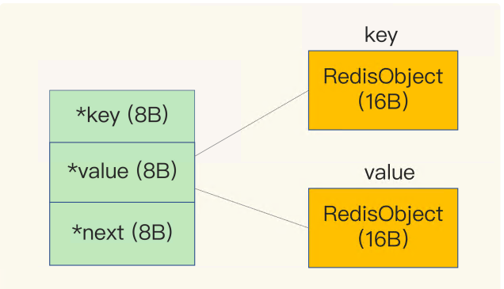
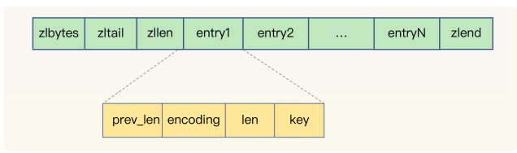

# 11 | “万金油”的String，为什么不好用了？

深入学习一下 数据结构部分，感受一下 Redis 如何快。

了解下 String 类型的**内存空间消耗**问题，以及选择节省内存开销的数据类型的解决方案。

---

场景： 保存了 1 亿张图片，记录图片ID 对应的图片储存ID。ID 的长度都是是 10位数。典型的“键 - 单值”模式保存了 1 亿张图片，大约用了 6.4GB 的内存,这样出现了 大内存 Redis 实例因为生成 RDB 而响应变慢的问题

> String 类型可以保存二进制字节流，就像“万金油”一样，只要把数据转成二进制 字节数组，就可以保存了

**String 类型并不是适用于所有场合的，它有一个明显的短板，就是它保存数据时所消耗的内存空间较多**

**集合类型的数据结构**，集合类型有非常节省内存空间的底层实现结构，但是，集合类型保存的数据模式，是一个键对应**一系列值**，并不适合直接保存单值的键值对。所以，**我们就使用二级编码的方法，实现了用集合类型保存单值键值对，Redis 实例的内存空间消耗明显下降了**。

---

## 为什么 String 类型内存开销大？

计算保存了 1 亿张图片的信息，用了约 6.4GB 的内存，**一个图片 ID 和 图片存储对象 ID 的记录平均用了 64 字节**

除了记录实际数据，String 类型还需要**额外的内存空间记录数据长度、空间使用**等 信息，这些信息也叫作元数据。当实际保存的数据较小时，元数据的空间开销就显得比较 大了

保存 64 位有符号整数时，String 类型会把它保存为一个 8 字节的 Long 类型整数， 这种保存方式通常也叫作 **int 编码方式**

当你保存的数据中包含字符时，String 类型就会用**简单动态字符串**（Simple Dynamic String，SDS）结构体来保存.

各个部分：

* buf：字节数组，保存实际数据。为了表示字节数组的结束，Redis 会自动在数组最后加 一个“\0”，这就会额外占用 1 个字节的开销。 

* len：占 4 个字节，表示 buf 的已用长度。 

* alloc：也占个 4 字节，表示 buf 的实际分配长度，一般大于 len。

除了 SDS 的额外开销，还有一个来自于 **RedisObject 结构体的开销**。

> 因为 Redis 的数据类型有很多，而且，不同数据类型都有些相同的元数据要记录（比如最后一次访问的时间、被引用的次数等），所以Redis 会用一个 **RedisObject 结构体来统 一记录这些元数据**，同时指向实际数据
>
> 理解是指针然后带通用信息

一个 RedisObject 包含了 **8 字节的元数据和一个 8 字节指针**，这个指针再进一步指向具体 数据类型的实际数据所在。

为了节省内存空间，Redis 还对 Long 类型整数和 SDS 的内存布局做了专门的设计。

1. 当保存的是 Long 类型整数时，RedisObject 中的指针就直接赋值为整数数据 了，这样就不用额外的指针再指向整数了，节省了指针的空间开销

2. 保存的是字符串数据，并且字符串小于等于 44 字节时，RedisObject 中的元数据、指针和 SDS 是一块连续的内存区域，这样就可以避免内存碎片。这种布局方式也被 称为 **embstr 编码方式**

   字符串大于 44 字节时，SDS 的数据量就开始变多了，Redis 就不再把 SDS 和 RedisObject 布局在一起了，而是会给 SDS 分配独立的空间，并用指针指向 SDS 结构。 这种布局方式被称为 **raw 编码模式**

Redis 会使用一个全局哈希表保存所有键值对，哈希表的每一项是一个 dictEntry 的结构体，用来指向一个键值对。**dictEntry 结构中有三个 8 字节的指针， 分别指向 key、value 以及下一个 dictEntry，三个指针共 24 字节**

这三个指针只有 24 字节，为什么会占用了 32 字节呢？这就要提到 Redis 使用的内存分配库 jemalloc 了。 jemalloc 在分配内存时，会根据我们申请的字节数 N，找一个比 N 大，但是最接近 N 的 2 的幂次数作为分配的空间，这样可以减少频繁分配的次数。

如果你申请 6 字节空间，jemalloc 实际会分配 8 字节空间；如果你申请 24 字 节空间，jemalloc 则会分配 32 字节。所以，在我们刚刚说的场景里，dictEntry 结构就占 用了 32 字节。

小结：

一个图片 ID 和 图片存储对象 ID 的记录平均用了 64 字节。

1. 10 位数的图片 ID 和图片存储对象 ID 是 Long 类型整数，所以可以直接用 int 编码 的 RedisObject 保存（每个 int 编码的 RedisObject **元数据部分占 8 字**节，指针部分被直 接赋值为 8 字节的整数了）每个 ID 会使用 16 字节，加起来一共是 **32 字节**

2. 全局哈希 dictEntry 结构 24字节 但是分配了 **32 字节**

## 用什么数据结构可以节省内存？

压缩列表（ziplist），这是一种非常节省内存的结构。

表头有三个字段 zlbytes、zltail 和 zllen，表尾巴还有zlend表示结束。

1. zlbytes：用于记录**整个压缩列表占用的字节数**。
2. zltail：指向压缩列表**最后一个节点的偏移量**。
3. zllen：表示压缩列表中**节点的数量**。

每个 entry 的 元数据：

1. prev_len，表示前一个 entry 的长度

   有两种取值情况：1 字节或 5 字节。 **当上 一个 entry 长度小于 254 字节时，prev_len 取值为 1 字节，否则，就取值为 5 字节** (压缩列表中 zlend 的取值默认是 255)

2. len：表示自身长度，4 字节

3. encoding：表示编码方式，1 字节

4. content：保存实际数据

> 这些 entry 会挨个儿放置在内存中，不需要再用额外的指针进行连接，这样就可以节省指 针所占用的空间。

Redis 基于压缩列表实现了 List、Hash 和 Sorted Set 这样的集合类型，这样做的最大好处就是**节省了dictEntry 的开销**。当你用 String 类型时，**一个键值对就有一个 dictEntry， 要用 32 字节空间**。但采用集合类型时，**一个 key 就对应一个集合的数据，能保存的数据多了很多**，但也只用了一个 dictEntry，这样就节省了内存

## 如何用集合类型保存单值的键值对？

在保存单值的键值对时，可以采用**基于 Hash 类型的二级编码方法**。这里说的二级编码， **就是把一个单值的数据拆分成两部分，前一部分作为 Hash 集合的 key，后一部分作为 Hash 集合的 value**

二级编码方法中采用的 ID 长度是有讲究的。 Redis Hash 类型的两种底层实现结构，分别是压缩列表和哈希 表。

Hash 类型底层结构什么时候使用压缩列表，什么时候使用哈希表呢？其实，Hash 类型设置了用压缩列表保存数据时的两个阈值，一旦超过了阈值，Hash 类型就会用哈希表 来保存数据了

* hash-max-ziplist-entries：表示用压缩列表保存时**哈希集合中的最大元素个数**。 
* hash-max-ziplist-value：表示用压缩列表保存时**哈希集合中单个元素的最大长度**

一旦从压缩列表转为了哈希表，Hash 类型就会一直用哈希表进行保存，而不会再转回压缩列表了。在节省内存空间方面，哈希表就没有压缩列表那么高效了。

**为了能充分使用压缩列表的精简内存布局**，我们一般要控制保存在 Hash 集合中的元素个数。所以，在刚才的二级编码中，我们只用图片 ID 最后 3 位作为 Hash 集合的 key，也就 保证了 Hash 集合的元素个数不超过 1000，同时，我们把 hash-max-ziplist-entries 设置 为 1000，这样一来，Hash 集合就可以一直使用压缩列表来节省内存空间了。

