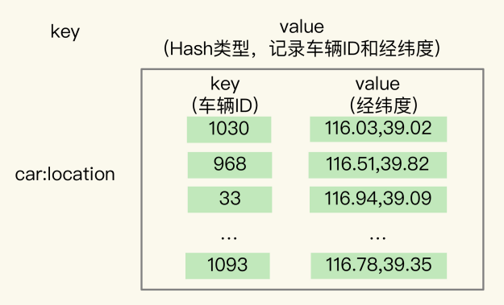
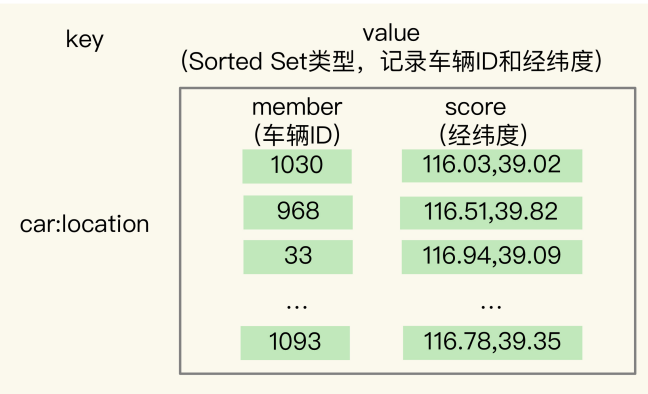
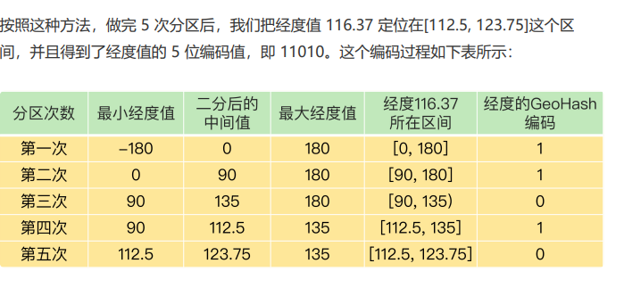
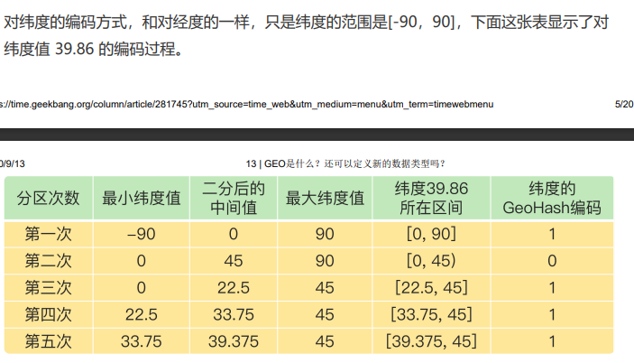
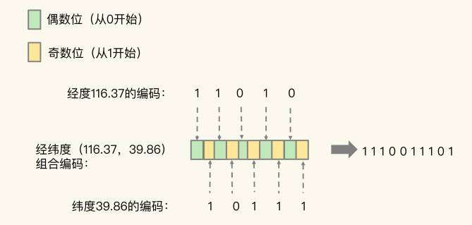
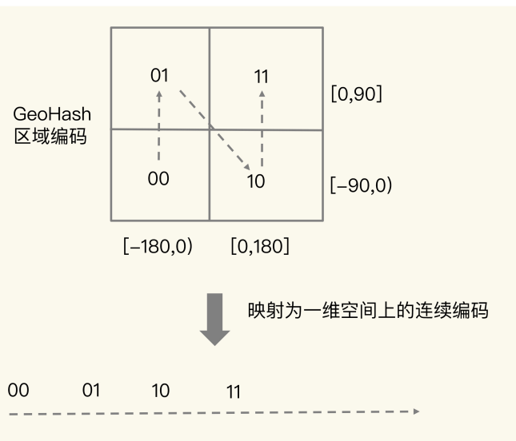
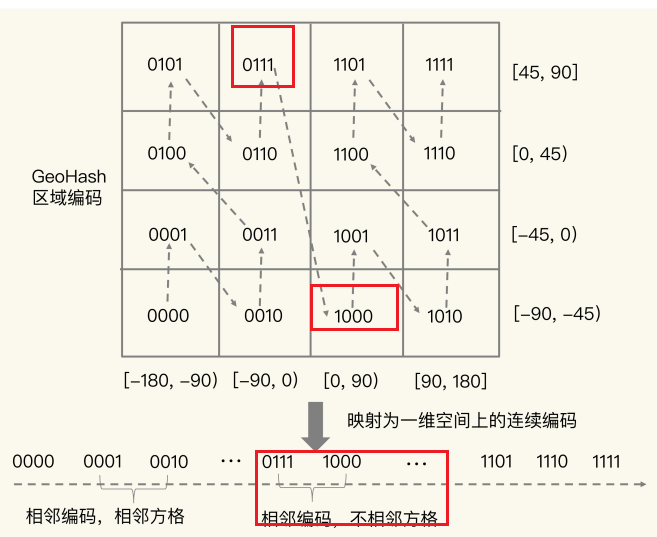
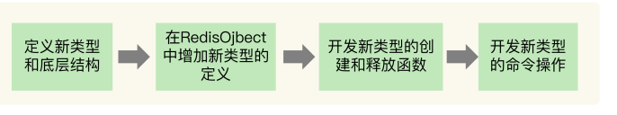

# 13 | GEO是什么？还可以定义新的数据类型吗？

在面对**海量数据统计**时，它们的内存开销很大，而且对于一些特殊的场景，它们是无法支持的。Bitmap、HyperLogLog 和 GEO

## 面向 LBS 应用的 GEO 数据类型

越来越依赖搜索“附近的餐馆”、在打车软件上叫车，这些都离不开**基于位置信息服务**（Location-Based Service，LBS）的应用

LBS 应用访问的数据是和人或物关联的一组**经纬度**信息，而且要能**查询相邻的经纬度范围**，GEO 就非常适合应用在 LBS 服务的场景中，我们来看一下它的底层结构

### GEO 的底层结构

这种数据记录模式属于一个 key（例如车 ID）对应一个 **value（一组经纬度）**

当有很多车辆信息要保存时，就需要有一个集合来保存一系列的 key 和 value。Hash 集合类型可以 快速存取一系列的 key 和 value，正好可以用来记录一系列车辆 ID 和经纬度的对应关系， 所以，**我们可以把不同车辆的 ID 和它们对应的经纬度信息存在 Hash 集合中**



Hash 类型的 HSET 操作命令，会根据 key 来设置相应的 value 值，所以，我们可以用它来**快速地更新车辆变化**的经纬度信息

还需要根据用户的**经纬度信息在车辆的 Hash 集合中进行范围查询**。一 旦涉及到范围查询，就意味着集合中的元素**需要有序**。Hash 类型的元素是无序的，显然不能满足我们的要求。

Sorted Set 类型也支持一个 key 对应一个 value 的记录模式，其中，**key 就是 Sorted Set 中的元素，而 value 则是元素的权重分数**。更重要的是，Sorted Set 可以根据元素的 权重分数排序，支持范围查询。这就能满足 LBS 服务中查找相邻位置的需求了



Sorted Set 元素的权重分数是一个浮点数（float 类型），而一组经纬度包含的是经度和纬度两个值，是没法直接保存为一个浮点数的，那具体该怎么进行保存呢？ **这就要用到 GEO 类型中的 GeoHash 编码了**

### GeoHash 的编码方法

为了能高效地对经纬度进行比较，Redis 采用了业界广泛使用的 GeoHash 编码方法，这 个方法的基本原理就是“**二分区间，区间编码**”。

我们要先**对经度和纬度分别编码**，然后再把经纬度各自的编码**组合**成一个最终编码。

对于一个地理位置信息来说，它的经度范围是[-180,180]。GeoHash 编码会把一个经度值 编码成一个 N 位的二进制值，我们来对经度范围[-180,180]做 N 次的二分区操作，其中 N 可以自定义。

在进行第一次二分区时，经度范围[-180,180]会被分成两个子区间：[-180,0) 和[0,180] （我称之为左、右分区）。此时，我们可以查看一下要编码的经度值落在了左分区还是右 分区。如果是落在左分区，我们就用 0 表示；如果落在右分区，就用 1 表示。这样一来， 每做完一次二分区，我们就可以得到 1 位编码值。

然后，我们再对经度值所属的分区再做一次二分区，同时再次查看经度值落在了二分区后 的左分区还是右分区，按照刚才的规则再做 1 位编码。当做完 N 次的二分区后，经度值就 可以用一个 N bit 的数来表示了。





当一组经纬度值都编完码后，我们再把它们的各自编码值组合在一起，组合的规则是：**最终编码值的偶数位上依次是经度的编码值，奇数位上依次是纬度的编码值，其中，偶数位 从 0 开始，奇数位从 1 开始**。(其实就是**交替**)



用了 GeoHash 编码后，原来无法用一个权重分数表示的一组经纬度（116.37，39.86）就 可以用 1110011101 这一个值来表示，就可以保存为 Sorted Set 的权重分数了。

使用 GeoHash 编码后，我们相当于把整个地理空间划分成了一个个方格，每个方 格对应了 GeoHash 中的一个分区



我们使用 Sorted Set 范**围查询得到的相近编码值，在实际的地理空间上，也是相邻的方格**，这就可以实现 LBS 应用“搜索附近的人或物”的功能了

> 有的编码值虽然在大小上接近，但实际对应的方格却距离比较 远
> 
>
> 为了避免查询不准确问题，我们可以**同时查询给定经纬度所在的方格周围的 4 个或 8 个方格**
>
> 为了提高查询的准确性，我们可以**扩大查询范围**，同时**查询给定经纬度所在方格周围的相邻方格**。通常有两种选择：
>
> 1. 四个相邻方格：查询给定方格左右两个相邻方格和上下两个相邻方格。
> 2. 八个相邻方格：查询给定方格左右两个相邻方格、上下两个相邻方格，以及左上、右上、左下和右下四个角上的相邻方格。
>
> 通过同时查询相邻方格，我们可以更全面地获取附近的地理位置信息，并提高查询的准确性。


GEOADD 命令：用于把一组经纬度信息和相对应的一个 ID 记录到 GEO 类型集合中； 

GEORADIUS 命令：会根据输入的经纬度位置，查找以这个经纬度为中心的一定范围内 的其他元素。当然，我们可以自己定义这个范围。

我们可以使用 ASC 选项，让返回的车辆信息按照距离这个中心位置从近到远的方式 来排序，以方便选择最近的车辆；还可以使用 COUNT 选项，指定返回的车辆信息的数 量。毕竟，5 公里范围内的车辆可能有很多，如果返回全部信息，会占用比较多的数据带 宽，这个选项可以帮助控制返回的数据量，节省带宽。

### 如何自定义数据类型

例如，我们需要一个数据类型既能像 Hash 那样支持快速的单键查询，又能像 Sorted Set 那样支持范围查询，此时，我们之前学习的这些数据类型就无法满足需求了。 那么，接下来，我就再向你介绍下 Redis 扩展数据类型的终极版——自定义的数据类型。


Redis 的基本对象结构 **RedisObject** 的内部组成包括了 type,、encoding,、lru 和 refcount 4 个元数据，以及 1 个*ptr指针。

type：表示值的类型，涵盖了我们前面学习的五大基本类型； 

encoding：是值的编码方式，用来表示 Redis 中实现各个基本类型的底层数据结构， 例如 SDS、压缩列表、哈希表、跳表等；

 lru：记录了这个对象最后一次被访问的时间，用于淘汰过期的键值对； 

refcount：记录了对象的引用计数； 

*ptr：是指向数据的指针


RedisObject 结构借助*ptr指针，就可以指向不同的数据类型，例如，*ptr指向一个 SDS 或一个跳表，就表示键值对中的值是 String 类型或 Sorted Set 类型。定义了新的数据类型后，也**只要在 RedisObject 中设置好新类型的 type 和 encoding**，再用***ptr指向新类型的实现**，就行了。


首先，我们需要为新数据类型定义好它的**底层结构**、**type 和 encoding 属性值**，然后再**实现新数据类型的创建、 释放函数和基本命令**。



#### 第一步：定义新数据类型的底层结构

```shell
// 新类型的定义 newtype.h
struct NewTypeObject {
struct NewTypeNode *head;
size_t len;
}NewTypeObject;

// 我们为底层结构设计两个成员变量：一个是 Long 类型的 value 值，用来保存实际数据；一个是*next指针，指向下一个 NewTypeNode 结构
struct NewTypeNode {
long value;
struct NewTypeNode *next;
};

```

#### 第二步：在 RedisObject 的 type 属性中，增加这个新类型的定义

```shell
#define OBJ_STRING 0 /* String object. */
#define OBJ_LIST 1 /* List object. */
#define OBJ_SET 2 /* Set object. */
#define OBJ_ZSET 3 /* Sorted set object. */
…
// server.h 文件中。比如，我们增加一个叫作 OBJ_NEWTYPE 的宏定义，用来在代码中指代 NewTypeObject 这个新类型
#define OBJ_NEWTYPE 7
```

#### 第三步：开发新类型的创建和释放函数

Redis 把数据类型的创建和释放函数都定义在了 object.c 文件中

```shel
robj *createNewTypeObject(void){
NewTypeObject *h = newtypeNew();
robj *o = createObject(OBJ_NEWTYPE,h);
return o;
}

NewTypeObject *newtypeNew(void){
NewTypeObject *n = zmalloc(sizeof(*n));
n->head = NULL;
n->len = 0;
return n;
}

// createObject 是 Redis 本身提供的 RedisObject 创建函数，它的参数是数据类型的 type和指向数据类型实现的指针*ptr
robj *createObject(int type, void *ptr) {
robj *o = zmalloc(sizeof(*o));
o->type = type;
o->ptr = ptr;
...
return o;
}

// 对于释放函数来说，它是创建函数的反过程，是用 zfree 命令把新结构的内存空间释放
掉。

```

#### 第四步：开发新类型的命令操作

1. 在 t_newtype.c 文件中增加命令操作的实现。比如说，我们定义 **ntinsertCommand 函 数**，由它实现对 NewTypeObject 单向链表的插入操作

   ```shell
   void ntinsertCommand(client *c){
   //基于客户端传递的参数，实现在NewTypeObject链表头插入元素
   }
   ```

   

2. 在 server.h 文件中，声明我们已经实现的命令，以便在 server.c 文件引用这个命令

   ```shell
   void ntinsertCommand(client *c)
   ```

   

3. 在 server.c 文件中的 redisCommandTable 里面，把新增命令和实现函数关联起来。 例如，新增的 ntinsert 命令由 ntinsertCommand 函数实现，我们就可以用 ntinsert 命令 给 NewTypeObject 数据类型插入元素了

   ```sh
   struct redisCommand redisCommandTable[] = {
   ...
   {"ntinsert",ntinsertCommand,2,"m",...}
   }
   ```

我们还需要在 Redis 的 RDB 和 AOF 模块中增加对新数据类型进行持久化保存的代码


