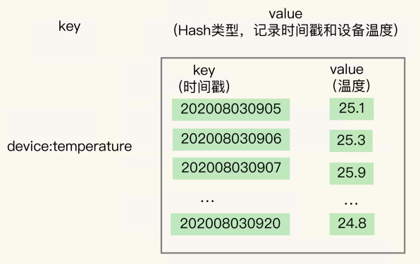
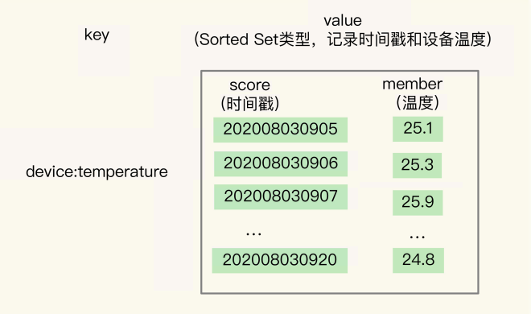

# 14 | 如何在Redis中保存时间序列数据？

我们需要周期性地统计近 万台设备的实时状态，包括设备 ID、压力、温度、湿度，以及对应的时间戳。**这些与发生时间相关的一组数据，就是时间序列数据**。这些数据的特点是没有严格的关系模型，记录的信息可以表示成键和值的关系

## 时间序列数据的读写特点

时间序列数据通常是**持续高并发写入**的，例如，需要连续记录数万个设备的实时状态值。同时，时间序列数据的**写入主要就是插入新数据，而不是更新一个已存在的数据**，也就是说，一个时间序列数据被记录后通常就不会变了，因为它就代表了一个设备在某个时刻的状态值

这种数据的写入特点很简单，就是**插入数据快**，这就要求我们选择的数据类型，**在进行数据插入时，复杂度要低，尽量不要阻塞**。读取特点，就是查询模式多（既有对单条记录的查询、某个时间范围内的数据的查询、某个时间范围内的数据做聚合计算）。

String 类型在**记录小数据时**（例如刚才例子中的设备 温度值），元数据的**内存开销比较大**，不太适合保存大量数据

针对时间序列数据的“写要快”，Redis 的高性能写特性直接就可以满足了；而针对“查询模式多”，也就是要支持单点查询、范围查询和聚合计算，Redis 提供 了保存时间序列数据的两种方案，分别可以**基于 Hash 和 Sorted Set 实现，以及基于 RedisTimeSeries 模块实现。**

### 基于 Hash 和 Sorted Set 保存时间序列数据

**Hash 类型有个短板：它并不支持对数据进行范围查询**。

> 存在member重复的问题，会对member覆盖

 **Redis 用来实现简单的事务的 MULTI 和 EXEC 命令，对Zset 和 Hash 同时进行操作。**

* MULTI 命令：表示一系列原子性操作的开始。收到这个命令后，Redis 就知道，接下来 再收到的命令需要放到一个内部队列中，后续一起执行，保证原子性。

*  EXEC 命令：表示一系列原子性操作的结束。一旦 Redis 收到了这个命令，就表示所有 要保证原子性的命令操作都已经发送完成了。此时，Redis 开始执行刚才放到内部队列中的所有命令操作。

为 Sorted Set 只支持范围查询，无法直接进行聚合计算。先把时间范围内的数据取回到客户端，然后在客户端自行完成聚合计算。

这个方法虽然能完成聚合计算，但是会带来一定的潜在风险，也就是大量数据在 Redis 实例和客户端间频繁传输，这 会和其他操作命令竞争网络资源，导致其他操作变慢

### 基于 RedisTimeSeries 模块保存时间序列数据

RedisTimeSeries 是 Redis 的一个**扩展模块**。它专门面向时间序列数据提供了数据类型和访问接口，并且支持在 Redis 实例上直接对数据进行按时间范围的聚合计算

与使用 Hash 和 Sorted Set 来保存时间序列数据相比，RedisTimeSeries 是专门为时间序列数据访问设计的扩展模块，能支持在 Redis 实例上**直接进行聚合计算，以及按标签属性过滤查询数据集合**，当我们需要频繁进行聚合计算，以及从大量集合中筛选出特定设备或 用户的数据集合时，RedisTimeSeries 就可以发挥优势了。

不过，RedisTimeSeries 的底层数据结构使用了**链表**，它的范围查询的复杂度是 O(N) 级别的，同时，它的 TS.GET 查询只能返回最新的数据，没有办法像第一种方案的 Hash 类型一样，可以返回任一时间点的数据

