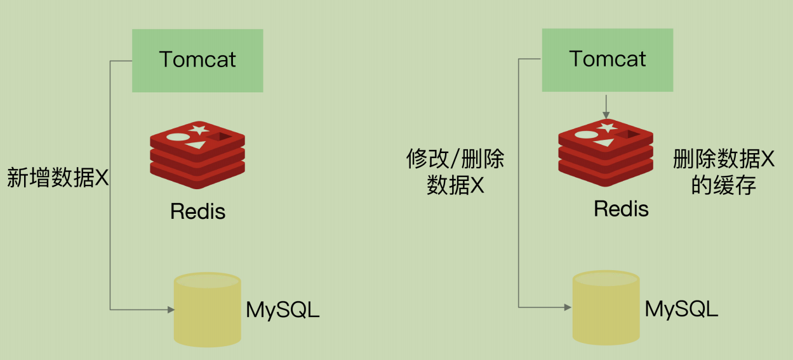
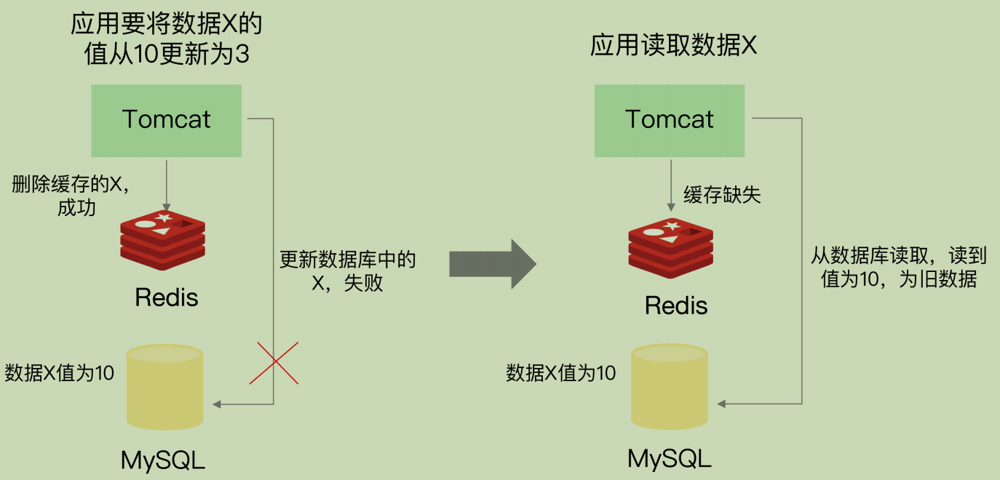
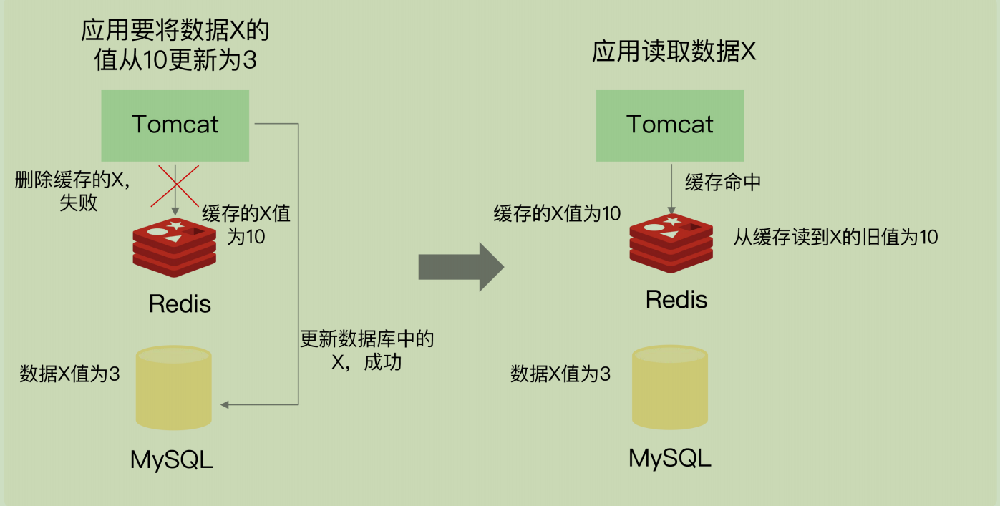
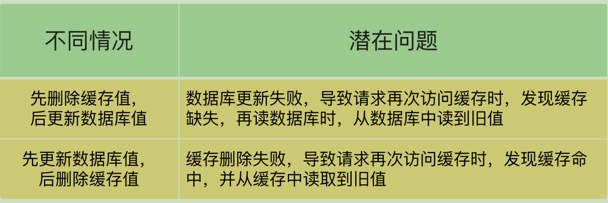
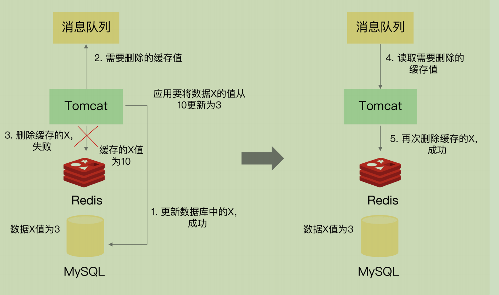
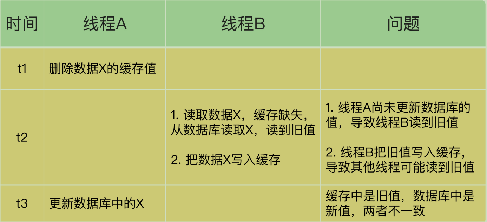
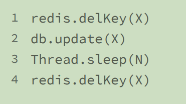
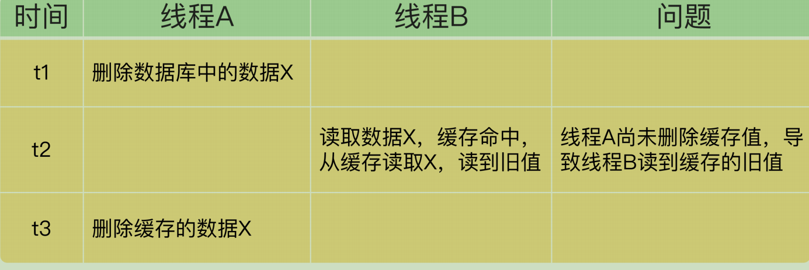
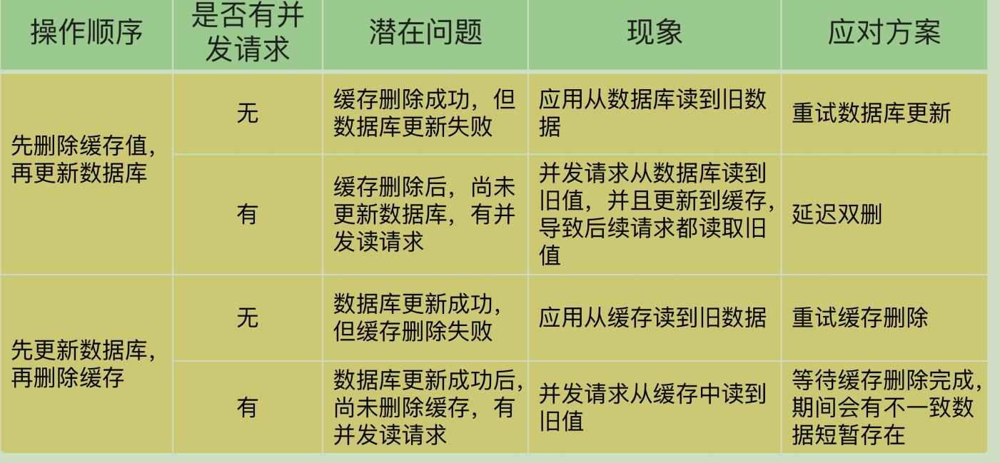

# **25 |** **缓存异常（上）：如何解决缓存和数据库的数据不一致问题？**

缓存雪崩；缓存击穿；缓存穿透

---

## **缓存和数据库的数据不一致是如何发生的？**

“一致性”包含了两种情况：

1. 缓存中有数据，那么，缓存的数据值需要和数据库中的值相同；
2. 缓存中本身没有数据，那么，数据库中的值必须是最新值

把缓存分成**读写缓存和只读缓存**

### 读写缓存

如果要对数据进行增删改，就需要在缓存中进行，同时还要根据采取的**写回策略**

同步直写策略：写缓存时，也同步写数据库，缓存和数据库中的数据一致

异步写回策略：写缓存时**不同步写数据库，等到数据从缓存中淘汰时，再写回数据库**。使用这种策略时，如果数据还没有写回数据库，**缓存就发生了故障，那么，此时，数据库就没有最新的数据了**

对于读写缓存来说，要想保证**缓存和数据库中的数据一致，就要采用同步直写策略**。不过，需要注意的是，如果采用这种策略，就需要同时更新缓存和数据库。所以，我们要在业务应用中**使用事务机制**，来保证缓存和数据库的更新具有原子性，也就是说，两者要不一起更新，要不都不更新，返回错误信息，进行重试。

在有些场景下，我们对数据一致性的要求可能不是那么高，比如说**缓存的是电商商品的非关键属性或者短视频的创建或修改时间等，那么，我们可以使用异步写回策略。**

### 只读缓存

如果有数据新增，会直接写入数据库；而有数据删改时，就需要把只读缓存中的数据标记为无效。因为缓存中没有相应的数据，**就会发生缓存缺失。此时，应用再从数据库中把数据读入缓存，这样后续再访问数据时，就能够直接从缓存中读取了**

#### 并发情况

**新增数据**

如果是新增数据，数据会直接写到数据库中，不用对缓存做任何操作

 **删改数据**

如果发生删改操作，应用既要更新数据库，也要在缓存中删除数据。这两个操作如果无法保证原子性，也就是说，要不都完成，要不都没完成。

在更新数据库和删除缓存值的过程中，无论这两个操作的执行顺序谁先谁后，只要有一个操作失败了，就会导致客户端读取到旧值。

**如何解决数据不一致问题**

更新数据库和删除缓存值的过程中，其中一个操作失败的情况

**重试机制**

删除的缓存值或者是要更新的数据库值暂存到消息队列中（例如使用Kafka 消息队列）。当应用没有能够成功地删除缓存值或者是更新数据库值时，可以从消息队列中重新读取这些值，然后再次进行删除或更新。

如果能够成功地删除或更新，我们就要把这些值从消息队列中去除，以免重复操作，此时，我们也可以保证数据库和缓存的数据一致了。否则的话，我们还需要再次进行重试。**如果重试超过的一定次数，还是没有成功，我们就需要向业务层发送报错信息了。**

当有大量并发请求时，应用还是有可能读到不一致的数据。

**情况一：先删除缓存，再更新数据库**

解决方案 ： **“延迟双删”**

**在线程 A 更新完数据库值以后，我们可以让它先 sleep 一小段时间，再进行一次缓存删除操作**

加上 sleep 的这段时间，就是为了让线程 B 能够先从数据库读取数据，再把缺失的数据写入缓存，然后，线程 A 再进行删除。**就需要大于线程 B 读取数据再写入缓存的时间**。这个时间怎么确定呢？建议你在业务程序运行的时候，统计下线程读数据和写缓存的操作时间，以此为基础来进行估算

**情况二：先更新数据库值，再删除缓存值。**

线程 A 删除了数据库中的值，**但还没来得及删除缓存值，线程 B 就开始读取数据了**，那么此时，线程 B 查询缓存时，**发现缓存命中，就会直接从缓存中读取旧值**。不过，在这种情况下，如果其他线程并发读缓存的请求不多，那么，就不会有很多请求读取到旧值。而且，线程 A 一般也会很快删除缓存值，这样一来，其他线程再次读取时，就会发生缓存缺失，进而从数据库中读取最新值。**所以，这种情况对业务的影响较小。**

**小结**

删除缓存值或更新数据库失败而导致数据不一致，你可以使用**重试机制确保删除或更新操作成功**。

在删除缓存值、更新数据库的这两步操作中，**有其他线程的并发读操作，导致其他线程读取到旧值，应对方案是延迟双删。**

在大多数业务场景下，我们会把 Redis 作为只读缓存使用。针对只读缓存来说，我们既可以先删除缓存值再更新数据库，也可以先更新数据库再删除缓存。我的建议是，**优先使用先更新数据库再删除缓存的方法**，原因主要有两个

* 先删除缓存值再更新数据库，**有可能导致请求因缓存缺失而访问数据库，给数据库带来压力**；
* 如果业务应用中读取数据库和写缓存的时间不好估算，那么，**延迟双删中的等待时间就不好设置**

