# Redis 学习分享

## 为什么Redis快

### 两大维度，三大主线

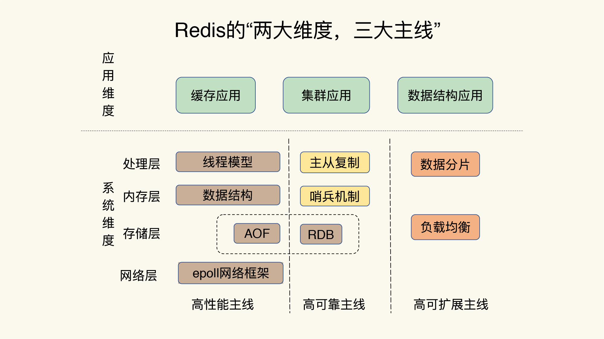

### 问题画像


### 如何设计一个键值数据库

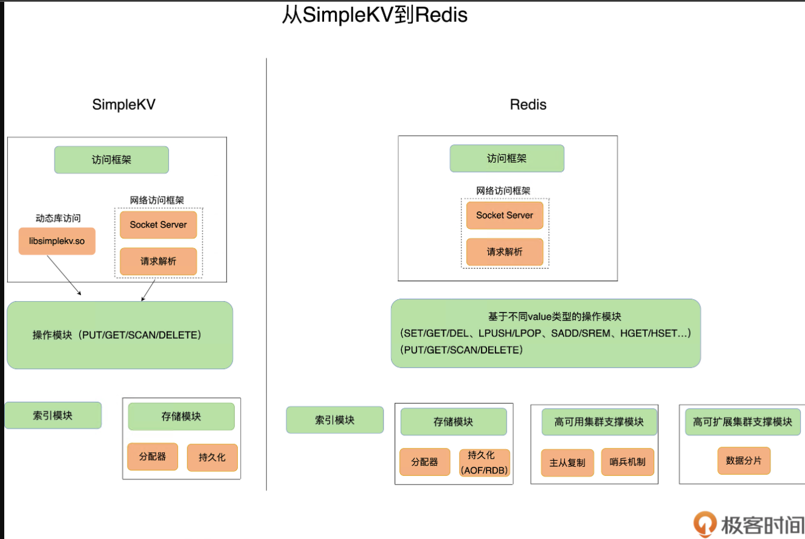

### 为什么 Redis 快

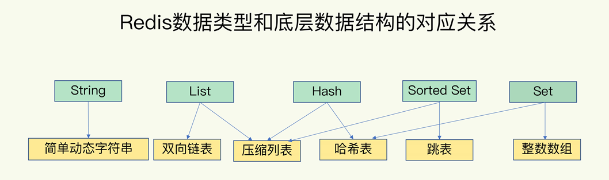

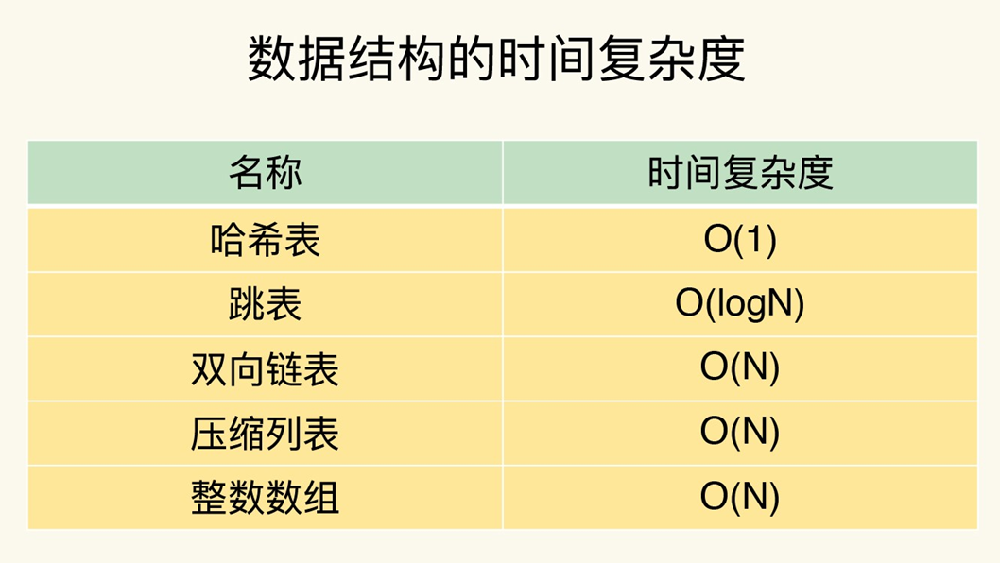

> Bitmaps 位图
>
> HyperLogLog 基数统计。Redis HyperLogLog 是一种概率数据结构，用于在恒定内存大小下对唯一值（设置基数）进行计数
>
> GEO  地理空间索引
>
> Streams

### IO模型

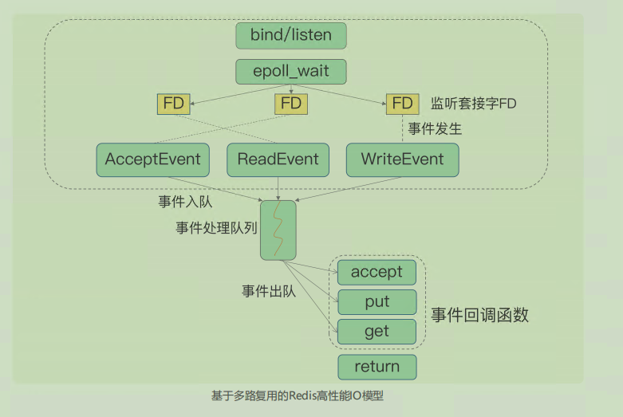

### 日志

AOF 记录的是操作命令

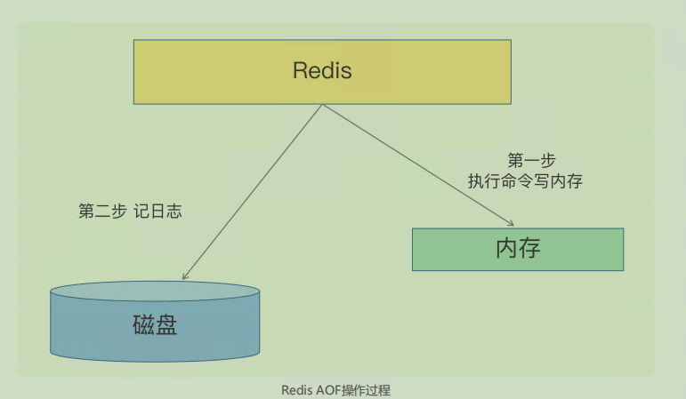

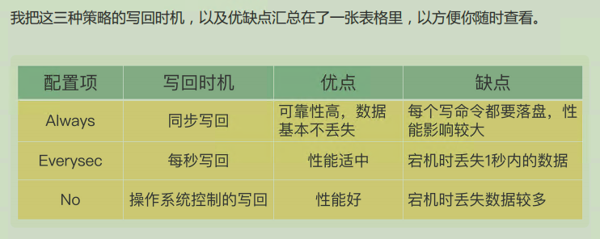

AOF 是以**文件的形式**在记录接收到的所有写命令。随着接收的写命令越来越多，**AOF 文件会越来越大**。这也就意味着，我们一定要**小心 AOF 文件过大带来的性能问题**。

1. 文件系统本身对文件大小有限制，**无法保存过大的文件**；
2. 如果文件太大，之后再往里面追**加命令记录的话，效率也会变低**；
3. 如果发生宕机，AOF 中记录的命令要一个个被重新执行，用于**故障恢复**，如果日志文件太大，整个恢复过程就会**非常缓慢**，这就会影响到 Redis 的正常使用

AOF 重写

**一个拷贝，两处日志**

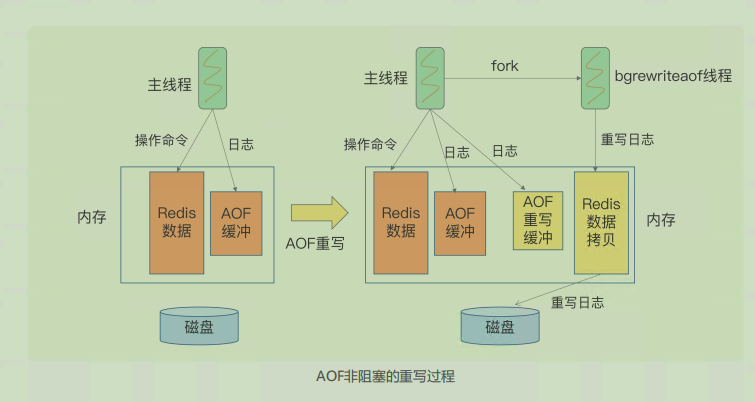

> fork子进程，fork这个瞬间一定是会阻塞主线程的

 RDB 文件 内存快照

全量数据越多，RDB 文件就越大，往磁盘上写数据的时间开销就越大。

> 所以一般不会让 Redis 实例过大，避免 RDB 过大

bgsave：创建一个子进程，专门用于写入 RDB 文件，避免了主线程的阻塞，这也是Redis RDB 文件生成的默认配置

写时复制

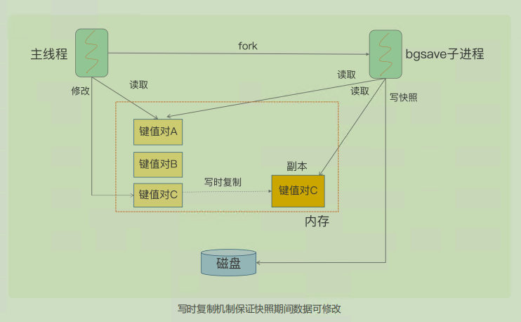

混合使用 AOF 日志和内存快照

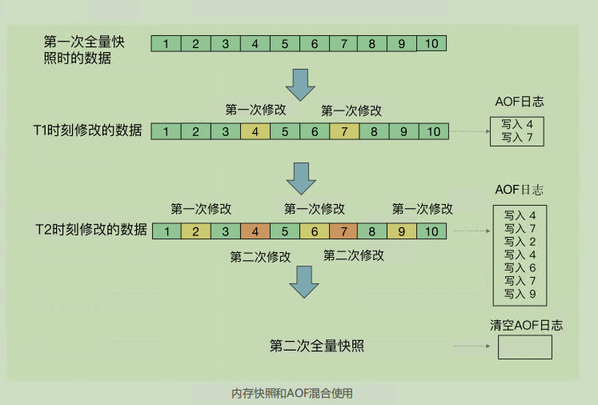

### 数据同步

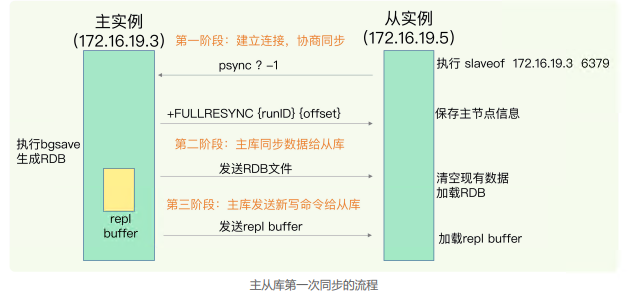

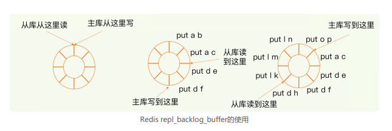

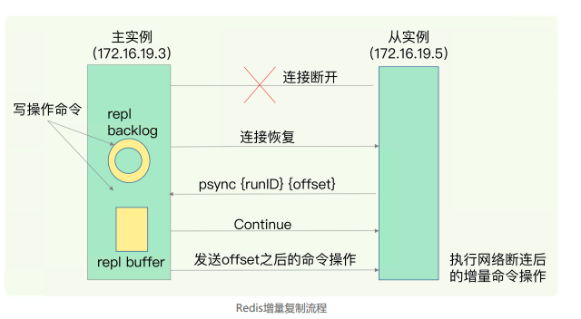

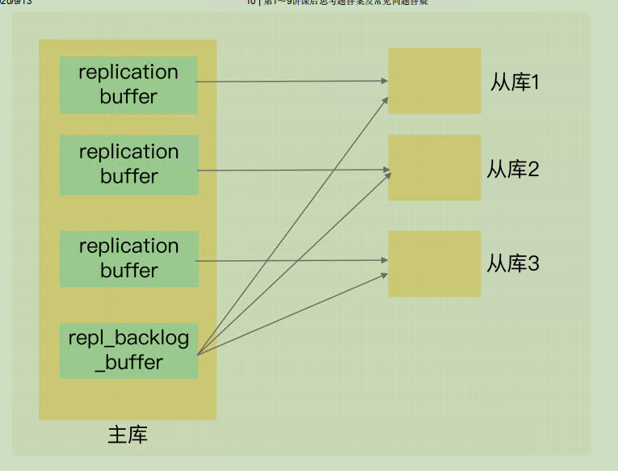

### 哨兵

监控、选主（选择主库）和通知

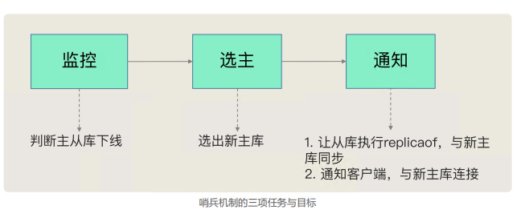

主观下线和客观下线

避免单个哨兵因为自身网络状况不好，而误判主库下线的情况

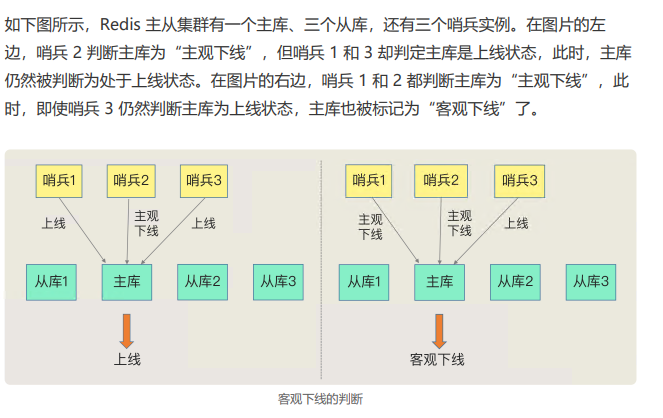

**当有 N 个哨兵实例时，最好要有 N/2 + 1 个实例判 断主库为“主观下线”**，才能最终判定主库为“客观下线”

**“筛选 + 打分”**

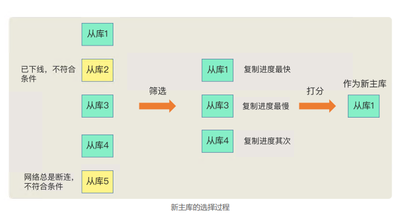

这三个规则分别是**从库优先级、从库复制进度以及从库 ID 号**。**只要在某一轮中，有从库得分最高，那么它就是主库了**，选主过程到此结束。如果没有出现得分最高的从库，那么就继续进行下一轮

### 哨兵集群

基于 pub/sub 机制的哨兵集群组成

> sentinel monitor <master-name> <ip> <redis-port> <quorum>
>
> INFO

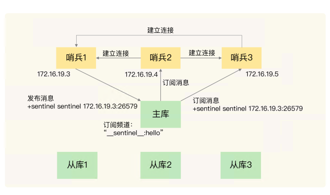

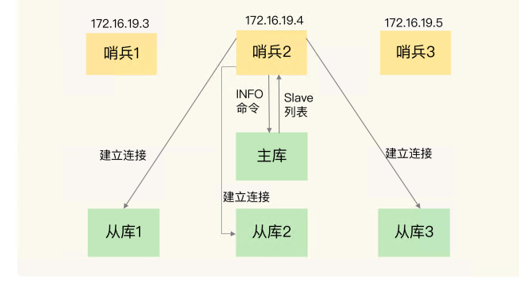

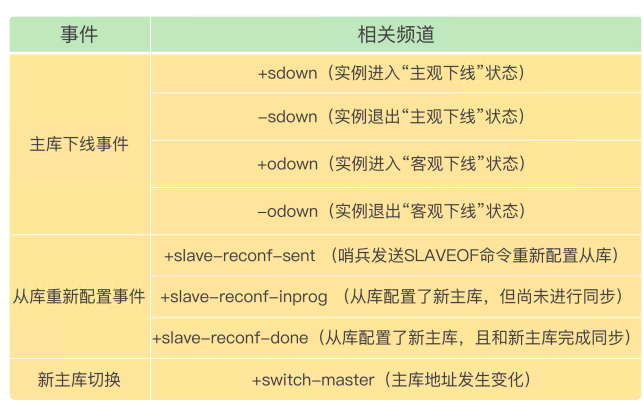

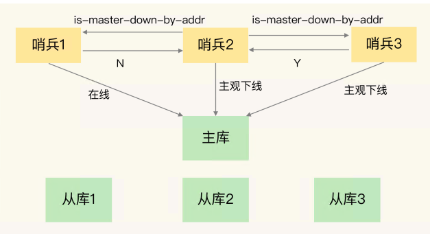

一个哨兵获得了仲裁所需的赞成票数后，就可以标记主库为“客观下线”。这个所需的赞成票数是通过哨兵配置文件中的 **quorum 配置项**设定的。

此时，这个哨兵就可以再给其他哨兵发送命令，表明希望由自己来执行主从切换，并让所有其他哨兵进行投票。这个投票过程称为“Leader 选举”。因为最终执行主从切换的哨兵称为 Leader，投票过程就是确定 Leader

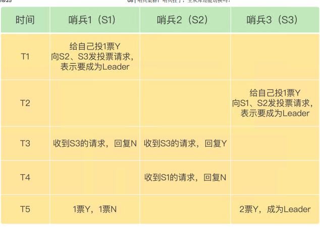

> 要保证所有哨兵实例的配置是一致的，尤其是主观下线 的判断值 down-after-milliseconds。

### 切片集群

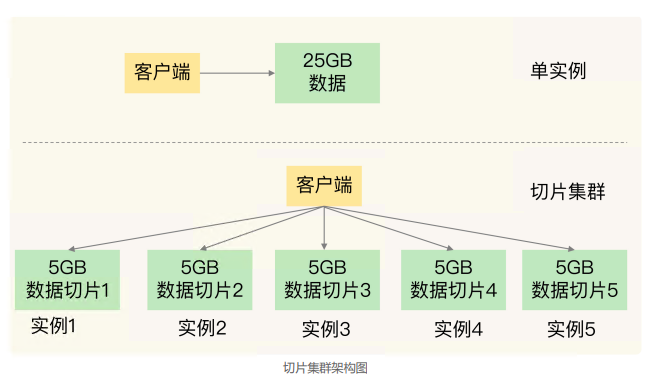

哈希槽映射到具体的Redis实例

1. 可以使用 cluster create 命令创建集群，此时，Redis 会自动把这些**槽平均分布在集群实例**上。例如，如果集群中有 N 个实例，那么，每个实例上的槽个数为 **16384**/N 个。
2. 也可以使用 **cluster meet 命令手动建立实例间的连接**，形成集群，再使用 **cluster addslots** 命令，指定每个实例上的哈希槽个数

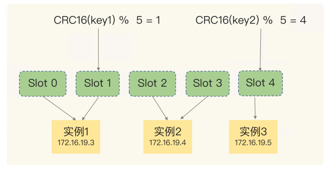

> Redis Cluster 默认会对 key 值使用 `CRC16` 算法计算得到一个 16 bit 的hash整数，然后用这个整数值对 `16384` 取模，得到一个 0~16383 范围内的模数，每个模数就代表一个相应编号的哈希槽，就得到了具体的槽位。
>
> Redis Cluster 还允许用户强制某个 key 挂在特定槽位上，通过在 key 字符串里面嵌入 `{tag}` 标记，CRC16 就会只计算 tag 的 hash 值。例如：user_{system}、role_{system}，这两个 key 都只对 system 计算 hash 值，那最终这两个 key 都会落到同一个槽上。

它所处的哈希槽是可以通过**计算**得到的，这个计算可以在客户端发送请求时来执行。但是，**要进一步定位到实例，还需要知道哈希槽分布在哪个实例上**。

**Redis 实例会把自己的哈希槽信息发给和它相连接的其它实例**，来完成哈希槽分配信息的扩散。当实例之间相互连接后，每个实例就有所有哈希槽的映射关系了

实例和哈希槽

Redis Cluster 方案提供了一种重定向机制**，所谓的“重定向”，就是指，客户端给一个实例发送数据读写操作时，这个实例上并没有相应的数据，客户端要再给一个新实例发送操 作命令。

MOVED  这个实例上并没有这个键值对映射的哈希槽，那么，这个实例就 会给客户端返回下面的 MOVED 命令响应结果

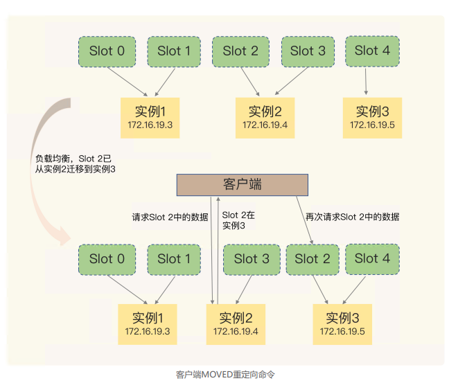

ASK 处于中间状态，这时候有请求（迁移部分）

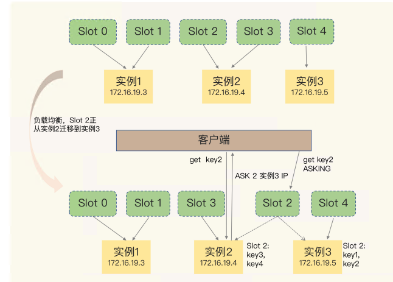


---

## 为什么Redis慢了

### Redis 真的变慢了吗?

**查看 Redis 的响应延迟**

**基于当前环境下的 Redis 基线性能做判断**

> 基线性能，也就是一个系统在低压力、无干扰下的基本性能，这个性能只由当前的软硬件配置决定。
>
>  2.8.7 版本开始，redis-cli 命令提供了–intrinsic-latency 选项，可以用来**监测 和统计测试期间内的最大延迟，这个延迟可以作为 Redis 的基线性能**。其中，测试时长可 以用–intrinsic-latency 选项的参数来指定。
>
> 一般来说，你要把**运行时延迟和基线性能进行对比**，如果你观察到的 Redis 运行时延迟是 **其基线性能的 2 倍及以上，就可以认定 Redis 变慢了**


### Redis 自身操作特性的影响

#### 慢查询命令

当 Value 类型为 Set 时，SORT、 SUNION/SMEMBERS 操作复杂度分别为 O(N+M*log(M)) 和 O(N)。其中，N 为 Set 中 的元素个数，M 为 SORT 操作返回的元素个数。这个复杂度就增加了很多。

可以通过 Redis 日志，或者是 latency monitor 工具，查询 变慢的请求，确认下是否采用了复杂度高的慢查询命令

1. **用其他高效命令代替**。比如说，如果你需要返回一个 SET 中的所有成员时，不要使用 SMEMBERS 命令，而是要使用 SSCAN 多次迭代返回，避免一次返回大量数据，造成 线程阻塞。
2. 当你需要执行排序、交集、并集操作时，**可以在客户端完成**，而不要用 SORT、 SUNION、SINTER 这些命令，以免拖慢 Redis 实例。

如果业务逻辑就是要求使用慢查询命令，那你得考虑采用性能更好的 CPU，更快地完成查询命令，避免慢查询的影响。

> 因为 KEYS 命令需要遍历存储的键值对，所以操作延时高。如果你不了解它的实现而使用 了它，就会导致 Redis 性能变慢。
>
> **所以，KEYS 命令一般不被建议用于生产环境中。**

#### 过期 key 操作

看过期 key 的**自动删除机制**。它是 Redis 用来回收内存空间的常用机制， 应用广泛，**本身就会引起 Redis 操作阻塞，导致性能变慢**，所以，你必须要知道该机制对性能的影响。

默认情况下，**Redis 每 100 毫秒**会删除一些过期key，具体的算法如下

1. 采样 ACTIVE_EXPIRE_CYCLE_LOOKUPS_PER_LOOP 个数的 key，并将其中过期的key 全部删除
2. **如果超过 25% 的 key 过期了，则重复删除的过程**，直到过期 key 的比例降至 25% 以下。

ACTIVE_EXPIRE_CYCLE_LOOKUPS_PER_LOOP 是 Redis 的一个参数，默认是 20，那么，一秒内基本有 200 个过期 key 会被删除。这一策略对清除过期 key、释放内存空间很有帮助。**如果每秒钟删除 200 个过期 key，并不会对 Redis 造成太大影响**。

如果触发了上面这个算法的第二条，Redis 就会一直删除以释放内存空间。注意，**删除操作是阻塞的**（Redis 4.0 后可以用异步线程机制来减少阻塞影响）。所以，一旦该条件触发，Redis 的线程就会一直执行删除，这样一来，就没办法正常服务其他的键值操作了，就会进一步引起其他键值操作的延迟增加，Redis 就会变慢。

所以我们就要避免第二种重复删除。

算法的第二条是怎么被触发的呢？是**频繁使用带有相同时间参数的 EXPIREAT 命令设置过期 key**，这就会导致，在同一秒内有大量的 key 同时过期。

要检查业务代码在使用 EXPIREAT 命令设置 key 过期时间时，是否使用了相同的 UNIX时间戳，有没有使用 EXPIRE 命令给批量的 key 设置相同的过期秒数。**因为，这都会造成大量 key 在同一时间过期，导致性能变慢**。

千万不要嫌麻烦，你首先要**根据实际业务的使用需求**，决定 EXPIREAT和 EXPIRE 的过期时间参数。其次，如果一批 key 的确是**同时过期**，你还可以在EXPIREAT 和 EXPIRE 的过期时间参数上，**加上一个一定大小范围内的随机数**，这样，既保证了 key 在一个邻近时间范围内被删除，又避免了同时过期造成的压力

#### 文件系统：AOF模式

Redis 会采用 AOF 日志或 RDB 快照。其中，AOF日志提供了三种日志写回策略：**no、everysec、always**。这三种写回策略依赖**文件系统的两个系统调用完成，也就是 write 和 fsync**。

1. write 只要把日志记录写到**内核缓冲区**，就可以返回了，**并不需要等待日志实际写回到磁盘**；
2. fsync 需要把日志记录写回到磁盘后才能返回，时间较长。

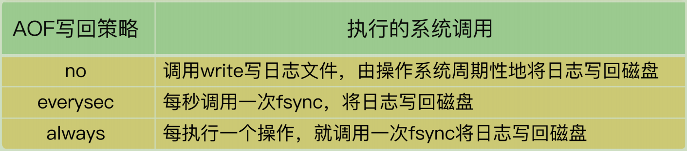

在使用 everysec 时，**Redis 允许丢失一秒的操作记录**，所以，Redis 主线程并不需要确保每个操作记录日志都写回磁盘。而且，fsync 的执行时间很长，如果是在 Redis 主线程中执行 fsync，就容易阻塞主线程。所以，当写回策略配置为 everysec 时，**Redis 会使用后台的子线程异步完成 fsync 的操作**。

对于 always 策略来说，**Redis 需要确保每个操作记录日志都写回磁盘**，如果用后台子线程异步完成，主线程就无法及时地知道每个操作是否已经完成了，这就不符合 always 策略的要求了。**所以，always 策略并不使用后台子线程来执行。**

在使用 AOF 日志时，**为了避免日志文件不断增大，Redis 会执行 AOF 重写**，生成体量缩小的新的 AOF 日志文件。**AOF 重写本身需要的时间很长，也容易阻塞 Redis 主线程，所以，Redis 使用子进程来进行 AOF 重写**。

这里有一个潜在的风险点：**AOF 重写会对磁盘进行大量 IO 操作**，同时，fsync 又需要等到数据写到磁盘后才能返回，**所以，当 AOF 重写的压力比较大时，就会导致 fsync 被阻塞**。虽然 fsync 是由后台子线程负责执行的，但是，**主线程会监控 fsync 的执行进度**。

当主线程使用后台子线程执行了一次 fsync，**需要再次把新接收的操作记录写回磁盘时**，如果主线程发现**上一次的 fsync 还没有执行完，那么它就会阻塞**。所以，如果**后台子线程执行的 fsync 频繁阻塞的话（比如 AOF 重写占用了大量的磁盘 IO 带宽），主线程也会阻塞**，导致 Redis 性能变慢

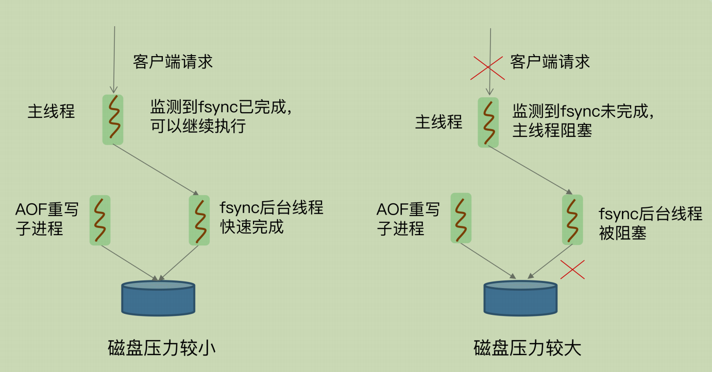

sync 后台子线程和 AOF 重写子进程的存在，主IO 线程一般不会被阻塞。但是，**如果在重写日志时，AOF 重写子进程的写入量比较大，fsync 线程也会被阻塞，进而阻塞主线程，导致延迟增加**

首先，你可以检查下 Redis 配置文件中的 **appendfsync 配置项**

如果 AOF 写回策略使用了 everysec 或 always 配置，请先确认下业务方对数据可靠性的要求，明确是否需要每一秒或每一个操作都记日志。有的业务方不了解 Redis AOF 机制，很可能就直接使用数据可靠性最高等级的 always 配置了。其实，在有些场景中（例如Redis 用于缓存），数据丢了还可以从后端数据库中获取，并不需要很高的数据可靠性。

如果业务应用对延迟非常敏感，但同时允许一定量的数据丢失，那么，可以把配置项 no-appendfsync-on-rewrite 设置为 yes，如下所示：

```java
no-appendfsync-on-rewrite yes
```

这个配置项设置为 yes 时，**表示在 AOF 重写时，不进行 fsync 操作**。也就是说，Redis 实例把写命令写到内存后，不调用后台线程进行 fsync 操作，就可以直接返回了。当然，如果此时实例发生宕机，就会导致数据丢失。反之，如果这个配置项设置为 no（也是默认配置），**在 AOF 重写时，Redis 实例仍然会调用后台线程进行 fsync 操作，这就会给实例带来阻塞**

如果的确需要高性能，同时也需要高可靠数据保证，建议考虑**采用高速的固态硬盘作****为 AOF 日志的写入设备**.

#### 操作系统：swap

内存 swap 是操作系统里将内存数据在内存和磁盘间来回换入和换出的机制，涉及到磁盘的读写，所以，一旦触发 swap，无论是被换入数据的进程，还是被换出数据的进程，其性能都会受到慢速磁盘读写的影响

Redis 是内存数据库，内存使用量大，如果没有控制好内存的使用量，或者和其他内存需求大的应用一起运行了，就可能受到 swap 的影响，而导致性能变慢。

**一旦 swap 被触发了，Redis 的请求操作需要等到磁盘数据读写完成才行**。而且，和我刚才说的 AOF 日志文件读写使用 fsync 线程不同，**swap 触发后影响的是 Redis 主 IO 线程**，这会极大地增加 Redis 的响应时间

触发 swap 的原因主要是**物理机器内存不足**

解决思路：**增加机器的内存或者使用 Redis 集群**。

```
$ redis-cli info | grep process_id
process_id: 5332

// 进入 Redis 所在机器的 /proc 目录下的该进程目录中：
cd /proc/5332


$cat smaps | egrep '^(Swap|Size)'
Size: 584 kB
Swap: 0 kB
Size: 4 kB
Swap: 4 kB
Size: 4 kB
Swap: 0 kB
Size: 462044 kB
Swap: 462008 kB
Size: 21392 kB
Swap: 0 kB
```

一行 Size 表示的是 Redis 实例所用的一块内存大小，而 Size 下方的 Swap 和它相对应，**表示这块 Size 大小的内存区域有多少已经被换出到磁盘上了**。如果这两个值相等，就表示这块内存区域已经完全被换出到磁盘了

一旦发生内存 swap，最直接的解决方法就是**增加机器内存**。如果该实例在一个 Redis 切片集群中，可以增加 Redis 集群的实例个数，来分摊每个实例服务的数据量，进而减少每个实例所需当然

如果 Redis 实例和其他操作大量文件的程序（例如数据分析程序）共享机器，你可以将 Redis 实例迁移到单独的机器上运行，以满足它的内存需求量。如果该实例正好是Redis 主从集群中的主库，而从库的内存很大，也可以考虑进行主从切换，把大内存的从库变成主库，由它来处理客户端请求

#### 操作系统：内存大页

除了内存 swap，还有一个和内存相关的因素，即**内存大页机制（Transparent HugePage, THP）**，也会影响 Redis 性能。

Linux 内核从 2.6.38 开始支持内存大页机制，该机制支持 **2MB 大小的内存页分配，而常规的内存页分配是按 4KB 的粒度来执行的。**

虽然内存大页可以给 Redis 带来**内存分配方面的收益**，但是，不要忘了，**Redis 为了提供数据可靠性保证，需要将数据做持久化保存**。这个写入过程由额外的线程执行，所以，此时，Redis 主线程仍然可以接收客户端写请求。客户端的写请**求可能会修改正在进行持久化的数据**。在这一过程中，**Redis 就会采用写时复制机制，也就是说，一旦有数据要被修改，Redis 并不会直接修改内存中的数据，而是将这些数据拷贝一份，然后再进行修改**。如果采用了内存大页，**那么，即使客户端请求只修改 100B 的数据，Redis 也需要拷贝2MB 的大页**。相反，如果是常规内存页机制，只用拷贝 4KB。两者相比，你可以看到，当客户端请求修改或新写入数据较多时，内存大页机制将导致大量的拷贝，这就会影响Redis 正常的访存操作，最终导致性能变慢。

关闭内存大页，就行了。

```
cat /sys/kernel/mm/transparent_hugepage/enabled
```

如果执行结果是 always，就表明内存大页机制被启动了；如果是 never，就表示，内存大页机制被禁止。

```
echo never /sys/kernel/mm/transparent_hugepage/enabled
```

### 总结

1. 获取 Redis 实例在当前环境下的基线性能。
2. 是否用了慢查询命令？如果是的话，就使用其他命令替代慢查询命令，或者把聚合计算命令放在客户端做。
3. 是否对过期 key 设置了相同的过期时间？对于批量删除的 key，可以在每个 key 的过期时间上加一个随机数，避免同时删除。
4. 是否存在 bigkey？ 对于 bigkey 的删除操作，如果你的 Redis 是 4.0 及以上的版本，可以直接利用异步线程机制减少主线程阻塞；如果是 Redis 4.0 以前的版本，可以使用SCAN 命令迭代删除；对于 bigkey 的集合查询和聚合操作，可以使用 SCAN 命令在客户端完成。
5. Redis AOF 配置级别是什么？业务层面是否的确需要这一可靠性级别？如果我们需要高性能，同时也允许数据丢失，可以将配置项 no-appendfsync-on-rewrite 设置为yes，避免 AOF 重写和 fsync 竞争磁盘 IO 资源，导致 Redis 延迟增加。当然， 如果既需要高性能又需要高可靠性，最好使用高速固态盘作为 AOF 日志的写入盘。
6. Redis 实例的内存使用是否过大？发生 swap 了吗？如果是的话，就增加机器内存，或者是使用 Redis 集群，分摊单机 Redis 的键值对数量和内存压力。同时，要避免出现Redis 和其他内存需求大的应用共享机器的情况。
7. 在 Redis 实例的运行环境中，是否启用了透明大页机制？如果是的话，直接关闭内存大页机制就行了。
8. 是否运行了 Redis 主从集群？如果是的话，把主库实例的数据量大小控制在 2~4GB，以免主从复制时，从库因加载大的 RDB 文件而阻塞。
9. 是否使用了多核 CPU 或 NUMA 架构的机器运行 Redis 实例？使用多核 CPU 时，可以给 Redis 实例绑定物理核；使用 NUMA 架构时，注意把 Redis 实例和网络中断处理程序运行在同一个 CPU Socket 上。

## 参考

[Redis 核心技术与实战](https://time.geekbang.org/column/intro/100056701)

[Data structures 数据结构](https://redis.io/redis-enterprise/data-structures/)

[Redis 性能分析官方文档](https://redis.io/docs/latest/operate/oss_and_stack/management/optimization/latency/)

