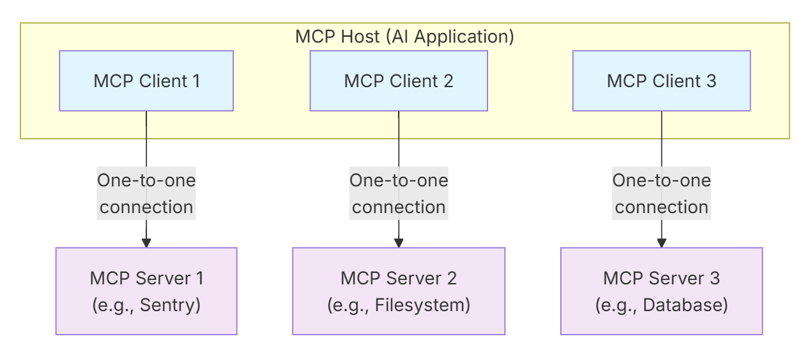
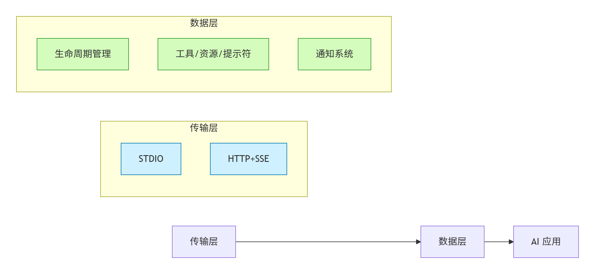
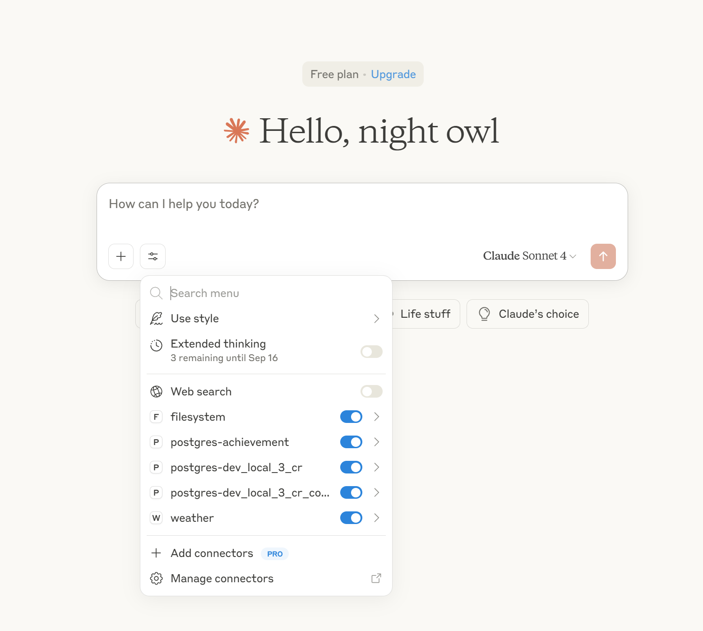

# MCP学习

## 简介

模型上下文协议（Model Context Protocol, MCP）旨在**搭建大模型和外部工具之间的信息传递通道**。


## 架构概览

MCP 采用的是经典的客户端-服务器架构

- **MCP 主机（MCP Hosts）：** 发起请求的 LLM 应用程序（例如 Claude Desktop、IDE 或 AI 工具）。

- **MCP 客户端（MCP Clients）：** 在主机程序内部，与 MCP server 保持 1:1 的连接。

- **MCP 服务器（MCP Servers）：** 为 MCP client 提供上下文、工具和 prompt 信息。

- **本地资源（Local Resources）：** 本地计算机中可供 MCP server 安全访问的资源（例如文件、数据库）。

- **远程资源（Remote Resources）：** MCP server 可以连接到的远程资源（例如通过 API）。




### 分层设计

* **传输层**：支持本地（STDIO）和远程（HTTP+SSE）通信

* **数据层**：基于 JSON-RPC 2.0，包含三大核心能力：

  - •

    🛠️ **Primitives（能力元语）**：

    * `Tools`：可执行函数（如 `weather_current`）

    * `Resources`：结构化数据源（如数据库表结构）

    * `Prompts`：LLM 提示模板

    🔔 **Notifications（通知机制）**：服务端主动推送变更（如新工具上线）

    🤝 **Lifecycle（生命周期）**：版本协商/能力声明



### 数据交互过程

MCP客户端-服务器交互的逐步讲解，重点关注数据层协议。使用JSON-RPC 2.0消息演示生命周期序列、工具操作和通知。

#### 1. 初始化握手

```
// Client → Server
{"method":"initialize","params":{
  "protocolVersion":"2025-06-18",
  "capabilities":{"elicitation":{}} // 声明支持用户交互
}}

// Server → Client
{"result":{
  "capabilities":{
    "tools":{"listChanged":true}, // 声明支持工具更新通知
    "resources":{}
}}}
```

#### 2. 工具动态发现

```
// Client → Server
{"id":2,"method":"tools/list"}

// Server → Client
{"result":{
  "tools":[{
    "name":"weather_current",
    "title":"实时天气",
    "inputSchema":{...} // 参数约束
  }]
}}
```

#### 3. 工具执行

```
// Client → Server
{"method":"tools/call","params":{
  "name":"weather_current",
  "arguments":{"location":"San Francisco"}
}}

// Server → Client
{"result":{
  "content":[{
    "type":"text",
    "value":"旧金山：22℃ 晴天"
  }]
}}
```

#### 4. 实时更新（核心优势）

```
// Server → Client（主动推送）
{"method":"notifications/tools/list_changed"} 

// Client 立即刷新工具列表
{"id":4,"method":"tools/list"}
```


## MCP servers

MCP 服务器是**通过标准化协议接口为 AI 应用提供特定领域能力**的程序（如文件管理、邮件处理、旅行规划）。其功能通过三大模块实现：

| **模块**              | **作用**                 | **控制方** | **示例**                         |
| :-------------------- | :----------------------- | :--------- | :------------------------------- |
| **Tools（工具）**     | 执行 AI 动作             | 模型控制   | 搜索航班、发送邮件、创建日历事件 |
| **Resources（资源）** | 提供上下文数据           | 应用控制   | 文档、日历、邮件、天气数据       |
| **Prompts（提示）**   | 交互模板（参数化工作流） | 用户控制   | “规划假期”、“总结会议纪要”       |

### **核心模块详解**

**Tools（AI 动作）**

* **功能**：定义可执行操作（输入/输出需 JSON Schema 验证）。

- **关键机制**：
  *  模型可自动发现工具（`tools/list`），但**执行需用户显式批准**。
  * 示例：`searchFlights(origin, destination, date)`搜索航班。
- **用户控制**：UI 需显示工具状态，执行前弹出审批弹窗。

**Resources（上下文数据）**

- **功能**：通过 URI 提供结构化数据（如 `file:///doc.pdf`）。
- **动态访问**：
  - **资源模板**（如 `weather://forecast/{city}`）支持参数化查询。
  - **参数补全**：输入 `Par`时自动建议 `Paris`。
- **协议方法**：`resources/read`读取数据，`resources/subscribe`监听变更。

**Prompts（交互模板）**

- **功能**：提供预定义工作流模板（如 `plan-vacation`）。
- **用户交互**：
  - 需手动触发（如通过 `/`命令或按钮）。
  - 支持结构化参数输入（目的地、预算、兴趣等）。
- **协议方法**：`prompts/list`发现模板，`prompts/get`获取详情。

------

### **多服务器协作示例：旅行规划**

1. **用户触发**：调用 `plan-vacation`提示，输入目的地、日期、预算等参数。
2. **关联资源**：
   - 日历（`calendar://my-calendar`）检查可用日期。
   - 旅行偏好（`travel://preferences`）获取用户偏好。
3. AI 执行流程**：
   - 用 **Weather 服务器**查询天气。
   - 用 **Travel 服务器**搜索航班/酒店（需用户批准）。
   - 用 **Calendar 服务器**创建行程事件。
4. **结果**：自动生成行程并发送确认邮件。

---

## MCP clients

- **客户端（Client）**：由宿主应用（如Claude.ai或IDE）实例化，负责与特定MCP服务器通信。
- **宿主应用（Host）**：管理整体用户体验，协调多个客户端。
- **关键区别**：用户直接与宿主应用交互，客户端是协议层组件。


### **三大核心功能**

#### **1. 采样（Sampling）**

**目的**：服务器可安全调用客户端的AI模型能力，无需自行集成或付费。

**流程**（严格的人机协作）：

1. 服务器发起请求（含分析目标/模型偏好）
2. **用户审核请求** → 批准/修改/拒绝
3. 客户端调用AI模型生成结果
4. **用户审核结果** → 批准/修改
5. 返回服务器

**示例**：航班分析工具

- 用户请求："预订下月最佳巴塞罗那航班"
- 服务器：收集47个航班选项 → 请求AI分析（含用户偏好：早晨出发、最多1次中转）
- 客户端：用户审核后生成推荐（如权衡红眼航班价格 vs 早晨航班便利性）

**用户控制机制**：

- 请求/结果双重人工审核
- 透明化：显示完整提示词、模型参数、令牌限制
- 配置项：设置模型优先级（成本/速度/智能）、敏感信息自动脱敏、上下文包含范围

------

#### **2. 根目录（Roots）**

**目的**：定义服务器可访问的文件系统边界，实现安全沙盒。

**机制**：

- 客户端通过URI指定根目录（如 `file:///Users/agent/travel-planning`）
- 服务器仅能在**限定目录**内操作（文件读写/搜索）
- 动态更新：目录变更时通过 `roots/list_changed`通知服务器

**示例**：旅行规划工作区

- 根目录分配：
  - `file:///Users/agent/travel-planning`（主工作区）
  - `file:///Users/agent/travel-templates`（模板库）
- 服务器行为：创建巴塞罗那行程时，仅能访问上述目录内文件（无法触及财务记录等外部路径）

**用户交互**：

- 自动根目录：用户打开文件夹时客户端自动暴露为Root
- 手动配置：高级用户可自定义目录（如添加模板路径，排除敏感目录）

------

#### **3. 引导（Elicitation）**

**目的**：服务器动态获取用户输入，实现灵活工作流。

**流程**：

1. 服务器发起结构化请求（定义需收集的数据）
2. 客户端展示定制化表单
3. 用户填写 → 客户端验证数据
4. 返回服务器继续处理

假期预订确认

- 服务器请求：

```java
{
  "message": "请确认巴塞罗那行程：航班+酒店=$3000",
  "schema": {
    "type": "object",
    "properties": {
      "confirmBooking": {"type": "boolean"},  // 是否确认
      "seatPreference": {"enum": ["靠窗", "走道"]}, // 座位偏好
      "travelInsurance": {"type": "boolean"} // 是否购买保险
    },
    "required": ["confirmBooking"]
  }
}
```

* 客户端渲染表单 → 用户填写偏好 → 验证后返回数据
* **用户控制**：
  - 响应选项：提交/拒绝填写/取消操作
  - 隐私保护：禁止请求密码/API密钥，异常请求预警


## Connect to local MCP servers

使用 VSCode 和  Claude DeskTop 演示

VSCode  安装好 Cline 插件，配置好对应的模型参数

配置好对应的MCP Server 



## Build an MCP server

实现美国的天气和预警查询的MCP Server

## Build an MCP client

MCP Client 使用 阿里的大模型 和 刚刚的天气MCP server 一起使用

```
uv run .\client_ali.py ..\weather-server-python\weather.py 
```

## 参考

[What is the Model Context Protocol (MCP)?](https://modelcontextprotocol.io/docs/getting-started/intro)

[Introducing the Model Context Protocol](https://www.anthropic.com/news/model-context-protocol)

[大模型服务平台百炼-MCP](https://help.aliyun.com/zh/model-studio/model-context-protocol/?spm=a2c4g.11186623.0.0.3f934e7a0Kwh2q)

[探索阿里云百炼全周期 MCP 服务](https://bailian.console.aliyun.com/?spm=a2c4g.11186623.0.0.2fd34eb1Yq9wjj&tab=mcp#/mcp-market)

[汇集腾讯官方和热门第三方MCP，提供MCP安全扫描、免费托管和远程连接服务](https://cloud.tencent.com/developer/mcp?Is=sdk-topnav)

[Agent平台（原AI开发平台）-工具](https://vip.kingdee.com/knowledge/specialDetail/503950377327157504?category=503950719784022528&id=594160886143732224&type=Knowledge&productLineId=29&lang=zh-CN)

[Model Context Protocol servers](https://github.com/modelcontextprotocol/servers)

[代码地址](https://github.com/modelcontextprotocol/quickstart-resources/tree/main)