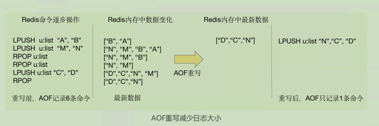

# 04 | AOF日志：宕机了，Redis如何避免数据丢失？

问题：

**一旦服务器宕机，内存中的数据将全部丢失。**

从后端数据库恢复这些数据，但这种方式存在两个问题：一是，需要**频繁访问数据库**，会给数据库带来巨大的压力；二是，这些数据是**从慢速数据库中读取**出来的，性能肯定比不上从 Redis 中读取，导致使用这些数据的应用程序响应变慢。

所以，**对 Redis 来说，实现数据的持久化**，避免从后端数据库中进行恢复，是至关重要的。

Redis 的持久化主要有两大机制，即 **AOF 日志和 RDB 快照**

## **AOF** **日志是如何实现的**

AOF 日志是写后日志。Redis 是先执行命令，把数据写入内存，然后才记录日志。

> 数据库的写前日志（Write Ahead Log, WAL），也就是说，在实际写数据前，先把修改的数据记到日志文件中，以便故障时进行恢复

**优点**

1. **避免额外的检查开销**. Redis 在向 AOF 里面记录日志的时候，**并不会先去对这些命令进行语法检查**。所以，如果先记日志再执行命令的话，日志中就有可能记录了错误的命令，Redis 在使用日志恢复数据时，就可能会出错. Redis 使用写后日志这一方式的**一大好处是，可以避免出现记录错误命令的情况**。
2. 它是在命令执行后才记录日志，所以**不会阻塞当前的写操作**。

**缺点**

1. 如果刚执行完一个命令，还没有来得及记日志就宕机了，那么这个命令和相应的数据就有丢失的风险
2. AOF 虽然避免了对当前命令的阻塞，但可能会给下一个操作带来阻塞风险，AOF 日志也是在主线程中执行的，如果在把日志文件写入磁盘时，磁盘写压力大，就会导致写盘很慢，进而导致后续的操作也无法执行了

这两个风险都是和 **AOF 写回磁盘的时机相关的**。这也就意味着，如果我们能够控制一个写命令执行完后 AOF 日志写回磁盘的时机，这两个风险就解除了

### **三种写回策略**

AOF 配置项appendfsync 的三个可选值

1. **Always**，同步写回：每个写命令执行完，立马同步地将日志写回磁盘
   1. “同步写回”可以做到**基本不丢数据**，但是它在**每一个写命令后都有一个慢速的落盘操作**，不可避免地会影响主线程性能
2. **Everysec**，每秒写回：每个写命令执行完，只是先把日志写到 AOF 文件的内存缓冲区，每隔一秒把缓冲区中的内容写入磁盘
   1. 避免了“同步写回”的性能开销，虽然减少了对系统性能的影响，但是如果发生宕机，上一秒内未落盘的命令操作仍然会丢失。所以，这只能算是，在避免影响主线程性能和避免数据丢失两者间取了个折中
3. **No**，操作系统控制的写回：每个写命令执行完，只是先把日志写到 AOF 文件的内存缓冲区，由操作系统决定何时将缓冲区内容写回磁盘
   1. 在写完缓冲区后，就可以继续执行后续的命令，但是落盘的时机已经不在 Redis 手中了，只要 AOF 记录没有写回磁盘，一旦宕机对应的数据就丢失了

**优缺点**：

**注意点**

AOF 是以**文件的形式**在记录接收到的所有写命令。随着接收的写命令越来越多，**AOF 文件会越来越大**。这也就意味着，我们一定要**小心 AOF 文件过大带来的性能问题**。

1. 文件系统本身对文件大小有限制，**无法保存过大的文件**；
2. 如果文件太大，之后再往里面追**加命令记录的话，效率也会变低**；
3. 如果发生宕机，AOF 中记录的命令要一个个被重新执行，用于**故障恢复**，如果日志文件太大，整个恢复过程就会**非常缓慢**，这就会影响到 Redis 的正常使用

## **日志文件太大了怎么办|**AOF 重写机制****

AOF 重写机制就是在重写时，Redis 根据数据库的**现状创建一个新的 AOF 文件**，也就是说，**读取数据库中的所有键值对，然后对每一个键值对用一条命令记录它的写入**。

实际上，重写机制具有“多变一”功能。所谓的“多变一”，也就是说，**旧日志文件中的多条命令，在重写后的新日志中变成了一条命令**

虽然 AOF 重写后，日志文件会缩小，但是，要把整个数据库的最新数据的操作日志都写回磁盘，仍然是一个非常耗时的过程，重写会不会阻塞主线程？

重写过程是由**后台线程 bgrewriteaof 来完成的**。

**一个拷贝，两处日志**

一个拷贝

每次执行重写时，主线程 **fork 出后台的 bgrewriteaof 子进程**。此时，**fork 会把主线程的内存拷贝一份给 bgrewriteaof 子进程**，这里面就包含了数据库的最新数据。然后，bgrewriteaof 子进程就可以在不影响主线程的情况下，逐一把拷贝的数据写成操作，记入重写日志。

两处日志

1. 主线程未阻塞，仍然可以处理**新来的操作**。此时，如果有写操作，第一处日志就是指正在使用的 AOF 日志，Redis 会把这个操作写到它的缓冲区。即使宕机了，这个 AOF 日志的操作仍然是齐全的，可以用于恢复。
2. 新的 AOF 重写日志。这个操作也会被写到重写日志的缓冲区。这样，重写日志也不会丢失最新的操作。等到拷贝数据的所有操作记录重写完成后，重写日志记录的这些最新操作也会写入新的 AOF 文件，以保证数据库最新状态的记录

​	

每次 AOF 重写时，Redis 会先执行一个**内存拷贝，用于重写**；然后，使用两个日志保证在重写过程中，**新写入的数据不会丢失**。而且，因为 Redis 采用**额外的线程进行数据重写**，所以，这个过程并不会阻塞主线程

> fork子进程，fork这个瞬间一定是会阻塞主线程的
>
> fork子进程时，子进程是会拷贝父进程的页表，即虚实映射关系，而不会拷贝物理内存。子进程复制了父进程页表，也能共享访问父进程的内存数据了，此时，类似于有了父进程的所有内存数据

