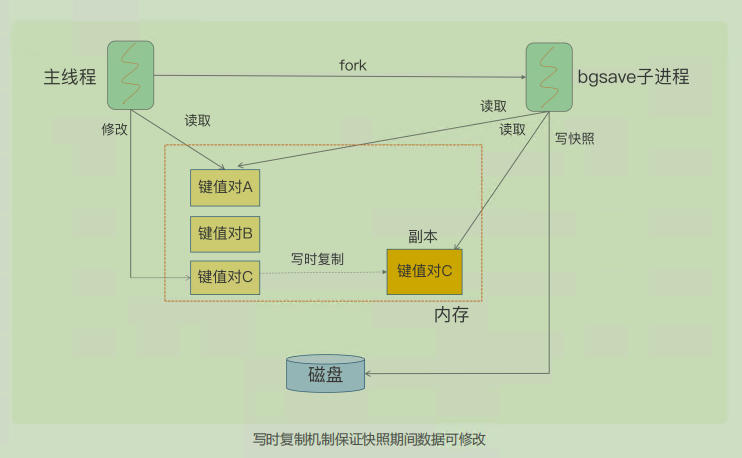
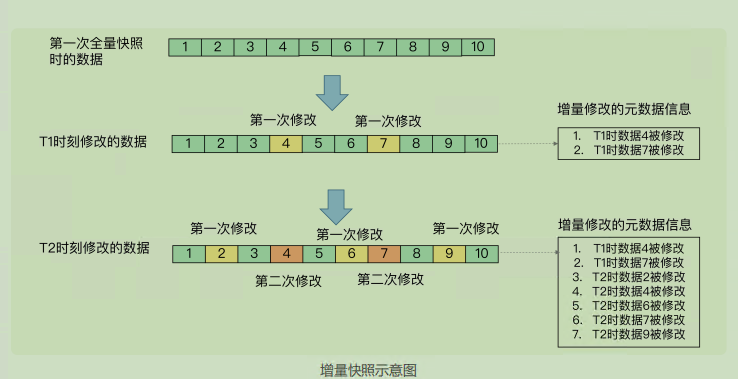
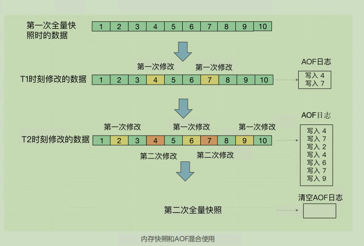

# **05 |** 内存快照：宕机后，Redis如何实现快速恢复？

AOF 缺点：因为记录的是操作命令，而不是实际的数据，所以，用 AOF 方法进行故障恢复的时候，需要逐一把操作日志都执行一遍。如果操作日志非常多，Redis 就会恢复得很缓慢，影响到正常使用

---

**内存快照**。所谓内存快照，就是指内存中的数据在某一个时刻的状态记录。这就类似于照片，当你给朋友拍照时，一张照片就能把朋友一瞬间的形象完全记下来。

这个快照文件就称为 RDB 文件，其中，RDB 就是 Redis DataBase 的缩写。在做数据恢复时，我们**可以直接把 RDB 文件读入内存，很快地完成恢复**

**两个关键问题**：

1. 对哪些数据做快照？这关系到快照的执行效率问题

2. 做快照时，数据还能被增删改吗？这关系到 Redis 是否被阻塞，能否同时正常处理请

   求。

## **给哪些内存数据做快照？**

Redis 的数据都在内存中，为了提供所有数据的可靠性保证，它执行的是**全量快照**，也就是说，把内存中的所有数据都记录到磁盘中。

全量数据越多，RDB 文件就越大，往磁盘上写数据的时间开销就越大。

> 所以一般不会让 Redis 实例过大，避免 RDB 过大

Redis 提供了两个命令来生成 RDB 文件，**分别是 save 和 bgsave**

1. save：在主线程中执行，会导致阻塞
2. **bgsave：创建一个子进程，专门用于写入 RDB 文件，避免了主线程的阻塞，这也是Redis RDB 文件生成的默认配置**

## **快照时数据能修改吗**

Redis 就会借助操作系统提供的写时复制技术（Copy-On-Write, COW），在执行快照的同时，正常处理写操作。

bgsave 子进程是由主线程 fork 生成的，可以共享主线程的所有内存数据。bgsave 子进程运行后，开始读取主线程的内存数据，并把它们写入 RDB 文件

如果主线程对这些数据也都是读操作，那么，主线程和bgsave 子进程相互不影响

如果主线程要修改一块数据，那么，这块数据就会被复制一份，生成该数据的副本。然后，bgsave 子进程会把这个副本数据写入 RDB 文件，而在这个过程中，主线程仍然可以直接修改原来的数据

保证了快照的完整性，也允许主线程同时对数据进行修改，避免了对正常业务的影响

---

小结：Redis 会使用 **bgsave 对当前内存中的所有数据做快照，这个操作是子进程在后台完成的，这就允许主线程同时可以修改数据**

## 多久做一次快照

虽然 bgsave 执行时不阻塞主线程，但是，**如果频繁地执行全量****快照，也会带来两方面的开销**

1. 频繁将全量数据写入磁盘，会给**磁盘带来很大压力**，**多个快照竞争**有限的磁盘带宽，前一个快照还没有做完，后一个又开始做了，容易造成恶性循环
2. bgsave 子进程需要通过 fork 操作从主线程创建出来。虽然，子进程在创建后不会再阻塞主线程，但是，**fork 这个创建过程本身会阻塞主线程，而且主线程的内存越大，阻塞时间越长**。如果频繁 fork 出 bgsave 子进程，这就会频繁阻塞主线程了。

### 增量快照

**做了一次全量快照后，后续的快照只对修改的数据进行快照记录，这样可以避免每次全量快照的开销**

前提：**我们需要记住哪些数据被修改了**

它需要我们使用额外的元数据信息去记录哪些数据被修改了，这会带来额外的空间开销问题

为了“记住”修改，引入的额外空间开销比较大。这对于内存资源宝贵的 Redis 来说有些得不偿失。

---

Redis 4.0 中提出了一个**混合使用 AOF 日志和内存快照**的方法，内存快照以一定的频率执行，在两次快照之间，使用 AOF 日志记录这期间的所有命令操作。

1. 快照不用很频繁地执行，这就避免了频繁 fork 对主线程的影响
2. AOF日志也只用记录两次快照间的操作，也就是说，不需要记录所有操作了，因此，就不会出现文件过大的情况了，也可以避免重写开销

