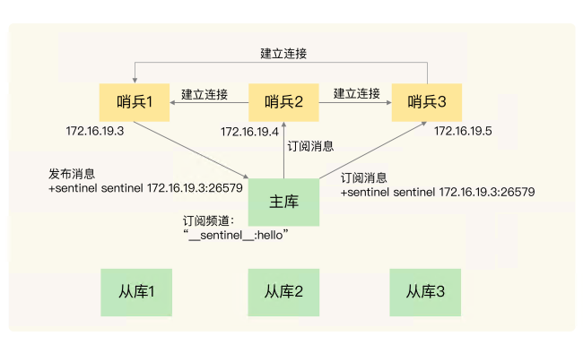
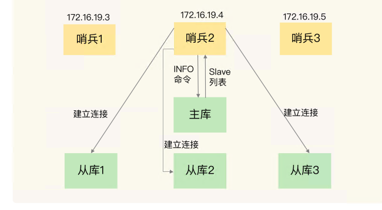
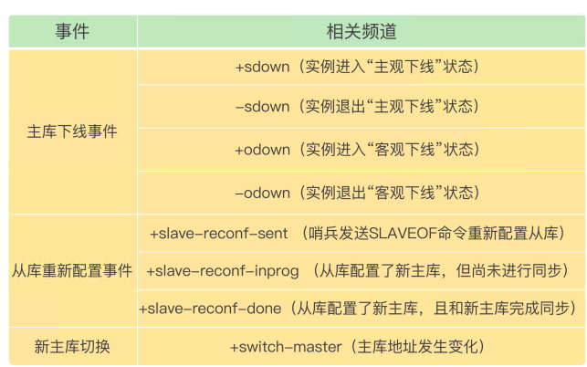
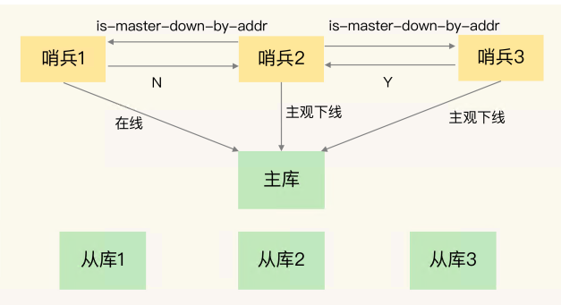
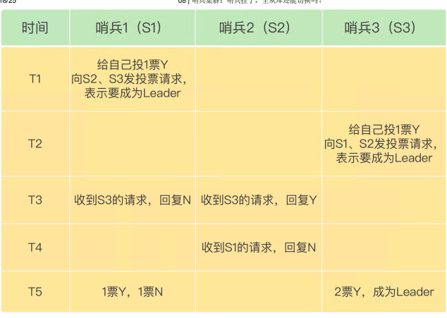

# 08 | 哨兵集群：哨兵挂了，主从库还能切换吗？

如果有哨兵实例在运行时发生了故障，主从库还能正常 切换吗？

多个实例组成了哨兵集群，即使有哨兵实例出现故障挂掉了，其他哨兵还能继续协作完成主从库切换的工作，包括判定主库是不是处于下线状态，选择新主库，以及通知从库和客户端。

在配置哨兵的信息时，我们只需要用到下面的这个配置项，设置主库的 IP 和端口，并没有配置其他哨兵的连接信息，哨兵实例既然都不知道彼此的地址，又是怎么组成集群的呢？
```shell
sentinel monitor <master-name> <ip> <redis-port> <quorum>
```

---

## 基于 pub/sub 机制的哨兵集群组成

Redis 提供的 pub/sub 机制，也就是发布 / 订阅 机制

哨兵只要和主库建立起了连接，就可以**在主库上发布消息了**，比如说发布它自己的连接信息（IP 和端口）。同时，它也可以从主库上订阅消息，**获得其他哨兵发布的连接信息**。

区分不同应用的消息，**Redis 会以频道的形式**，对这些消息进行分门别类的管理。所谓的频道，实际上就是消息的类别。当消息类别相同时，它们就属于同一个频道。 反之，就属于不同的频道。**只有订阅了同一个频道**的应用，才能通过发布的消息进行信息交换。

在主从集群中，主库上有一个名为“__sentinel__:hello”的频道，不同哨兵就是通过 它来相互发现，实现互相通信的.



哨兵除了**彼此之间建立起连接形成集群外，还需要和从库建立连接**。这是因为，在哨兵的监控任务中，它需要对主从库都进行心跳判断，而且在主从库切换完成后，它还需要通知从库，让它们和新主库进行同步。

**哨兵是如何知道从库的 IP 地址和端口的呢**

哨兵向主库发送 INFO 命令来完成的。哨兵 2 给主库发送 INFO 命令，主库接受到这个命令后，就会把从库列表返回给哨兵



**小结**：

通过 pub/sub 机制，哨兵之间可以组成集群，同时，哨兵又通过 INFO 命令，获得 了从库连接信息，也能和从库建立连接，并进行监控了。

主从库切换后，**客户端也需要知道新主库的连接信息**，才能向新主库发送请求操作。所以，哨兵还需要完成把新主库的信息告诉客户端这个任务。

## 基于 pub/sub 机制的客户端事件通知

从本质上说，哨兵就是一个运行在特定模式下的 Redis 实例，只不过它并不服务请求操作，只是完成监控、选主和通知的任务。所以，**每个哨兵实例也提供 pub/sub 机制，客户端可以从哨兵订阅消息。**

哨兵提供的消息订阅频道有很多，不同频道包含了主从库切换过 程中的不同关键事件



客户端读取哨兵的配置文件后，可以获得哨兵的地址和端口，**和哨兵建立网络连接**。然后， 我们可以在客户端执行订阅命令，来获取不同的事件消息。

```shell
所有实例进入客观下线状态的事件
SUBSCRIBE +odown
订阅所有的事件
PSUBSCRIBE *
主库已经切换了，新主库的 IP 地址和端口信息已经有了
switch-master <master name> <oldip> <oldport> <newip> <newport>
```

### 由哪个哨兵执行主从切换？

由哪个哨兵执行主从切换的过程，和主库“客观下线”的判断过程类似，也是一 个“投票仲裁”的过程。

**判断过程**

任何一个实例只要自身判断主库“主观下线”后，就会给其他实例发送 is-master-downby-addr 命令。接着，其他实例会根据自己和主库的连接情况，做出 Y 或 N 的响应，Y 相 当于赞成票，N 相当于反对票



一个哨兵获得了仲裁所需的赞成票数后，就可以标记主库为“客观下线”。这个所需的赞成票数是通过哨兵配置文件中的 **quorum 配置项**设定的。

此时，这个哨兵就可以再给其他哨兵发送命令，表明希望由自己来执行主从切换，并让所有其他哨兵进行投票。这个投票过程称为“Leader 选举”。因为最终执行主从切换的哨兵称为 Leader，投票过程就是确定 Leader

要满足两个条件：

第一，拿到半数以上的 赞成票；

第二，拿到的票数同时还需要大于等于哨兵配置文件中的 quorum 值



> 如果哨兵集群只有 2 个实例，此时，一个哨兵要想成为 Leader，必须获得 2 票，而不是 1 票。所以，**如果有个哨兵挂掉了，那么，此时的集群是无法进行主从库切换的**。因此，通常我们至少会配置 3 个哨兵实例。这一点很重要，你在实际应用时可不能忽略了。

**小结**

为了实现主从切换，我们引入了哨兵；

为了避免单个哨兵故 障后无法进行主从切换，以及为了减少误判率，又引入了哨兵集群；

哨兵集群又需要有一 些机制来支撑它的正常运行

1. 基于 pub/sub 机制的哨兵集群组成过程； 
2. 基于 INFO 命令的从库列表，这可以帮助哨兵和从库建立连接； 
3. 基于哨兵自身的 pub/sub 功能，这实现了客户端和哨兵之间的事件通知。

主从切换，需要 哨兵集群在判断了主库“客观下线”后，经过投票仲裁，选举一个 Leader 出来，由它负责实际的主从切换，即由它来完成新主库的选择以及通知从库与客户端。


> 要保证所有哨兵实例的配置是一致的，尤其是主观下线 的判断值 down-after-milliseconds。我们曾经就踩过一个“坑”。当时，在我们的项目 中，因为这个值在不同的哨兵实例上配置不一致，导致哨兵集群一直没有对有故障的主库 形成共识，也就没有及时切换主库，最终的结果就是集群服务不稳定。所以，你一定不要 忽略这条看似简单的经验。