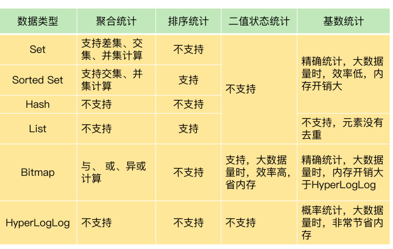

# 12 | 有一亿个keys要统计，应该用哪种集合？

需要对集合中的数据进行统计。
比如在网页访问记录中，需要统计独立访客（Unique Visitor，UV）量。

要想选择合适的集合，我们就得了解常用的集合统计模式。包括聚合统计、排序统计、二值状态统计和基数统计。

## 聚合统计

例如：统计手机 App 每天的新增用户数和第二天的留存用户数，正好对应了聚合统计

指统计多个集合元素的聚合结果，包括：统计多个集合的共有元素 （交集统计）；把两个集合相比，统计其中一个集合独有的元素（差集统计）；统计多个集合的所有元素（并集统计）

Set 的差集、并集和交集的计算复杂度较高，在数据量较大的情况下，如果直接执行这些计算，会导致 Redis 实例阻塞。

所以，我给你分享一个小建议：**你可以从主从集群中选择一 个从库，让它专门负责聚合计算，或者是把数据读取到客户端，在客户端来完成聚合统 计，这样就可以规避阻塞主库实例和其他从库实例的风险了**。

## 排序统计

例如：电商网站上提供最新评论列表的场景为例

最新评论列表包含了所有评论中的最新留言，这就要求集合类型能对元素保序，也就是 说，集合中的元素可以按序排列，这种对元素保序的集合类型叫作有序集合。

List 是按照元素进入 **List 的顺序**进行排序的，而 Sorted Set 可以根据**元素的权重**来排序，

在只有一页评论的时候，我们可以很清晰地看到最新的评论，但是，在实际应用中，网站 一般会分页显示最新的评论列表，**一旦涉及到分页操作，List 就可能会出现问题了**

List 是通过元素在 List 中的位置来排序的，当**有一个新元素插入**时，原先的元素在 List 中的位置都后移了一位，比如说原来在第 1 位的元素现在 排在了第 2 位。所以，对比新元素插入前后，**List 相同位置上的元素就会发生变化**，用 LRANGE 读取时，就会**读到旧元素**。

和 List 相比，Sorted Set 就不存在这个问题，因为它是根**据元素的实际权重**来排序和获取数据的。

可以按评论时间的先后给每条评论设置一个权重值，然后再把评论保存到 Sorted Set 中。Sorted Set 的 ZRANGEBYSCORE 命令就可以按权重排序后返回元素。这样的话，即使集合中的元素频繁更新，Sorted Set 也能通过 ZRANGEBYSCORE 命令准确地获取到按 序排列的数据。

假设越新的评论权重越大，目前最新评论的权重是 N，我们执行下面的命令时，就可以获 得最新的 10 条评论

```shel
 ZRANGEBYSCORE comments N-9 N
```

在面对需要展示最新列表、排行榜等场景时，如果数据更新频繁或者需要分页显 示，建议你优先考虑使用 Sorted Set

> 这里zset 中可以指定 分数，分数固定了，对应的也是固定的，不会影响插入数据，影响位置。
>
> 而 list 显示第一页后，插入数据了，然后翻页，会出现第一页页尾的数据

在面对需要展示最新列表、排行榜等场景时，**如果数据更新频繁或者需要分页显示**，建议你优先考虑使用 Sorted Set。

## 二值状态统计

二值状态统计。这里的二值状态就是指集合元素的取 值就只有 0 和 1 两种

在签到打卡的场景中，我们只用记录签到（1）或未签到（0），所 以它就是**非常典型的二值状态**

每个用户一天的签到用 1 个 bit 位就能表示，一个月（假设是 31 天）的签到情况用 31 个 bit 位就可以，而一年的签到也只需要用 365 个 bit 位，根本不用太复杂的集合类型。这个时候，我们就可以选择 **Bitmap**。这是 Redis 提供的扩展数据类型。

Bitmap 本身是用 **String 类型作为底层数据结构**实现的一种统计二值状态的数据类型。 **String 类型是会保存为二进制的字节数组**，所以，Redis 就把字节数组的每个 bit 位利用 起来，用来表示一个元素的二值状态。你可**以把 Bitmap 看作是一个 bit 数组**。

Bitmap 提供了 GETBIT/SETBIT 操作，使用一个偏移值 offset 对 bit 数组的某一个 bit 位 进行读和写。需要注意的是，**Bitmap 的偏移量是从 0 开始算的**，也**就是说 offset 的最小值是 0**。当使用 SETBIT 对一个 bit 位进行写操作时，这个 bit 位会被设置为 1。 Bitmap 还提供了 BITCOUNT 操作，用来统计这个 bit 数组中所有“1”的个数

ID 3000 的用户在 2020 年 8 月份的签到情况

```shell
第一步，执行下面的命令，记录该用户 8 月 3 号已签到
SETBIT uid:sign:3000:202008 2 1
第二步，检查该用户 8 月 3 日是否签到
GETBIT uid:sign:3000:202008 2
第三步，统计该用户在 8 月份的签到次数
BITCOUNT uid:sign:3000:202008
```

如果记录了 1 亿个用户 10 天的签到情况，你有办法**统计出这 10 天连续签到 的用户总数**吗？

BITOP 命令对多个 Bitmap 按位 做“与”“或”“异或”的操作，操作的结果会保存到一个新的 Bitmap 中。

在统计 1 亿个用户连续 10 天的签到情况时，你可以把**每天的日期作为 key**，每**个 key 对应一个 1 亿位的 Bitmap，每一个 bit 对应一个用户当天的签到情况**。

在实际应用时，最好对 Bitmap 设置过期时间，让 Redis 自动删除不再需要的签到记录，以节省内存开销

如果只需要统计数据的二值状态，例如商品有没有、用户在不在等，就可以使用 Bitmap，因为它只用一个 bit 位就能表示 0 或 1。在记录海量数据时，Bitmap 能够有效 地节省内存空间

---

## 基数统计

基数统计。基数统计就是指统计一个集合中不重复的元素个数。对应到我们刚才介绍的场景中，就是统计网页的 UV。独特的地方，就是需要去重，一个用户一天内的多次访问只能算作一 次。

Set 类型默认支持去重，所以看到有去重需求时，我们可能第一时间就会想到用 Set 类型，当你需要统计 UV 时，可以直接用 SCARD 命令，这个命令会 返回一个集合中的元素个数。但是数量过大的情况下可能很大，很占空间。

如果 page1 非常火爆，**UV 达到了千万**，这个时候，一个 Set 就要记录千万个用户 ID。对于一个搞大促的电商网站而言，**这样的页面可能有成千上万个**，如果每个页面都用 这样的一个 Set，就会消耗很大的内存空间

也可以用 Hash 类型记录 UV，当用户访问页面时，就用 HSET 命令（用 于设置 Hash 集合元素的值），对这个用户 ID 记录一个值“1”，表示一个独立访客，用 户 1 访问 page1 后，我们就记录为 1 个独立访客。即使用户 1 多次访问页面，重复执行这个 HSET 命令，也只会把 user1 的值设置为 1，仍 然只记为 1 个独立访客。当要统计 UV 时，我们可以用 HLEN 命令统计 Hash 集合中的所有元素个数。和 Set 类型相似，当页面很多时，Hash 类型也会消耗很大的内存空间。

**Redis 提供的 HyperLogLog**

HyperLogLog 是一种用于统计基数的数据集合类型，它的最大优势就在于，当集合元素数 量非常多时，它计算基数所需的空间总是固定的，而且还很小。

每个 HyperLogLog 只需要花费 12 KB 内存，就可以计算接近 2^64 个元素 的基数

```SHELL
PFADD page1:uv user1 user2 user3 user4 user5
返回 HyperLogLog 的统计结果
PFCOUNT page1:uv
```

HyperLogLog 的统计规则是基于概率(数学原理 伯努利 这里不记录具体的用户点击，通过数学计算概率)完成的，所以它给出 的统计结果是有一定误差的，标准误算率是 0.81%。但是，如果你需要精确统计结果的话，最好还是继续用 Set 或 Hash 类型.




