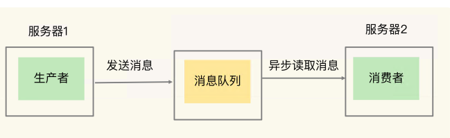
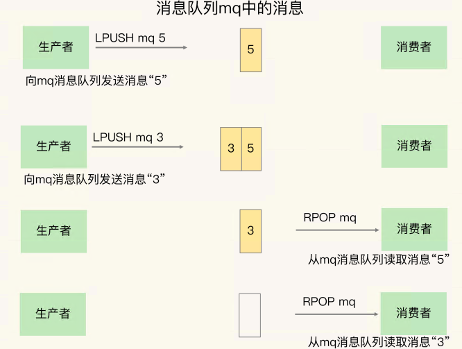
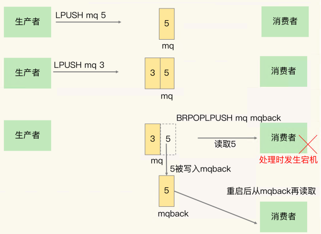
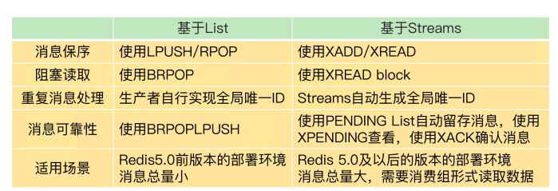
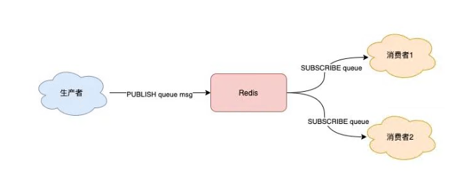
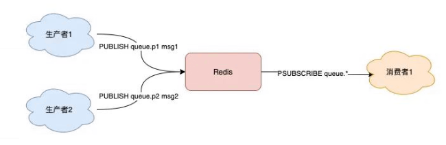
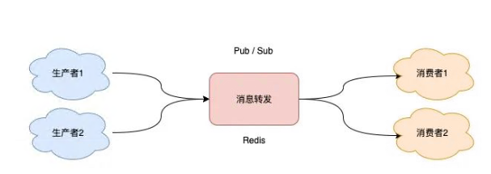
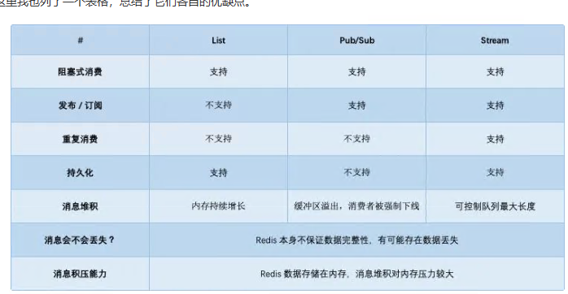

# 15 | 消息队列的考验：Redis有哪些解决方案？

消息队列要能支持组件通信消息的快速读写，而 Redis 本身支持数据的高速访问，正好可 以满足消息队列的读写性能需求。不过，除了性能，消息队列还有其他的要求，所以，很多人都很关心一个问题：“**Redis 适合做消息队列吗**？”

问题点：

1. 消息队列的消息存取需求是什么
2. Redis 如何实现消息队列的需求

## Redis 如何实现消息队列的需求

当两个组件要基于消息队列进行通信时，一个组件会把要处理的数据以消息的形式传递给消息队列，然后，这个组件就 可以继续执行其他操作了；远端的另一个组件从消息队列中把消息读取出来，再在本地进行处理。

消息队列在存取消息时，必须要满足三个需求，分别是**消息保序、处理重复的消息 和保证消息可靠**性。

### 需求一：消息保序

消费者仍然需要按照生产者发送消息的顺序来处理消息，避免后发送的消息被先处理了。对于要求消息保序的场景来说，一旦出现这种消息被乱序处理的情况，就可能会导致业务逻辑被错误执行，从而给业务方造成损失

### 需求二：重复消息处理

消费者从消息队列读取消息时，有时会因为**网络堵塞而出现消息重传**的情况。此时，消费者可能会收到多条重复的消息。对于重复的消息，消费者如果多次处理的话，就可能造成 一个业务逻辑被多次执行，如果业务逻辑正好是要修改数据，那就会出现数据被多次修改的问题了

### 需求三：消息可靠性保证

消费者在处理消息的时候，还可能出现因为**故障或宕机导致消息没有处理完成**的情况。此时，消息队列需要能提供消息可靠性的保证，也就是说，**当消费者重启后，可以重 新读取消息再次进行处理**，否则，就会出现消息漏处理的问题了

### 基于 List 的消息队列解决方案

List 本身就是按先进先出的顺序对数据进行存取的，所以，如果使用 List 作为消息队列保存消息的话，就已经能满足消息保序的需求了

List 并不会**主动地通知消费者有新消息写入**，如果消费者想要及时处理消息，就需要在程序中不停地调用 RPOP 命令（比如使用一个 while(1) 循 环）。如果有新消息写入，RPOP 命令就会返回结果，否则，RPOP 命令返回空值，再继续循环。

为了解决这个问题，Redis 提供了 **BRPOP 命令**。BRPOP 命令也称为阻塞式读取，客户端 在没有读到队列数据时，**自动阻塞，直到有新的数据写入队列，再开始读取新数据**。和消费者程序自己不停地调用 RPOP 命令相比，这种方式能**节省 CPU 开销**

**消费者程序本身能对重复消息进行判断**。 一方面，消息队列要能给每一个消息提供全局唯一的 ID 号；另一方面，消费者程序要把已经处理过的消息的 ID 号记录下来。

List 本身是不会为每个消息生成 ID 号的，所以，消息的全局唯一 ID 号就需要生产 者程序在发送消息前自行生成。

当消费者程序从 List 中读取一条消息后，List 就不会再留存这条消息了。

为了**留存消息**，List 类型提供了 **BRPOPLPUSH** 命令，这个命令的作用是让消费者程序从 一个 List 中读取消息，同时，Redis 会把这个消息再插入到**另一个 List（可以叫作备份 List）留存**。这样一来，如果消费者程序读了消息但没能正常处理，等它重启后，就可以从 备份 List 中重新读取消息并进行处理了

在用 List 做消息队列时，我们还可能遇到过一个问题：**生产者消息发送很快，而消费者处理消息的速度比较慢，这就导致 List 中的消息越积越多**，给 Redis 的内存带来很大压力。启动多个消费者程序组成一个消费组，一起分担处理 List 中的消息。 但是，List 类型并不支持消费组的实现。到 Redis 从 5.0 版本开始提供的 Streams 数据类型了，和 List 相比，Streams 同样能够满足消息队列的三大需求。而且，它还支持**消费组形式的 消息读取**。

### 基于 Streams 的消息队列解决方案

Streams 是 Redis 专门为消息队列设计的数据类型，它提供了丰富的消息队列操作命令

* XADD：插入消息，保证有序，可以自动生成全局唯一 ID； 

* XREAD：用于读取消息，可以按 ID 读取数据； 

* XREADGROUP：按消费组形式读取消息； 

* XPENDING 和 XACK：XPENDING 命令可以用来查询每个消费组内所有消费者已读取但尚未确认的消息，而 XACK 命令用于向消息队列确认消息处理已完成。

Streams 是 Redis 5.0 专门针对消息队列场景设计的数据类型，如果你的 Redis 是 5.0 及 5.0 以后的版 本，就可以考虑把 Streams 用作消息队列了

---

关于 Redis 是否适合做消息队列，业界一直是有争论的。很多人认为，要使用消息 队列，就应该采用 Kafka、RabbitMQ 这些专门面向消息队列场景的软件，而 Redis 更加 适合做缓存。

Redis 是一个非常轻量级的键值数据库，部署一个 Redis 实例就是启动一个进程，部署 Redis 集群，也就是部署多个 Redis 实 例。而 Kafka、RabbitMQ 部署时，涉及额外的组件，例如 Kafka 的运行就需要再部署 ZooKeeper。相比 Redis 来说，Kafka 和 RabbitMQ 一般被认为是重量级的消息队列。

如果分布式系统中的组件消息通信量不大，那么，Redis 只需要使用有限的内存空间就能满足消息存储的需求，而且，Redis 的高性能特性能支持快速的消息读写，不失为消息队列的一个好的解决方案。

----

参考[把Redis当作队列来用，真的合适吗？-腾讯云开发者社区-腾讯云 (tencent.com)](https://cloud.tencent.com/developer/article/1819027)

### **发布/订阅模型：Pub/Sub**

这个模块是 Redis 专门是针对「发布/订阅」这种队列模型设计的

使用 Pub/Sub 这种方案，既支持阻塞式拉取消息，还很好地满足了多组消费者，消费同一批数据的业务需求。除此之外，Pub/Sub 还提供了「匹配订阅」模式，允许消费者根据一定规则，订阅「多个」自己感兴趣的队列

Pub/Sub 最大的优势就是，支持多组生产者、消费者处理消息。

那它有什么缺点呢？

其实，Pub/Sub 最大问题是：**丢数据**.

如果发生以下场景，就有可能导致数据丢失：

1. 消费者下线
2. Redis 宕机
3. 消息堆积

Pub/Sub 在实现时非常简单，它没有基于任何数据类型，也没有做任何的数据存储，它只是单纯地为生产者、消费者建立「数据转发通道」，把符合规则的数据，从一端转发到另一端。

整个过程中，没有任何的数据存储，一切都是实时转发的.

如果一个消费者异常挂掉了，它再重新上线后，只能接收新的消息，在下线期间生产者发布的消息，因为找不到消费者，都会被丢弃掉。如果所有消费者都下线了，那生产者发布的消息，因为找不到任何一个消费者，也会全部「丢弃」

所以，当你在使用 Pub/Sub 时，一定要注意：**消费者必须先订阅队列，生产者才能发布消息，否则消息会丢失**

**因为 Pub/Sub 没有基于任何数据类型实现，所以它也不具备「数据持久化」的能力**。也就是说，Pub/Sub 的相关操作，不会写入到 RDB 和 AOF 中，**当 Redis 宕机重启，Pub/Sub 的数据也会全部丢失**。

Pub/Sub 的处理方式却不一样，当消息积压时，有可能会导致**消费失败和消息丢失**。每个消费者订阅一个队列时，Redis 都会在 Server 上给这个消费者在分配一个「**缓冲区**」，这个缓冲区其实就是一块内存。

因为这个缓冲区其实是有「上限」的（可配置），如果消费者拉取消息很慢，就会造成生产者发布到缓冲区的消息开始积压，缓冲区内存持续增长。如果超过了缓冲区配置的上限，此时，Redis 就会「强制」把这个消费者踢下线。这时消费者就会消费失败，也会丢失数据。

> 如果你有看过 Redis 的配置文件，可以看到这个缓冲区的默认配置：client-output-buffer-limit pubsub 32mb 8mb 60。
>
> 它的参数含义如下：
>
> - 32mb：缓冲区一旦超过 32MB，Redis 直接强制把消费者踢下线
> - 8mb + 60：缓冲区超过 8MB，并且持续 60 秒，Redis 也会把消费者踢下线

现在我们总结一下 Pub/Sub 的优缺点：

1. 支持发布 / 订阅，支持多组生产者、消费者处理消息
2. 消费者下线，数据会丢失
3. 不支持数据持久化，Redis 宕机，数据也会丢失
4. 消息堆积，缓冲区溢出，消费者会被强制踢下线，数据也会丢失

> 目前只有哨兵集群和 Redis **实例通信时**，采用了 Pub/Sub 的方案，因为哨兵正好符合即时通讯的业务场景。

---

### **与专业的消息队列对比**

其实，一个专业的消息队列，必须要做到两大块：

1. 消息不丢
2. 消息可堆积

---

#### 消息不丢

1. **生产者会不会丢消息**

   > 生产者一般会设定一个最大重试次数，超过上限依旧失败，需要记录日志报警处理。

   所以，无论是 Redis 还是专业的队列中间件，生产者在这一点上都是可以保证消息不丢的。
   
2. **消费者会不会丢消息**

​	消费者在处理完消息后，必须「告知」队列中间件，**队列中间件才会把标记已处理，否则仍旧把这些数据发给消费者**。无论是 Redis 的 Stream，还是专业的队列中间件，例如 RabbitMQ、Kafka，其实都是这么做的。所以，从这个角度来看，Redis 也是合格的

3. **队列中间件会不会丢消息**

	Redis 在以下 2 个场景下，都会导致数据丢失。

	* AOF 持久化配置为每秒写盘，但这个写盘过程是异步的，Redis 宕机时会存在数据丢失的可能
	* 主从复制也是异步的，主从切换时，也存在丢失数据的可能（从库还未同步完成主库发来的数据，就被提成主库）
	
	**所以，如果把 Redis 当做消息队列，在这方面是有可能导致数据丢失的。**
	
	像 RabbitMQ 或 Kafka 这类专业的队列中间件，在使用时，**一般是部署一个集群，生产者在发布消息时，队列中间件通常会写「多个节点」**，以此保证消息的完整性。这样一来，即便其中一个节点挂了，也能保证集群的数据不丢失。
	
	正因为如此，RabbitMQ、Kafka在设计时也更复杂。毕竟，它们是专门针对队列场景设计的

#### 消息可堆积

因为 Redis 的数据都存储在内存中，这就意味着一旦发生消息积压，则会导致 Redis 的内存持续增长，如果超过机器内存上限，就会面临被 OOM 的风险。Redis 的 Stream 提供了可以指定队列最大长度的功能，就是为了避免这种情况发生.

Kafka、RabbitMQ 这类消息队列就不一样了，它们的数据都会存储在磁盘上，磁盘的成本要比内存小得多，当消息积压时，无非就是多占用一些磁盘空间，相比于内存，在面对积压时也会更加「坦然」。

综上，我们可以看到，把 Redis 当作队列来使用时，始终面临的 2 个问题：

1. Redis 本身可能会丢数据
2. 面对消息积压，Redis 内存资源紧张

#### 小结

到这里，Redis 是否可以用作队列，我想这个答案你应该会比较清晰了。

如果你的**业务场景足够简单，对于数据丢失不敏感，而且消息积压概率比较小**的情况下，把 Redis 当作队列是完全可以的。而且，Redis 相比于 Kafka、RabbitMQ，部署和运维也更加轻量。

如果你的业务场景对于数**据丢失非常敏感，而且写入量非常大，消息积压时会占用很多的机器资源**，那么我建议你使用专业的消息队列中间件。

