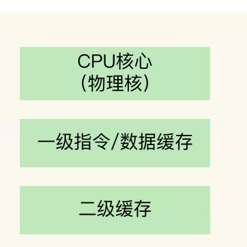
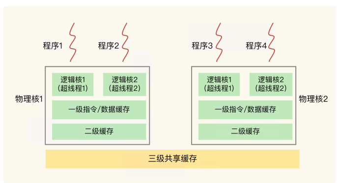
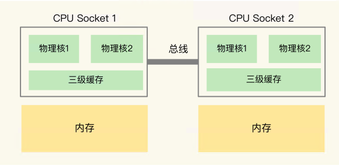
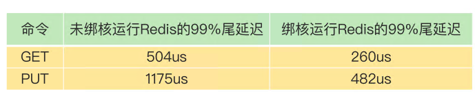
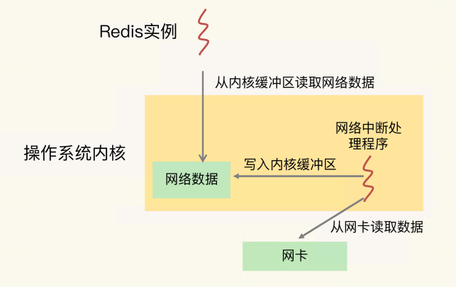
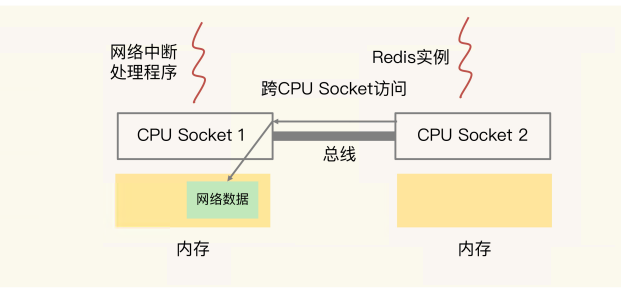

# 17 | 为什么CPU结构也会影响Redis的性能？

CPU 的多核架构以及多 CPU 架构，也会影响到 Redis 的性能。 如果不了解 CPU 对 Redis 的影响，在对 Redis 的性能进行调优时，就可能会遗漏一些调优方法，不能把 Redis 的性能发挥到极限

---

## CPU架构



不同的物理核还会共享一个共同的三级缓存（Level 3 cache，简称为 L3 cache）

现在主流的 CPU 处理器中，每个物理核通常都会运行两个超线程，也叫作逻辑核。 同一个物理核的逻辑核会共享使用 L1、L2 缓存。



在主流的服务器上，**一个 CPU 处理器会有 10 到 20 多个物理核**。同时，为了提升服务器 的处理能力，**服务器上通常还会有多个 CPU 处理器（也称为多 CPU Socket**），每个处理 器有自己的物理核（包括 L1、L2 缓存），L3 缓存，以及连接的内存，同时，**不同处理器间通过总线连接**。



在多 CPU 架构上，应用程序可以在不同的处理器上运行

如果应用程序先在一个 Socket 上运行，并且把数据保存到了内存，然后被调度到另一个 Socket 上运行，此时，应用程序再进行内存访问时，就需 要访问之前 Socket 上连接的内存，这种访问属于**远端内存访问**。**和访问 Socket 直接连接 的内存相比，远端内存访问会增加应用程序的延**迟。

在多 CPU 架构下，一个应用程序访问所在 Socket 的本地内存和访问远端内存的延迟并不 一致，所以，我们也把这个架构称为**非统一内存访问架构**（Non-Uniform Memory Access，**NUMA 架构**）


L1、L2 缓存中的指令和数据的访问速度很快，所以，充分利用 L1、L2 缓存，可以有效 缩短应用程序的执行时间；

 在 NUMA 架构下，如果应用程序从一个 Socket 上调度到另一个 Socket 上，就可能会 出现远端内存访问的情况，这会直接增加应用程序的执行时间

在多核 CPU 的场景下，一旦应用程序需要在一个新的 CPU 核上运行，那么，运行 时信息就需要重新加载到新的 CPU 核上。而且，新的 CPU 核的 L1、L2 缓存也需要重新 加载数据和指令，这会导致程序的运行时间增加。

> 我们把所有请求的处理延迟从小到大排个序，99% 的请求延迟小于的值就是 99% 尾延迟
>
> 比如说，我们有 1000 个请求， 假设按请求延迟从小到大排序后，第 991 个请求的延迟实测值是 1ms，而前 990 个请求 的延迟都小于 1ms，所以，这里的 99% 尾延迟就是 1ms。

context switch 是指线程的上下文切换，这里的上下文就是线程的运行时信息。在 CPU 多 核的环境中，一个线程先在一个 CPU 核上运行，之后又切换到另一个 CPU 核上运行，这 时就会发生 context switch

如果在 CPU 多核场景下，**Redis 实例被频繁调度到不同 CPU 核上运行的话**，那么，对 Redis 实例的请求处理时间影响就更大了。每调度一次，一些请求就会受到运行时信息、 指令和数据重新加载过程的影响，这就会导致某些请求的延迟明显高于其他请求。

我们要避免 **Redis 总是在不同 CPU 核上来回调度执行**。于是，我们尝试着把 Redis 实例和 CPU 核绑定了，让一个 Redis 实例固定运行在一个 CPU 核上。我们可以使用 **taskset** 命令把一个程序绑定在一个核上运行

```shell
taskset -c 0 ./redis-server
```



## CPU 的 NUMA 架构对 Redis 性能的影响

为了提升 Redis 的网络性能，把操作系统的网络中断处理程序和 CPU 核绑定。这个做法可以避免网络中断处理程序在不同核上来回调度执行，的确能有效提升 Redis 的网络处理性能

网络中断程序是要和 Redis 实例进行网络数据交互的，一旦把网络中断程序绑核 后，我们就需要注意 Redis 实例是绑在哪个核上了，这会关系到 Redis 访问网络数据的效 率高低。



网络中断处理程序从网卡硬件中读 取数据，并把数据写入到操作系统内核维护的一块内存缓冲区。内核会通过 epoll 机制触 发事件，通知 Redis 实例，Redis 实例再把数据从内核的内存缓冲区拷贝到自己的内存空间



如果网络中断处理程序和 Redis 实例各自所绑的 CPU 核不在同一个 CPU Socket 上，那么，Redis 实例读取网络数据时，就需要跨 CPU Socket 访 问内存，这个过程会花费较多时间

> 在 CPU 的 NUMA 架构下，对 CPU 核的编号规则，并不是先把一 个 CPU Socket 中的所有逻辑核编完，再对下一个 CPU Socket 中的逻辑核编码，而是**先 给每个 CPU Socket 中每个物理核的第一个逻辑核依次编号，再给每个 CPU Socket 中的 物理核的第二个逻辑核依次编号**。
>
> 我们可以执行 lscpu 命令，查看到这些核的编号

所以，你一定要注意 NUMA 架构下 CPU 核的编号方法，这样才不会绑错核


## 绑核的风险和解决方案

当我们把 Redis 实例绑到一个 CPU 逻辑核上时，就会导致子进程、后台线程和 Redis 主 线程竞争 CPU 资源，一旦子进程或后台线程占用 CPU 时，主线程就会被阻塞，导致 Redis 请求延迟增加。

分别是**一个 Redis 实例对应绑一个物理核和 优化 Redis 源码**。

### 方案一：一个 Redis 实例对应绑一个物理核

我们不要把一个实例和一个逻辑核绑定，而要和一个物理核绑定，也就是说，**把一个物理核的 2 个逻辑核都用上**

可以让主线程、子进程、后台线程共享使用 2 个逻辑核，可以在一定程度上缓解 CPU 资源竞争。但是，因为只用了 2 个逻 辑核，它们相互之间的 CPU 竞争仍然还会存在。


### 方案二：优化 Redis 源码

通过修改 Redis 源码，把子进程和后台线程绑到不同的 CPU 核上

> Redis 6.0 出来后，可以支持 CPU 核绑定的配置操作了


