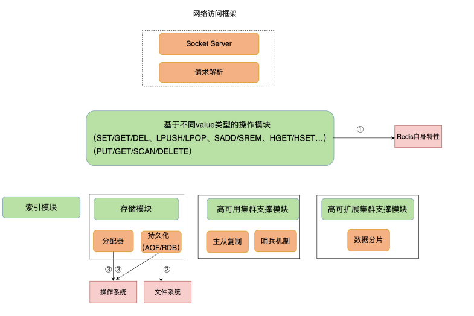

# 18 | 波动的响应延迟：如何应对变慢的Redis？（上）

Redis 突然变慢了,怎么处理？

---

导致 Redis 变慢的潜在阻塞点以及相应的解决方案，即**异步线程机制和 CPU 绑核**。

## Redis 真的变慢了吗？

### **查看 Redis 的响应延迟**

有些 Redis 实例会出现很高的响应延迟，甚至能达到几秒到十几秒，不过持续时间不长，这也叫延迟“毛刺”。

当你发现 Redis 命令的执行时间突然就增长到了几秒，基本就可以认定 Redis 变慢了

看 Redis 延迟的绝对值，在不同的软硬件环境下（有的性能高、性能低），Redis 本身的绝对性能并不相同。

### **基于当前环境下的 Redis 基线性能做判断**

> 基线性能，也就是一个系统在低压力、无干扰下的基本性能，这个性能只由当前的软硬件配置决定。

从 2.8.7 版本开始，redis-cli 命令提供了–intrinsic-latency 选项，可以用来**监测 和统计测试期间内的最大延迟，这个延迟可以作为 Redis 的基线性能**。其中，测试时长可 以用–intrinsic-latency 选项的参数来指定。

一般来说，你要把**运行时延迟和基线性能进行对比**，如果你观察到的 Redis 运行时延迟是 **其基线性能的 2 倍及以上，就可以认定 Redis 变慢了**

> 判断基线性能这一点，对于**在虚拟化环境下运行的 Redis 来说，非常重要**。这是因为，在 虚拟化环境（例如虚拟机或容器）中，由于**增加了虚拟化软件层，与物理机相比，虚拟机 或容器本身就会引入一定的性能开销**，所以基线性能会高一些。

为了避免网络对基线性能的影响， 刚刚说的**这个命令需要在服务器端直接运行**，这也就是说，我们**只考虑服务器端软硬件环境的影响**。

你想了解网络对 Redis 性能的影响，一个简单的方法是用 iPerf 这样的工具，**测量从 Redis 客户端到服务器端的网络延迟**。如果这个延迟有几十毫秒甚至是几百毫秒，就说明，Redis 运行的网络环境中很可能有大流量的其他应用程序在运行，导致网络拥塞了。 这个时候，你就需要协调网络运维，调整网络的流量分配了

---

## 如何应对 Redis 变慢？

### Redis 自身操作特性的影响

#### 慢查询命令

当 Value 类型为 Set 时，SORT、 SUNION/SMEMBERS 操作复杂度分别为 O(N+M*log(M)) 和 O(N)。其中，N 为 Set 中 的元素个数，M 为 SORT 操作返回的元素个数。这个复杂度就增加了很多。

可以通过 Redis 日志，或者是 latency monitor 工具，查询 变慢的请求，确认下是否采用了复杂度高的慢查询命令

1. **用其他高效命令代替**。比如说，如果你需要返回一个 SET 中的所有成员时，不要使用 SMEMBERS 命令，而是要使用 SSCAN 多次迭代返回，避免一次返回大量数据，造成 线程阻塞。
2. 当你需要执行排序、交集、并集操作时，**可以在客户端完成**，而不要用 SORT、 SUNION、SINTER 这些命令，以免拖慢 Redis 实例。

如果业务逻辑就是要求使用慢查询命令，那你得考虑采用性能更好的 CPU，更快地完成查询命令，避免慢查询的影响。

> 因为 KEYS 命令需要遍历存储的键值对，所以操作延时高。如果你不了解它的实现而使用 了它，就会导致 Redis 性能变慢。
>
> **所以，KEYS 命令一般不被建议用于生产环境中。**

#### 过期 key 操作

看过期 key 的**自动删除机制**。它是 Redis 用来回收内存空间的常用机制， 应用广泛，**本身就会引起 Redis 操作阻塞，导致性能变慢**，所以，你必须要知道该机制对性能的影响。

默认情况下，**Redis 每 100 毫秒**会删除一些过期key，具体的算法如下

1. 采样 ACTIVE_EXPIRE_CYCLE_LOOKUPS_PER_LOOP 个数的 key，并将其中过期的key 全部删除
2. **如果超过 25% 的 key 过期了，则重复删除的过程**，直到过期 key 的比例降至 25% 以下。

ACTIVE_EXPIRE_CYCLE_LOOKUPS_PER_LOOP 是 Redis 的一个参数，默认是 20，那么，一秒内基本有 200 个过期 key 会被删除。这一策略对清除过期 key、释放内存空间很有帮助。**如果每秒钟删除 200 个过期 key，并不会对 Redis 造成太大影响**。

如果触发了上面这个算法的第二条，Redis 就会一直删除以释放内存空间。注意，**删除操作是阻塞的**（Redis 4.0 后可以用异步线程机制来减少阻塞影响）。所以，一旦该条件触发，Redis 的线程就会一直执行删除，这样一来，就没办法正常服务其他的键值操作了，就会进一步引起其他键值操作的延迟增加，Redis 就会变慢。

所以我们就要避免第二种重复删除。

算法的第二条是怎么被触发的呢？是**频繁使用带有相同时间参数的 EXPIREAT 命令设置过期 key**，这就会导致，在同一秒内有大量的 key 同时过期。

要检查业务代码在使用 EXPIREAT 命令设置 key 过期时间时，是否使用了相同的 UNIX时间戳，有没有使用 EXPIRE 命令给批量的 key 设置相同的过期秒数。**因为，这都会造成大量 key 在同一时间过期，导致性能变慢**。

千万不要嫌麻烦，你首先要**根据实际业务的使用需求**，决定 EXPIREAT和 EXPIRE 的过期时间参数。其次，如果一批 key 的确是**同时过期**，你还可以在EXPIREAT 和 EXPIRE 的过期时间参数上，**加上一个一定大小范围内的随机数**，这样，既保证了 key 在一个邻近时间范围内被删除，又避免了同时过期造成的压力

