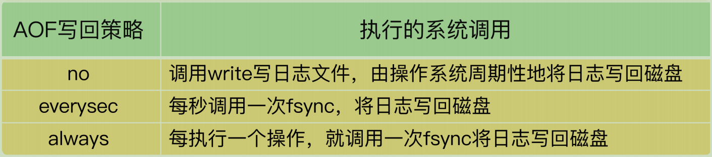

# **19 |** 波动的响应延迟：如何应对变慢的Redis？（下）

> 判断 Redis 变慢的两种方法，分别是响应延迟和基线性能
>
> 从 Redis 的自身命令操作层面排查和解决问题的两种方案（过期Key & 本身操作费时的KEYS）

上节课的方法不管用，那就说明，你要关注影响性能的其他机制了，也就是**文件系统和操作系统**

Redis 会**持久化保存数据到磁盘**，这个过程要依赖文件系统来完成，所以，**文件系统将数据写回磁盘的机制**，会直接影响到 Redis 持久化的效率。而且，在持久化的过程中，**Redis也还在接收其他请求**，持久化的效率高低又会影响到 Redis 处理请求的性能。

另一方面，Redis 是内存数据库，**内存操作非常频繁**，所以，**操作系统的内存机制**会直接影响到 Redis 的处理效率。比如说，**如果 Redis 的内存不够用了，操作系统会启动 swap机制**，这就会直接拖慢 Redis。


## 文件系统：AOF模式

Redis 会采用 AOF 日志或 RDB 快照。其中，AOF日志提供了三种日志写回策略：**no、everysec、always**。这三种写回策略依赖**文件系统的两个系统调用完成，也就是 write 和 fsync**。

1. write 只要把日志记录写到**内核缓冲区**，就可以返回了，**并不需要等待日志实际写回到磁盘**；

2. fsync 需要把日志记录写回到磁盘后才能返回，时间较长。



在使用 everysec 时，**Redis 允许丢失一秒的操作记录**，所以，Redis 主线程并不需要确保每个操作记录日志都写回磁盘。而且，fsync 的执行时间很长，如果是在 Redis 主线程中执行 fsync，就容易阻塞主线程。所以，当写回策略配置为 everysec 时，**Redis 会使用后台的子线程异步完成 fsync 的操作**。

对于 always 策略来说，**Redis 需要确保每个操作记录日志都写回磁盘**，如果用后台子线程异步完成，主线程就无法及时地知道每个操作是否已经完成了，这就不符合 always 策略的要求了。**所以，always 策略并不使用后台子线程来执行。**

在使用 AOF 日志时，**为了避免日志文件不断增大，Redis 会执行 AOF 重写**，生成体量缩小的新的 AOF 日志文件。**AOF 重写本身需要的时间很长，也容易阻塞 Redis 主线程，所以，Redis 使用子进程来进行 AOF 重写**。

这里有一个潜在的风险点：**AOF 重写会对磁盘进行大量 IO 操作**，同时，fsync 又需要等到数据写到磁盘后才能返回，**所以，当 AOF 重写的压力比较大时，就会导致 fsync 被阻塞**。虽然 fsync 是由后台子线程负责执行的，但是，**主线程会监控 fsync 的执行进度**。

当主线程使用后台子线程执行了一次 fsync，**需要再次把新接收的操作记录写回磁盘时**，如果主线程发现**上一次的 fsync 还没有执行完，那么它就会阻塞**。所以，如果**后台子线程执行的 fsync 频繁阻塞的话（比如 AOF 重写占用了大量的磁盘 IO 带宽），主线程也会阻塞**，导致 Redis 性能变慢


fsync 后台子线程和 AOF 重写子进程的存在，主IO 线程一般不会被阻塞。但是，**如果在重写日志时，AOF 重写子进程的写入量比较大，fsync 线程也会被阻塞，进而阻塞主线程，导致延迟增加**

---

首先，你可以检查下 Redis 配置文件中的 **appendfsync 配置项**

如果 AOF 写回策略使用了 everysec 或 always 配置，请先确认下业务方对数据可靠性的要求，明确是否需要每一秒或每一个操作都记日志。有的业务方不了解 Redis AOF 机制，很可能就直接使用数据可靠性最高等级的 always 配置了。其实，在有些场景中（例如Redis 用于缓存），数据丢了还可以从后端数据库中获取，并不需要很高的数据可靠性。

如果业务应用对延迟非常敏感，但同时允许一定量的数据丢失，那么，可以把配置项 no-appendfsync-on-rewrite 设置为 yes，如下所示：

```java
no-appendfsync-on-rewrite yes
```

这个配置项设置为 yes 时，**表示在 AOF 重写时，不进行 fsync 操作**。也就是说，Redis 实例把写命令写到内存后，不调用后台线程进行 fsync 操作，就可以直接返回了。当然，如果此时实例发生宕机，就会导致数据丢失。反之，如果这个配置项设置为 no（也是默认配置），**在 AOF 重写时，Redis 实例仍然会调用后台线程进行 fsync 操作，这就会给实例带来阻塞**

如果的确需要高性能，同时也需要高可靠数据保证，我建议你考虑**采用高速的固态硬盘作****为 AOF 日志的写入设备**.

## 操作系统：swap

内存 swap 是操作系统里将内存数据在内存和磁盘间来回换入和换出的机制，涉及到磁盘的读写，所以，一旦触发 swap，无论是被换入数据的进程，还是被换出数据的进程，其性能都会受到慢速磁盘读写的影响

Redis 是内存数据库，内存使用量大，如果没有控制好内存的使用量，或者和其他内存需求大的应用一起运行了，就可能受到 swap 的影响，而导致性能变慢。

**一旦 swap 被触发了，Redis 的请求操作需要等到磁盘数据读写完成才行**。而且，和我刚才说的 AOF 日志文件读写使用 fsync 线程不同，**swap 触发后影响的是 Redis 主 IO 线程**，这会极大地增加 Redis 的响应时间

触发 swap 的原因主要是**物理机器内存不足**

解决思路：**增加机器的内存或者使用 Redis 集群**。

```bash
$ redis-cli info | grep process_id
process_id: 5332

// 进入 Redis 所在机器的 /proc 目录下的该进程目录中：
cd /proc/5332


$cat smaps | egrep '^(Swap|Size)'
Size: 584 kB
Swap: 0 kB
Size: 4 kB
Swap: 4 kB
Size: 4 kB
Swap: 0 kB
Size: 462044 kB
Swap: 462008 kB
Size: 21392 kB
Swap: 0 kB
```

每一行 Size 表示的是 Redis 实例所用的一块内存大小，而 Size 下方的 Swap 和它相对应，**表示这块 Size 大小的内存区域有多少已经被换出到磁盘上了**。如果这两个值相等，就表示这块内存区域已经完全被换出到磁盘了

一旦发生内存 swap，最直接的解决方法就是**增加机器内存**。如果该实例在一个 Redis 切片集群中，可以增加 Redis 集群的实例个数，来分摊每个实例服务的数据量，进而减少每个实例所需当然

如果 Redis 实例和其他操作大量文件的程序（例如数据分析程序）共享机器，你可以将 Redis 实例迁移到单独的机器上运行，以满足它的内存需求量。如果该实例正好是Redis 主从集群中的主库，而从库的内存很大，也可以考虑进行主从切换，把大内存的从库变成主库，由它来处理客户端请求

## **操作系统：内存大页**

除了内存 swap，还有一个和内存相关的因素，即**内存大页机制（Transparent HugePage, THP）**，也会影响 Redis 性能。

Linux 内核从 2.6.38 开始支持内存大页机制，该机制支持 **2MB 大小的内存页分配，而常规的内存页分配是按 4KB 的粒度来执行的。**

虽然内存大页可以给 Redis 带来**内存分配方面的收益**，但是，不要忘了，**Redis 为了提供数据可靠性保证，需要将数据做持久化保存**。这个写入过程由额外的线程执行，所以，此时，Redis 主线程仍然可以接收客户端写请求。客户端的写请**求可能会修改正在进行持久化的数据**。在这一过程中，**Redis 就会采用写时复制机制，也就是说，一旦有数据要被修改，Redis 并不会直接修改内存中的数据，而是将这些数据拷贝一份，然后再进行修改**。如果采用了内存大页，**那么，即使客户端请求只修改 100B 的数据，Redis 也需要拷贝2MB 的大页**。相反，如果是常规内存页机制，只用拷贝 4KB。两者相比，你可以看到，当客户端请求修改或新写入数据较多时，内存大页机制将导致大量的拷贝，这就会影响Redis 正常的访存操作，最终导致性能变慢。

那该怎么办呢？很简单，关闭内存大页，就行了。

```bash
cat /sys/kernel/mm/transparent_hugepage/enabled
```

如果执行结果是 always，就表明内存大页机制被启动了；如果是 never，就表示，内存大页机制被禁止。

```bash
echo never /sys/kernel/mm/transparent_hugepage/enabled
```

## 总结

1. 获取 Redis 实例在当前环境下的基线性能。
2. 是否用了慢查询命令？如果是的话，就使用其他命令替代慢查询命令，或者把聚合计算命令放在客户端做。
3. 是否对过期 key 设置了相同的过期时间？对于批量删除的 key，可以在每个 key 的过期时间上加一个随机数，避免同时删除。
4. 是否存在 bigkey？ 对于 bigkey 的删除操作，如果你的 Redis 是 4.0 及以上的版本，可以直接利用异步线程机制减少主线程阻塞；如果是 Redis 4.0 以前的版本，可以使用SCAN 命令迭代删除；对于 bigkey 的集合查询和聚合操作，可以使用 SCAN 命令在客户端完成。
5. Redis AOF 配置级别是什么？业务层面是否的确需要这一可靠性级别？如果我们需要高性能，同时也允许数据丢失，可以将配置项 no-appendfsync-on-rewrite 设置为yes，避免 AOF 重写和 fsync 竞争磁盘 IO 资源，导致 Redis 延迟增加。当然， 如果既需要高性能又需要高可靠性，最好使用高速固态盘作为 AOF 日志的写入盘。
6. Redis 实例的内存使用是否过大？发生 swap 了吗？如果是的话，就增加机器内存，或者是使用 Redis 集群，分摊单机 Redis 的键值对数量和内存压力。同时，要避免出现Redis 和其他内存需求大的应用共享机器的情况。
7. 在 Redis 实例的运行环境中，是否启用了透明大页机制？如果是的话，直接关闭内存大页机制就行了。
8. 是否运行了 Redis 主从集群？如果是的话，把主库实例的数据量大小控制在 2~4GB，以免主从复制时，从库因加载大的 RDB 文件而阻塞。
9. 是否使用了多核 CPU 或 NUMA 架构的机器运行 Redis 实例？使用多核 CPU 时，可以给 Redis 实例绑定物理核；使用 NUMA 架构时，注意把 Redis 实例和网络中断处理程序运行在同一个 CPU Socket 上。

----

**推荐直接看[Redis 性能分析官方文档](https://redis.io/docs/latest/operate/oss_and_stack/management/optimization/latency/)**


