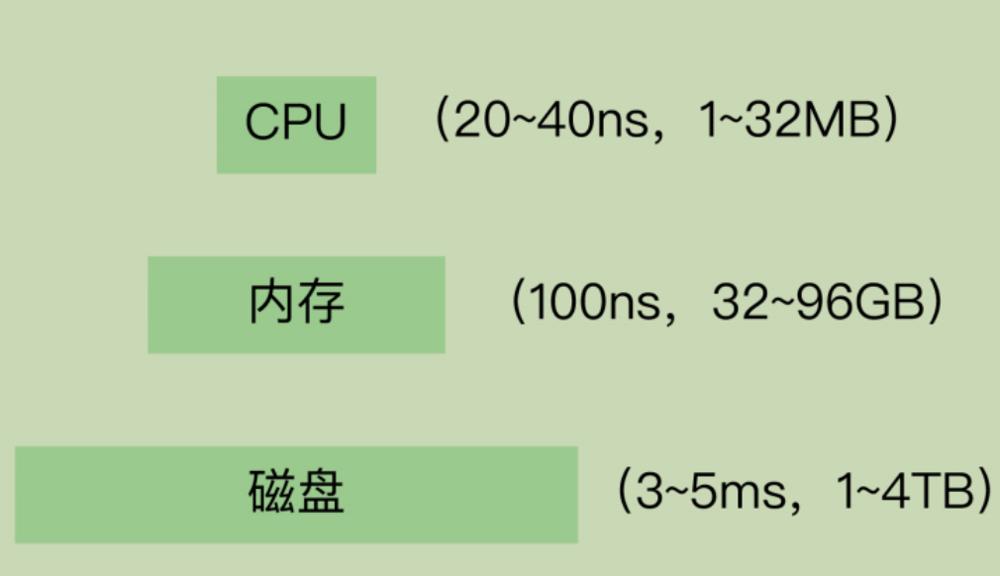
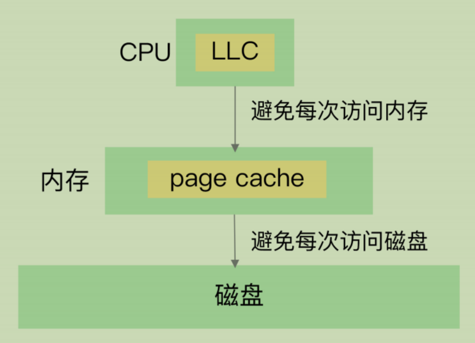
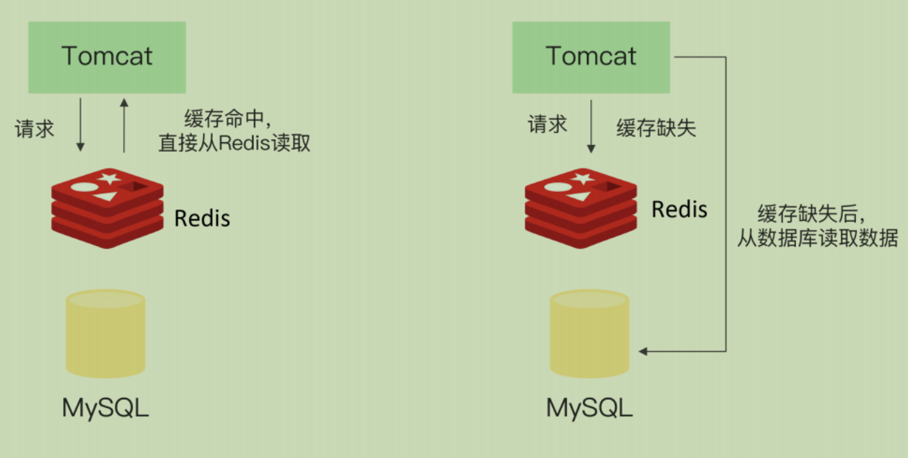
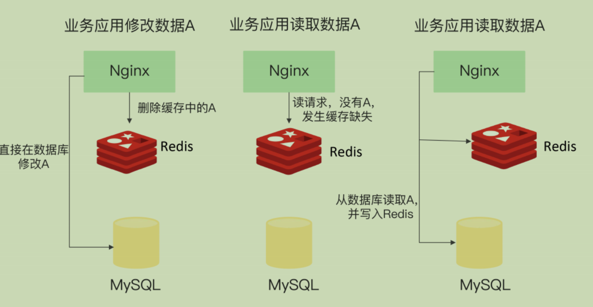
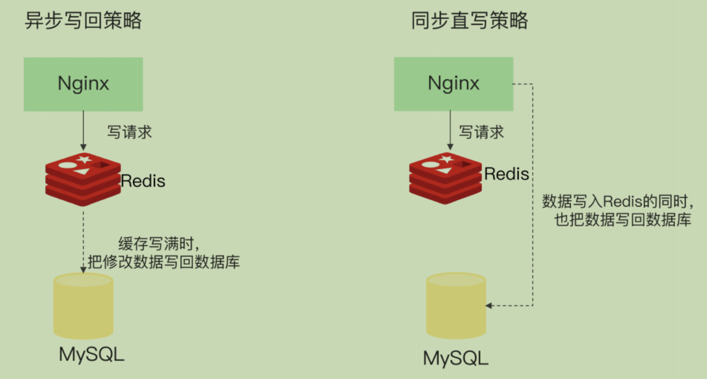

# **23 |** 旁路缓存：Redis是如何工作的？

Redis 提供了**高性能的数据存取功能**，所以广泛应用在缓存场景中，既能有**效地提升业务应用的响应速度**，还可以**避免把高并发大压力的请求发送到数据库层**。

作为缓存需要了解的点：

1. Redis 缓存具体是怎么工作的？
2. Redis 缓存如果满了，该怎么办？
3. 为什么会有缓存一致性、缓存穿透、缓存雪崩、缓存击穿等异常，该如何应对？
4. Redis 的内存毕竟有限，如果用快速的固态硬盘来保存数据，可以增加缓存的数据量，那么，Redis 缓存可以使用快速固态硬盘吗？

---

## **缓存的特征**

一个系统中的**不同层之间的访问速度不一样**，所以我们才需要缓存，这样就可以把一些需要**频繁访问的数据放在缓存中**，以加快它们的访问速度

CPU 里面的末级缓存，即 LLC，用来缓存内存中的数据，避免每次从内存中存取数据；

内存中的高速页缓存，即 page cache，用来缓存磁盘中的数据，避免每次从磁盘中存取数据

**第一个特征**：在一个层次化的系统中，**缓存一定是一个快速子系统**，数据存在缓存中时，能避免每次从慢速子系统中存取数据。

**第二个特征：缓存系统的容量大小总是小于后端慢速系统的，我们不可能把所有数据都放在缓存系统中**。

缓存中的数据需要**按一定规则淘汰**出去，写回后端系统，而**新的数据又要从后端系统中读取进来，写入缓存**。

## **Redis** **缓存处理请求的两种情况**

 Redis 部署在数据库的前端，业务应用在访问数据时，会先查询 Redis 中是否保存了相应的数据此时，根据数据是否存在缓存中，会有两种情况:

1. **缓存命中**：Redis 中有相应数据，就直接读取 Redis，性能非常快。
2. **缓存缺失**：Redis 中没有保存相应数据，就**从后端数据库中读取数据**，性能就会变慢。而且，一旦发生缓存缺失，为了让后续请求能从缓存中读取到数据，我们需要把缺失的数据写入 Redis，这个过程叫作**缓存更新**。缓存更新操作会涉及到保证缓存和数据库之间的**数据一致性问题**

## **Redis** **作为旁路缓存的使用操作**

Redis 是一个独立的系统软件，和业务应用程序是两个软件，当我们部署了 Redis 实例后，它只会被动地等待客户端发送请求，然后再进行处理。所以，如果应用程序想要使用Redis 缓存，我们就要在程序中增加相应的缓存操作代码。所以，我们也把 Redis 称为旁路缓存，也就是说，**读取缓存、读取数据库和更新缓存的操作都需要在应用程序中来完成**

这和我刚才讲的计算机系统中的 LLC 和 page cache 不一样。

## **缓存的类型**

### **只读缓存**

当 Redis 用作只读缓存时，应用要读取数据的话，会先调用 Redis GET 接口，查询数据是否存在。而所有的数据**写请求，会直接发往后端的数据库**，在数据库中增删改。对于删改的数据来说，如果 Redis 已经缓存了相应的数据，应用需要把这些缓存的数据删除，Redis中就没有这些数据了。

当应用再次读取这些数据时，会发生缓存缺失，应用会把这些数据从数据库中读出来，并写到缓存中。

所有**最新的数据都在数据库中**，而数据库是提供数据可靠性保障的，**这些数据不会有丢失的风险**。当我们需要缓存图片、短视频这些用户**只读的数据时，就可以使用只读缓存这个类型**了

### **读写缓存**

除了读请求会发送到缓存进行处理（直接在缓存中查询数据是否存在)，所有的写请求也会发送到缓存，在缓存中直接对数据进行增删改操作。此时，得益于Redis 的高性能访问特性，数据的增删改操作可以在缓存中快速完成，处理结果也会快速返回给业务应用，这就可以提升业务应用的响应速度。

和只读缓存不一样的是，在使用**读写缓存时，最新的数据是在 Redis 中**，而 Redis是内存数据库，一旦出现掉电或宕机，**内存中的数据就会丢失**。这也就是说，应用的最新数据可能会丢失，给应用业务带来风险

根据业务应用对数据可靠性和缓存性能的不同要求，我们会有同步直写和异步写回两种策略。

#### 同步直写

写请求发给缓存的同时，也会发给后端数据库进行处理，等到缓存和数据库都写完数据，才给客户端返回。这样，即使缓存宕机或发生故障，最新的数据仍然保存在数据库中，这就提供了数据可靠性保证。

同步直写会**降低缓存的访问性能**。这是因为缓存中处理写请求的速度是很快的，而**数据库处理写请求的速度较慢**。即使缓存很快地处理了写请求，也需要等待数据库处理完所有的写请求，才能给应用返回结果，这就增加了缓存的响应延迟。

#### 异步写回策略

优先考虑了响应延迟。此时，所有写请求都先在缓存中处理。等到这些增改的数据要被从缓存中淘汰出来时，缓存将它们写回后端数据库。如果发生了掉电，而它们还没有被写回数据库，就会有丢失的风险了

