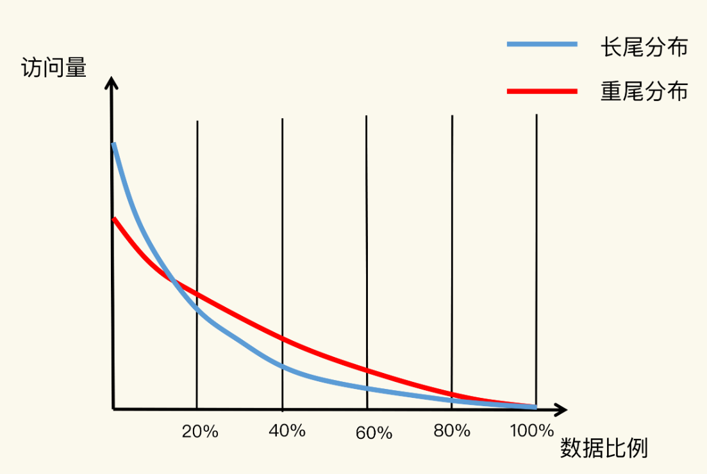
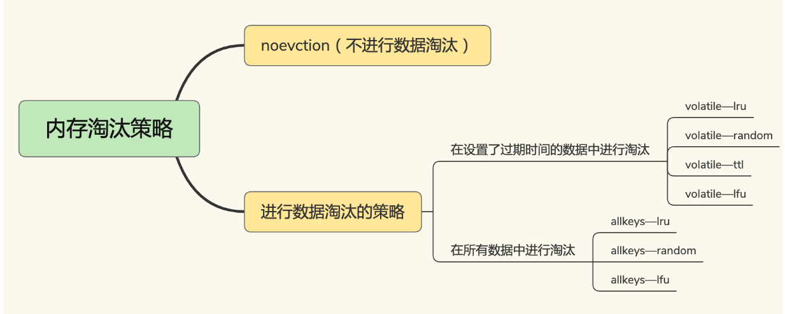
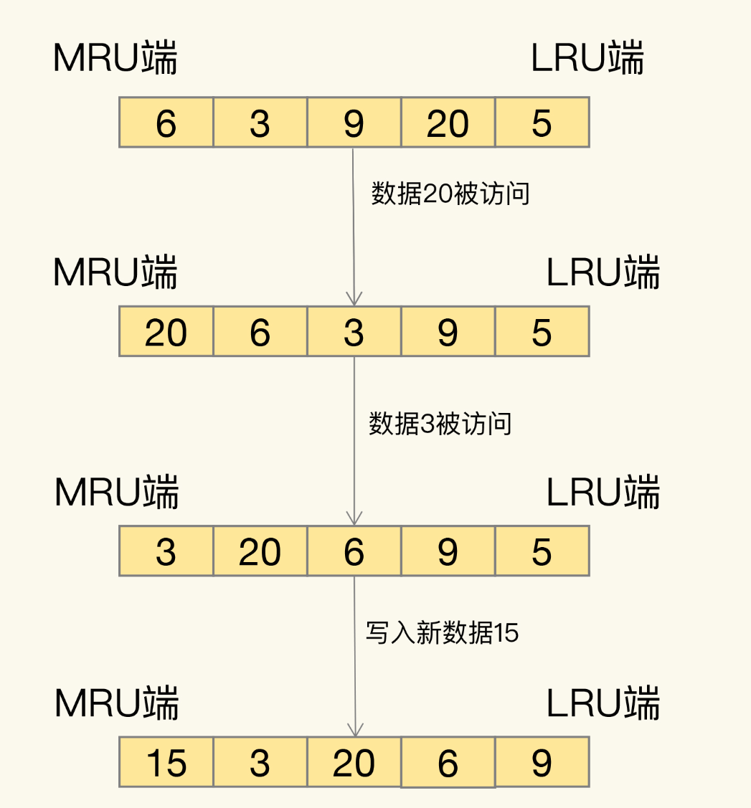
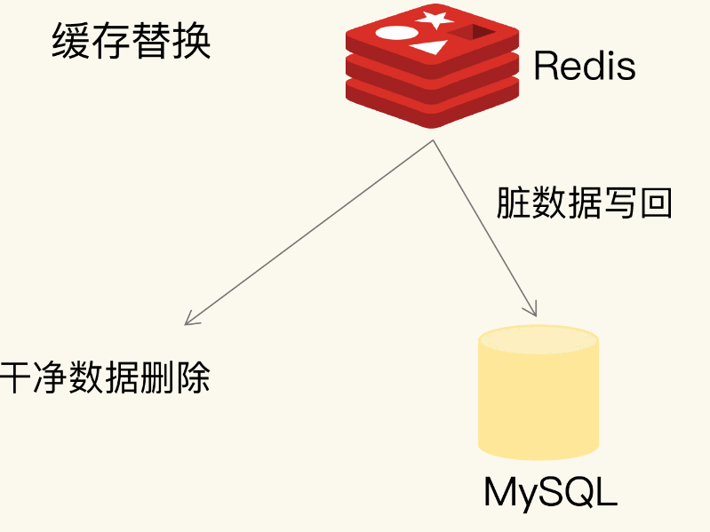

# 24 | 替换策略：缓存满了怎么办？

1. 缓存空间容量肯定小于后端数库的数据总量，缓存会被写满。
2. 八二原理

---

缓存数据的淘汰机制

1. 根据策略筛选出 “不重要”数据
2. 将这些数据 del

---

## 设置多少缓存容量合适

八二原理是统计意义上的，具体到业务场景不一定准确

根据应用数据访问特征 & 成本开销 综合考虑。 一般是设置容量是总数据的15%-30%

## 淘汰策略

4.0 之前 6种  之后 加了 2种 8种

LRU： 最近最少使用

random：随机

ttl：针对设置了 过期时间用的， 更加过期时间先后进行删除，越早过期越先del

LFU：最近最少频率使用

LRU：Least Recently Used

1. 需要链表记录
2. 每次操作，需要移动节点或者删除节点，耗时

改进：

1. 记录每个数据最近的一次访问时间戳（RedisObject种的 lru 字段记录）
2. 淘汰时，第一次随机选 N 个数据（maxmemory-samples 参数设置），作为候选集合
3. 比较 N 个数据的lru 字段，把最小的数据淘汰了
4. 再次需要淘汰时，Redis 挑选数据进入第一次淘汰创建的候选集合，标准： lru字段必须小于候选集合中的最小lru值
5. 新数据进入后，候选集合个数达到 maxmemory-samples ,Redis 就把 lru 最小的数据淘汰处理

**不需要维护链表和每次访问移动了**

---

> 如果业务数据有明显的冷热数据区分, 优先选择 allkey-lru。 
>
> 数据访问频率不大，使用 allkeys-random
>
> 业务有置顶的需求（就是不能过期的） volatile-lru

## 如何处理淘汰数据

脏数据： 和数据库不一样的就是了，有没有被修改过

