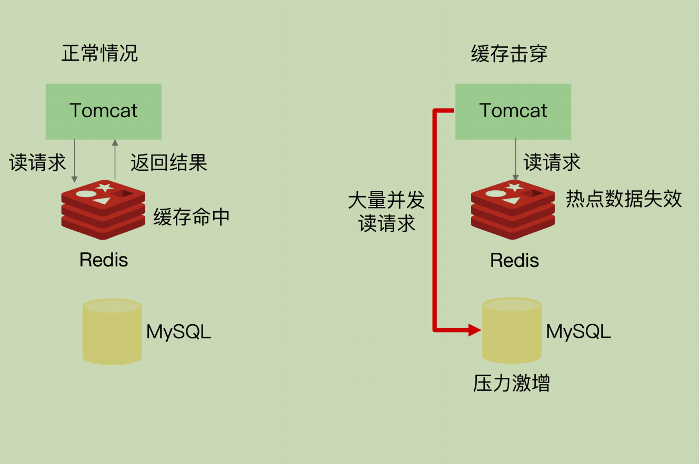

# **26 |** **缓存异常（下）：如何解决缓存雪崩、击穿、穿透难题？**

常常还会面临缓存异常的三个问题，分别是**缓存雪崩、缓存击穿和缓存穿透**。这三个问题一旦发生，会**导致大量的请求积压到数据库层**。如果请求的并发量很大，就会导致数据库宕机或是故障，这就是很严重的生产事故了。

## 缓存雪崩

缓存雪崩是指**大量的应用请求无法在 Redis 缓存中进行处理，紧接着，应用将大量请求发送到数据库层**，导致数据库层的压力激增。

第一个原因是：缓存中有**大量数据同时过期**，导致大量请求无法得到处理

两种解决方案：

1. 我们可以**避免给大量的数据设置相同的过期时间**。如果业务层的确要求有些数据同

   时失效，你可以在用 EXPIRE 命令给每个数据设置过期时间时，给这些数据的过期时间增

   **加一个较小的随机数**（例如，随机增加 1~3 分钟），这样一来，不同数据的过期时间有所

   差别，但差别又不会太大，既避免了大量数据同时过期，同时也保证了这些数据基本在相

   近的时间失效，仍然能满足业务需求

2. 服务降级，来应对缓存雪崩

   1. 当业务应用访问的是**非核心数据（例如电商商品属性）时，暂时停止从缓存中查询这些**

   **数据，而是直接返回预定义信息、空值或是错误信息**；

   2. 当业务应用访问的是核心数据（例如电商商品库存）时，仍然允许查询缓存，如果缓存

   缺失，也可以继续通过数据库读取
   
   

**除了大量数据同时失效会导致缓存雪崩，还有一种情况也会发生缓存雪崩，那就是，Redis**缓存实例发生故障宕机了，无法处理请求，这就会导致大量请求一下子积压到数据库层，从而发生缓存雪崩。

 Redis 实例发生了宕机，我们需要通过其他方法来应对缓存雪崩了

1. **是在业务系统中实现服务熔断或请求限流机制**

   指在发生缓存雪崩时，为了**防止引发连锁的数据库雪崩**，甚至是整个系统的崩溃，我们**暂停业务应用对缓存系统的接口访问**。再具体点说，就是业务应用调用缓存接口时，缓存客户端并不把请求发给 Redis 缓存实例，而是直接返回，**等到 Redis 缓存实例重新恢复服务后，再允许应用请求发送到缓存系统**

   我们可以监测 Redis 缓存所在机器和数据库所在机器的负载指标，例如每秒请求数、CPU 利用率、内存利用率等。**如果我们发现 Redis 缓存实例宕机了，而数据库所在机器的负载压力突然增加**（例如每秒请求数激增），此时，就发生缓存雪崩了。大量请求被发送到数据库进行处理。我们可以**启动服务熔断机制，暂停业务应用对缓存服务的访问**，从而降低对数据库的访问压力

   

   服务熔断虽然可以保证数据库的正常运行，但是暂停了整个缓存系统的访问，对业务应用的**影响范围大**。为了尽可能减少这种影响，我们也可以进行请求限流。这里说的**请求限流**，就是指，我们在业务系统的**请求入口前端控制每秒进入系统的请求数**，避免过多的请求被发送到数据库。

   

**事前预防**

主从节点的方式构建 Redis 缓存高可靠集群

## **缓存击穿**

针对某个**访问非常频繁的热点数据**的请求，**无法在缓存中进行处理**，紧接着，访问该数据的大量请求，一下子都发送到了后端数据库，导致了数据库压力激增，会影响数据库处理其他请求。缓存击穿的情况，经常发生在热点数据过期失效时。

我们的解决方法也比较直接，对于访问特别频繁的热点数据，我**们就不设置过期时间了**。

## **缓存穿透**

缓存穿透是指要访问的**数据既不在 Redis 缓存中，也不在数据库中**，导致请求在访问缓存时，发生缓存缺失，再去访问数据库时，发现数据库中也没有要访问的数据。如果应用持续有大量请求访问数据，就会同时给缓存和数据库带来巨大压力

1. 业务层误操作：缓存中的数据和数据库中的数据被误删除了，所以缓存和数据库中都没有数据；

   解决： **缓存空值或缺省值**

2. 恶意攻击：专门访问数据库中没有的数据。

   解决：

   1. 使用布隆过滤器快速判断数据是否存在，避免从数据库中查询数据是否存在，减轻数据库压力。

   

   2. 在请求入口的**前端进行请求检测。**缓存穿透的一个原因是有大量的恶意请求访问不存在的数据，所以，一个有效的应对方案是在请求入口前端，对**业务系统接收到的请求进行合法性检测**，把恶意的请求（例如**请求参数不合理、请求参数是非法值、请求字段不存在**）直接过滤掉，不让它们访问后端缓存和数据库。这样一来，也就不会出现缓存穿透问题了

## 总结

服务熔断、服务降级、请求限流这些方法都是属于“有损”方案，在保证数据库和整体系统稳定的同时，会对业务应用带来负面影响。例如使用服务降级时，有部分数据的请求就只能得到错误返回信息，无法正常处理。如果使用了服务熔断，那么，整个缓存系统的服务都被暂停了，影响的业务范围更大。而使用了请求限流机制后，整个业务系统的吞吐率会降低，能并发处理的用户请求会减少，会影响到用户体验。

尽量使用预防式方案：

1. 针对缓存雪崩，合理地设置数据过期时间，以及搭建高可靠缓存集群；

2. 针对缓存击穿，在缓存访问非常频繁的热点数据时，不要设置过期时间；

3. 针对缓存穿透，提前在入口前端实现恶意请求检测，或者规范数据库的数据删除操作，避免误删除。
