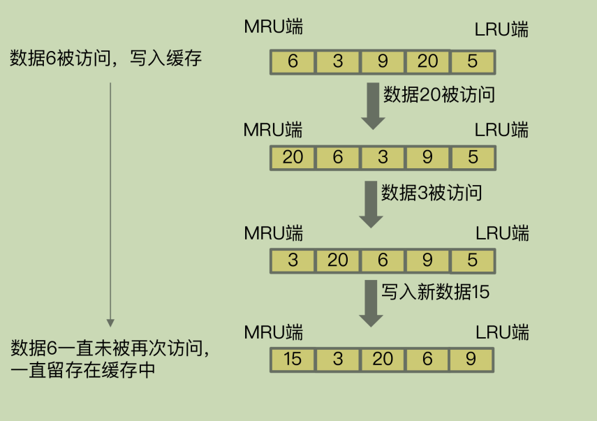
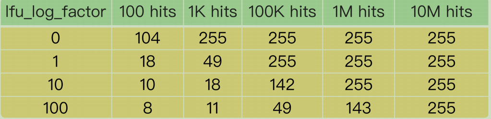

# **27 |** **缓存被污染了，该怎么办？**

## 什么是缓存污染

缓存污染是指操作系统将**不常用的数据从内存移到*缓存*，降低了缓存效率**的现象。

有些数据被访问的**次数非常少，甚至只会被访问一次**。当这些数据服务完访问请求后，如果还**继续留存在缓存中的话**，就只会**白白占用缓存空间**。这种情况，就是缓存污染。

对于访问频次很少的缓存，**不及时删除，浪费缓存空间**

---

## **如何解决缓存污染问题？**

把不会再被访问的数据**筛选出来并淘汰**掉。这样就不用等到缓存被写满以后，再逐一淘汰旧数据之后，才能写入新数据了。而哪些数据能留存在缓存中，是由缓存的**淘汰策略**决定的。

noeviction、volatile-random、volatile-ttl、volatile-lru、volatile-lfu、allkeys-lru、allkeys-random 和 allkeys-lfu 策略

noeviction 策略是不会进行数据淘汰的。所以，它肯定不能用来解决缓存污染问题。

---

**volatile-random 和 allkeys-random** 这两种策略。

它们都是采用**随机挑选数据**的方式，来筛选即将被淘汰的数据。既然是随机挑选，那么 Redis 就不会根据数据的访问情况来筛选数据。**如果被淘汰的数据又被访问了，就会发生缓存缺失**。也就是说，应用需要到后端数据库中访问这些数据，降低了应用的请求响应速度。所以，volatile-random 和 allkeys-random 策略，**在避免缓存污染这个问题上的效果非常有限。**

---

 **volatile-ttl** 策略是否能有效应对缓存污染。**volatile-ttl 针对的是设置了过期时间的数据，把这些数据中剩余存活时间最短的筛选出来并淘汰掉。**

剩余存活时间并不能直接反映数据再次访问的情况。所以，按照 volatile-ttl 策略淘汰数据，和按随机方式淘汰数据类似，也可能出现数据被淘汰后，被再次访问导致的缓存缺失问题。

**除了在明确知道数据被再次访问的情况下，volatile-ttl 可以有效避免缓存污染**

---

### **LRU** **缓存策略**

LRU 策略的核心思想：如果一个数据刚刚被访问，那么这个数据肯定是热数据，还会被再次访问

按照这个核心思想，Redis 中的 LRU 策略，会在**每个数据对应的 RedisObject 结构体中设置一个 lru 字段**，用来记录数据的**访问时间戳**。在进行数据淘汰时，LRU 策略会在候选数据集中淘汰掉 lru 字段值最小的数据（也就是访问时间最久的数据）。

也正是**因为只看数据的访问时间，使用 LRU 策略在处理扫描式单次查询操作时，无****法解决缓存污染**。

> 所谓的**扫描式单次查询**操作，就是指应用对**大量的数据进行一次全体读取，每个数据都会被读取，而且只会被读取一次**。此时，因为这些被查询的数据刚刚被访问过，所以 lru 字段值都很大。

在使用 LRU 策略淘汰数据时，**这些数据会留存在缓存中很长一段时间，造成缓存污染**。如果查询的数据量很大，这些数据占满了缓存空间，却又不会服务新的缓存请求，此时，再有新数据要写入缓存的话，还是需要先把这些旧数据替换出缓存才行，这会影响缓存的性能。



对于采用了 LRU 策略的 Redis 缓存来说，扫描式单次查询会造成缓存污染。为了应对这类缓存污染问题，Redis 从 4.0 版本开始增加了 LFU 淘汰策略。

与 LRU 策略相比，LFU 策略中会从两个维度来筛选并淘汰数据：**一是，数据访问的时效性（访问时间离当前时间的远近）；二是，数据的被访问次数。**

### **LFU** **缓存策略的优化**

LFU 缓存策略是在 LRU 策略基础上，**为每个数据增加了一个计数器，来统计这个数据的访问次数**。当使用 LFU 策略筛选淘汰数据时，**首先会根据数据的访问次数进行筛选**，把访问次数最低的数据淘汰出缓存。**如果两个数据的访问次数相同，LFU 策略再比较这两个数据的访问时效性**，把距离上一次访问时间更久的数据淘汰出缓存。

因此，L**FU 策略会优先把这些访问次数低的数据淘汰出缓存**。这样一来，LFU 策略就可以避免这些数据对缓存造成污染了

设计思路：

为了避免操作链表的开销，Redis 在实现 LRU 策略时使用了两个近似方法：

Redis 是用 RedisObject 结构来保存数据的，R**edisObject 结构中设置了一个 lru 字段**，用来记录数据的访问时间戳；

Redis 并没有为所有的数据维护一个全局的链表，而是通过随机采样方式，选取一定数量（例如 10 个）的数据放入候选集合，后续在候选集合中根据 lru 字段值的大小进行筛选

在此基础上，**Redis 在实现 LFU 策略的时候，只是把原来 24bit 大小的 lru 字段，又进一步拆分成了两部分。

1. ldt 值：lru 字段的前 16bit，表示数据的访问时间戳；

2. counter 值：lru 字段的后 8bit （那这最大就是 255），表示数据的访问次数。

总结一下：当 LFU 策略筛选数据时，Redis 会在候选集合中，根据数据 lru 字段的后 8bit选择访问次数最少的数据进行淘汰。当访问次数相同时，再根据 lru 字段的前 16bit 值大小，选择问时间最久远的数据进行淘汰。

---

巧妙的设计：

在实际应用中，一个数据可能会被访问成千上万次。如果每被访问一次，**counter 值就加1 的话**，那么，只要访**问次数超过了 255**，数据的 counter 值就一样了。在进行数据淘汰时，LFU 策略就无法很好地区分并筛选这些数据，反而还可能会把不怎么访问的数据留存在了缓存中。

假设第一个数据 A 的累计访问次数是 256，访问时间戳是 202010010909，所以它的counter 值为 255，而第二个数据 B 的累计访问次数是 1024，访问时间戳是202010010810。如果 counter 值只能记录到 255，那么数据 B 的 counter 值也是255

此时，缓存写满了，Redis 使用 LFU 策略进行淘汰。数据 A 和 B 的 counter 值都是255，LFU 策略再比较 A 和 B 的访问时间戳，发现数据 B 的上一次访问时间早于 A，就会把 B 淘汰掉。但其实数据 B 的访问次数远大于数据 A，很可能会被再次访问。这样一来，使用 LFU 策略来淘汰数据就不合适了。

因此，**在实现 LFU 策略时，Redis 并没有采用数据每****被访问一次，就给对应的 counter 值加 1 的计数规则，而是采用了一个更优化的计数规则

LFU 策略实现的计数规则是：**每当数据被访问一次时**，

首先，用计数器当前的值乘以配置项 lfu_log_factor 再加 1，再取其倒数，得到一个 p 值；

然后，把这个 p 值和一个取值范围在（0，1）间的随机数 r 值比大小，只有 p 值大于 r 值时，计数器才加 1。

```java
double r = (double)rand()/RAND_MAX;
...
double p = 1.0/(baseval*server.lfu_log_factor+1);
if (r < p) counter++;
```

使用了这种计算规则后，我们可以通过设置不同的 lfu_log_factor 配置项，来控制计数器值增加的速度，避免 counter 值很快就到 255 了。



正是因为**使用了非线性递增的计数器方法**，即使缓存数据的访问次数成千上万，LFU 策略也可以有效地区分不同的访问次数，从而进行合理的数据筛选。从刚才的表中，我们可以看到，**当 lfu_log_factor 取值为 10 时，百、千、十万级别的访问次数对应的 counter 值已经有明显的区分了**，所以，我们在应用 LFU 策略时，一般可以将 lfu_log_factor 取值为10。

有些数据在**短时间内被大量访问后就不会再被访问了**。那么再按照访问次数来筛选的话，这些数据会被留存在缓存中，但不会提升缓存命中率。**为此，Redis 在实现 LFU 策略时，还设计了一个 counter值的衰减机制**。

LFU 策略使用衰减因子配置项 lfu_decay_time 来控制访问次数的衰减。

LFU 策略会**计算当前时间和数据最近一次访问时间的差值，并把这个差值换算成以分钟为单位**。然后，LFU 策略再把这个**差值除以 lfu_decay_time** 值，所得的结果就是数据 **counter 要衰减的值**

假设 lfu_decay_time 取值为 1，如果数据在 N 分钟内没有被访问，那么

它的访问次数就要减 N。如果 lfu_decay_time 取值更大，那么相应的衰减值会变小，衰减效果也会减弱。所以，如果业务应用中有短时高频访问的数据的话，建议把lfu_decay_time 值设置为 1，这样一来，LFU 策略在它们不再被访问后，会较快地衰减它们的访问次数，尽早把它们从缓存中淘汰出去，避免缓存污染。

## 小结

缓存污染问题指的是留存在缓存中的数据，实际不会被再次访问了，但是又占据了缓存空间。

解决缓存污染问题，最关键的技术点就是能识别出这些只访问一次或是访问次数很少的数据，在淘汰数据时，优先把它们筛选出来并淘汰掉

volatile-random 和 allkeys-random 是随机选择数据进行淘汰，无法把不再访问的数据筛选出来，可能会造成缓存污染。**如果业务层明确知道数据的访问时长，可以给数据设置合理的过期时间，再设置 Redis 缓存使用 volatile-ttl 策略。**当缓存写满时，剩余存活时间最短的数据就会被淘汰出缓存，避免滞留在缓存中，造成污染。

使用 LRU 策略时，由于 LRU 策略只考虑数据的访问时效，对于只访问一次的数据来说，LRU 策略无法很快将其筛选出来。而 LFU 策略在 LRU 策略基础上进行了优化，在筛选数据时，首先会筛选并淘汰访问次数少的数据，然后针对访问次数相同的数据，再筛选并淘汰访问时间最久远的数据。

相对于 LRU 策略，Redis 只是把原来 24bit 大小的 lru 字段，又进一步拆分成了 16bit 的 ldt 和 8bit 的 counter，分别用来表示数据的访问时间戳和访问次数。为了避开 8bit 最大只能记录 255 的限制，LFU 策略设计使用非线性增长的计数器来表示数据的访问次数

LRU 和 LFU 两个策略都有应用。LRU 和 LFU 两个策略关注的数据访问特征各有侧重**，LRU 策略更加关注数据的时效性，而 LFU 策略更加关注数据的访问频次**。通常情况下，**实际应用的负载具有较好的时间局部性，所以 LRU 策略的应用会更加广泛。但是，在扫描式查询的应用场景中，LFU 策略就可以很好地应对缓存污染问题了，建议你优先使用**.

如果业务应用中有**短时高频访问**的数据，除了 LFU 策略本身会对数据的访问次数进行自动衰减以外，我再给你个小建议：**你可以优先使用 volatile-lfu 策略，并根据这些数据的访问时限设置它们的过期时间**，以免它们留存在缓存中造成污染

