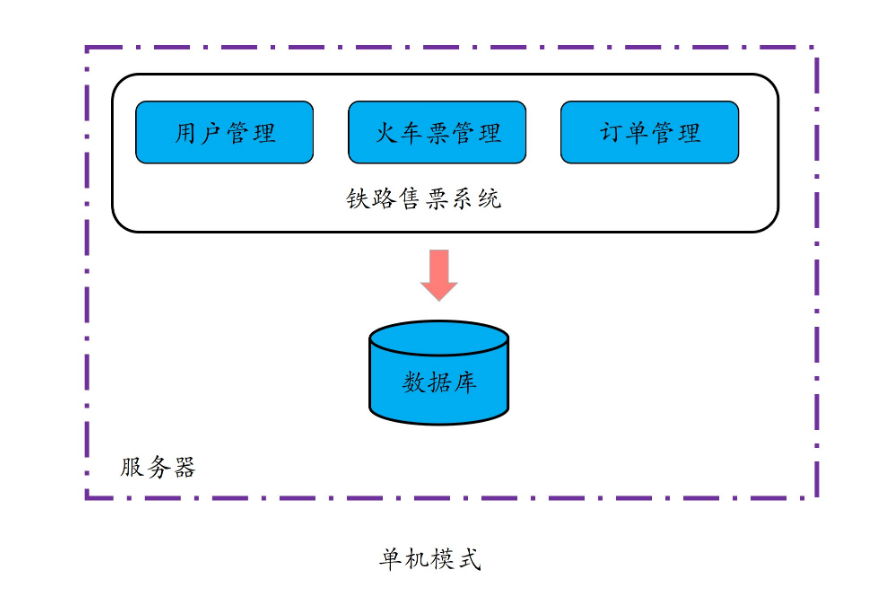
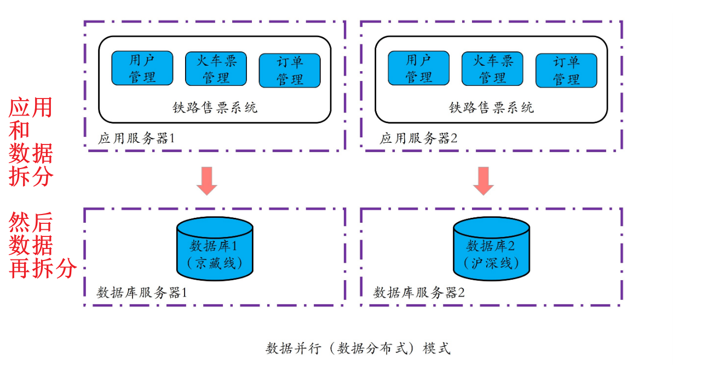
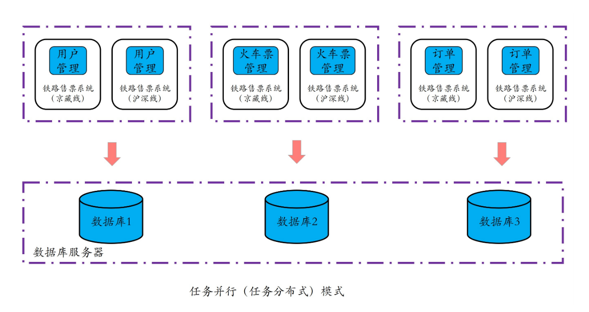

### 分布式起源

#### 单兵模式：单机模式

所有业务和数据均部署到同一台机器上

* 好处是功能、代码和数据集中，便于维护、管理和执行
* 性能受限，也存在单点失效的问题

#### 游击队模式：数据并行或数据分布式

* 对**数据进行拆分**，利用多台计算机并行执行多个相同任务，通过在相同的时间内完成多个相同任务，从而缩短所有任务的总体执行时间。

* 对提升单个任务的执行性能及降低时延无效

#### 集团军模式：任务并行或任务分布式

单任务拆分成多个子任务，多个子任务并行执行，只要一个复杂任务中的任意子任务的执行时间变短了，那么这个业务的整体执行时间也就变短了

---

#### 总结

**分布式其实就是将相同或相关的程序运行在多台计算机上，从而实现特定目标的一种计算方式。**数据并行、任务并行其实都可以算作是分布式的一种形态。**产生分布式的最主要驱动力量，是我们对于性能、可用性及可扩展性的不懈追求**。

