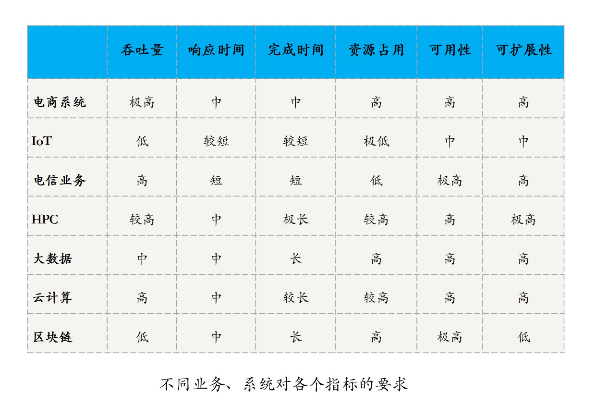

### 分布式系统的指标

分布式系统的出现就是为了用廉价的、普通的机器解决单个计算机处理复杂、大规模数据和任务时存在的性能问题、资源瓶颈问题，以及可用性和可扩展性问题。换句话说，分布式的目的是**用更多的机器，处理更多的数据和更复杂的任务**。

#### 性能（Performance）

性能指标，主要用于衡量一个系统处理各种任务的能力。

常见的性能指标，包括吞吐量（Throughput）、响应时间（Response Time）和完成时间（Turnaround Time）

**吞吐量**指的是，系统在一定时间内可以处理的任务数。

* QPS，即查询数每秒，用于衡量一个系统每秒处理的查询数。*
* TPS，即事务数每秒，用于衡量一个系统每秒处理的事务数。
* BPS，即比特数每秒，用于衡量一个系统每秒处理的数据量。

**响应时间**指的是，系统响应一个请求或输入需要花费的时间。

**完成时间**指的是，系统真正完成一个请求或处理需要花费的时间。

#### 资源占用（Resource Usage）

一个系统提供正常能力需要占用的硬件资源，比如 CPU、内存、硬盘等

**空载资源占用** 一个系统在没有任何负载时的资源占用

**满载资源占用** 一个系统满额负载时的资源占用

#### 可用性（Availability）

系统在面对各种异常时可以正确提供服务的能力。系统的可用性可以用**系统停止服务的时间与总的时间之比衡量**

**可靠性**通常用来表示一个系统完全不出故障的概率，更多地用在硬件领域。

**可用性**则更多的是指在允许部分组件失效的情况下，一个系统对外仍能正常提供服务的概率。

#### 可扩展性（Scalability）

分布式系统通**过扩展集群机器规模提高系统性能** (吞吐、响应时间、 完成时间)、存储容量、计算能力的特性，是分布式系统的特有性质。

**当任务的需求随着具体业务不断提高时，除了升级系统的性能做垂直 / 纵向扩展外，另一个做法就是通过增加机器的方式去水平 / 横向扩展系统规模。**

衡量系统可扩展性的常见指标是加速比（Speedup），也就是一个系统进行扩展后相对扩展前的性能提升。

---

### 不同场景下分布式系统的指标

### 总结

> 按照不同维度，分布式系统的指标可以分为性能、资源占用、可用性、可扩展性这四大类。我们自然希望自己的系统，是高性能、高可用、高扩展和低资源占用的，但考虑到硬件成本、开发效率等因素，必须要在设计不同的系统、业务时有所取舍。

