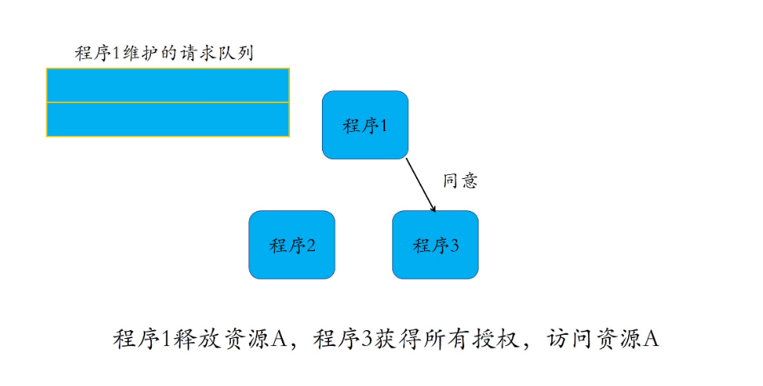

### 什么是分布式互斥？

分布式系统里，这种排他性的资源访问方式，叫作**分布式互斥**（Distributed Mutual Exclusion），而这种被互斥访问的共享资源就叫作**临界资源**（Critical Resource）。

### 霸道总裁：集中式算法

每个程序在需要访问临界资源时，先给**协调者**发送一个请求。如果当前没有程序使用这个资源，协调者直接授权请求程序访问；否则，按照先来后到的顺序为请求程序“排一个号”。如果有程序使用完资源，则通知协调者，协调者从“排号”的队列里取出排在最前面的请求，并给它发送授权消息。拿到授权消息的程序，可以直接去访问临界资源。

> 简单、易于实现的特点，但可用性、性能易受协调者影响

### 民主协商：分布式算法

当一个程序要访问临界资源时，先向系统中的其他程序发送一条请求消息，在**接收到所有程序返回的同意消息后，才可以访问临界资源**。其中，请求消息需要包含所请求的资源、请求者的 ID，以及发起请求的时间。

在分布式领域中，我们称之为分布式算法，或者使用组播和逻辑时钟的算法。

根据 先来先到 和 投票全票通过机制，让每个程序按时间顺序公平地访问资源，简单粗暴、易于实现。

缺点：

* 当系统内需要访问临界资源的程序增多时，容易产生“信令风暴”

  > 总结来说，**在大型系统中使用分布式算法，消息数量会随着需要访问临界资源的程序数量呈指数级增加，容易导致高昂的“沟通成本”。**

* 一旦某一程序发生故障，无法发送同意消息，那么其他程序均处在等待回复的状态中，使得整个系统处于停滞状态，导致整个系统不可用。

**分布式算法适合节点数目少且变动不频繁的系统，且由于每个程序均需通信交互，因此适合 P2P 结构的系统**。

#### Demo

Hadoop 是我们非常熟悉的分布式系统，其中的分布式文件系统 HDFS 的文件修改就是一个典型的应用分布式算法的场景。

### 轮值 CEO：令牌环算法

所有程序构成一个环结构，令牌按照顺时针（或逆时针）方向在程序之间传递，收到令牌的程序有权访问临界资源，访问完成后将令牌传送到下一个程序；若该程序不需要访问临界资源，则直接把令牌传送给下一个程序。
在分布式领域，这个算法叫作令牌环算法，也可以叫作基于环的算法。

优点

* 更高的通信效率 

  不需要像分布式算法那样挨个征求其他程序的意见了

* 公平性很好 

  在一个周期内，每个程序都能访问到临界资源

缺点

* 这就降低了系统的实时性 

  假设系统中有 100 个程序，那么程序 1 访问完资源后，即使其它 99 个程序不需要访问，也必须要等令牌在其他 99 个程序传递完后，才能重新访问资源

### 知识扩展：有适合大规模系统中的分布式互斥算法吗？

由于大规模系统的复杂性，我们很自然地想到要用一个相对复杂的互斥算法。时下有一个很流行的互斥算法，**两层结构的分布式令牌环算法，**把整个广域网系统中的节点组织成两层结构，可以用于节点数量较多的系统，或者是广域网系统。

广域网由多个局域网组成，因此在该算法中，局域网是较低的层次，广域网是较高的层次。每**个局域网中包含若干个局部进程和一个协调进程**。局部进程在逻辑上组成一个环形结构，在每个环形结构上有一个局部令牌 T 在局部进程间传递。**局域网与局域网之间通过各自的协调进程进行通信，这些协调进程同样组成一个环结构，这个环就是广域网中的全局环**。在这个全局环上，有一个全局令牌在多个协调进程间传递。

### 总结

