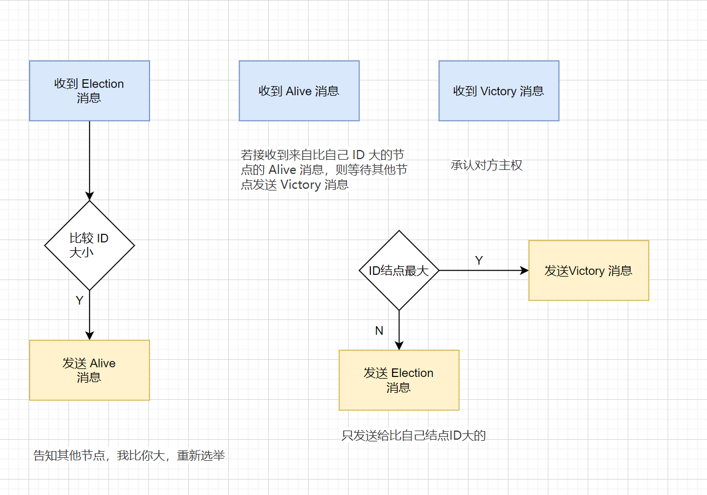

### 为什么要有分布式选举？

集群一般是由两个或两个以上的服务器组建而成，每个服务器都是一个节点

主节点，在一个分布式集群中负责对其他节点的协调和管理

主节点的存在，就可以保证其他节点的有序运行，以及数据库集群中的写入数据在每个节点上的一致性。这里的一致性是指，数据在每个集群节点中都是一样的，不存在不同的情况。

**选举的作用就是选出一个主节点，由它来协调和管理其他节点，以保证集群有序运行和节点间数据的一致性。**

### 分布式选举的算法

#### 长者为大：Bully 算法

选举原则是“长者”为大，即在所有活着的节点中，选取 ID 最大的节点作为主节点。

3 种消息类型

* Election 消息，用于发起选举；
* Alive 消息，对 Election 消息的应答；
* Victory 消息，竞选成功的主节点向其他节点发送的宣誓主权的消息

---

算法逻辑

* 每个节点判断自己的 ID 是否为当前活着的节点中 ID 最大的，如果是，则直接向其他节点发送 Victory 消息，宣誓自己的主权；

* 如果自己不是当前活着的节点中 ID 最大的，则向比自己 ID 大的所有节点发送 Election 消息，并等待其他节点的回复；

* 若在给定的时间范围内，本节点没有收到其他节点回复的 Alive 消息，则认为自己成为主节点，并向其他节点发送 Victory 消息，宣誓自己成为主节点；若接收到来自比自己 ID 大的节点的 Alive 消息，则等待其他节点发送 Victory 消息；

* 若本节点收到比自己 ID 小的节点发送的 Election 消息，则回复一个 Alive 消息，告知其他节点，我比你大，重新选举。

  

##### Demo

MongoDB 的副本集故障转移功能。MongoDB 的分布式选举中，采用节点的最后操作时间戳来表示 ID，时间戳最新的节点其 ID 最大，也就是说时间戳最新的、活着的节点是主节点。

##### 小结

这种算法的优点是，选举速度快、算法复杂度低、简单易实现

缺点在于

* **需要每个节点有全局的节点信息，因此额外信息存储较多**；

* 其次，任意一个比当前主节点 ID 大的新节点或节点故障后恢复加入集群的时候，都**可能会触发重新选举**，成为新的主节点，如果该节点频繁退出、加入集群，就会导致频繁切主

#### 民主投票：Raft 算法

“少数服从多数”,获得投票最多的节点成为主。

节点角色:

* Leader 主节点，同一个时刻只有一个Leader 负责协调管理其他接节点
* Candidate 候选者，只有Candidate 才能选为Leader
* Follower Leader 跟随者，不可以发起选举

**每一轮选举，每个节点只能投一次票**

Kubernetes 通常会部署 3 个节点用于数据备份。这 3 个节点中，有一个会被选为主，其他节点作为备。

Kubernetes 的选主采用的是开源的 etcd 组件。

etcd 的集群管理器 etcds，是一个高可用、强一致性的**服务发现存储仓库**，就是**采用了 Raft 算法来实现选主和一致性的**。

> Raft 算法具有选举速度快、算法复杂度低、易于实现的优点；
>
> 缺点是，**它要求系统内每个节点都可以相互通信，且需要获得过半的投票数才能选主成功，因此通信量大**。该算法选举稳定性比 Bully 算法好，这是因为当有新节点加入或节点故障恢复后，**会触发选主，但不一定会真正切主**，除非新节点或故障后恢复的节点获得投票数过半，才会导致切主

#### 具有优先级的民主投票：ZAB 算法

ZAB（ZooKeeper Atomic Broadcast）选举算法是为 ZooKeeper 实现分布式协调功能而设计的。

ZAB 算法增加了通过节点 ID 和数据 ID 作为参考进行选主，节点 ID 和数据 ID 越大，表示数据越新，优先成为主。ZAB 算法尽可能保证数据的最新性。

**ZAB 选举算法的核心是“少数服从多数，ID 大的节点优先成为主”**

3个角色 

* Leader 主节点
* Follower 跟随者
* Observer 观察者 没有投票权

---

4种状态

* Looking 即选举状态。当节点处于该状态时，它会认为当前集群中没有 Leader，因此自己进入选举状态。
* Leading  Leader 主节点 表示已经选出主，且当前节点为 Leader
* Following  Follower 跟随者 集群中已经选出主后，其他非主节点状态更新为 Following，表示对 Leader 的追随。
* Observing observer 观察者 ，持观望态度，没有投票权和选举权。

---

每个节点都有一个唯一的三元组 (server_id, server_zxID, epoch)，其中 server_id 表示本**节点的唯一 ID**；server_zxID 表示本节点存放的数据 ID，**数据 ID 越大表示数据越新，选举权重越大**；e**poch 表示当前选取轮数，一般用逻辑时钟表示。**

举过程中通过 (vote_id, vote_zxID) 来表明投票给哪个节点，其中 vote_id 表示被投票节点的 ID，vote_zxID 表示被投票节点的服务器 zxID。

ZAB 算法选主的原则是：server_zxID 最大者成为 Leader；若 server_zxID 相同，则 server_id 最大者成为 Leader。

##### 小结

ZAB 算法**性能高**，对系统无特殊要求，采用广播方式发送信息，若节点中有 n 个节点，每个节点同时广播，则集群中信息量为 n*(n-1) 个消息，**容易出现广播风暴**；且除了投票，还增加了对比节点 ID 和数据 ID，这就意味着还需要知道**所有节点的 ID 和数据 ID**，所以选举时间相对较长。

该算法选举**稳定性比较好**，当有新节点加入或节点故障恢复后，会触发选主，但不一定会真正切主，除非新节点或故障后恢复的节点数据 ID 和节点 ID 最大，且**获得投票数过半，才会导致切主**。

#### 三种选举算法的对比分析

#### 知识扩展：为什么“多数派”选主算法通常采用奇数节点，而不是偶数节点呢？

> 答案是，在这种情况下，无法选出主，必须重新投票选举。但即使重新投票选举，两个节点拥有相同投票数的概率也会很大。因此，多数派选主算法通常采用奇数节点。
>
> 通常看到 ZooKeeper、 etcd、Kubernetes 等开源软件选主均采用奇数节点的一个关键原因

### 总结

