# 06 | 分布式事务：All or nothing

具体业务场景：网上购物两个核心步骤：一是订单业务采取下订单操作，二是库存业务采取减库存操作。

两个业务会运行在不同的机器上，甚至是运行在不同区域的机器上。针对同一笔订单，当且仅当订单操作和减库存操作一致时，才能保证交易的正确性。

## 什么是分布式事务

**分布式事务，就是在分布式系统中运行的事务，由多个本地事务组合而成。**

分布式事务是多个事务的组合，事务的特征 ACID，也是分布式事务的基本特征

* 原子性 事务最终的状态只有 全部执行 和 全部不执行
* 一致性 事务前后，数据的完整性保持一致或者满足完整性约束
* 隔离性 事务之间的操作和使用数据是隔离的（要看对应的隔离级别）
* 持久性 事务完成，落盘了，永久存储下来

---

C 是强一致性，所有操作均执行成功，才提交最终结果，以保证数据一致性或完整性。

## 如何实现分布式事务

### 基于 XA 协议的二阶段提交方法

XA 协议是分布式事务协议，分为两部分，事务管理器和本地资源管理器。

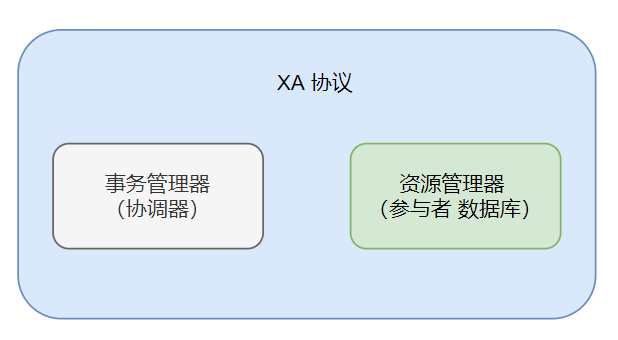

基本原理是：

* **事务管理器作为协调者（类似集中式算法）**，负责各个本地资源的提交和回滚；

* 资源管理器就是分布式事务的**参与者（数据库）**，通常由数据库实现

  > 从5.7版本 MySQL 实现了对 XA 事务的支持
  >
  > Oracle、DB2 等商业数据库都实现了 XA 接口。

二阶段提交协议用于保证分布式系统中事务提交时的数据一致性，是 XA 在全局事务中用于协调多个资源的机制。

协调者来管理所有的节点，并确保这些节点正确提交操作结果，若提交失败则放弃事务。

具体逻辑：

1. 投票（Voting）阶段

   事务管理器向事务参与者发起操作 CanCommit 请求，等待响应。 参与者收到请求，**执行事务，记录日志但是不提交**，向事务管理器返回结果 Yes / No。

   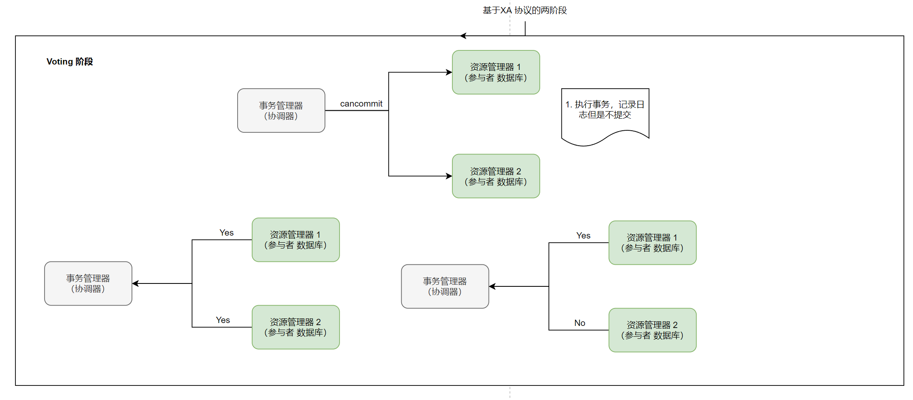

2. 提交（Commit）阶段

   参与者都返回了操作结果，系统进入了提交阶段，根据操作结果，向所有参与者发送 DoCommit /  DoAbort 指令

   * 收到的都是Yes ，则发送 DoCommit 给参与者完成剩余操作释放资源，然后向协调者发送 HaveCommited
   * 收到包含 No，则发送 DoAbort 参与者，此时发送 Yes 的参与者则会根据之前执行操作时的回滚日志对操作进行回滚，然后所有参与者会向协调者发送 HaveCommitted 消息；
   * 协调者接收到 HaveCommitted 消息，就意味着整个事务结束了。

   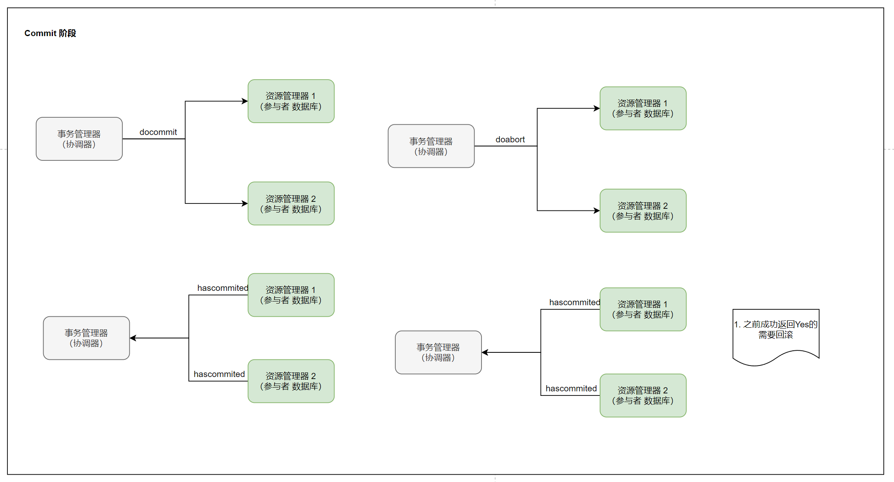

   **小结**

   协调者下发请求事务操作，参与者将操作结果通知协调者，协调者根据所有参与者的反馈结果决定各参与者是要提交操作还是撤销操作。

   **缺点**：

   * **同步阻塞问题** 

     二阶段提交算法在执行过程中，所有参与节点都是**事务阻塞型**的。也就是说，当本地资源管理器占有临界资源时，其他资源管理器如果要访问同一临界资源，会处于阻塞状态。

   * **单点故障问题**

     一旦**事务管理器发生故障**，整个系统都处于停滞状态。尤其是在提交阶段，一旦事务管理器发生故障，资源管理器会由于等待管理器的消息，而一直锁定事务资源，导致整个系统被阻塞。

   * **数据不一致问题**

     在提交阶段，当协调者向参与者发送 DoCommit 请求之后，如果发生了局部网络异常，或者在发送提交请求的过程中协调者发生了故障，就会**导致只有一部分参与者接收到了提交请求并执行提交操作**，但其他未接到提交请求的那部分参与者则无法执行事务提交。于是整个分布式系统便出现了数据不一致的问题。

### 三阶段提交协议方法

对二阶段提交（2PC）的改进。为了解决两阶段提交的同步阻塞和数据不一致问题，**三阶段提交引入了超时机制和准备阶段**。

* 同时在协调者和参与者中添加超时机制

  规定的时间内没有接收到其他节点的响应，根据单前的状态提交或者终止整个事务

* Voting投票第一阶段和 Commit提交第二阶段插入 PreCommit 预提交阶段

  用于排除不一致的情况，保证最后提交之前各个参与节点状态是一致的

具体逻辑：

1. CanCommit 阶段

   CanCommit 阶段与 2PC 的投票阶段类似：协调者向参与者发送请求操作，询问参与者是否可以执行事务提交操作，然后等待参与者的响应；参与者收到 CanCommit 请求之后，回复 Yes，表示可以顺利执行事务；否则回复 No

   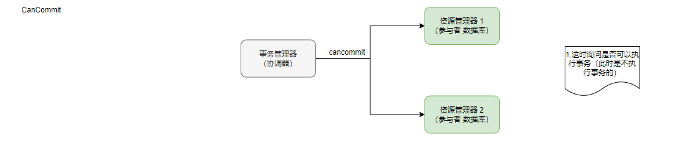

   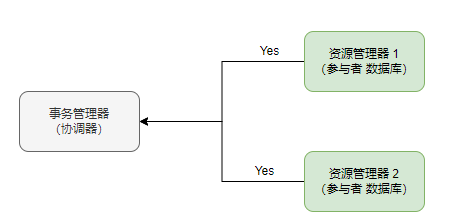

   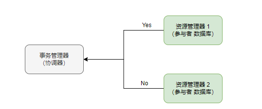

   

2. PreCommit 阶段

   协调者根据参与者的回复情况，来决定是否可以进行 PreCommit 操作

   1. 收到所有的都是 Yes ,那么协调**者执行事务的预执行**
      1. 发送预提交请求 协调者向所有参与者发送PreCommit请求 进入预提交状态
      2. 事务预提交  参与者收到 PreCommit 后，执行事务操作，并将 Undo 和 Re都信息记录到事务日志中
      3. 响应反馈 参与者成功执行事务操作后，反馈 ACK 响应，同时开始等待最终的指令
      
      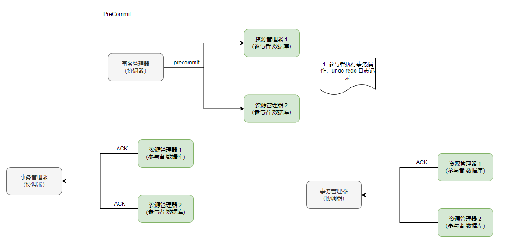
   2. 收到了任意一个 No，或者 **等待超时**之后都没有收到参与者的响应，则执行 **中断事务的操作**
      1. 发送中断请求 协调者向所有参与者发送 Abort
      2. 终端事务 参与者**收到 Abort 消息**之后，或**超时后仍未收到协调者的消息**，执行事务的终断操作。
      
      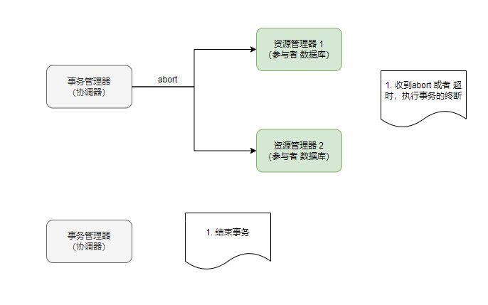

3. DoCommit 阶段

   DoCmmit 阶段**进行真正的事务提交**，根据 PreCommit 阶段协调者发送的消息，进入**执行提交阶段或事务中断阶段**

   1. 执行提交阶段
      1. 发送提交请求 收到所有的参与者的 ACK ,由预提交进入到提交状态，向所有参与者发送 DoCommit 消息
      2. 事务提交 参与者接收到 DoCommit 消息之后，正式提交事务。完成事务提交之后，释放所有锁住的资源
      3. 响应反馈 参与者提交完事务之后，向协调者发送 Ack 响应
      4. 完成事务 协调者接收到所有参与者的 Ack 响应之后，完成事务
      
      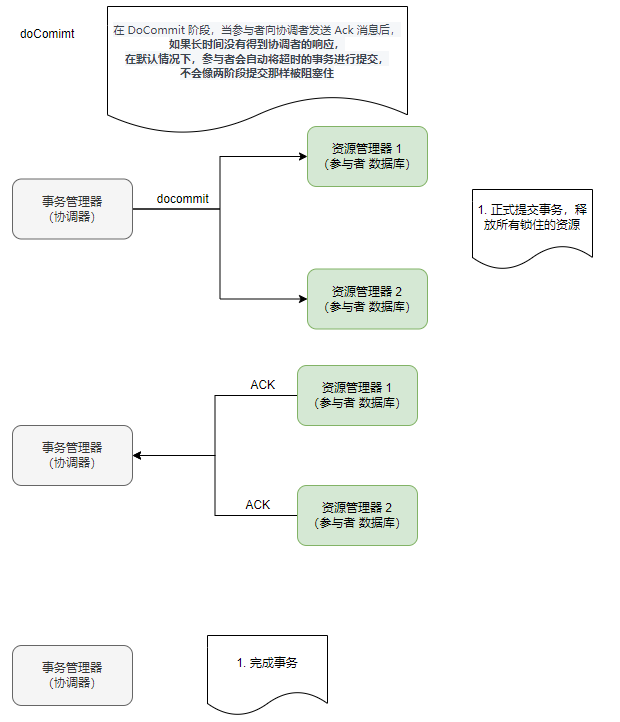
   2. 事务中断阶段
      	1. 发送中断请求 协调者向所有参与者发送 Abort 请求
       	2. 事务回滚 参与者接收到 Abort 消息之后，利用其在 PreCommit 阶段记录的 Undo 信息执行事务的回滚操作，并释放所有锁住的资源
    	3. 反馈结果 参与者完成事务回滚之后，向协调者发送 Ack 消息
           
         
           	4. 终断事务 协调者接收到参与者反馈的 Ack 消息之后，执行事务的终断，并结束事务
   
       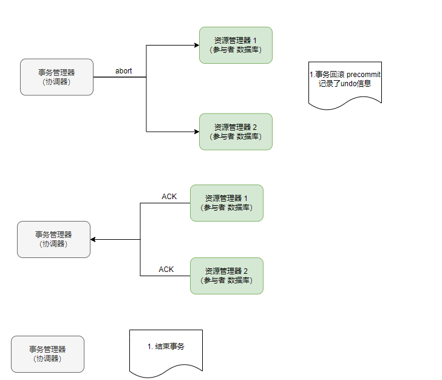
   
   > 在 DoCommit 阶段，当参与者向协调者发送 Ack 消息后，**如果长时间没有得到协调者的响应，在默认情况下，参与者会自动将超时的事务进行提交，不会像两阶段提交那样被阻塞住**。

### 基于消息的最终一致性方法

2PC 和 3PC 这两种方法，有两个共同的缺点，**一是都需要锁定资源，降低系统性能**；二是，**没有解决数据不一致的问题**。因此，便有了通过分布式消息来确保事务最终一致性的方案。

核心思想：将需要分布式处理的事务通过**消息或者日志的方式异步执行**，消息或日志可以存到本地文件、数据库或消息队列中，再通过业务规则进行失败重试

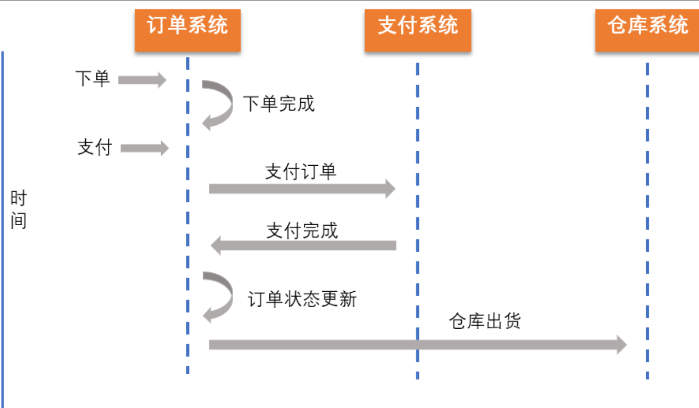

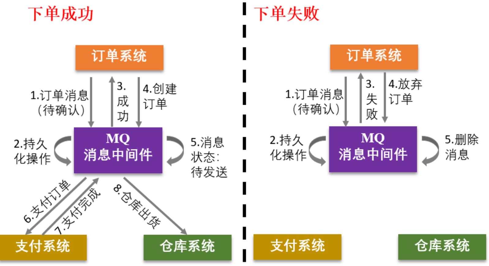

### 小结

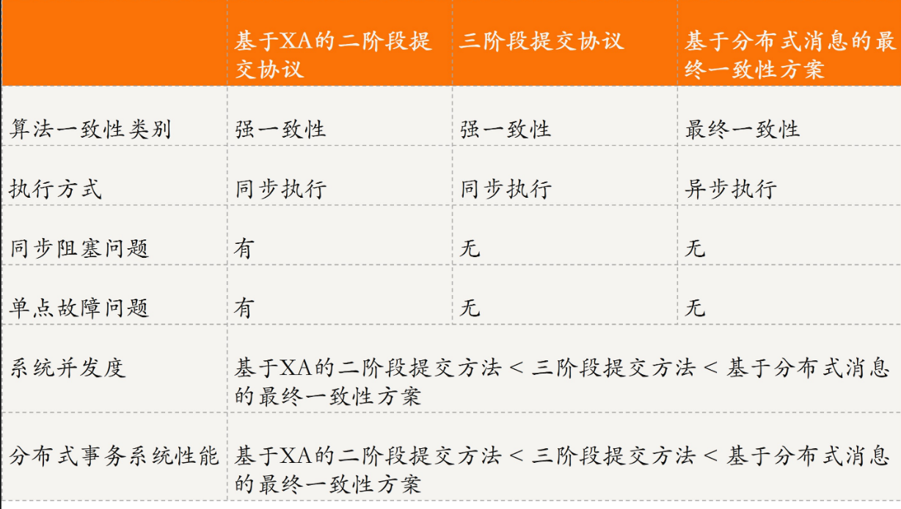

---

## **BASE 理论**

随着分布式系统规模不断扩大，复杂度急剧上升，**达成强一致性所需时间周期较长，限定了复杂业务的处理**。为了适应复杂业务，出现了 **BASE 理论**，该理论的一个关键点就是**采用最终一致性代替强一致性**。

* 基本可用 分布式系统出现故障的时候，允许损失一部分功能的可用性。比如 服务降级
* 柔性状态  **允许系统存在中间状态**，且这个中间状态不会影响系统整体可用性。比如，数据库读写分离，写库同步到读库（主库同步到从库）会有一个延时，其实就是一种柔性状态
* 最终一致性 事务在操作过程中可能会由于同步延迟等问题导致不一致，但最终状态下，数据都是一致的

BASE 理论为了支持大型分布式系统，通过牺牲强一致性，保证最终一致性，来获得高可用性，是对 ACID 原则的弱化。

## 总结

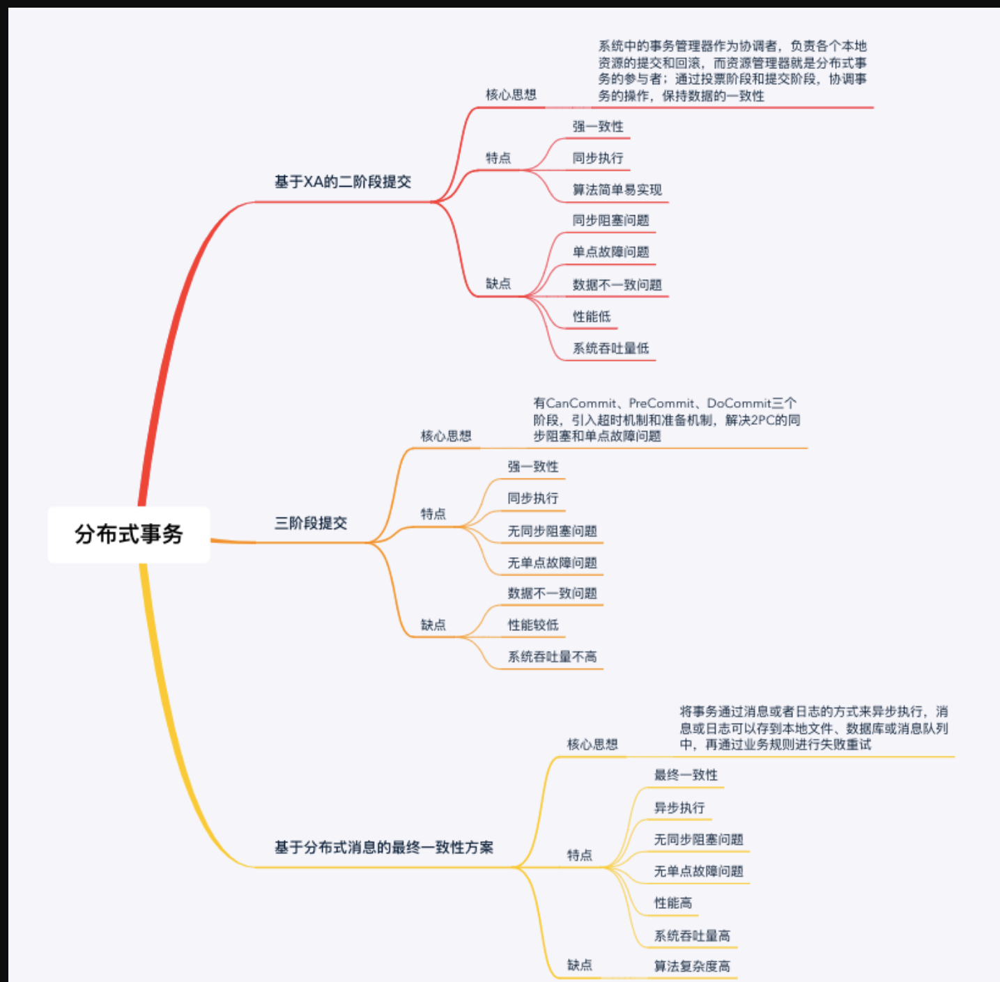