# 03｜通信协议：如何设计一个好的通信协议？


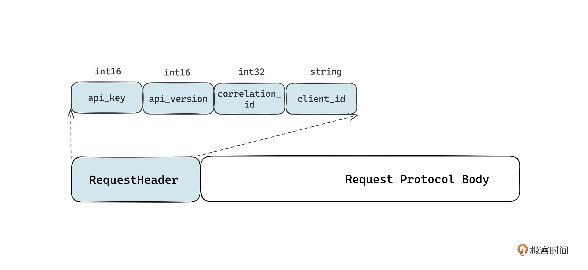

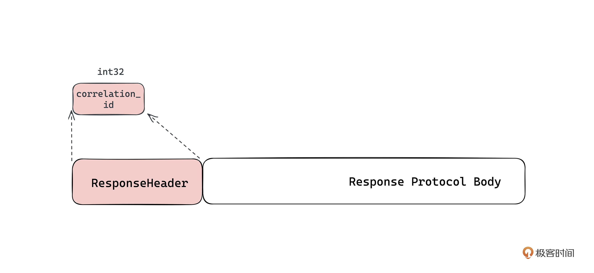

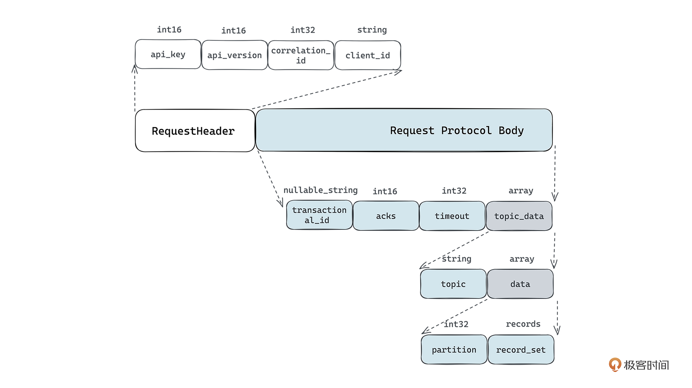

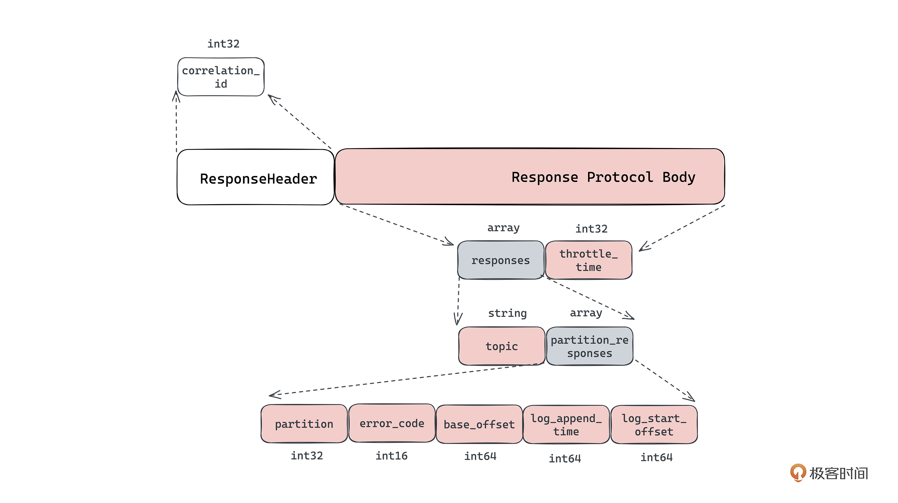

在序列化和反序列化中，最重要的就是**TCP的粘包和拆包**。我们知道TCP是一个“流”协议，是一串数据，没有明显的界限，TCP层面不知道这段流数据的意义，只负责传输。所以应用层就要根据某个规则从流数据中拆出完整的包，解析出有意义的数据，这就是粘包和拆包的作用。

**粘包/拆包的几个思路就是：**

- 消息定长。
- 在包尾增加回车换行符进行分割，例如FTP协议。
- 将消息分为消息头和消息体，消息头中包含消息总长度，然后根据长度从流中解析出数据。
- 更加复杂的应用层协议，比如HTTP、WebSocket等。


## 小结

从**功能支持、迭代速度、灵活性**上考虑，大多数消息队列的核心通信协议都会优先考虑自定义的**私有协议**。

私有协议的设计主要考虑网络通信协议选择、应用通信协议设计、编解码实现三个方面。

- 网络通信协议选型，基于可靠、低延时的需求，大部分情况下应该选择**TCP**。
- 应用通信协议设计，分为**请求协议和返回协议**两方面。协议应该包含**协议头和协议体**两部分。协议头主要包含一些**通用的信息**，**协议体包含请求维度的信息**。
- 编解码，也叫**序列化和反序列化**。在实现上分为自定义实现和使用现成的编解码框架两个路径。

其中最重要的是应用通信协议部分的设计选型，这部分需要设计协议头和协议体。重要的是要思考协议头和协议体里面分别要放什么，放多了浪费带宽影响传输性能，放少了无法满足业务需求，需要频繁修改协议内容。另外，每个字段的类型也有讲究，需要尽量降低每次通信的数据大小。

所以应用通信协议的内容设计是非常考验技术功底或者经验的。有一个技巧是，如果需要实现自定义的协议，可以去参考一下业界主流的协议实现，看看都包含哪些元素，各自踩过什么坑。总结分析后，这样一般能设计出一个相对较好的消息队列。

另外，我们不可能一下子设计出完美的协议，所以核心是保证协议的向前兼容和向后兼容的能力，以便后续的升级和改造。

因为历史发展原因，**业界大部分的消息队列的编解码都是自己实现的，只有近年兴起的Pulsar和RocketMQ的新版本选择了Protobuf作为编解码框架。**从编解码框架的选择来看，如果是一个全新的项目或架构，使用现成的编解码框架比如Protobuf，是比较好的选择。


# 04｜网络：如何设计高性能的网络模块？

## 高性能网络模块的设计实现

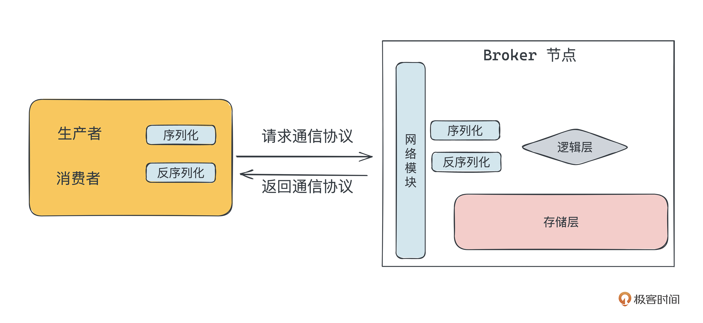

## 如何**连接处理** 、如何**快速处理高并发请求** 

### 基于多路复用技术管理 TCP 连接

#### 单条TCP连接的复用

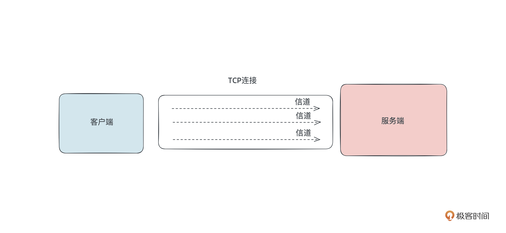

在一条真实的TCP连接中，创建信道（channel，可以理解为虚拟连接）的概念。通过编程手段，我们把**信道当做一条TCP连接使用，做到TCP连接的复用，避免创建大量TCP连接导致系统资源消耗过多**。缺点是在协议设计和编码实现的时候有额外开发工作量，而且**近年随着异步IO、IO多路复用技术的发展，这种方案有点多余**

因为语言特性、历史背景原因，RabbitMQ用的就是这种方案


#### IO多路复用技术

Kakfa、RocketMQ、Pulsar的网络模块都是基于IO多路复用的思路开发的

IO多路复用技术，是指通过**把多个IO的阻塞复用到同一个selector的阻塞上，让系统在单线程的情况下可以同时处理多个客户端请求**。最大的优势是系统开销小，系统不需要创建额外的进程或者线程，降低了维护的工作量，也节省了资源。


### 基于Reactor模型处理高并发请求

单个请求的处理

对于单个请求来说，最快的处理方式就是客户端直接发出请求，服务端接收到包后，直接丢给后面的业务线程处理，当业务线程处理成功后，直接返回给客户端

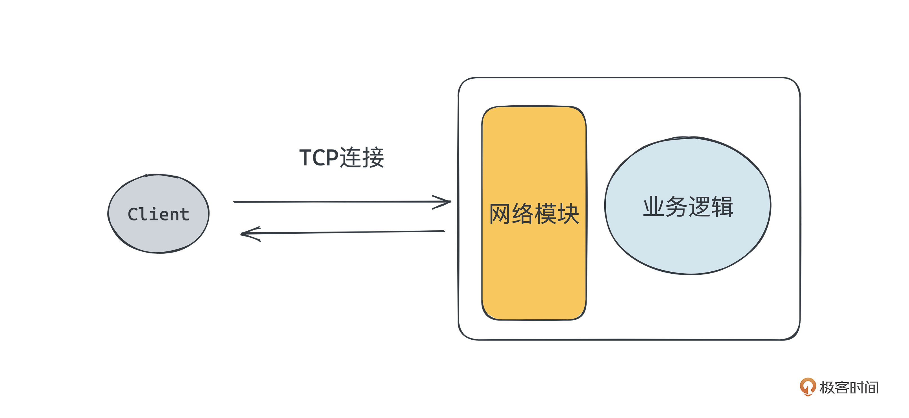

这种处理模式是最快的，但是这里有两个问题需要解决。

- 如何第一时间拿到包交给后端的业务逻辑处理？
- 当业务逻辑处理完成后，如何立即拿到返回值返回给客户端？

最直观的思路是**阻塞等待模型，不断轮询等待请求拿到包，业务逻辑处理完，直接返回结果给客户端**。这种处理是最快的。但是阻塞等待模型因为是**串行的处理机制**，每个请求需要等待上一个请求处理完才能处理，处理**效率会很低**。所以，单个请求，最合理的方式就是 **异步的事件驱动模型**，**可以通过Epoll和异步编程来解决**。

高并发请求处理

在高并发的情况下会有很多连接、请求需要处理，核心思路就是**并行、多线程处理**。那**如何并行处理呢？这时候就需要用到 Reactor 模型了**。

Reactor 模型是一种**处理并发服务请求的事件设计模式**，当主流程收到请求后，通过**多路分离处理的方式**，把请求**分发给相应的请求处理器处理**。

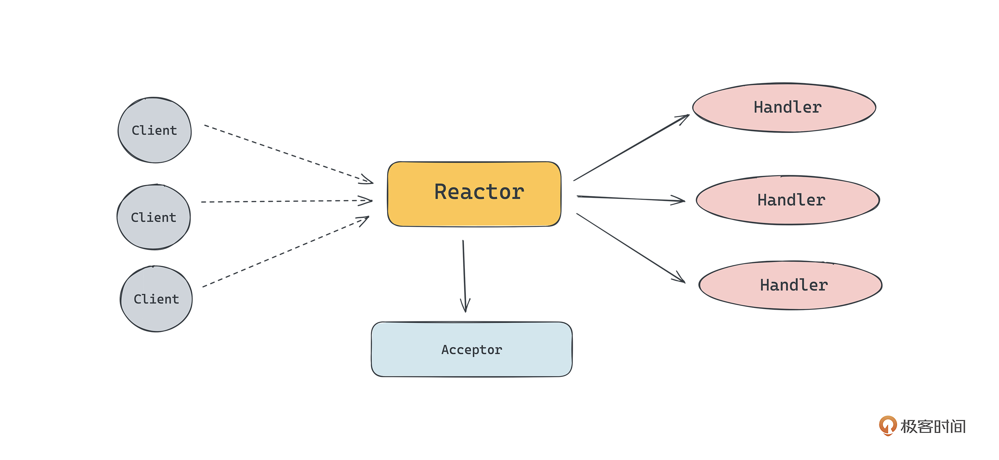

- Reactor：负责监听和分配事件。收到事件后分派给对应的 Handler处理，事件包括连接建立就绪、读就绪、写就绪等。
- Acceptor：负责处理客户端新连接。Reactor 接收到客户端的**连接事件**后，会转发给 Acceptor，**Acceptor接收客户端的连接，然后创建对应的Handler，并向Reactor注册此 Handler**。
- Handler：请求处理器，**负责业务逻辑的处理，即业务处理线程**。

**从技术上看，Reactor模型一般有三种实现模式。**

- 单 Reactor 单线程模型（单 Reactor 单线程）
- 单 Reactor 多线程模型 （单 Reactor 多线程）
- 主从 Reactor 多线程模型 (多 Reactor 多线程)

#### 单 Reactor 单线程模型

特点是Reactor和Handler都是单线程的串行处理


优点是所有处理逻辑放在**单线程中实现，没有上下文切换、线程竞争、进程通信等问题**。缺点是在**性能与可靠性方面存在比较严重的问题**。

性能上，因为是单线程处理，无法充分利用 CPU 资源，并且业务逻辑Handler的处理是同步的，容易造成阻塞，出现性能瓶颈。可靠性主要是因为单Reactor是单线程的，如果出现异常不能处理请求，会导致整个系统通信模块不可用。

**单Reactor **单进程模型不适用于计算密集型的场景，只适用于业务处理非常快速的场景**

---

#### 单 Reactor 多线程模型

业务逻辑处理Handler 变成了多线程，也就是说，获取到 IO读写事件之后，业务逻辑是一批线程在处理。


优点是 Handler 收到响应后通过 send 把响应结果返回给客户端，降低 Reactor 的性能开销，提升整个应用的吞吐。而且 Handler 使用多线程模式，可以充分利用 CPU 的性能，提高了业务逻辑的处理速度

缺点是 Handler 使用多线程模式，带来了多线程竞争资源的开销，同时涉及共享数据的互斥和保护机制，实现比较复杂。另外，单个 Reactor 承担所有事件的监听、分发和响应，对于高并发场景，容易造成性能瓶颈。

---

####  主从 Reactor 多线程模型

在此基础上，主从 Reactor 多线程模型，是让Reactor也变为了多线程


当前业界消息队列的网络模型，比如Pulsar、Kafka、RocketMQ，为了保证性能，都是基于主从 Reactor 多线程模型开发的。

优点是Reactor的**主线程和子线程分工明确**。主线程**只负责接收新连接**，子线程负责**完成后续的业务处理**。同时主线程和子线程的交互也很简单，**子线程接收主线程的连接后，只管业务处理即可，无须关注主线程，可以直接在子线程把处理结果返回给客户端**。所以，主从Reactor 多线程模型适用于高并发场景，Netty 网络通信框架也采用了这种实现。

缺点是如果基于NIO从零开始开发，开发的复杂度和成本较高。另外，Acceptor是一个单线程，如果挂了，如何处理客户端新连接是一个风险点。

为了解决Acceptor的单点问题，有些组件为了保证高可用性，会对主从 Reactor 多线程做一些优化，把Acceptor也变为多线程的形态


## 提高网络模块的稳定性和降低开发成本

#### 基于成熟网络框架提高稳定性并降低开发成本

 这里的“稳定性”主要指代码的稳定性。

在Java中，网络编程的核心是一个基础的类库——Java NIO库，它的底层是基于Linux/Unix IO复用模型**Epoll**实现的。

如果我们要基于Java NIO库开发一个Server，需要处理网络的闪断、客户端的重复接入、连接管理、安全认证、编解码、心跳保持、半包读写、异常处理等等细节，工作量非常大。所以在消息队列的网络编程模型中， **为了提高稳定性或者降低成本，选择现成的、成熟的NIO框架是一个更好的方案。**


Netty就是这样一个基于Java NIO封装的成熟框架。所以我们一提到Java的网络编程，最先想到的就是Netty。当前业界主流消息队列RocketMQ、Pulsar也都是基于Netty开发的网络模块，Kafka 因为历史原因是基于Java NIO实现的。

#### 主流消息队列的网络模型实现

##### Kafka 网络模型

Kafka的网络层没有用Netty作为底层的通信库，而是直接采用Java NIO实现网络通信。在网络模型中，也是参照Reactor多线程模型，采用多线程、多Selector的设计。(1个Acceptor + N个Processor + M个Handler)

Processor线程和Handler线程之间通过RequestChannel传递数据，RequestChannel中包含一个RequestQueue队列和多个ResponseQueues队列。每个Processor线程对应一个ResponseQueue。

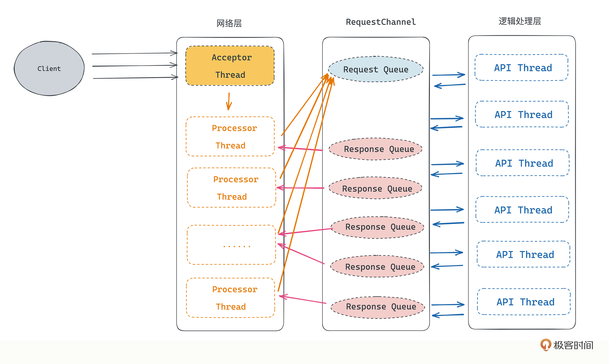

具体流程：

- 一个Acceptor接收客户端建立连接的请求，创建Socket连接并分配给Processor处理。
- Processor线程把读取到的请求存入RequestQueue中，Handler线程从RequestQueue队列中取出请求进行处理。
- Handler线程处理请求产生的响应，会存放到Processor对应的ResponseQueue中，Processor 线程从其对应的ResponseQueue中取出响应信息，并返回给客户端。

##### RocketMQ 网络模型

RocketMQ 采用Netty组件作为底层通信库，**遵循Reactor多线程模型，同时又在Reactor模型上做了一些扩展和优化**。所以它的网络模型是Netty的网络模型，**Netty底层采用的是主从Reactor多线程模型**，模型的原理逻辑跟前面讲到的主从Reactor多线程模型是一样的。


具体流程上：

1. 一个 Reactor 主线程负责监听 TCP网络连接请求，建立好连接，创建SocketChannel，并注册到Selector上。RocketMQ的源码中会自动根据OS的类型选择NIO和Epoll，也可以通过参数配置，监听真正的网络数据。
2. 接收到网络数据后，会把数据传递给Reactor线程池处理。
3. 真正执行业务逻辑之前，会进行SSL验证、编解码、空闲检查、网络连接管理，这些工作在Worker线程池处理（defaultEventExecutorGroup）。
4. 处理业务操作，放在业务Processor线程池中执行。


从Kafka和RocketMQ的网络模型的实现来看，网络模块既可以基于原生的Java NIO，也可以基于NIO的框架（如Netty）来完成开发，不过**基本思想都是基于IO多路复用技术和Reactor模型来提高处理性能、完成具体的编码实现。**

NIO编程属于**TCP层网络编程**，我们还需要进行**协议设计、编解码、链路的建立/关闭等工作，才算完成一个完整的网络模块的开发。**

### NIO 编程和 RPC 框架

要想不关心底层的调用细节（如底层的网络协议和传输协议等），我们可以调用远端机器上的函数或方法来实现，也就是RPC（Remote Procedure Call）远程过程调用。


- **网络传输协议**：远端调用底层需要经过网络传输，所以需要选择网络通信协议，比如TCP。
- **应用通信协议**：网络传输需要设计好应用层的通信协议，比如HTTP2或自定义协议。
- **服务发现**：调用的是远端对象，需要可以定位到调用的服务器地址以及调用的具体方法。
- **序列化和反序列化：** 网络传输的是二进制数据，因此RPC框架需要自带序列化和反序列化的能力。

那RPC框架作为消息队列中的网络模块会有哪些优缺点呢？

我们以gRPC框架举例分析。gRPC是Google推出的一个RPC框架，可以说是RPC框架中的典型代表。主要有以下三个优点：

- gRPC 内核已经很好地实现了服务发现、连接管理、编解码器等公共部分，我们可以把开发精力集中在消息队列本身，不需要在网络模块消耗太多精力。
- gRPC 几乎支持所有主流编程语言，开发各个消息队列的SDK可以节省很多开发成本。
- 很多云原生系统，比如Service Mesh都集成了gRPC协议，基于HTTP2的gRPC的消息队列很容易被云原生系统中的其他组件所访问，组件间的集成成本很低。

**但是当前主流的消息队列都不支持gRPC框架，这是因为如果支持就要做很大的架构改动**。而且，gRPC底层默认是七层的HTTP2协议，**在性能上，可能比直接基于TCP协议实现的方式差一些**。但是HTTP2本身在性能上做了一些优化，从实际表现来看，性能损耗在大部分场景下是可以接受的。

所以如果是一个新设计的消息队列或者消息队列的新架构，通过成熟的RPC框架来实现网络模块是一个蛮不错的方案。比如RocketMQ 5.0中的Proxy就使用gRPC框架实现了网络模块。


## 小结

消息队列的网络模块主要解决的是**性能、稳定性、成本**三个方面的问题。

性能问题，核心是通过 **Reactor 模型、IO 多路复用技术解决的**。Reactor模式在Java网络编程中用得非常广泛，比如 Netty 就实现了 Reactor 多线程模型。即使不用Netty进行网络编程（比如Kafka 直接基于Java NIO编程）的情况下，网络模块也大多是参考或基于Reactor模式实现的。因为Reactor模式可以结合多路复用、异步调用、多线程等技术解决高并发、大流量场景下的网络模块的性能问题

在Java技术栈下，网络编程的核心是Java NIO。但为了解决**稳定性和开发成本的问题，建议选择业界成熟的网络框架来实现网络模块**，而不是基于原生的Java NIO来实现。成熟的框架分为成熟的**NIO框架（如Netty）和成熟的RPC框架（如gRPC**）。

当你需要构建一个组件的网络模块的时候，你要先知道这个组件的业务特点是什么，需要解决哪些问题，再来考虑使用什么技术。比如在客户端连接数不多、并发不高，流量也很小的场景，只需要一个简单的网络Server就够了，完全没必要选择Java NIO或Netty来实现你的网络模块。随着技术架构的迭代，基于RPC框架的方案也是一个不错的选择。


# 05｜存储：消息数据和元数据的存储是如何设计的？

存储模块作为消息队列高吞吐、低延时、高可靠特性的基础保证，可以说是最核心的模块。

存储模块包含 **功能实现和性能优化** 两个方面。

存储模块的主流程是数据的**写入、存储、读取、过期。读写、持久化存储**是基本功能，但因为消息队列独有的产品特性，**主要被用来当缓冲分发，它的数据存储是临时的，数据持久化存储后，在一定的时间或操作后，需要能自动过期删除。**

首先，一个前置信息你要清楚，消息队列中的数据一般分为 **元数据和消息数据**。

* 元数据是指Topic、Group、User、ACL、Config等集群维度的资源数据信息，

* 消息数据指客户端写入的用户的业务数据。下面我们先来看元数据信息的存储。


## 元数据信息的存储

元数据信息的特点是**数据量比较小，不会经常读写，但是需要保证数据的强一致和高可靠，不允许出现数据的丢失**。同时，元数据信息一般需要**通知到所有的Broker节点**，Broker会根据元数据信息执行具体的逻辑。比如创建Topic并生成元数据后，就需要通知对应的Broker执行创建分区、创建目录等操作。


元数据信息的存储，一般有两个思路。

- 基于第三方组件来实现元数据的存储。
- 在集群内部实现元数据的存储。

**基于第三方组件来实现元数据的存储是目前业界的主流选择。** 比如Kafka ZooKeeper版本、Pulsar、RocketMQ 用的就是这个思路，其中Kakfa和Pulsar的元数据存储在ZooKeeper中，RocketMQ存储在NameServer中（准确说是存储在Broker+NameServer中，后面会详细说明）。


优点是**集成方便，开发成本低**，能满足消息队列功能层面的基本要求，因为我们可以**直接复用第三方组件已经实现的一致性存储、高性能的读写和存储、Hook机制等能力，而且在后续集群构建中也可以复用这个组件，能极大降低开发难度和工作成本。**

但也有缺点。引入第三方组件会**增加系统部署和运维的复杂度，而且第三方组件自身的稳定性问题会增加系统风险**，**第三方组件和多台Broker之间可能会出现数据信息不一致的情况，导致读写异常**。


**另一种思路，** **集群内部实现元数据的存储是指在集群内部完成元数据的存储和分发。** 也就是在集群内部实现类似第三方组件一样的元数据服务，比如基于Raft协议实现内部的元数据存储模块或依赖一些内置的数据库。目前Kafka 去ZooKeeper的版本、RabbitMQ的Mnesia、Kafka的C++版本RedPanda用的就是这个思路。


优缺点跟第一个正好相反。优点是部署和运维成本低，不会因为依赖第三方服务导致稳定性问题，也不会有数据不一致的问题。但缺点是开发成本高，前期要投入大量的开发人力。 

总的来说，当前主流选择第一种方案，主要是出于开发成本考虑。

### 消息数据的存储

一般情况下，消息队列的存储主要是指消息数据的存储，分为**存储结构、数据分段、数据存储格式、数据清理**四个部分。

#### 数据存储结构设计

在消息队列中，跟存储有关的主要是Topic和分区两个维度。用户可以将数据写入Topic或直接写入到分区。

不过如果写入Topic，数据也是分发到多个分区去存储的。所以从实际数据存储的角度来看， **Topic和Group不承担数据存储功能，承担的是逻辑组织的功能，实际的数据存储是在在分区维度完成的**。

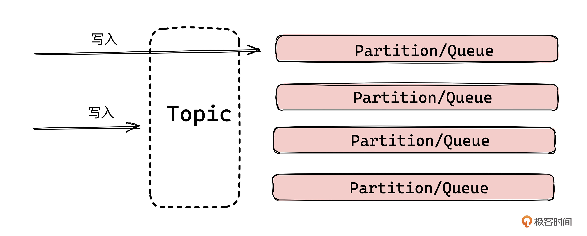

从技术架构的角度，数据的落盘存储也有两个思路。

- 每个分区单独一个存储“文件”。
- 每个节点上所有分区的数据都存储在同一个“文件”。

这里的“文件”是一个虚指，即表示**所有分区的数据是存储在一起，还是每个分区的数据分开存储的意思**。在实际的存储中，这个“文件”通常以目录的形式存在，目录中会有多个分段文件。接下来讲到的文件都是表示这个意思。

第一个思路，每个分区对应一个文件的形式去存储数据。具体实现时，每个分区上的数据顺序写到同一个磁盘文件中，数据的存储是连续的。因为消息队列在大部分情况下的读写是有序的，所以 **这种机制在读写性能上的表现是最高的**。

但如果分区太多，会占用太多的系统FD资源，极端情况下有可能把节点的FD资源耗完，并且硬盘层面会出现大量的随机写情况，导致写入的性能下降很多，另外管理起来也相对复杂。Kafka在存储数据的组织上用的就是这个思路。

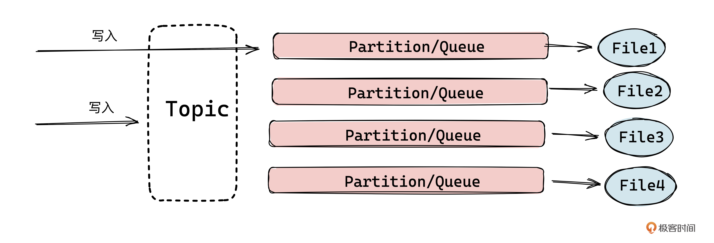

具体的磁盘的组织结构一般有“目录+分区二级结构”和“目录+分区一级结构”两种形式。不过从技术上来看，没有太大的优劣区别。

```java
目录+分区二级结构：
├── topic1
│   ├── partrt0
│   ├── 1
│   └── 2
└── topic2
    ├── 0
    ├── 1

目录+分区一级结构：
├── topic1-0
├── topic1-1
├── topic1-2
├── topic2-0
├── topic2-1
└── topic2-2
```

第二种思路，**每个节点上所有分区的数据都存储在同一个文件中**，这种方案需要为**每个分区维护一个对应的索引文件，索引文件里会记录每条消息在File里面的位置信息，以便快速定位到具体的消息内容**。


因为 **所有文件都在一份文件上，管理简单，也不会占用过多的系统FD资源，单机上的数据写入都是顺序的，写入的性能会很高**。缺点是同一个分区的数据一般会在文件中的不同位置，或者不同的文件段中，无法利用到顺序读的优势，读取的性能会受到影响，但是随着SSD技术的发展，随机读写的性能也越来越高。如果使用SSD或高性能SSD，一定程度上可以缓解随机读写的性能损耗，但SSD的成本比机械硬盘高很多。

目前RocketMQ、RabbitMQ和Pulsar的底层存储BookKeeper用的就是这个方案。

这种方案的数据组织形式一般是这样的。假设这个统一的文件叫commitlog，则commitlog就是用来存储数据的文件，.index是每个分区的索引信息。

```java
.
├── commitlog
├── topic-0.index
├── topic-1.index
└── topic-2.index
```

---

那怎么选择呢？ **核心考虑是你对读和写的性能要求。**

- 第一种方案，单个文件读和写都是顺序的，性能最高。但是当文件很多且都有读写的场景下，硬盘层面就会退化为随机读写，性能会严重下降。
- 第二种方案，因为只有一个文件，不存在文件过多的情况，写入层面一直都会是顺序的，性能一直很高。但是在消费的时候，因为多个分区数据存储在同一个文件中，同一个分区的数据在底层存储上是不连续的，硬盘层面会出现随机读的情况，导致读取的性能降低。

不过随机读带来的性能问题，可以通过给底层配备高性能的硬件来缓解。所以当前比较多的消息队列选用的是第二种方案，但是 Kafka 为了保证更高的吞吐性能，选用的是第一种方案。

但是不管是方案一还是方案二，在数据存储的过程中，**如果单个文件过大，在文件加载、写入和检索的时候，性能就会有问题，并且消息队列有自动过期机制，如果单个文件过大，数据清理时会很麻烦，效率很低。所以，我们的消息数据都会分段存储。**

#### 消息数据的分段实现

数据分段的规则一般是根据大小来进行的，比如默认1G一个文件，同时会支持配置项调整分段数据的大小。看数据目录中的文件分段示意图。


从技术上来看，当数据段到达了规定的大小后，就会新创建一个新文件来保存数据。

如果进行了分段，消息数据可能分布在不同的文件中。所以我们在读取数据的时候，就需要先定位消息数据在哪个文件中。为了满足这个需求，技术上一般有 **根据偏移量定位或根据索引定位** 两种思路。

##### 根据偏移量定位

根据偏移量（Offset）来定位消息在哪个分段文件中，是指通过记录**每个数据段文件的起始偏移量、中止偏移量、消息的偏移量信息**，来快速定位消息在哪个文件。

通常会用一个自增的数值型数据（比如Long）来表示这条数据在分区或commitlog中的位置，这个值就是消息的偏移量

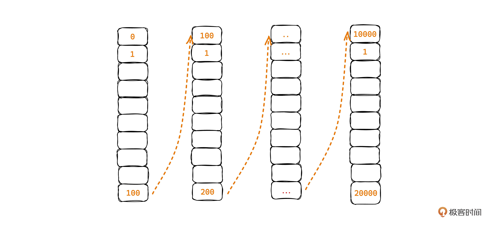

记录文件的起始偏移量一般有两种思路：**单独记录每个数据段的起始和结束偏移量** 和 **在文件名称中携带起始偏移量信息**。因为数据是顺序存储的，**每个文件记录了本文件的起始偏移量，那么下一个文件的起始偏移量就是上一个文件的结束偏移量。**

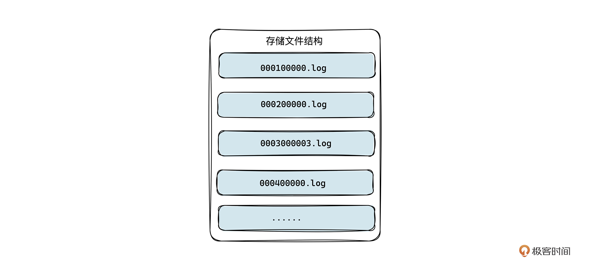

##### 根据索引定位

索引定位，会直接存储消息对应的文件信息，而不是通过偏移量来定位到具体文件。

具体是通过维护一个单独的索引文件，记录消息在哪个文件和文件的哪个位置。读取消息的时候，先根据消息ID找到存储的信息，然后找到对应的文件和位置，读取数据。RabbitMQ和RocketMQ用的就是这个思路。

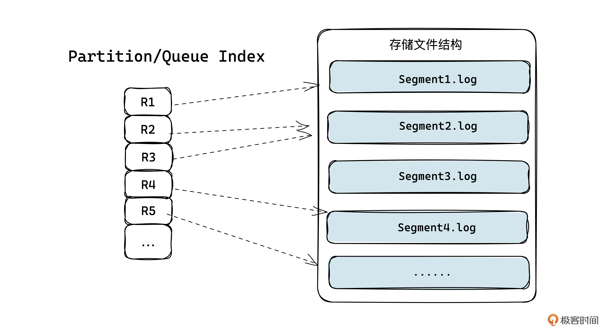

**这两种方案所面临的场景不一样。** 

根据偏移量定位数据，通常用在每个分区各自存储一份文件的场景；

根据索引定位数据，通常用在所有分区的数据存储在同一份文件的场景。

因为在前一种场景，**每一份数据都属于同一个分区，那么通过位点来二分查找数据的效率是最高的**。第二种场景，**这一份数据属于多个不同分区，则通过二分查找来查找数据效率很低，用哈希查找效率是最高**的。


#### 消息数据存储格式

消息数据存储格式一般包含**消息写入文件的格式和消息内容的格式**两个方面。

**消息写入文件的格式指消息是以什么格式写入到文件中的**，比如JSON字符串或二进制。从性能和空间冗余的角度来看，**消息队列中的数据基本都是以二进制的格式写入到文件的**。这部分二进制数据，我们不能直接用vim/cat等命令查看，需要用专门的工具读取，并解析对应的格式。

我们想查看Kafka消息数据存储文件中的数据，如果用cat命令查看是乱码，用日志解析工具kafka.tools.DumpLogSegments查看，才是格式化的数据。

**消息内容的格式是指写入到文件中的数据都包含哪些信息。** 对于一个成熟的消息队列来说，消息内容格式不仅关系功能维度的扩展，还牵涉性能维度的优化。

如果消息格式设计得不够精简，功能和性能都会大打折扣。比如冗余字段会增加分区的磁盘占用空间，使存储和网络开销变大，性能也会下降。如果缺少字段，则可能无法满足一些功能上的需要，导致无法实现某些功能，又或者是实现某些功能的成本较高。

所以，在数据的存储格式设计方面，**内容的格式需要尽量完整且不要有太多冗余**。

我们看Kakfa的V2版本存储格式的内容

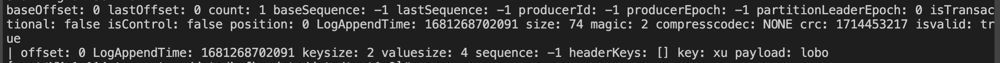

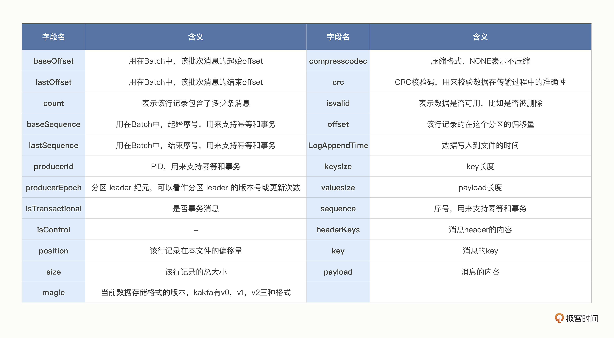

Kafka的消息内容包含了业务会感知到的消息的Header、Key、Value，还包含了时间戳、偏移量、协议版本、数据长度和大小、校验码等基础信息，最后还包含了压缩、事务、幂等Kafka业务相关的信息。

因为Kafka支持Batch特性，所以消息格式中还包含base和last等Batch相关信息。

RocketMQ的存储格式的内容

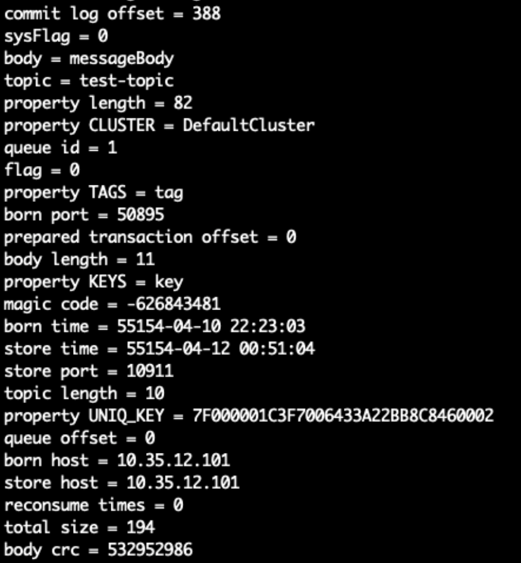

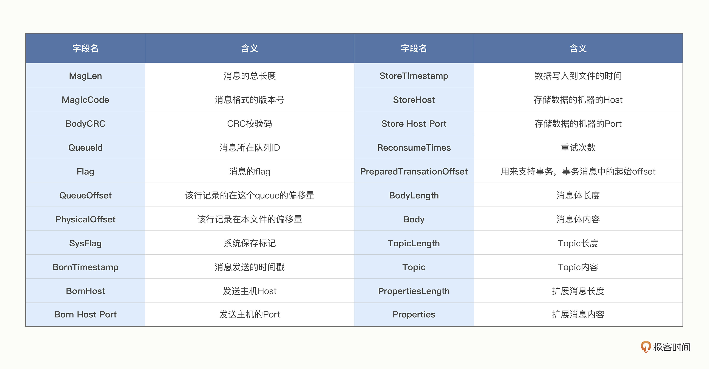

RocketMQ的存储格式中也包含基础的Properties（相当于Kafka中的Header）、Value、时间戳、偏移量、协议版本、数据长度和大小、校验码等信息，还包含了系统标记、事务等RocketMQ特有的信息，另外还包含了数据来源和数据目标的节点信息。


消息数据的存储格式虽然没有统一的规范，**但是一般包含通用信息和业务信息两部分**。通用信息主要包括时间戳、CRC、消息头、消息体、偏移量、长度、大小等信息，业务信息主要跟业务相关，包含事务、幂等、系统标记、数据来源、数据目标等信息。

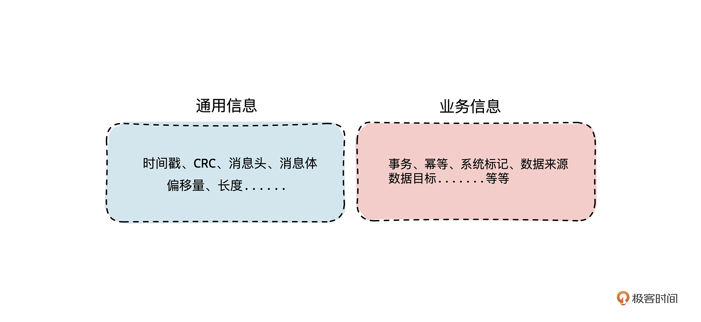

#### 消息数据清理机制

消息队列中的数据最终都会删除，时间周期短的话几小时、甚至几分钟，正常情况一天、三天、七天，长的话可能一个月，基本很少有场景需要在消息队列中存储一年的数据。

消息队列的数据过期机制**一般有手动删除和自动删除**两种形式，从实现上看主要有三种思路。

- 消费完成执行ACK删除数据
- 根据时间和保留大小删除
- ACK机制和过期机制相结合


**消费完成执行ACK删除数据，技术上的实现思路一般是** **：** 当客户端成功消费数据后，回调服务端的ACK接口，告诉服务端数据已经消费成功，服务端就会标记删除该行数据，以确保消息不会被重复消费。ACK的请求一般会有单条消息ACK和批量消息ACK两种形式。

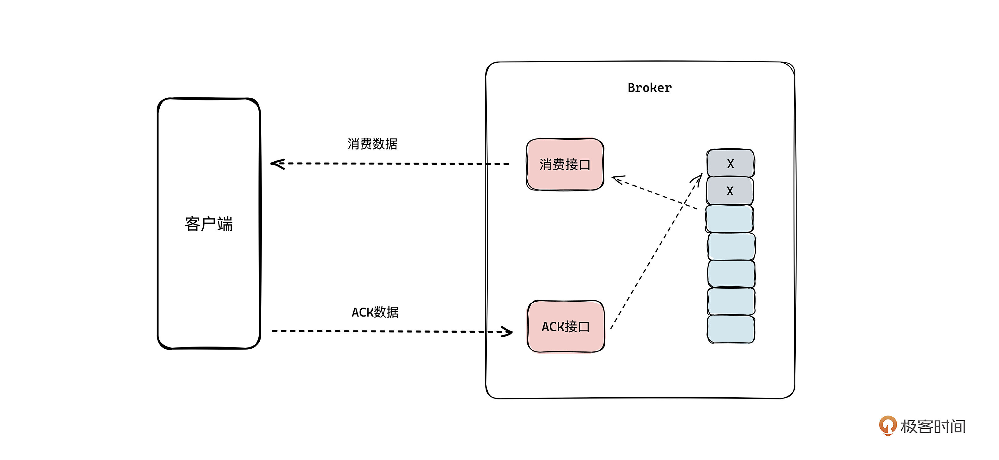

因为消息队列的ACK一般是**顺序的**，如果前一条消息无法被正确处理并ACK，就无法消费下一条数**据，导致消费卡**住。**此时就需要死信队列的功能，把这条数据先写入到死信队列，等待后续的处理**。然后ACK这条消息，确保消费正确进行。

这个方案，**优点是不会出现重复消费**，一条消息只会被消费一次。**缺点是ACK成功后消息被删除，无法满足需要消息重放的场景**。

---

根据时间和保留大小删除指**消息在被消费后不会被删除，只会通过提交消费位点的形式标记消费进度**。

实现思路一般是**服务端提供偏移量提交的接口**，当客户端消费成功数据后，**客户端会回调偏移量提交接口，告诉服务端这个偏移量的数据已经消费成功了，让服务端把偏移量记录起来**。然后服务端会根据消息保留的策略，**比如保留时间或保留大小来清理数据。一般通过一个常驻的异步线程来清理数据**。


这个方案，一条消息可以重复消费多次。不管有没有被成功消费，消息都会根据配置的时间规则或大小规则进行删除。优点是消息可以多次重放，适用于需要多次进行重放的场景。缺点是在某些情况下（比如客户端使用不当）会出现大量的重复消费。

---

结合前两个方案，就有了 **ACK机制和过期机制相结合的方案**。实现核心逻辑跟方案二很像，但保留了ACK的概念，不过ACK是相对于Group概念的。

当消息完成后，在Group维度ACK消息，此时消息不会被删除，只是这个Group也不会再重复消费到这个消息，而新的Group可以重新消费订阅这些数据。**所以在Group维度避免了重复消费的情况，也可以允许重复订阅。**


三种方案都有在使用，RabbitMQ选择的是第一个方案，Kafka和RocketMQ选择的是第二种方案，Pulsar选择的是第三种方案

消息数据是顺序存储在文件中的，会有很多分段数据，一个文件可能会有很多行数据。那么在ACK或者数据删除的时候，一个文件中可能既存在可删除数据，也存在不可删除数据。**如果我们每次都立即删除数据，需要不断执行“读取文件、找到记录、删除记录、写入文件”的过程，即使批量操作，降低频率，还是得不断地重复这个过程，会导致性能明显下降。**

当前主流的思路都是 **延时删除，以段数据为单位清理**，降低频繁修改文件内容和频繁随机读写文件的操作。

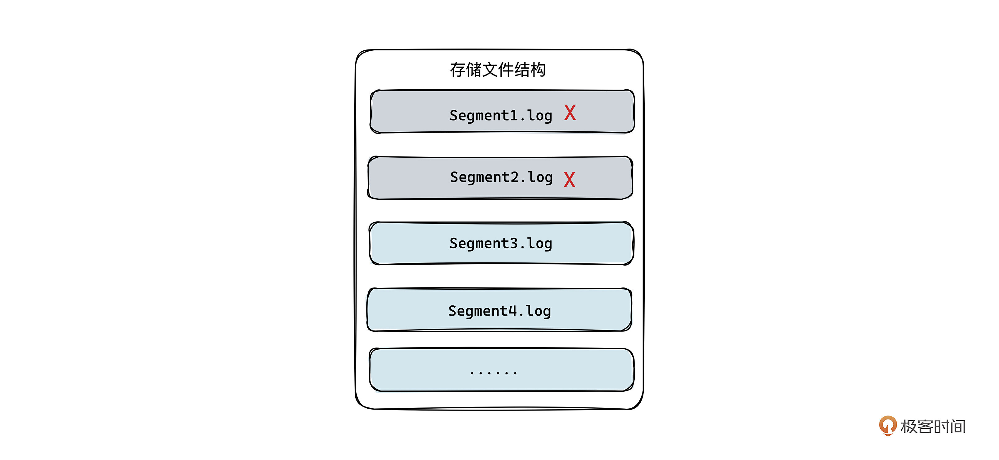

只有该段里面的数据都允许删除后，才会把数据删除。

而删除该段数据中的某条数据时，**会先对数据进行标记删除，比如在内存或 Backlog 文件中记录待删除数据，然后在消费的时候感知这个标记，这样就不会重复消费这些数据**。


## 小结

消息队列的存储分为元数据存储和消息数据存储两方面。

元数据的存储主要依赖第三方组件实现，比如ZooKeeper、etcd或者自研的简单元数据存储服务等等。在成熟的消息队列架构中，**基于简化架构和提升稳定性的考虑，都会考虑在集群内部完成元数据的存储和管理**

消息数据的存储在功能层面包含数据**存储结构设计、数据分段存储、数据存储格式、数据清理机制**四个方面。

消息数据的存储主要包含Topic和分区两个维度。Topic起逻辑组织作用，实际的数据**存储是在分区维度完成的**。所以在数据存储目录结构上，我们**都以分区为最小粒度去设计**，至于选择每个分区单独一个存储文件，还是将每个节点上所有分区的数据都存储在同一个文件，方案各有优劣，你可以根据实际情况去选择。

因为大文件存在性能和资源占用、数据清理成本等问题，一般情况下，我们都需要对数据文件进行分段处理，分段的策略一般都是按照文件大小进行的。

数据存储格式可以分为基础信息和业务信息两个维度，数据格式需要遵循极简原则，以达到性能和成本的最优。

数据的过期策略一般有三种，ACK删除、根据时间和保留大小删除数据、两者结合。目前业界的实现比较多样，从选择上来看，两者结合的方案更合理。


# 06｜存储：如何提升存储模块的性能和可靠性？

存储模块的性能优化。核心要解决的其实就是两个问题：“写得快”和“读得快”。

从四点和存储性能优化有关的基础理论

- 内存读写的效率高于硬盘读写
- 批量读写的效率高于单条读写
- 顺序读写的效率高于随机读写
- 数据复制次数越多，效率越低

## 提升写入操作的性能

数据写入需要经过内存，最终才到硬盘，所以写入优化就得围绕 **内存和硬盘** 展开。写入性能的提高主要**有缓存写、批量写、顺序写**三个思路，这里对比来讲。

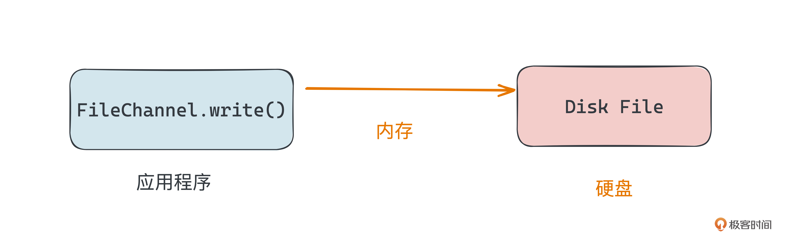

### 1\. 缓存写和批量写

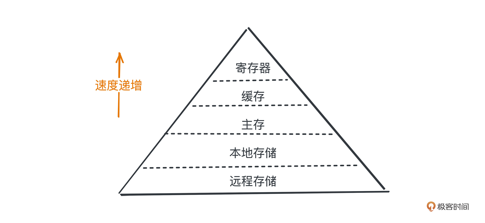

基于理论1和2：

- 内存读写的效率高于硬盘读写
- 批量读写的效率高于单条读写

写入优化的主要思路之一是： **将数据写入到速度更快的内存中，等积攒了一批数据，再批量刷到硬盘中。**

“数据先写入PageCache，再批量刷到硬盘”，说的就是这个思路。PageCache指操作系统的页缓存，简单理解就是内存，通过缓存读写数据可以避免直接对硬盘进行操作，从而提高性能

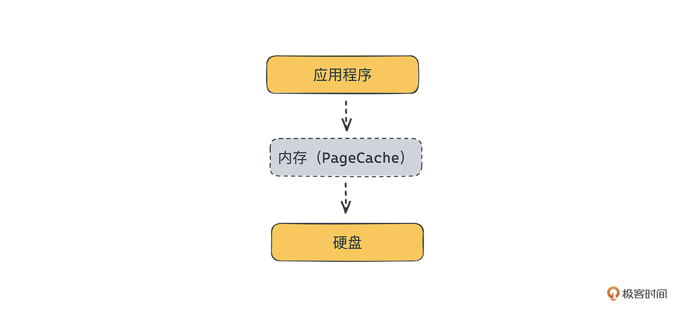

就是把硬盘中的数据缓存到内存中，这样对硬盘的访问就变成了对内存的访问。然后再通过一定的策略，把缓存中的数据刷回到硬盘。一般情况下，内存数据是自动批量刷到硬盘的，这个逻辑对应用是透明的

把缓存数据刷回到硬盘，一般有“**按照空间占用比例”**、**“时间周期扫描”**和“**手动强制刷新”**三种策略。操作系统内核提供了前两种处理策略，不需要应用程序感知。我们具体了解一下。

**按空间占用比例刷新** 是指当系统内存中的“脏”数据大于某个阈值时会将数据刷新到硬盘。操作系统提供了两个配置项。

- “脏”数据在内存中的占比（dirty\_background\_ratio）
- “脏”数据的绝对的字节数（dirty\_background\_bytes）

当这两个配置超过阈值，就会触发刷新操作。如果两者同时设置，则以绝对字节数为更高优先级。


**按时间周期刷新** 是指根据配置好的时间，周期性刷新数据到硬盘。主要通过脏页存活时间（dirty_expire_seconds) 和刷新周期（dirty_writeback_centisecs）两个参数来配置。两个配置默认都是1/100，也就说时间间隔为每秒100次，根据刷新周期的配置周期性执行刷新，刷新会检查脏页的存活时间是否超过配置的最大存活时间，如果是则刷入硬盘。


操作系统也提供了第三种方法 **程序手动强制刷新**，你可以通过系统提供的sync()/msync()/fsync() 调用来强制刷新缓存。通过操作系统的参数配置，在Java 代码中，通过Java.NIO包中FileChannel提供的write()和 force()方法，实现写缓存和强制刷新缓存。代码参考：

```java
FileChannel channel = fin.getChannel();
file.write(buf)
file.force(true)
```

通过 FileChannel 提供的write()方法写数据时，FileChannel 把数据写入到缓存就会返回成功，然后依赖操作系统的缓存更新策略，将数据刷新到硬盘。我们也可以在代码中调用FileChannel 提供的 force() 方法，把数据立即刷入刷盘中以免丢失。

**基本所有的消息队列在写入时用的都是这个方案，比如 Kafka、RocketMQ、Pulsar 就是先写入缓存，然后依赖操作系统的策略刷新数据到硬盘**。

消息队列一般会同时提供：**是否同步刷盘、刷盘的时间周期、刷盘的空间比例**三个配置项，让业务根据需要调整自己的刷新策略。从性能的角度看，异步刷新肯定是性能最高的，同步刷新是可靠性最高的。


## 2\. 随机写和顺序写

你要理解顺序写和随机写是针对谁的？我们所说的都是**针对硬盘的，是整个操作系统和硬盘的关系，而不是单文件和硬盘的关系**。

单文件顺序写入硬盘很简单，硬盘控制器只需在连续的存储区域写入数据，**对硬盘来讲，数据就是顺序写入的**。

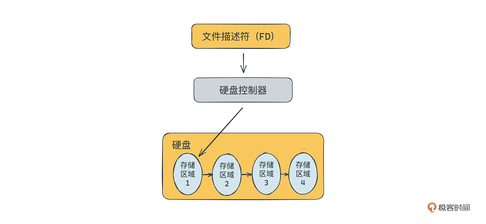

多文件顺序写入硬盘，系统中有很多文件同时写入，这个时候从硬盘的视角看，你会发现**操作系统同时对多个不同的存储区域进行操作，硬盘控制器需要同时控制多个数据的写入，所以从硬盘的角度是随机写的**

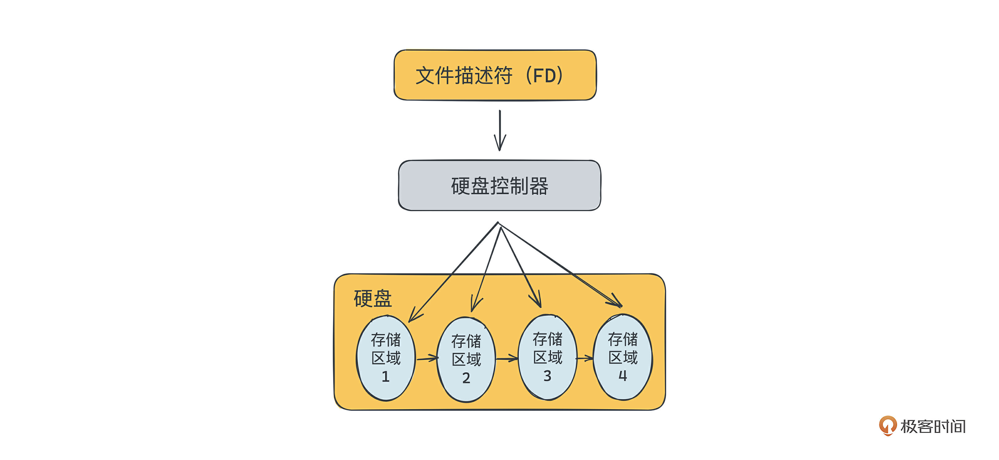

所以，在消息队列中，实现随机写和顺序写的核心就是 **数据存储结构的设计**。

数据存储结构设计有两个思路：**每个Partition/Queue单独一个存储文件，每台节点上所有Partition/Queue的数据都存储在同一个文件。**

第一种方案，对单个文件来说读和写都是顺序的，性能最高，但当文件很多且都有读写，在硬盘层面就会退化为随机读写，性能会下降很多。

第二种方案，因为只有一个文件，不存在文件过多的情况，写入层面一直都会是顺序的，性能一直很高。所以为了提高写的性能，我们最好使用第二种方案。


## 提升写入操作的可靠性

因为消息队列基本都采用数据先写入缓存、再写入硬盘的方案，**所以有丢失数据的风险，比如数据还没刷新到硬盘中时，机器就异常重启了，数据就丢失了**。

为了提高数据可靠性，在消息队列的存储模块中，一般会通过三种处理手段：**同步刷盘、WAL预写日志、多副本备份**，进一步提升数据的可靠性。

### 1\. 同步刷盘

同步刷盘指每条数据都同步刷盘，等于回到了直接写硬盘的逻辑，一般通过写入数据后调用force()操作来完成数据刷盘。这种方案无法利用内存写入速度的优势，效率会降低很多


一般消息队列都会开放这个配置项，默认批量刷盘，但有丢失数据的风险。如果业务需要修改为直接刷盘的策略来提高数据的可靠性，则会有一定的性能降低。

## 2\. WAL

WAL（预写日志）指在写数据之前先写日志，当出现数据丢失时通过日志来恢复数据，避免数据丢失。

讲到这里，估计有同学有疑问了，WAL日志需要写入持久存储，业务数据也要写入缓存，多了一步，性能会不会降低呢？


没错，从理论来看，**WAL机制肯定会比直接写入缓存中的性能低**。但我们实际落地的时候往往可以通过一些手段来优化，降低影响，达到性能要求。

因为在消息队列中，**消息数据的数据量是非常大的，我们不可能直接使用非常高性能的持久存储设备，成本太高**。虽然WAL日志需要极高的写入性能，**但是数据量一般很小，而且是可顺序存储的、可预测的（根据配置的缓存大小和更新策略可明确计算）。**

所以 **在实际落地中，我们可以采取WAL日志盘和实际数据盘分离的策略，提升WAL日志的写入速度**。具体就是让WAL数据盘是高性能、低容量的数据盘，数据盘是性能较低、容量较大的数据盘，如果出现数据异常，就通过WAL日志进行数据恢复。这样，**给WAL日志选择合适的设备，再加上并行读写等代码优化手段，性能损失就可控了，甚至可以忽略。**

强制刷盘、WAL预写日志这两种方案，都是指单机维度的可靠性保证。而我们在实际运维过程中，单机是不可靠的，**都需要通过分布式的多副本存储来保证数据的高可靠**，也就有了第三种方案。


### 3\. 多副本的备份

将数据拷贝到多台节点，每台节点都写入到内存中，从而完成数据的可靠性存储。因为单机层面也是把数据写入到内存中就记录写入成功，单机层面也可能出现数据丢失，所以核心思路是同时在多台节点中缓存数据，只**要不是多台节点同时重启，数据就可以恢复。**

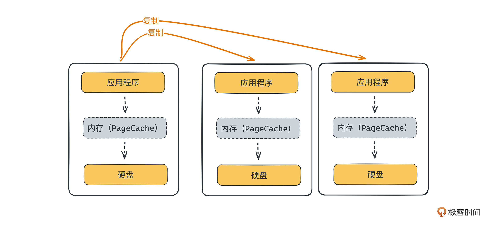

好处是可以在分布式存储的基础上做优化，通过多台缓存的手段来降低数据丢失的概率。但是如果所有节点在同一时刻重启，数据还是有可能丢失的，无法保证百分百的数据高可靠。

从消息队列业界的存储方案来看，方案一所有产品都会支持，方案二和方案三一般会选一种支持，K**akfa、RabbitMQ、RocketMQ用的是第三种**，Pulsar用的是第二种。


## 提升读取操作的性能

根据消息队列的特性，数据都是单分区顺序读写的

提高读取的性能主要有读热数据、顺序读、批量读、零拷贝四个思路。

### 1\. 冷读和热读

热读是指消息数据本身还在缓存中，读取数据是从内存中获取，此时性能最高，不需要经过硬盘。

冷读是指消息数据刷到硬盘中了，并且数据已经被换页换出缓存了，此时读取数据需要从硬盘读取。

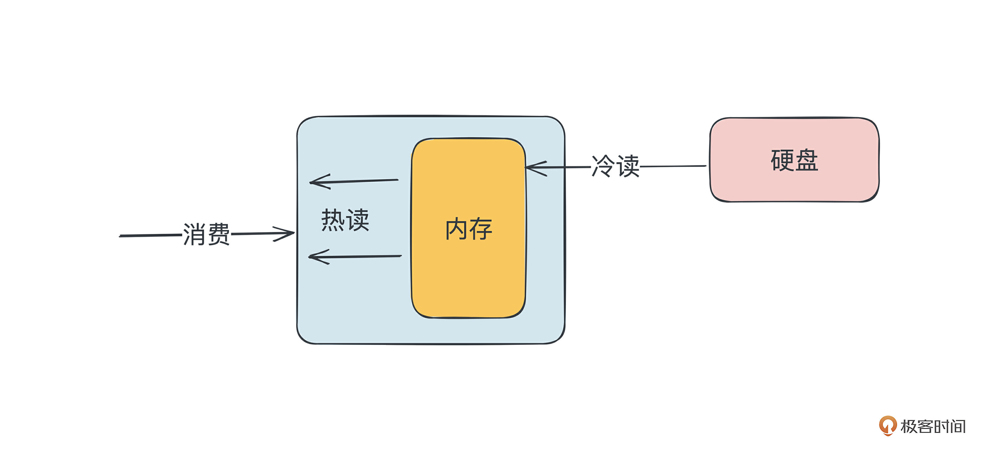

Java 中使用代码实现读缓存很简单，只需要使用Java.NIO包中的FileChannel.read数据。

```java
ByteBuffer buffer = ByteBuffer.allocate(1024);
int byteRead = channel.read(buffer);

```

理想情况，肯定全部是热读最好，因为性能最高。但是在代码层面，我们是无法控制冷读或热读的，只能通过配置更大的内存，尽量保证缓存中保留更多的数据，从而提高热读的概率。


## 2\. 顺序读、随机读、批量读

为了实现大吞吐，在消费的时候服务端都会**支持批量读的能力**。为了能尽快返回数据给客户端，服务端都会实现数据的**预读机制**。在读取数据的时候，**也读取客户下一步可能会用的数据**，预先加载到内存中，以便更快返回数据。

数据的预读分为两种：硬盘层面预读、应用程序的预读。

硬盘层面的预读，是在连续的地址空间中读取数据。 **但具体实现，我们在程序中无法控制，这和数据目录存储结构设计有关。**

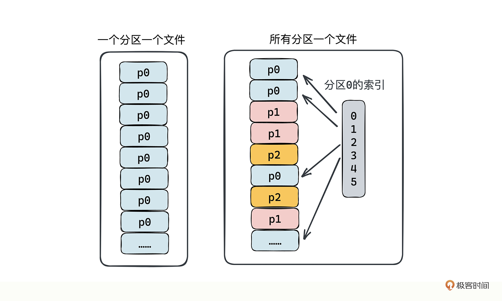

方案一在读取的过程中，因为数据是连续存储的，数据预读非常方便，只要在硬盘上读取连续的数据块即可，不需要在程序上做逻辑处理，性能最高。

方案二需要根据分区上的数据索引，在具体存储文件的不同位置读取数据。**数据可能是连续的，也可能是不连续的。这种情况下硬盘的预读就很有随机性，大部分情况下在硬盘看来就是随机读**。性能比第一种方案低

---

应用程序的预读就比较简单，**一般通过程序中的逻辑关系，提前通过调度去硬盘读取数据**（可能是连续的也可能是不连续的）。因为消息队列的数据是分区有序的，当读取到某条数据时，手动读取后面的一个批次的数据就可以了。**这种方案需要程序去控制，比如read(0)时，要同时读read(1,10)的数据，相对繁琐，并且性能较低。**

对比来看，理想情况下，肯定是硬盘层面的顺序预读的性能最高，所以针对读取操作，方案一更合适。

## 3\. 零拷贝原理和使用方式

数据要**经过五步**，硬盘 -\> ReadBuffer -> 应用程序 -> SocketBuffer -> 网卡设备，**四次复制**。因为数据在复制过程耗费资源和时间，会降低性能，所以优化流程最重要的是减少数据复制的次数和资源损耗

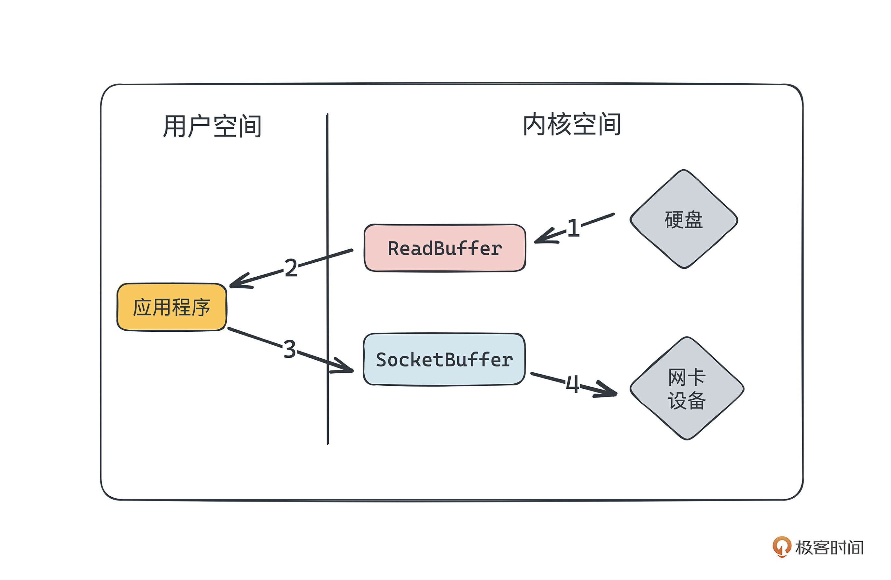

零拷贝指的是**数据在内核空间和用户空间之间的拷贝次数**，即图中的第2步和第3步。如果只有1和4两步，没有执行2和3的话，那么内核空间和用户空间之间的拷贝次数就是零，“零拷贝”的零指的是这个次数“零”，因此是零拷贝。

为了解决复制次数带来的性能损耗，“零拷贝”这个概念就被提出来了。 **主要思路是通过减少数据复制次数、减少上下文（内核态和用户态）切换次数、通过DMA（直接内存）代替 CPU 完成数据读写，来解决复制和资源损耗的问题。**

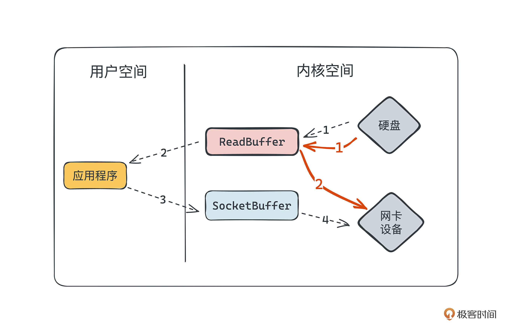

1. 将数据复制链路缩短成了：硬盘 -\> ReadBuffer -> 网卡设备，**复制次数从四次减为两次**。

2. 用户空间和内核空间之间的**数据复制需要进行上下文切换，优化完复制链路后，数据只在内核空间复制传输，就可以减少两次上下文切换**。

3. 通过DMA 来搬运数据，使数据复制不需要通过 CPU，释放CPU。

   > DMA 全称是直接内存存取。简单理解就是在IO设备和内存之间传递数据时，数据搬运工作全部交给 DMA 控制器，CPU不再参与任何与数据搬运相关的事情，这样 CPU 就可以去处理别的事务，从而释放CPU。


零拷贝主要用于在**消费的时候提升性能**，具体有两种实现方式： **mmap+write 和 sendfile**。

mmap是一种内存映射文件的方法，**把文件或者其他对象映射到进程的地址空间，修改内存文件也会同步修改，这样就减少了一次数据拷贝**。所以，我们不需要把数据拷贝到用户空间，修改后再回写到内核空间。

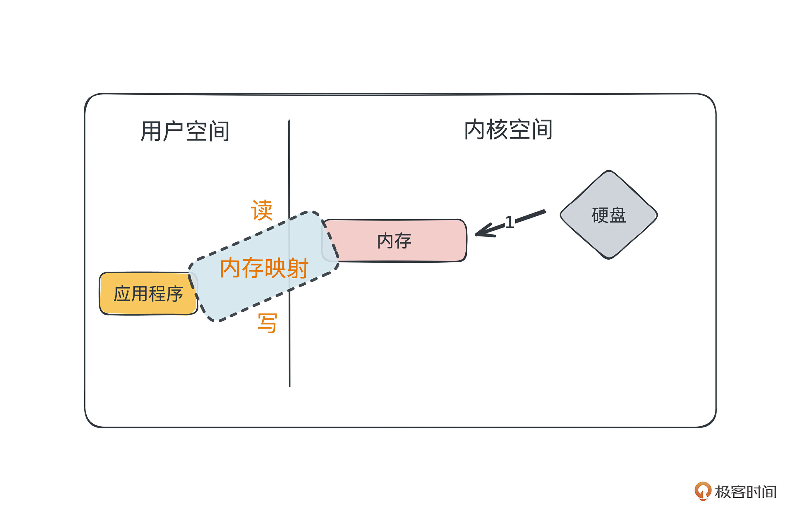

正常的“读取数据并发送”流程是通过read + write完成的，比如

```java
  read(file, tmp_buf, len);
  write(socket, tmp_buf, len);

```

而操作系统层面的 read()，系统在调用的过程中，**会把内核缓冲区的数据拷贝到用户的缓冲区里，为了减少这一步开销，我们可以用 mmap() 替换 read() 系统调用函数**。比如：

```java
buf = mmap(file, len);
write(sockfd, buf, len);
```

在Java代码中，实现mmap的方法很简单，使用Java NIO包的FileChannel的map方法即可。

```java
FileChannel fc = f.getChannel();
MappedByteBuffer buf = fc.map(FileChannel.MapMode.READ_WRITE, 0, 200)
```

---

另外一种实现思路 sendfile，是指Linux内核提供的一个系统调用 sendfile() ，它可以将数据从一个文件描述符传输到另一个文件描述符。**之前图中的红色线路就是通过senfile系统调用和DMA技术，将四次的数据复制次数变为了两次，提高了性能。**

在 Java 中也可以使用零拷贝技术，主要是在 NIO FileChannel 类中。

- transferTo() 方法：可以将数据从 FileChannel 直接传输到另外一个 Channel。
- transferFrom() 方法：可以将数据从 Channel 传输到 FileChannel。

几乎所有的消息队列在消费时都使用了**sendfile的调用，因为它配合DMA技术至少可以提升一倍的消费速度。**


##  通过硬件和系统优化提升性能

从硬件和系统优化提升性能的角度，主要可以通过提升硬件配置（如内存或硬盘）、配置多盘读写、配置硬盘阵列三个手段来提高集群的性能。

### 1\. 提升硬件配置

为了提高热度的概率，直接配备**更大的机器内存，性能提升最明显**。

消息队列是一款非常重视IO的组件，使用更快的硬盘IO设备，提高单机的吞吐能力，也能快速提升性能。硬盘类型很多，比如物理机部署下的机械盘、SSD、NVMe SSD，以及在云环境部署的各种规格的云盘。核心衡量指标主要有三个：IOPS、吞吐量、延时，这些指标越好，性能越高。


### 2\. 配置多盘读写

我们可以通过在机器上挂多块硬盘提升单机的硬盘吞吐能力**。这种方案要内核支持这个机制，在部署的时候进行相关配置才能生效。**

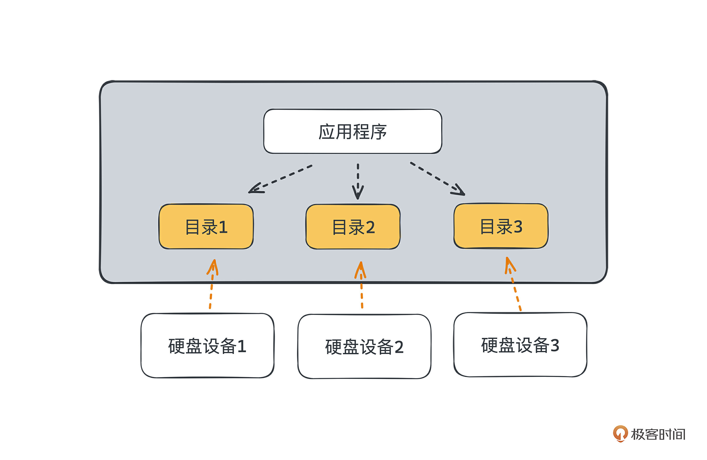

一般实现思路是在消息队列的内核**支持多目录读写的能力**，**将不同的文件或者不同的数据段调度存放在不同硬盘设备对应的挂载目录中**。此时在数据的写入和读取的过程中，就可以同时利用到多块盘的吞吐和存储。


### 3\. 配置 RAID 和 LVM 硬盘阵列

多目录读写的**问题是多块盘之间无法共享IO能力和存储空间**，当遇到数据倾斜时，在单机层面会出现性能和容量瓶颈。Linux提供了RAID硬盘阵列和LVM 逻辑卷管理两种方式，通过串联多块盘的读写能力和容量，提升硬盘的性能和吞吐能力（具体的硬盘阵列构建你可以参考 [这篇文章](https://www.infoq.cn/article/xsAkegr9N0VExtFaY8W0)）。

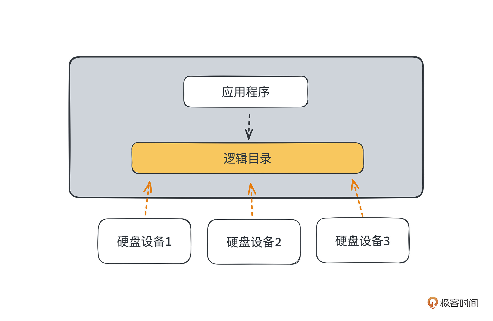


## 小节

写入性能优化的核心是**缓存写、批量写、顺序写**。

内存的写性能比任何硬盘都高，通过先写内存、后批量刷新数据到硬盘，可以降低硬盘的写入次数，从而提升写入性能。在写缓存的过程中，要**注意数据的可靠性，我们可以通过同步刷盘、副本同步、WAL机制等手段提高性能和可靠性**。写入的时候，顺序写的性能比随机写的性能高，**顺序写的核心是数据存储目录结构的设计**。


读操作的性能提升，主要依赖热读、顺序读、批量读、零拷贝四种手段。

热读主要依赖可用**内存的大小**。批量读指一次IO操作尽可能读取更多的数据，避免多次的数据IO操作。数据预读分为硬盘预读和应用程序预读两类，主要思路都是提前读取数据缓存到内存中，提高热读的命中率。和写入一样，顺序读的核心也是数据存储目录结构的设计。


零拷贝主要用来提升消费的性能，它只是一个概念，不是一门具体的技术。核心思路是 **减少复制和上下文切换的次数，通过DMA技术释放 CPU 的工作量**，从而提升消费性能。

底层的实现主要涉及mmap内存映射、sendfile系统调用、DMA直接内存读取三种技术手段。Java代码的实现，mmap和sendfile的操作都在NIO FileChannel类中，对应map、transferTo、transferFrom三个方法的使用。DMA技术在代码中无法控制，依赖于操作系统的实现。

在硬件和操作系统层面，我们还可以通过提升硬件的规格和类型、配置多盘读写、配置RAID和LVM硬盘阵列三种手段来提高性能。


# 07｜生产端：生产者客户端的SDK有哪些设计要点？

你在使用消息队列的SDK生产消费数据的时候，是否会有疑问，SDK底层是怎么工作的，由哪些功能模块组成呢？

消息队列的客户端主要包含**生产、消费、集群管控**三类功能。这节课我们聚焦在生产和集群管控。从客户端SDK实现的角度来看，生产模块包含 **客户端基础功能和生产相关功能** 两部分，其中基础功能是客户端中所有功能共用的。

基础功能是蓝色部分，包括请求连接管理、心跳检测、内容构建、序列化、重试、容错处理等等。

生产功能是黄色部分，包括客户端寻址、分区选择、批量发送，生产错误处理、SSL、压缩、事务、幂等等等。

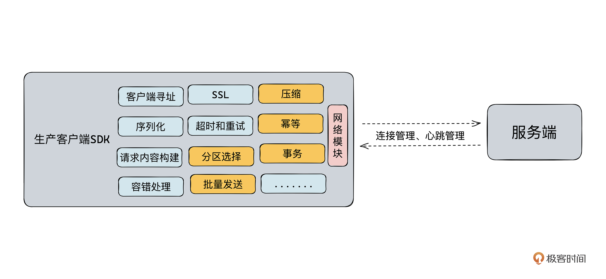

## 客户端基础功能

### 连接管理

客户端和服务端之间基本都是通过各自语言的网络库，**创建TCP长连接进行通信**的。在大部分实现中，为**了避免连接数膨胀，每个客户端实例和每台Broker只会维护一条TCP连接。**

建立一条TCP连接很简单，更关键的是，什么情况下建立连接？

- **初始化创建连接**，指在实例初始化时就创建到各个Broker的TCP连接，等待数据发送。好处是提前创建好可以避免发送的时候冷启动。缺点是需要提前创建好所有的连接，可能导致连接空跑，会消耗一定的资源。
- **使用时创建链接**，指在实例初始化时不建立连接，当需要发送数据时再建立。好处是发送时才建立，连接的使用率会较高。缺点是可能出现连接冷启动，会增加一点本次请求的耗时。

因为客户端会有空闲连接回收机制，创建连接的耗时一般较短，所以在实际的架构实现中，两种方式都会用，优劣区别并不明显。不过，从资源利用率的角度考虑， **我建议你使用晚建立连接的方式。**

因为连接并不是任何时候都有数据，可能出现长时间连接空闲。**所以连接都会搭配连接回收机制，连接建立后如果连接出现长时间空闲，就回收连接。**连接回收的策略一般是判断这段时间内是否有发送数据的行为，如果没有就判断是空闲，然后执行回收。

因为单个TCP连接发送性能存在上限，我们就需要在客户端启动多个生产者，提高并发读写的能力。一般情况下，**每个生产者会有一个唯一的ID或唯一标识来标识客户端，比如ProduceID或客户端的IP+Port。**

> 单个TCP的瓶颈和很多因素有关，比如网路带宽、网络延迟、客户端请求端的socketbuff的配置、TCP窗口大小、发送速率导致本地数据反压堆积、服务端请求队列的堆积情况、收包和回包的速度等等。

### 心跳检测

心跳检测是客户端和服务端之间保活的一种机制，检测服务端或者客户端的一方不可用时，另一方可以及时回收资源，避免资源浪费。一般通过 ping-pong 的方式来发起探测。

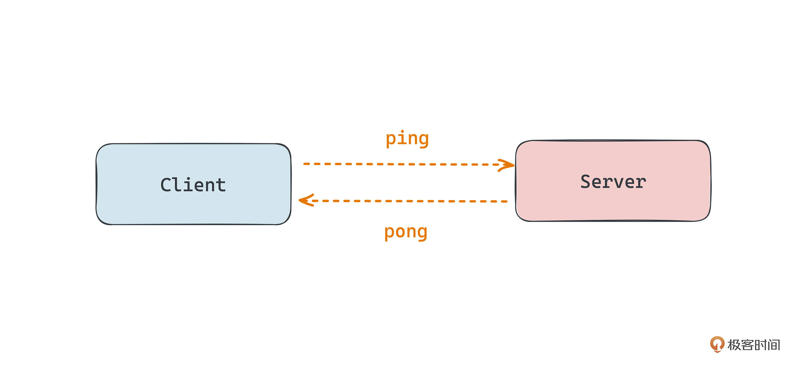

消息队列一般都是基于TCP协议通信的。所以客户端和服务端之间的心跳检测机制的实现**，一般有基于 TCP 的 KeepAlive 保活机制和应用层主动探测两种形式**。

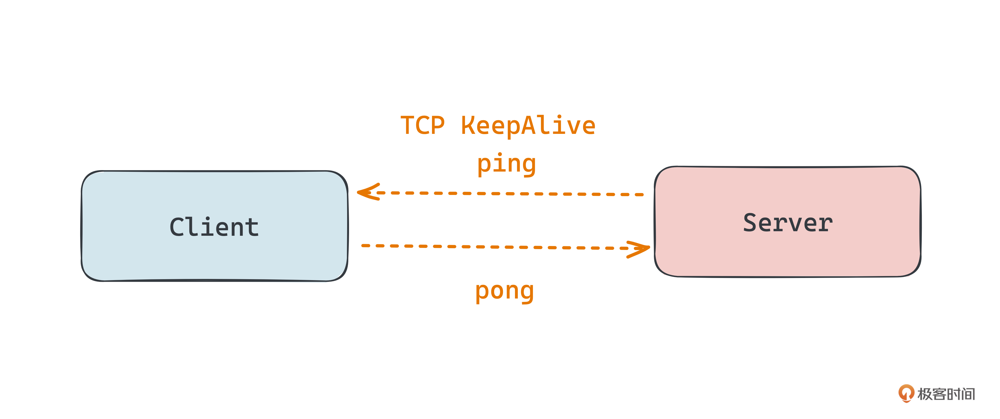

**基于TCP的KeepAlive保活机制** 是TCP/IP 协议层内置的功能，需要手动打开TCP的KeepAlive功能。通过这种方案实现心跳探测，优点是简单，**缺点是KeepAlive实现是在服务器侧，需要Server主动发出检测包，此时如果客户端异常，可能出现很多不可用的TCP连接。这种连接会占用服务器内存资源，导致服务端的性能下降。**

**应用层主动探测** 一般是Client向Server发起的，主要解决灵活性和TCP KeepAlive的缺陷。探测流程一般是客户端定时发送保活心跳，当服务端连续几次没收到请求，就断开连接。这样做的好处是，**可以将压力分担到各个客户端，避免服务端的过载。**

看一下 Java NIO 框架 Netty 中心跳探测的实现，来加深一下印象

Netty 支持心跳探测的关键是 IdleStateHandler，我们来看它的构造器。构造器包含读超时（readerIdleTime）、写超时（writerIdleTime）、读或写超时（allIdleTime）、时间单位（unit）四个参数，这四个参数是心跳检测的主要配置。

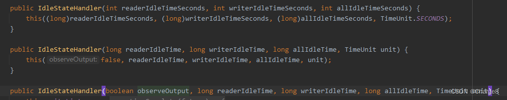

- 读超时，在指定的时间间隔内没有从 Channel 读取到数据时，会触发一个 READER\_IDLE 的 IdleStateEvent 事件。
- 写超时，在指定的时间间隔内没有数据写入到 Channel 时，会触发一个 WRITER\_IDLE 的 IdleStateEvent 事件。
- 读或写超时，在指定的时间间隔内没有读或写操作时，会触发一个 ALL\_IDLE 的 IdleStateEvent 事件。
- 时间单位，当超过时间间隔没有收到请求，就会触发后续的处理逻辑，一般是关闭连接。


  此时，如果触发了超时事件，则会触发后续的比如连接重建、报错等行为。接下来我们来看看错误是如何处理的。

### 错误处理

从请求的角度，**有些错误是重试可以恢复的**，比如连接断开、Leader切换、发送偶尔超时、服务端某些异常等；有些错误是不可恢复的，比如Topic/分区不存在、服务端Broker不存在、集群和Broker长时间无响应等。

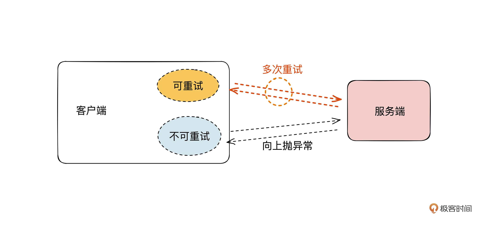

因为网络环境、架构部署的复杂性，集群可能出现短暂网络抖动、Leader切换等异常，可重试错误就是这类通过一次或多次重试可能恢复的异常；不可重试的错误就是不管如何重试都无法恢复的异常。

客户端收到可重试错误后，会通过一定的策略进行重试，尽量确保生产流程的顺利进行。

虽然实现思路很直接、很简单，但在客户端SDK的实现过程中，错误处理是一个包含很多细节的工作，一般需要考虑下面几个点。

- 如何**定义可恢复错误和不可恢复错误**。
- **完整的错误码的定义和枚举**，**好的错误码定义可以提高排查问题的效率**。
- 错误后**重试的代码实现方式是否合理高效。**
- 判断哪些情况需要停止客户端，**向上抛错**，以免一些错误信息一直在SDK内空转，**提高上层感知异常和排查异常的难度。**
- **日志信息**打印debug、info、error日志时，**是否包含了完整的内容**。

### 重试机制

重试策略一般会**支持重试次数和退避时间的概念**。当消息失败，超过设置的退避时间后，会继续重试，当超过重试次数后，就会抛弃消息或者将消息投递到配置好的重试队列中。

退避时间是可以配置的，比如1s、10s、1分钟。当出现错误时，就会根据退避策略退避，再尝试写入。一般情况下，重试是有次数上限的，当然也支持配置无限重试。

退避策略影响的是重试的成功率，因为网络抖动正常是ms级，某些异常可能会抖动十几秒。此时，如果退避策略设置得太短，在退避策略和重试次数用完后，可能消息还没生产成功；如果退避时间设置太长，可能导致客户端发送堵塞消息堆积。

## 生产相关功能

### 客户端寻址机制

往服务端写入数据的时候，服务端有那么多台节点，请求要发给哪台节点

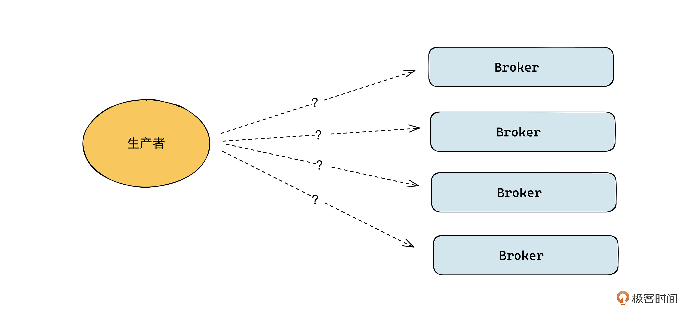

如何记录分区 和 Broker对应关系？

**Metadata（元数据）寻址机制、 服务端内部转发**两个思路

**1\. Metadata（元数据）寻址机制**

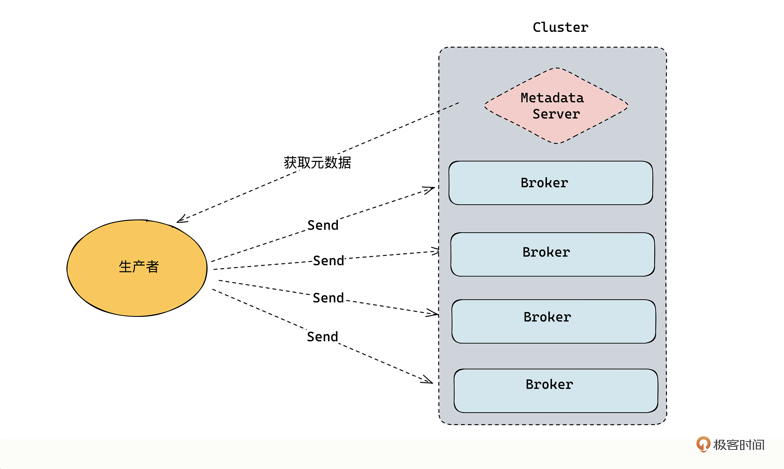

消息队列的元数据是指 **Topic、分区、Group、节点、配置等集群维度的信息**。比如Topic有几个分区，分区的 Leader 和 Follower 在哪些节点上，节点的 IP 和端口是什么，有哪些Group等等。

在 Metadata 寻址机制中，元数据信息主要包括 Topic 及其对应的分区信息和 Node 信息两部分。

Kafka的元数据信息结构

```shell
主题分区元数据：
{
    "test123": {
        "Topic": "test123",
        "Partitions": [
            {
                "ID": 0,
                "Error": {},
                "Leader": 101194,
                "Replicas": [
                    101194,
                    101193
                ],
                "Isrs": [
                    101194,
                    101193
                ]
            }
        ],
        "Error": {}
    }
}

节点元数据：
[
    {
        "ID": 101195,
        "Host": "9.130.62.0",
        "Port": 6097
    },
    {
        "ID": 101194,
        "Host": "9.130.62.1",
        "Port": 6096
    },
    {
        "ID": 101193,
        "Host": "9.130.62.2",
        "Port": 6095
    }
]

```

客户端一般通过 **定期全量更新Metadata信息和请求报错时更新元数据信息** 两种方式，来保证客户端的元数据信息是最新的。目前Kafka、RocketMQ、Pulsar用的都是这个方案。

**2\. 服务端内部转发机制**

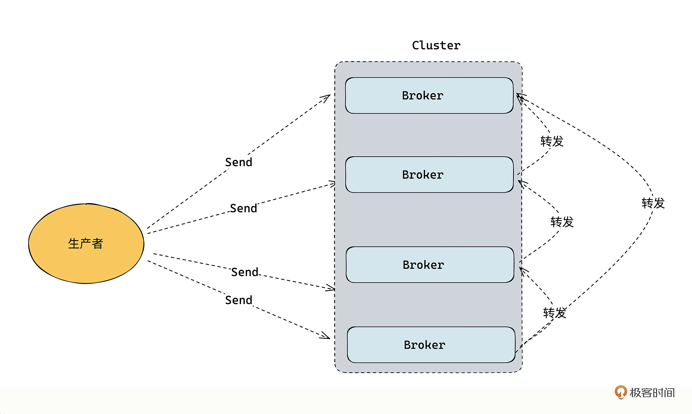

客户端不需要经过寻址的过程，**写入的时候是随机把数据写入到服务端任意一台Broker**。

具体思路是服务端的**每一台Broker会缓存所有节点的元数据信息，生产者将数据发送给Broker后，Broker如果判断分区不在当前节点上，会找到这个分区在哪个节点上，然后把数据转发到目标节点**。

这个方案的好处是分区寻址在服务端完成，客户端的实现成本比较低。但是生产流程多了一跳，耗时增加了。另外服务端因为转发多了一跳，会导致服务端的资源损耗多一倍，比如CPU、内存、网卡，在大流量的场景下，这种损耗会导致集群负载变高，从而导致集群性能降低。

**所以这种方案不适合大流量、高吞吐的消息队列。目前业界只有 RabbitMQ 使用这个方案。**

解决了请求要发送给哪个节点，接下来我们来看看消息数据要写入到哪个分区。

### 生产分区分配策略

我们知道，数据可以直接写入分区或者写入Topic。写入Topic时，最终数据还是要写入到某个分区。**这个数据选择写入到哪个分区的过程，就是生产数据的分区分配过程**。过程中的分配策略就是生产分区分配策略

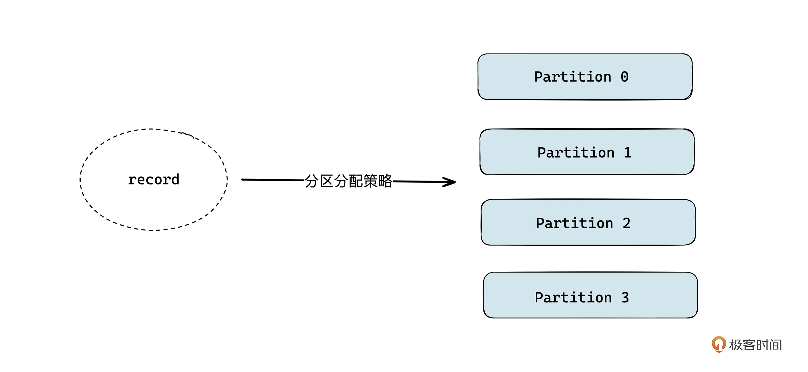

消息队列默认支持轮询、按Key Hash、手动指定、自定义分区分配策略四种分区分配策略。

**轮询** 是所有消息队列的默认选项。消息通过轮询的方式依次写入到各个分区中，这样可以保证每个分区的数据量是一样的，不会出现分区数据倾斜。

但是如果**我们需要保证数据的写入是有序的，轮询就满足不了**。因为在消费模型中，每个分区的消费是独立的，如果数据顺序依次写入多个分区，在消费的时候就无法保持顺序。所以为了保证数据有序，**就需要保证Topic只有一个分区**。这是另外两种分配策略的思路。


**按Key Hash** 是指根据消息的Key 算出一个Hash值，然后跟Topic的分区数取余数，算出一个分区号，将数据写入到这个分区中。公式参考：

```shell
partitionSeq = hash(key) % partitionNum
```

好处是可以根据Key来保证数据的分区有序。比如某个用户的访问轨迹，以客户的AppID为Key，按Key Hash存储，就可以确保客户维度的数据分区有序。**缺点是分区数量不能变化，变化后Hash值就会变，导致消息乱序。并且因为每个Key的数据量不一样，容易导致数据倾斜**。

**手动指定** 很简单，就是在生产数据的时候，手动指定数据写入哪个分区。这种方案的好处就是灵活，用户可以在代码逻辑中根据自己的需要，选择合适的分区，缺点就是业务需要感知分区的数量和变化，代码实现相对复杂。

消息队列也支持 **自定义分区分配策略**，让用户灵活使用。内核提供 Interface（接口）机制，用户如果需要指定自定义的分区分配策略，可以实现对应的接口，然后配置分区分配策略。比如Kafka可以通过实现 org.apache.kafka.clients.producer.Partitioner 接口实现自定义分区策略。


为了提高写入性能，有的生产者客户端会提供批量（Batch）写入的语义。

### 批量语义

客户端支持批量写入数据的前提是，**需要在协议层支持批量的语义**。**否则就只能在业务中自定义将多条消息组成一条消息。**

批量发送的实现思路一般是在客户端内存中**维护一个队列，数据写入的时候，先将其写到这个内存队列，然后通过某个策略从内存队列读取数据，发送到服务端。**

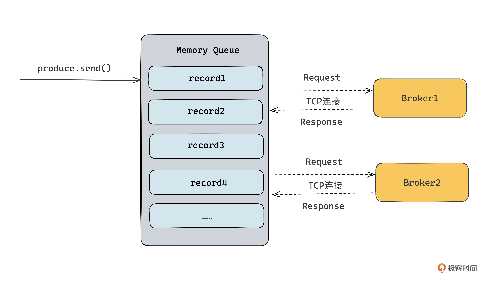

批量发送数据的策略和存储模块的刷盘策略很像，都是根据数据条数或时间聚合后，汇总发送到服务端，一般是满足时间或者条数的条件后触发发送操作，也会有立即发送的配置项。

Kafka是按照**时间的策略批量发送的**，提供了linger.ms、max.request.size、batch.size三个参数，来控制数据的批量发送。

> linger.ms：设置消息延迟发送的时间，这样可以等待更多的消息组成 Batch 发送。默认为0表示立即发送。
>
> max.request.size：生产者能够发送的请求包大小上限，默认为1MB。
>
> batch.size：生产者会尝试将业务发送到相同的 Partition 的消息合包后再进行发送，它设置了合包的大小上限。

Pulsar也提供了batchingEnabled、batchingMaxMessages、batchingMaxPublishDelayMicros 三个参数，来控制数据批量发送（参数语义参考 [官方文档](https://pulsar.apache.org/reference/#/2.11.x/client/client-configuration-producer)）。

为了支持对于性能和可靠性有不同需求的业务场景，客户端一般会支持多种数据发送方式。

### 数据发送方式

消息队列一般也会提供同步发送、异步发送、发送即忘三种形式。

同步和异步更多是语言语法的实现，同步发送主要解决数据发送的即时性和顺序性，异步发送主要考虑性能。

发送即忘指消息发送后**不关心请求返回的结果，立即发送下一条**。这种方式因为不用关心发送结果，发送性**能会提升很多**。缺点是当数据发送失败时无法感知，可能有数据丢失的情况，所以适合用在**发送不重要的日志等场景**。Kafka提供了**ack=0、RocketMQ提供了sendOneway来支持这种模式。**


## 集群管控操作

集群管控操作一般是用来完成资源的创建、查询、修改、删除等集群管理动作。资源包括主题、分区、配置、消费分组等等。

从功能上来看，消息队列一般会提供多种集群管理方式，比如命令行、客户端、HTTP接口等等

命令行工具是最基本的支持方式。如下图所示，它的底层主要通过包装客户端SDK和服务端的相关功能接口进行交互。程序编码上一般由 **命令行** **、** **参数包装**、 **底层SDK调用** 三部分组成。主要流程是接收参数、处理参数、调用SDK等相关操作。

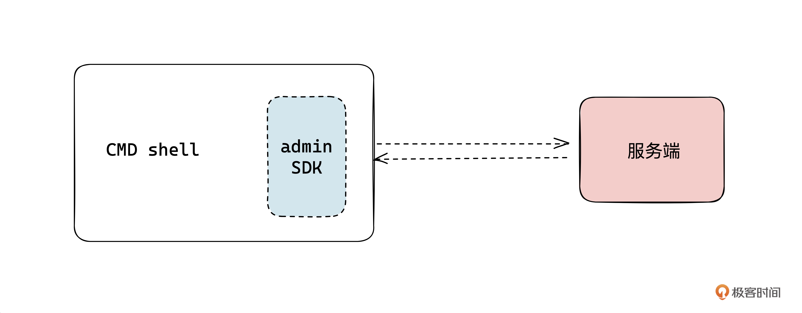

有的消息队列也会支持HTTP接口形式的管控操作。好处是因为HTTP协议的通用性，业务可以从各个环境发起管控的调用，不用非得使用admin SDK。另外客户端封装HTTP接口实现命令行工具的成本也比较低。


## 小结

消息队列生产者客户端的设计，主要关注下面三个部分。

1. 网络模块的开发和管理。这部分是为**了完成和服务端的通信**，比如请求和返回的构建、心跳检测、错误处理，重试机制等。
2. 根据服务端提供的各个接口的协议结构，**构建请求，完成序列化和反序列化后，通过网络模块发起请求并获得返回。**
3. 在前面两步的基础上，**添加各个业务层面的功能，比如生产、消费、事务、幂等、SSL等等**。

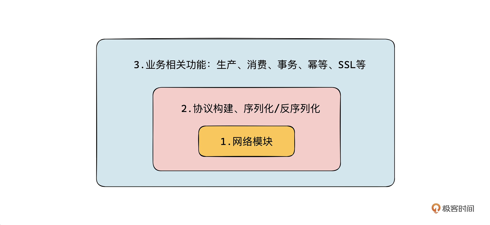

客户端和服务端交互的过程中，**一般要经过元数据寻址，以正确找到分区所在的Broker**。如果我们想避免客户端寻址，**只能在服务端内进行转发，但有性能和资源的损耗。所以在主打吞吐的消息队列组件中，转发的方案用得很少。**

从生产者的角度来看，需要重点关注**分区分配策略、批量语义、发送方式**三个方面。请求内容构建和序列化属于协议设计的内容，主要取决于协议的具体设计和序列化/反序列化框架的选择。


# 08｜消费端：消费者客户端的SDK有哪些设计要点？（上）

消费端SDK和生产端SDK一样，主要包括客户端基础功能和消费相关功能两部分。

消费相关功能包括 **消费模型**、 **分区消费模式**、 **消费分组（订阅）**、 **消费确认**、 **消费失败处理** 五个部分。

## 消费模型的选择

从实现机制上来看，主流消息队列一般支持 **Pull、Push、Pop 三种消费模型**

### Pull 模型

Pull（拉）模型是指客户端通过不断轮询的方式向服务端拉取数据。它是消息队列中使用最广泛和最基本的模型，主流的消息队列都支持这个模型。


好处是客户端根据**自身的处理速度去拉取数据，不会对客户端和服务端造成额外的风险和负载压力**

缺点是可能会出现**大量无效返回的Pull调用，另外消费及时性不够，无法满足一些需要全链路低耗时的场景**。

Pull模型都会支持批量读，即 **在客户端指定需要拉取多少条数据或者拉取多大的数据**，然后传递给服务端。客户端拉取到数据并处理完成后，再重复拉取数据处理。

缺点是可能会出现长时间轮询到空数据的情况，从而浪费通信资源，提高服务端的负载。

当Topic1数据已经被消费完，此时如果消费者频繁来拉取数据并立即返回结果，客户端就会不停地重复请求服务端。当空数据请求特别多的时候，就会造成资源损耗，不利于提高吞吐，也有可能导致负载问题。


为了解决这个问题，正常的思路是在客户端**根据一定策略进行等待和回避**。这样做的话，就会出现如何设置等待时间的问题，**客户端等待时间设置不合理就会出现消费不及时的情况。**

一般服务端会协助处理，有如下两个思路

**1\. 服务端hold住请求**

当客户端根据策略拉取数据时，如果没有足够的数据，就先在服务端等一段时间，等有数据后一起返回给客户端。这种方案的好处是，可以尽量提高吞吐能力，不会有太多的空交互请求。**缺点是如果长时间不给客户端回包，会导致客户端请求超时，另外当数据不够时，hold住请求的时间太长就会提高消费延时。**


**2\. 服务端有数据的时候通知客户端**

**当服务端不hold住请求，立刻返回空数据，客户端收到空数据时则不再发起请求，会等待服务端的通知**。当服务端有数据的时候，再**主动通知客户端来拉取**。这种方案的好处是可以及时通知客户端来拉取数据，从而降低消费延时。**缺点是因为客户端和服务端一般是半双工的通信，此时服务端是不能主动向客户端发送消息的**。

所以在 Pull 模型中，比较合适的方案是客户端告诉服务端： **最多需要多少数据、最少需要多少数据、未达到最小数据时可以等多久** 三个信息。然后服务端首先判断是否有足够的数据，有的话就立即返回，否则就根据客户端设置的等待时长hold住请求，如果超时，无论是否有数据，都会直接给客户端返回当前的结果。

这种策略可以解决频繁不可控的空轮询请求。即使全是空轮询，对单个消费者来说，其TPS也是可以预估的，即总时间/等待时长 = 总轮询次数。而如果需要降低消费延时，可以通过降低最小获取的数据大小和最大等待时长来提高获取的频率，从而尽量降低延时。通过这种方案，我们可以把理想的消费延迟时间降低到两次Pull请求之间的时间间隔。

在一些业务消息的场景中，因为应对的场景规模有限，可以将最大等待时长设置为0，此时消费模型就变成了请求-返回的模式，当没数据的时候就会立即返回数据，其余逻辑交给客户端自己处理。

### Push 模型

Push（推）模型是为了解决消费及时性而提出来的。这个模型的本意是**指当服务端有数据时会主动推给客户端，让数据的消费更加及时**。


在实际的Push模型的实现上，**一般有 Broker 内置 Push 功能、Broker 外独立实现 Push 功能的组件、在客户端实现伪 Push 功能**三种思路。

**Broker** **内置** **Push** **功能是指在Broker中内置标准的** **Push** **的能力，由服务端向客户端主动推送数据。**


Broker自带Push能力，无需重复开发和部署。Broker 内部可以感知到数据堆积情况，可以保证消息被及时消费。

缺点是当消费者很多时，**内核需要主动维护很多与第三方的长连接，并且需要处理各种客户端异常，比如客户端卡住、接收慢、处理慢等情况**。这些推送数据、异常处理、连接维护等工作需要消耗很多的系统资源，在性能上容易对Broker形成反压，**导致Broker本身的性能和稳定性出现问题**。

所以这种方案在主流消息队列中用得较少，**比如RabbitMQ和某些金融证券领域的消息队列，为了保证消息投递的高效及时（比如全链路的毫秒级耗时），才会采用这种方案。**

---

**Broker外独立实现Push功能的组件是指独立于Broker提供一个专门实现推模型的组件**


将Push组件独立部署，**解决了 Broker 的性能和稳定性问题，也能实现Push的效果**。缺点是虽然实现了Push的模型，**但其本质还是先Pull再Push，从全链路来看，还是会存在延时较高的问题，并且需要单独开发独立的 Push 组件，开发和运维成本较高。**

---

在客户端实现伪Push功能是指在客户端内部维护内存队列，SDK 底层通过Pull模型从服务端拉取数据存储到客户端的内存队列中。** 然后通过回调的方式，触发用户设置的回调函数，将数据推送给应用程序，在使用体验上看就是 Push 的效果。


这种方案的好处在于通过客户端底层的封装，从用户体验看是Push模型的效果，解决用户代码层面的不断轮询问题，**降低了用户的使用复杂度**。缺点是**底层依旧是Pull模型，还是得通过不断轮询的方式去服务端拉取数据，就会遇到 Pull 模型遇到的问题**。

在客户端实现伪Push，是目前消息队列在实现Push模型上常用的实现方案，因为它**解决了客户体验上的主动回调触发消费问题**。虽然底层会有不断轮询和消费延时的缺点，**但是可以通过编码技巧来降低这两个问题的影响**。

---

因为Push模型需要先**分配分区和消费者的关系**，客户端就需要感知分区分配、分区均衡等操作，**从而在客户端就需要实现比较重的逻辑**。并且当客户端和订阅的分区数较多时，容易出现需要**很长的重平衡时间的情况。此时为了解决这个问题，业界提出了Pop模型。**

### Pop模型

Pop模型想解决的是客户端实现较重，重平衡会暂停消费并且可能时间较长，从而出现消费倾斜的问题。

思路是客户端不需要感知到分区，直接通过Pop模型提供的get接口去获取到数据，消费成功后ACK数据。就跟我们发起HTTP请求去服务端拉取数据一样，不感知服务端的数据分布情况，只需要拉到数据。

**这种方案的好处是简化了消费模型，同时服务端可以感知到消费的堆积情况，可以根据堆积情况返回那些分区的数据给客户端，这样也简化了消息数据的分配策略。**


## 分区消费模式的设计

消息队列的**数据是在Partition/Queue维度承载的**。所以消费过程中一个重要的工作就是**消费者和分区的消费模式问题**，即分区的数据能不能**被多个消费者并发消费**，一条数据能不能**被所有消费者消费到**，分区的数据能不能**被顺序消费**等等。

在数据的消费模式上主要有**独占消费、共享消费、广播消费、灾备消费**四个思路

**独占消费是指一个分区在同一个时间只能被一个消费者消费。** 

当消费者数量和分区数量都没有变化的情况下，两者之间的分配关系不会变动。当分配关系变动时，一个分组也只能被一个消费者消费，这个消费者可能是当前的，也可能是新的。**如果消费者数量大于分区数量，则会有消费者被空置；反之，如果分区数量大于消费者数量，一个消费者则可以同时消费多个分区。**


独占消费的好处是可以保证**分区维度的消费是有序的**。缺点是当**数据出现倾斜、单个消费者出现性能问题或hang住时，会导致有些分区堆积严重**。现在大部分消息队列默**认支持的就是独占消费的类型，比如Kafka、RocketMQ、Pulsar等。**


---

**共享消费是指单个分区的数据可以同时被多个消费者消费。** 即分区的数据会依次投递给不同的消费者，一条数据只会投递给一个消费者。


这种方式的好处是，可以避免**单个消费者的性能和稳定性问题导致分区的数据堆积**。缺点是无法保证数据的顺序消费。**这种模式一般用在对数据的有序性无要求的场景，比如日志。**


---

**广播消费是指一条数据要能够被多个消费者消费到。** 即分区中的一条数据可以投递给所有的消费者，这种方式是需要广播消费的场景。


实现广播消费一般有**内核实现广播消费的模型、使用不同的消费分组消费和指定分区消费**三种技术思路。

1. 内核实现广播消费的模型，指在**Broker内核中的消息投递流程实现广播消费模式，即 Broker 投递消息时，可以将一条消息吐给不同的消费者，从而实现广播消费**。
2. 使用不同的消费分组对数据进行消费，指通过**创建不同的消费者组消费同一个Topic或分区，不同的消费分组管理自己的消费进度，消费到同一条消息，从而实现广播消费的效果**。
3. 指定分区消费，是指**每个消费者指定分区进行消费，在本地记录消费位点，从而实现不同消费者消费同一条数据，达到广播消费的效果**


在常见的消息队列产品中，Pulsar支持的Share消费模型就是第一种实现思路。Kafka和RocketMQ主要支持第二和第三种实现思路。

---

**灾备消费是独占消费的升级版，在保持独占消费可以支持顺序消费的基础上，同时加入灾备的消费者** **。** 当消费者出现问题的时候，灾备消费者加入工作，继续保持独占顺序消费。

好处是既能保持独占顺序消费，又能保证容灾能力。**缺点是无法解决消费倾斜的性能问题，另外还需要准备一个消费者来做灾备，使用成本较高。**


## 小结

在消费端，为了提高消费速度和消息投递的及时性，需要选择**合适的消费模型**，**目前主流有Pull、Push、Pop三种模型。**

这三种模型的应用场景都不一样。目前业界主流消息队列使用的都是Pull模型。但为了满足业务需求，很多消息队列也会支持Push模型和Pop模型。其中，Push模型的及时性更高，实现较为复杂，限制较多。Pop模型本质上是Pull模型的一种，只是在实现和功能层面上，与Push的实现思路和适用场景不一样。所以在模型的选择上来看，因为场景复杂，三种模型都是需要的。

常用的**消费模式**一般有独占消费、共享消费、广播消费、灾备消费四种 **。** 为了避免堆积，保证消息消费顺序，一般需要选择分区独占的消费模式。从单分区的维度，共享消费的性能是最高的。广播消费主要是通过创建多个消费分组、指定分区消费来实现的。灾备消费的场景用得相对较少。


# 09｜消费端：消费者客户端的SDK有哪些设计要点？（下）

## 消费分组

消费分组是用来组织**消费者、分区、消费进度关系的逻辑概念。**

在没有消费分组直接消费Topic的场景下，如果希望不重复消费Topic中的数据，那么就 **需要有一个标识来标识当前的消费情况，比如记录进度。** 这个唯一标识就是消费分组。

在一个集群中可以有很多消费分组，消费分组间通过名称来区分。消费分组自身的数据是集群元数据的一部分，会存储在Broker的元数据存储服务中。消费分组主要有**管理消费者和分区的对应关系、保存消费者的消费进度、实现消息可重复被消费**三类功能。

消费分组和Topic是强相关的，它需要包含Topic才有意义，一个空的消费分组是没有意义的。消费分组内有很多个消费者，一个消费分组也可以订阅和消费多个Topic，一个Topic也可以被多个消费分组订阅和消费。


Topic 不存储真实数据，分区才存储消息数据，所以就需要解决消费者和分区的分配关系，即 **哪个分区被哪个消费者消费，这个分配的过程就叫做消费重平衡（Rebalance）**。


从流程上来看，**当新建一个消费分组的时候，就需要开始分配消费者和分区的消费关系了**。分配完成后，就可以正常消费。如果消费者和分区出现变动，比如消费者挂掉、新增消费者、订阅的Topic的分区数发生变化等等，就会**重新开始分配消费关系**，**否则就会存在某些分区不能被订阅和消费的情况**。


## 协调者

如果要对消费者和分区进行分配，肯定需要有一个模块拥有消费分组、所有的消费者、分区信息三部分信息，这个模块我们一般命名为 **协调者。** 协调者主要的工作就是执行消费重平衡，并记录消费分组的消费进度。

**在消费分组创建、消费者变化、分区变化的时候就会触发重新分配**。

分区分配的操作可以在协调者内部或者消费者上完成。

1. 在协调者完成，即协调者首先获取消费者和分区的信息，然后**在协调者内部完成分区分配，最后再把分配关系同步给所有消费者。**
2. 在消费者完成，**即负责分配的消费者获取所有消费者和分区的信息，然后该消费者完成分区分配操作，最后再把分配关系同步给其他消费者。**

从技术上来看，这两种形式的优劣区别并不大，取决于代码的实现。 **一般在创建消费分组和消费者/ Topic分区发生变化的时候，会触发协调者执行消费重平衡。**


从实现的角度来看，协调者一般是Broker内核的一个模块，就是一段代码或者一个类，专门用来完成上述的工作。当有多台Broker时，协调者的实现有多种方式，比如**Kafka 集群每台Broker都有协调者存在**。**通过消费分组的名称计算出来一个hash值和\_\_consumer\_offset的分区数，取余计算得出一个分区号。最后这个分区号对应的Leader所在的Broker节点就是协调者所在的节点**。客户端就和计算出来的这台Broker节点进行交互，来执行消费重平衡的相关操作。


## 消费分区分配策略

在具体实现上，一般内核会默认提供几种分配策略，也可以通过定义接口来支持用户自定义实现分区分配策略。

分区分配策略的制定一般遵循以下三个原则：

1. 各个分区的数据能均匀地分配给每个消费者，保证所有消费者的负载最大概率是均衡的，该原则最为常用。
2. 在每次重新分配的时候，尽量减少分区和消费者之间的关系变动，这样有助于加快重新分配的速度，并且保持数据处理的连续性，降低处理切换成本。
3. 可以允许灵活地根据业务特性制定分配关系，比如根据机房就近访问最近的分区、某个Topic的奇数分区分配给第一个消费者等等。

所有消息队列的默认策略都是相对通用的，一般都会包含有轮询、粘性、自定义三种类型的策略。

**轮询** 就是指用轮询的方式将分区分配给各个消费者，保证每个消费者的分区数量是尽量相同的，从而保证消费者的负载最大概率上是均衡的。

思路是拿到所有主题的所有分区和所有消费者，根据拿到的顺序（实际实现中可能会先全部打乱，以确保随机性）将分区逐个分配给消费者。分配到最后的效果是，每个消费者所分到的分区数是一样的，最多相差1个分区

```java
消费者1：tp0-0、tp2-1、tp1-1

消费者2：tp2-2、tp0-1、tp2-0

消费者3：tp1-0、tp0-2
```

因为Topic一般会有多个分区，默认情况下写入大部分是均匀的。这个方案的优点是，从随机性的原理来看，打乱分区后再分配给每个消费者，消费者的负载大概率是均匀的。

但是也有可能出现不均衡，比如**当消费组同时订阅多个分区时，有可能会将同一个Topic的多个分区都分配给一个消费者，从而出现消费者的负载倾斜。**

业界提出了一些轮询方案的升级版本，比如在随机的基础上，**将Topic的不同分区尽量打散到不同的消费者**，从而保证整体消费者之间的分区是均衡的

```java
消费者1：tp0-0、tp2-1、tp1-1

消费者2：tp0-1、tp2-0、tp1-0

消费者3：tp0-2、tp2-2
```

核心都是为了消费者更加均衡，避免消费倾斜。所以当你看到有些分配算法很像轮询又不太一样时，只要从这个目的去拆解，就会比较好理解了。


---

**粘性** 是指尽量减少分区分配关系的变动，进而减少重平衡所耗费的时间和资源损耗。即当已经分配好消费者和分区的消费关系后，当消费者或者分区出现变动，就会触发重平衡。

比如当上面的消费者3挂了后，只需要将tp1-0、tp0-2平均分给消费者1和2即可，消费者1和2原先分配的分区不用动。

```java
消费者1：tp0-0、tp2-1、tp1-1、tp1-0

消费者2：tp2-2、tp0-1、tp2-0、tp0-2
```

在实际的实现中，为了减少重新分配关系，有一个非常常用的算法是 **一致性哈希**。一致性哈希的算法经常用在负载均衡中。用一致性哈希实现粘性策略的优点是，当节点或者分区变动时，只需要执行少量的分区再分配即可。


---

在一些消息队列中，也会提供一些与自己相关的特色的分区分配策略。比如RocketMQ内部就提供了根据机房就近分配、指定机房分配两种策略，这两种策略的协调者要感知到客户端和服务端的机房信息，然后根据策略进行分配，均主要用在跨可用区场景中。Kafka 也提供了轮询策略改进版RoundRobinAssignor分配策略。这些策略的核心出发点，都是为了解决消费者和分区之间的分配均衡、重平衡耗时、业务场景需要等诉求。

自定义分区分配算法，跟上节课生产端数据的分区分配策略是一样的，内核会提供接口，用户可以根据自身需求实现自定义算法，然后指定配置生效即可。比如Kafka提供了org.apache.kafka.clients.consumer.internals.PartitionAssignor 接口来提供自定义分区分配策略。


## 消费确认

那么当数据被消费成功后，就必须进行消费确认操作了，告诉服务端已经成功消费了这个数据。**消费确认就是我们在消息队列中常说的ACK。**

消息确认分为**确认后删除数据和确认后保存消费进度数据**两种形式。

**确认后删除数据** 是指集群的每条消息只能被消费一次，只要数据被消费成功，就会回调服务端的ACK接口，服务端就会执行数据删除操作。在实际开发的过程中，一般都会支持单条ACK和批量ACK两种操作。这种方式不利于回溯消费，所以用得比较少。


**消费成功保存消费进度** 是指当消费数据成功后，调用服务端的消费进度接口来保存消费进度。这种方式一般都是配合消费分组一起用的，服务端从消费分组维度来保存进度数据。


为了保证消息的回溯消费和多次消费，消息队列大多数用的是第二种方案。 **数据的删除交由数据过期策略去执行。**


保存消费进度一般分为服务端保存和客户端自定义保存两种实现机制。

**服务端保存** 是指当消费端消费完成后，客户端需要调用一个接口提交信息，这个接口是由服务端提供的“提交消费进度”接口，然后服务端会持久保存进度。**当客户端断开重新消费时，可以从服务端读取这个进度进行消费**。服务端一般会通过**内置的Topic或者文件来持久保存该数据**。这种方式的优点就是客**户端会封装好这些逻辑，使用简单，无需管理进度相关的信息，缺点就是不够灵活**。服务端保存一般是默认的方案。

在提交位点信息的时候，底层一般**支持自动提交和手动提交**两种实现。

- **自动提交** 一般是根据时间批次或数据消费到客户端后就自动提交，提交过程客户无感知。
- **手动提交** 是指业务根据自己的处理情况，手动提交进度信息，以避免业务处理异常导致的数据丢失。


优先使用手动提交方式，可以避免数据丢失。

**客户端自定义保存** 是指当消费完成后，客户端自己管理保存消费进度。此时就不需要向服务端接口提交进度信息了，自定义保存进度信息即可，比如保存在客户端的缓存、文件、自定义的服务中，当需要修改和回滚的时候就比较方便。这种方案的优点就是灵活，缺点就是会带来额外的工作量。

业界主流来看，这两种方案用得都比较多，不过默认情况下都是使用第一种方案，业务需要的话就选择第二种方案


## 消费失败处理

一个完整的消费流程包括消费数据、本地业务处理、消费进度提交三部分。

从消费失败的角度来看，就应该分为从服务端拉取数据失败、本地业务数据处理失败、提交位点信息失败三种情况。

**从服务端拉取数据失败**，和客户端的错误逻辑处理是一致的，根据可重试错误和不可重试错误的分类，进行重复消费或者向上抛错。

**本地业务数据处理失败**，处理起来就比较复杂了。如果是偶尔失败，那么在业务层**做好重试处理逻辑，配合手动提交消费进度的操作即可解决**。如果是一直失败，即使重试多次也无法被解决，比如这**条数据内容有异常，导致无法被处理。此时如果一直重试，就会出现消费卡住的情况，这就需要配合死信队列的功能，将无法被处理的数据投递到死信队列中，从而保存异常数据并保证消费进度不阻塞**。

**提交位点信息失败**，其处理方法通常是**一直重试，重复提交，如果持续失败就向上抛错**。因为如果提交进度失败，即使再从服务端拉取数据，还是会拉到同一批数据，出现重复消费的问题。


## 小结

从设计上看，消费端要解决的问题依次分为三步：

1. 满足基本的消费需求，能消费到数据，确认数据。
2. 满足稳定性和性能的需求，能快速稳定地消费到数据。
3. 支持功能方面的需求，比如回溯消费、消费删除、广播消费等等。

为了能满足基本的消费需求，**服务端会提供消费和确认接口，同时在客户端封装消费和确认操作中，底层通过网络层和服务端建立、维护TCP连接，然后通过协议完成基本的消费操作**。

如果要回溯消费，则需要单独记录消费进度。这样就能**抽象出消费分组的概念，用来管理消费者、分区、消费进度的关系。**通过消费分组来**记录消费进度**，从而实现数据的多次分发。另外，消费分组机制也可以用在广播消费的场景。

在消费确认的过程中，一般需要客户端回调服务端提供的确认接口。确认接口分为确认删除和确认记录消费进度两种模式。主流方式是在确认的时候记录消费进度。

异常处理主要是为了保证数据能被正常消费，重点关注不丢数据、不重复消费、不阻塞住消费三个问题，我们需要针对不同的问题做不一样的处理。


# 10｜从基础功能拆解RabbitMQ的架构设计与实现

## RabbitMQ 系统架构

RabbitMQ的系统架构


RabbitMQ由Producer、Broker、Consumer三个大模块组成。生产者将数据发送到Broker，Broker 接收到数据后，将数据存储到对应的Queue里面，消费者从不同的Queue消费数据。

Exchange 称为交换器，它是一个逻辑上的概念，用来做分发，本身不存储数据。

流程：

1. 生产者先将消息发送到Exchange，而不是发送到数据的实际存储单元Queue里面
2. 然后 Exchange 会根据一定的规则将数据分发到实际的Queue里面存储 (这个分发过程就是Route（路由），设置路由规则的过程就是Bind（绑定)

Exchange 会接收客户端发送过来的 route\_key，然后根据不同的路由规则，将数据发送到不同的Queue里面

这里需要注意的是， **在RabbitMQ中是没有Topic这个用来组织分区的逻辑概念的。** RabbitMQ中的Topic是指Topic路由模式，是一种路由模式，和消息队列中的Topic意义是完全不同的。

那为什么RabbitMQ 会有Exchange、Bind、Route这些独有的概念呢？

当时业界的架构设计思想以及主导设计 AMQP 协议的公司背景有关。当时的设计思路是： **希望发消息跟写信的流程一样**，可以有一个集中的分发点（邮局），通过填写好地址信息，最终将信投递到目的地。这个集中分发点（邮局）就是Exchange，地址信息就是Route，填写地址信息的操作就是Bind，目的地是Queue。


## 协议和网络模块

### 协议

在网络通信协议层面，RabbitMQ 数据流是基于四层TCP协议通信的，**跑在TCP上的应用层协议是AMQP**。如果开启 Management 插件，也可以支持HTTP协议的生产和消费。

TCP + AMQP 是数据流的默认访问方式，也是官方推荐的使用方式，因为它性能会比 HTTP 高很多。

**RabbitMQ在协议内容和连接管理方面，都是遵循AMQP规范。** 即RabbitMQ的模型架构和AMQP 的模型架构是一样的，交换器、交换器类型、队列、绑定、路由键等都是遵循AMQP 协议中相应的概念。

AMQP 是一个应用层的通信协议，可以看作一系列结构化命令的集合，用来填充TCP 层协议的body 部分。通过协议命令进行交互，可以完成各种消息队列的基本操作，如Connection.Start（建立连接）、Basic.Publish（发送消息）等等，详细的AMQP协议内容可以参考文档 [AMQP Working Group 1.0 Final](http://www.amqp.org/sites/amqp.org/files/amqp.pdf)。

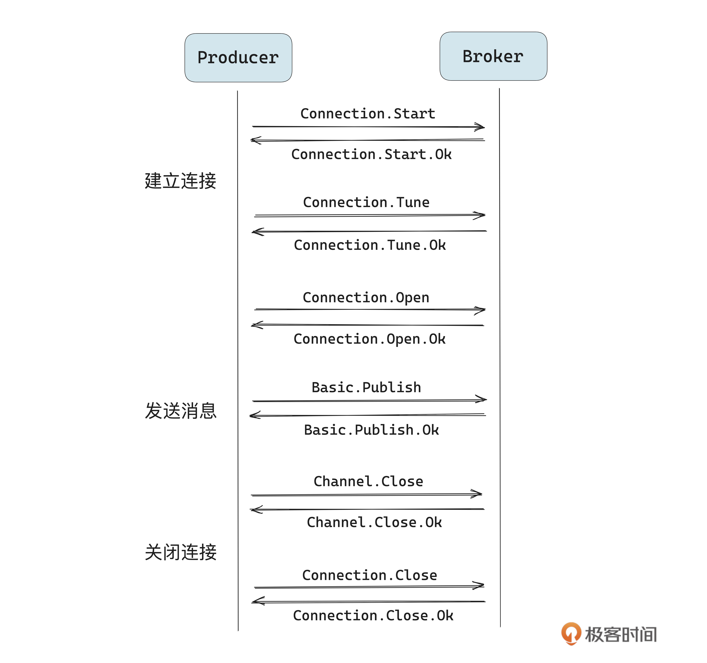

### 网络模块

在RabbitMQ的网络层有Connection和Channel 两个概念需要关注。


Connection 是指TCP连接，Channel 是Connection中的虚拟连接。

两者的关系是：**一个客户端和一个Broker之间只会建立一条TCP连接**，就是指 Connection。Channel（虚拟连接）的概念在这个连接中定义，**一个 Connection中可以创建多个Channel**。

**客户端和服务端的实际通信都是在Channel维度通信的。** 这个机制可以减少实际的TCP连接数量，从而降低网络模块的损耗。从设计角度看，也是基于IO复用、异步I/O的思路来设计的。


从编码实现的角度，RabbitMQ 的网络模块设计会比较简单。主要包含 tcp\_listener、tcp\_acceptor、rabbit\_reader 三个进程。如下图所示，RabbitMQ 服务端通过 tcp\_listener 监听端口，tcp\_acceptor 接收请求，rabbit\_reader 处理和返回请求。本质上来看是也是一个多线程的网络模型。


## 数据存储

RabbitMQ 的两类数据都是存储在 Broker 节点上的，不会依赖第三方存储引擎。


#### 元数据存储

RabbitMQ的元数据都是存在于Erlang自带的分布式数据库Mnesia中的。即每台Broker都会起一个Mnesia进程，用来保存一份完整的元数据信息。因为 Mnesia 本身是一个分布式的数据库，自带了多节点的 Mnesia 数据库之间的同步机制。所以在元数据的存储模块，RabbitMQ 的Broker 只需要调用本地的 Mnesia 接口保存、变更数据即可。不同节点的元数据同步 Mnesia 会自动完成。

Mnesia对RabbitMQ的作用，相当于ZooKeeper对于Kafka、NameServer对于RocketMQ的作用。**因为Mnesia是内置在Broker中，所以部署RabbitMQ集群时，你会发现只需要部署Broker，不需要部署其他的组件。这种部署结构就很简单清晰，从而也降低了后续的运维运营成本。**

在一些异常的情况下，如果不同节点上的 Mnesia 之间的数据同步出现问题，就会导致不同的 Mnesia 数据库之间数据不一致，进而导致集群出现脑裂、无法启动等情况。此时就需要手动修复异常的Mnesia实例上的数据。

因为Mnesia 本身是一个数据库，所以它和数据库一样，可以进行增删改查的操作。需要了解Mnesia 的更多操作，你可以参考 [ErLang Mnesia](https://www.erlang.org/doc/man/mnesia.html)。


#### 消息数据存储

RabbitMQ 消息数据的最小存储单元是Queue，即消息数据是按顺序写入存储到Queue里面的。在底层的数据存储方面，所有的Queue数据是存储在同一个“文件”里面的。这个“文件”是一个虚拟的概念，表示所有的Queue数据是存储在一起的意思。


这个“文件”由队列索引（rabbit\_queue\_index）和消息存储（rabbitmq\_msg\_store）两部分组成。

即在节点维度，所有 Queue 数据都是存储在rabbit\_msg\_store里面的，每个节点上只有一个rabbit\_msg\_store，数据会依次顺序写入到rabbit\_msg\_store中。

rabbit\_msg\_store是一个逻辑概念，底层的实际存储单元分为两个，msg\_store\_persistent和msg\_store\_transient，分别负责持久化消息和非持久化消息的存储

msg\_store\_persistent 和 msg\_store\_transient 在操作系统上是以文件夹的形式表示的，具体的数据存储是以不同的文件段的形式存储在目录中，所有消息都会以追加的形式写入到文件中。当一个文件的大小超过了配置的单个文件的最大值，就会关闭这个文件，然后再创建一个文件来存储数据


队列索引负责**存储、维护队列中落盘消息的信息，包括消息的存储位置、是否交付、是否ACK等等信息**。队列索引是Queue维度的，**每个Queue都有一个对应的队列索引**。

RabbitMQ 也提供了 **过期时间（TTL）机制**，用来删除集群中没用的消息。它支持**单条消息和队列两个维度**来设置数据过期时间。如果在队列上设置TTL，那么队列中的所有消息都有相同的过期时间。我们也可以对单条消息单独设置TTL，每条消息的TTL可以不同。**如果两种方案一起使用，那么消息的TTL 就会以两个值中最小的那个为准。如果不设置TTL，则表示此消息不会过期。**

删除消息时，不会立即删除数据，只是从Erlang 中的ETS表删除指定消息的相关信息，同时更新消息对应的存储文件的相关信息。**此时文件中的消息不会立即被删除，会被标记为已删除数据，直到一个文件中都是可以删除的数据时，再将这个文件删除，这个动作就是常说的延时删除**。另外内核有检测机制，会检查前后两个文件中的数据是否可以合并，当符合合并规则时，会进行段文件的合并。

## 生产者和消费者

当生产者和消费者连接到Broker进行生产消费的时候，是直接和Broker交互的，不需要客户端寻址。客户端连接Broker的方式，跟我们通过HTTP服务访问Server是一样的，都是直连的。


RabbitMQ集群部署后，为了提高容灾能力，就需要在集群前面挂一层负载均衡来进行灾备。

因为Queue是具体存储数据的单元，不同的Queue 有可能分布在不同的Broker上，就有可能出现生产或消费基于负载均衡IP请求到的Broker，并不是当前Queue所在的Broker，从而导致生产消费失败。

在每个Broker上会设置有转发的功能。在实现上，每台Broker节点都会保存集群所有的元数据信息。当Broker收到请求后，根据本地缓存的元数据信息判断Queue是否在本机上，如果不在本机，就会将请求转发到Queue所在的目标节点。

---

从客户端的实现来看，因为各个语言的实现机制不太一样，基础模块的连接管理、心跳管理、序列化等部分遵循各编程语言的开发规范去实现。例如网络模块的实现，如果客户端是用Java语言写的，那么可以使用Java NIO库完成网络模块的开发。

客户端和服务端传输协议的内容遵循AMQP协议，底层以二进制流的形式序列化数据。即根据 AMQP 协议的格式构建内容后，然后序列化为二进制的格式，传递给 Broker 进行处理。


生产端发送数据不是直接发送到Queue，而是直接发送到Exchange。即发送时需要**指定Exchange和route\_key，服务端会根据这两个信息，将消息数据分发到具体的Queue**。因为Exchange和route\_key都是一个逻辑概念，数据是直接发送到Broker的，然后在服务端根据路由绑定规则，将数据分发到不同的Queue中，所以在客户端是没有发送生产分区分配策略的逻辑。其实从某种程度来看， **Exchagne和Route的功能就是生产分区分配的过程，只是将这个逻辑从客户端移动到了服务端而已。**


在消费端，RabbitMQ 支持Push（推）和Pull（拉）两种模式，如果使用了Push模式，Broker会不断地推送消息给消费者。不需要客户端主动来拉，只要服务端有消息就会将数据推给客户端。当然推送消息的个数会受到 channel.basicQos 的限制，不能无限推送，在消费端会设置一个缓冲区来缓冲这些消息。

拉模式是指客户端不断地去服务端拉取消息，**RabbitMQ的拉模式只支持拉取单条消息**。

在AMQP协议中，是没有定义Topic和消费分组的概念的，所以在消费端没有消费分区分配、消费分组 Rebalance 等操作，**消费者是直接消费Queue数据的。**

为了保证消费流程的可靠性，RabbitMQ也提供了 **消息确认机制**。消费者在消费到数据的时候，会调用ACK接口来确认数据是否被成功消费。

底层提供了自动ACK和手动ACK两种机制。自动ACK表示当客户端消费到数据后，消费者会自动发送ACK，默认是自动ACK。手动ACK表示客户端消费到数据后，需要手动调用。ACK的时候，支持单条ACK和批量ACK两种动作，批量ACK可以用来提升ACK效率。另外，为了提升ACK动作的性能，有些客户端也支持异步的ACK。


---

## HTTP 协议支持和管控操作

RabbitMQ 内核本身不支持 HTTP 协议的生产、消费和集群管控等操作。如果需要支持，则需要先手动开启Management插件，通过插件的形式让内核支持这个功能。

大部分情况下，我都会建议你启用Management插件，否则集群使用就会不太方便。如下图所示，从实现上来看 Management 插件对 HTTP 协议的支持，就是在开启插件的时候，会启动一个新的 HTTP Server 来监听一个新的端口。客户端只需要访问这个端口提供的HTTP接口，就可以完成HTTP读写数据和一些集群管控的操作。


开启插件后，就可以通过HTTP接口实现生产、消费、集群的配置、资源的创建、删除等操作。


## 小节

RabbitMQ 主要有 Producer、Broker、Consumer、Exchange、Queue、Route、Bind、Connection、Channel、ACK 等概念。

总结 RabbitMQ，可以从以下七个方面入手：

1. 协议层基于AMQP标准开发。
2. 网络层核心数据流基于 TCP 协议通信，并通过Connection和Channel机制实现连接的复用，以减少创建的TCP连接数量。
3. 存储层基于多个Queue数据统一到一个文件存储的思路设计，同时支持分段存储和基于时间的数据过期机制。
4. 元数据存储是基于Erlang内置的数据库Mnesia来实现。
5. 客户端的访问是直连的，没有客户端寻址机制。
6. 生产端是通过Exchange和Route写入数据的，生产数据的分发是在服务端完成的，其他消息队列的分发一般都是在客户端。
7. 消费端没有消费分组、消费分区分配等概念，直连Queue消费，同时也提供了手动和自动两种ACK机制。


# 11｜从基础功能拆解RocketMQ的架构设计与实现

>  有一个蛮有意思的现象，从我们的统计数据来看，RabbitMQ的用户数是最多的。但是在程序员的口碑中，RocketMQ无论是从性能还是稳定性上都是优于RabbitMQ的。从我个人来看，RocketMQ 可以当作RabbitMQ的替代品，因为RocketMQ在功能、稳定性、性能层面都比RabbitMQ的表现更好

## RocketMQ 系统架构

RocketMQ由 **Producer**、 **NameServer**、 **Broker**、 **Consumer** 四大模块组成。其中，NameServer是RocketMQ的元数据存储组件。另外，在RocketMQ 5.0后，还增加了Proxy模块，用来支持gRPC协议，并为后续的计算存储分离架构做准备。


RocketMQ有Topic、MessageQueue、Group的概念，一个Topic可以包含一个或多个MessageQueue，一个Group 可以订阅一个或多个Topic。MessageQueue是具体消息数据的存储单元，订阅的时候通过Group来管理消费订阅关系。

从流程上看，Broker 在启动的时候会先连接NameServer，将各自的元数据信息上报给NameServer，NameServer会在内存中存储元数据信息。客户端在连接集群的时候，会配置对应的 NameServer 地址，通过连接NameServer来实现客户端寻址，从而连接上对应的Broker。

客户端在发送数据的时候，会指定Topic或MessageQueue。Broker收到数据后，将数据存储到对应的Topic中，消息存储在Topic的不同Queue中。在底层的文件存储中，所有Queue的数据是存储在同一个CommitLog文件中的。在订阅的时候会先创建对应的Group，消费消息后，再确认数据。

从客户端来看，在RocketMQ 5.0以后，我们也可以通过直连Proxy，将数据通过gRPC协议发送给Proxy。Proxy在当前阶段本质上只是一个代理（gRPC协议的代理），不负责真正的数据存储，当收到数据后，还是将数据转发到Broker进行保存


---

## 协议和网络模块

RocketMQ 5.0 之前支持自定义的Remoting协议，在5.0之后，增加了gRPC协议的支持。


**Remoting** **不够用吗** **？** **为什么还需要** **gRPC** **呢？**

Remoting 从功能、性能、灵活性来看没有太大的问题。它的主要缺点是**私有协议客户端的重复开发成本**，以及与第三方服务集成的不便捷。**因为是私有协议，所以Remoting在多语言SDK开发时，基础网络模块的工作（如连接管理、网络模型设计、心跳管理等）都需要重新开发，工作量很高。**另外，生态连接在 RocketMQ 是一个很重要的工作，gRPC作为公有协议，有很多天然的生态集成能力，比如Service Mesh、Kubernetes生态等等。


gRPC的架构图

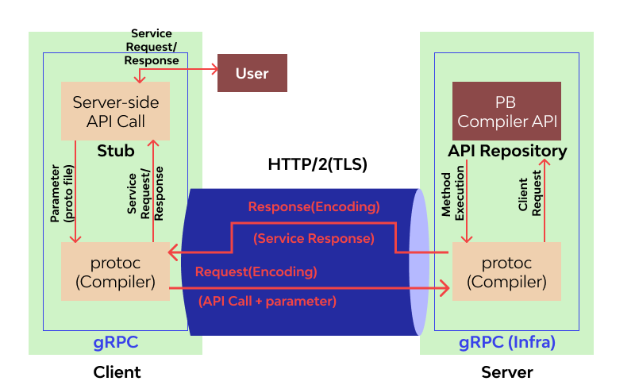

gRPC 分为Client端和Server端，底层基于HTTP2通信，内置了编解码模块，也定义好了Client和Server之间的调用方式，同时支持TLS加密，是一个完整的RPC框架。所以我们可以看到它在底层已经实现了网络通信、协议的设计、编解码框架等所有基础的工作。从使用的角度来说，gRPC 提供了各个语言的开发库，只需要集成对应语言的开发库，即可完成网络模块的开发，很轻便。


## 数据存储

RocketMQ 同 RabbitMQ 一样，数据存储模块也分为元数据存储和消息数据存储两部分。

### 元数据存储

RocketMQ 的元数据信息实际是存储在Broker上的，Broker启动时将数据上报到NameServer模块中汇总缓存。NameServer是一个简单的TCP Server，专门用来接收、存储、分发 Broker 上报的元数据信息。这些元数据信息是存储在NameServer内存中的，NameServer不会持久化去存储这些数据


Broker 启动或删除时，会调用NameServer的注册和退出接口，每个Broker都会存储自己节点所属的元数据信息（比如有哪些Topic、哪些Queue 在本节点上），在Broker启动时，会把全量的数据上报到 NameServer 中。

从部署形态上看，NameServer 是多节点部署的，是一个集群。 但是不同节点之间是没有相互通信的，所以本质上多个NameServer节点间数据没有一致性的概念，是各自维护自己的数据，由每台Broker上报元数据来维护每台 NameServer 节点上数据的准确性。

由于NameServer不负责具体消息数据的存储和分发，所以在请求频率、负载方面都不会很高。所以在大多数场景下，NameServer都是可以多集群共享的。从功能上看，它对RocketMQ的作用相当于RabbitMQ的Mnesia。


## 消息数据

RocketMQ 消息数据的最小存储单元是MessageQueue，也就是我们常说的Queue或Partition。Topic可以包含一个或多个MessageQueue，数据写入到Topic后，最终消息会分发到对应的MessageQueue中存储。


在底层的文件存储方面，并不是一个MessageQueue对应一个文件存储的，而是**一个节点对应一个总的存储文件，单个Broker 节点下所有的队列共用一个日志数据文件（CommitLog）来存储**，和RabbitMQ采用的是同一种存储结构。

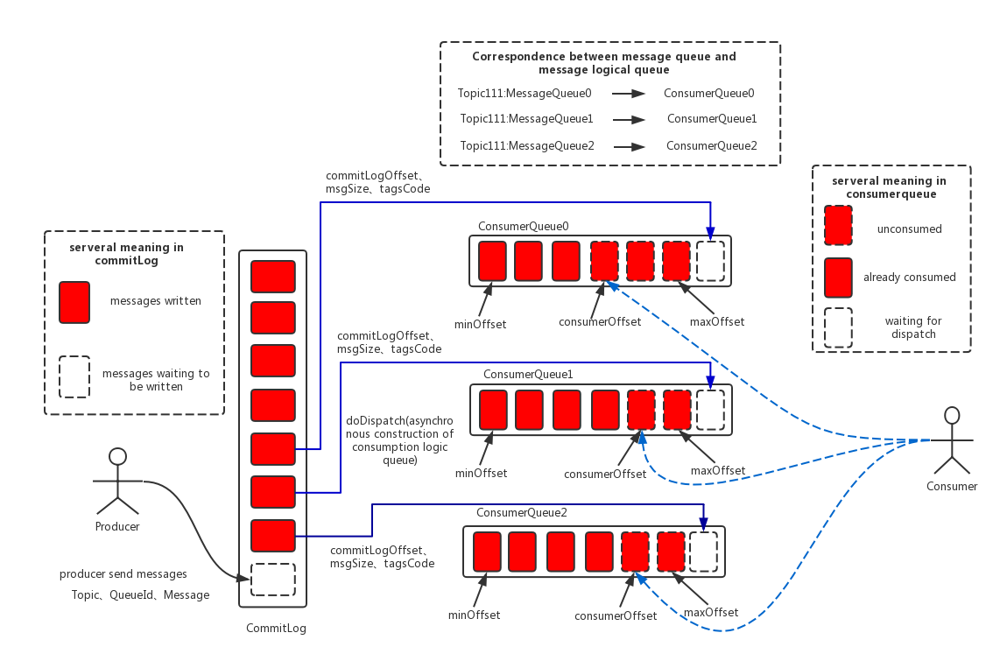

CommitLog、ConsumeQueue、IndexFile 三个跟消息存储相关的文件

* **CommitLog** 是消息主体以及元数据存储主体，每个节点只有一个，客户端写入到所有MessageQueue的数据，最终都会存储到这一个文件中。
* **ConsumeQueue** 是逻辑消费队列，是消息消费的索引，不存储具体的消息数据。引入的目的主要是提高消息消费的性能。由于RocketMQ是基于主题Topic的订阅模式，消息消费是针对主题进行的，如果要遍历Commitlog文件，基于Topic检索消息是非常低效的。Consumer可根据ConsumeQueue来查找待消费的消息，ConsumeQueue文件可以看成是基于Topic的CommitLog索引文件。
* **IndexFile** 是索引文件，它在文件系统中是以HashMap结构存储的。在RocketMQ中，通过Key或时间区间来查询消息的功能就是由它实现的。

值得关注的是，因为消息数据会很多，CommitLog 会存储所有的消息内容。所以为了保证数据的读写性能，我们会对CommitLog进行分段存储。**CommitLog底层默认单个文件大小为1G，消息是顺序写入到文件中，当文件满了，就会写入下一个文件**。对于 ConsumeQueue 和 IndexFile，则不需要分段存储，因为它们存储的是索引数据，数据量一般很小。

在消息清理方面，RocketMQ 支持按照时间清理数据。这个时间是按照**消息的生产时间计算的，和消息是否被消费无关，只要时间到了，那么数据就会被删除**。

不过跟RabbitMQ不同的是，RocketMQ 不是按照主题或队列维度来清理数据的，而是**按照节点的维度来清理的**。原因和RocketMQ 的存储模型有关，**上面说到RocketMQ所有Queue的日志都存储在一个文件中，如果要支持主题和队列单独管理，需要进行数据的合并、索引的重建，实现难度相对复杂，所以RocketMQ并没有选择主题和队列这两个维度的清理逻辑。**


## 生产者和消费者

RocketMQ的客户端连接服务端是需要经过客户端寻址的。如下图所示，首先和NameServer 完成寻址，拿到Topic/MessageQueue和Broker的对应关系后，接下来才会和Broker进行交互。


### 生产端

生产端的基础模块（如连接管理、心跳检测、协议构建、序列化等工作），则会以协议和网络层的设计为准，使用不同编程语言 SDK 完成对应的开发。**例如，在Java中，我们可以使用Netty 来构建客户端，进行TCP通信，根据Remoting协议构建请求数据，序列化后向服务端发起请求**，或者直接使用 gRPC 框架的客户端进行通信。

从生产端来看，生产者是将数据发送到Topic或者Queue里面的。如果是发送到Topic，则数据要经历生产数据分区分配的过程。 **即决定消息要发送到哪个目标分区。**

默认情况下，RocketMQ支持**轮询算法**和**最小投递延迟**算法两种策略。默认是轮询算法，该算法保证了每个Queue中可以均匀地获取到消息。**最小投递延迟算法会统计每次消息投递的时间延迟，然后根据统计出的结果将消息投递到时间延迟最小的Queue。**如果是直接发送到Queue，则无需经过分区选择，直接发送即可

由于**RocketMQ在协议层不支持批量发送消息的协议**，所以在SDK底层是没有等待、聚合发送逻辑的。所以如果需要批量发送数据，就需要在生产的时候进行聚合，然后发送。

为了满足不同的发送场景， **RocketMQ** **支持单向发送、同步发送、异步发送三种发送形式**。单向发送（Oneway）指发送消息后立即返回，不处理响应，不关心是否发送成功。同步发送（Sync）指发送消息后等待响应。异步发送（Async）指发送消息后立即返回，在提供的回调方法中处理响应。


### 消费端

在RocketMQ消费端，为了满足不同场景的消费需要，RocketMQ同时支持Pull、Push、Pop三种消费模型。

默认的消费模型是Pull，Pull的底层是以客户端会不断地去服务端拉取数据的形式实现的。Push 模型底层是以伪Push的方式实现的，即在客户端底层用一个Pull线程不断地去服务端拉取数据，拉到数据后，触发客户端设置的回调函数。让客户端从感受上看，是服务端直接将数据Push过来的。

当消费者和分区都很多的时候，因为消费重平衡会消耗很长时间，且重平衡期间的消费会暂停。而在客户端也需要感知到复杂的重平衡行为，各个语言的客户端需要较高的重复开发成本。所以，RocketMQ 推出了Pop模式，将消费分区、分区分配关系、重平衡都移到了服务端， **减少了重平衡机制给客户端带来的复杂性。**

RocketMQ 默认是通过**消费分组机制来消费的**。即在客户端消费数据的时候，会通过消费分组来管理消费关系和存储消费进度。从实现上看，**同一条消息支持被多个消费分组订阅，每个消费者分组可以有多个消费者**。

由于Topic和Queue模型的存在，在启动消费的时候，就需要先分配消费者和分区消费关系。这个过程就是 RocketMQ 消费端负载均衡。在实现中，消息按照哪种逻辑分配给哪个消费者，就是由消费者负载均衡策略所决定的。

分为消息粒度负载均衡和队列粒度负载均衡两种模式

**消息粒度负载均衡** 是指同一消费者分组内的多个消费者，将按照消息粒度平均分摊主题中的所有消息。即同一个队列中的消息，会被平均分配给多个消费者共同消费。


**队列粒度负载均衡** 是指同一消费者分组内的多个消费者，将按照队列粒度消费消息，即每个队列仅被一个消费者消费


消息粒度负载均衡就是我们之前在 [第08讲](https://time.geekbang.org/column/article/673672) 讲到的共享消费模式，而队列粒度负载均衡就是独占消费模式。大部分情况下，我推荐你优先使用队列粒度负载均衡。

当消费端消费数据成功后，就需要保存消费进度信息。RocketMQ通过提交消费位点信息来保存消费进度。在服务端，RocketMQ会为每个消费分组维护一份消费位点信息，信息中会保存消费的 **最大位点、最小位点、当前消费位点** 等内容。


客户端消费完数据后，就会调用Broker的消费位点更新接口，提交当前消费的位点信息。

消息被某个消费者消费完成后，不会立即在队列中被删除，以便当消费者客户端停止又再次重新上线时，会严格按照服务端保存的消费进度继续处理消息。如果服务端保存的历史位点信息已过期被删除，此时消费位点向前移动至服务端存储的最小位点。


## HTTP 协议支持和管控操作

RocketMQ原生不支持HTTP协议的生产消费，但是在一些云厂商的商业化版本是支持的。从技术上来看，HTTP协议的支持和gRPC的支持可以是一个技术思路，即通过使用Proxy模式来实现。

同样的，RocketMQ的管控也是不支持HTTP协议的操作的。RocketMQ的管控操作都是通过Remoting协议支持的，在gRPC协议中也不支持管控操作。即在Broker中，通过Remoting协议暴露不同的接口或者在NameServer中暴露TCP的接口，来实现一些对应的管控操作。

客户端 SDK 会集成调用服务端这些接口的逻辑。命令行工具就是通过客户端SDK来完成管控操作，也可以在代码中通过SDK来执行管控操作。


## 小结

现在我们来总结一下RocketMQ。

1. 协议层支持Remoting和gRPC两种协议。
2. 网络层是基于Java NIO框架Netty开发，底层也是通过多路复用、异步IO、Reactor模型等技术来提高网络模块的性能。
3. 存储层是基于多个MessageQueue的数据统一存储到一个文件的思路来设计的，同时也支持分段存储和基于时间的数据过期机制。
4. 元数据存储是使用 Broker + 自定义的NameServer之间的配合来实现的。
5. 客户端的访问需要经过客户端寻址机制，拿到元数据信息后，才直连Broker。
6. 生产端是将数据写入到Topic或分区，写入Topic时需要经过生产分区分配操作，确认最终写入的MessageQueue也支持多种写入方式。
7. 消费端有消费分组的概念，也需要在多个消费者和消费分组之间进行消费的负载均衡，最后通过提交消费位点的形式来保存消费进度。


# 12｜从基础功能拆解Kafka的架构设计与实现

你会发现Kafka和RocketMQ的架构是非常像的，那为什么今天我们还要单独拿出一节课来分析 Kafka 呢？因为它们俩面对的场景是不一样的，**一个是消息场景、一个是流场景，所以它们在底层的协议设计、存储模型、消费方式的实现上也是不一样的。**而实现的不同，又导致了它们在功能和性能上的表现不一样。

## Kafka 系统架构


Kafka 由 Producer、Broker、ZooKeeper、Consumer 四个模块组成。其中，ZooKeeper 用来存储元数据信息，集群中所有元数据都持久化存储在ZooKeeper 当中。

Kafka有Topic和分区的概念，分区就相当于RocketMQ的MessageQueue。一个Topic可以包含一个或多个分区。消费方面通过Group来组织消费者和分区的关系。

 **Kafka架构和RocketMQ非常像。** 从社区信息来看，RocketMQ最初的设计应该参考过Kafka，所以它们的架构和概念非常像，只是在具体实现方式上不太一样。比如概念上分区和MessageQueue的作用是一样的，元数据存储ZooKeeper和NameServer 的作用也是一样的。

使用 ZooKeeper 作为元数据存储服务会带来额外的维护成本、数据一致性和集群规模限制（主要是分区数）等问题。所以RocketMQ 使用NameServer替代ZooKeeper，Kafka 3.0 使用内置的Raft机制替代 ZooKeeper，就是为了解决这几个问题。

从消息的生命周期来看，生产者也需要通过客户端寻址拿到元数据信息。客户端通过生产分区分配机制，选择消息发送到哪个分区，然后根据元数据信息拿到分区Leader所在的节点，最后将数据发送到Broker。Broker收到消息并持久化存储。消费端使用消费分组或直连分区的机制去消费数据，如果使用消费分组，就会经过消费者和分区的分配流程，消费到消息后，最后向服务端提交Offset记录消费进度，用来避免重复消费。


## 协议和网络模块

Kafka 是自定义的私有协议，经过多年发展目前有V0、V1、V2三个版本，稳定在V2版本。官方没有支持其他的协议，比如HTTP，但是商业化的 Kafka 一般都会支持HTTP协议，原因还是 HTTP 协议使用的便捷性。

Kafka 协议从结构上来看包含协议头和协议体两部分， **协议头包含基础通用的信息，协议体由于每个接口的功能参数不一样，内容结构上差异很大。**

Kafka 服务端的网络层是基于 Java NIO和Reactor 来开发的，通过多级的线程调度来提高性能。


## 数据存储

### 元数据

Kafka的元数据是存储在ZooKeeper里面的。元数据信息包括Topic、分区、Broker节点、配置等信息。ZooKeeper 会持久化存储全量元数据信息，Broker 本身不存储任何集群相关的元数据信息。在Broker启动的时候，需要连接ZooKeeper读取全量元数据信息。

ZooKeeper是一个单独的开源项目，它自带了集群组网、数据一致性、持久化存储、监听机制等等完整的能力。它的底层是基于Zab协议组件集群，有Leader节点和Slave节点的概念，数据写入全部在Leader节点完成，Slave负责数据的读取工作。

从ZooKeeper的角度来看， **Kafka只是它的一个使用者**，Kafka用ZooKeeper的标准使用方式向ZooKeeper集群上写入、删除、更新数据，以完成Kafka的元数据管理、集群构建等工作。所以每台Broker启动时，都会在ZooKeeper注册、监听一些节点信息，从而感知集群的变化。

另外，Kakfa 集群中的一些如**消费进度信息、事务信息，分层存储元数据，以及3.0后的Raft架构相关的元数据信息，都是基于内置Topic来完成存储的。**把数据存储在内置Topic中，算是一个比较巧妙的思路了，也是一个值得借鉴的技巧。


### 消息数据

Kafka的数据是以分区为维度单独存储的。即写入数据到Topic后，根据生产分区分配关系，会将数据分发到 Topic 中不同的分区。此时底层不同分区的数据是存储在不同的“文件”中的，**即一个分区一个数据存储“文件”。这里提到的“文件”也是一个虚指，在系统底层的表现是一个目录，里面的文件会分段存储。**

当Broker收到数据后，是直接将数据写入到不同的分区文件中的。所以在消费的时候，消费者也是直接从每个分区读取数据。这个存储模型和RocketMQ、RabbitMQ都不像。


在底层数据存储中，Kafka的存储结构是以Topic和分区维度来组织的。一个分区一个目录，目录名称是TopicName + 分区号

```shell
/data/kafka/data#ll
drwxr-xr-x 2 root root 4096 2月  15 2020 __consumer_offsets-0
drwxr-xr-x 2 root root 4096 2月  15 2020 __consumer_offsets-1
drwxr-xr-x 2 root root 4096 2月  15 2020 __consumer_offsets-2
drwxr-xr-x 2 root root 4096 2月  15 2020 __transaction_state-0
drwxr-xr-x 2 root root 4096 2月  15 2020 __transaction_state-1
drwxr-xr-x 2 root root 4096 2月  15 2020 __transaction_state-2

```

每个分区的目录下，都会有 .index、.log、.timeindex 三类文件。其中，.log 是消息数据的存储文件，**.index 是偏移量（offset）索引文件，.timeindex 是时间戳索引文件。**两个索引文件分别根据 Offset 和时间来检索数据。

```shell
/data/data/data#ll __consumer_offsets-0
总用量 0
-rw-r--r-- 1 root root 10485760 11月 19 2020 00000000000000000000.index
-rw-r--r-- 1 root root        0 2月  15 2020 00000000000000000000.log
-rw-r--r-- 1 root root 10485756 11月 19 2020 00000000000000000000.timeindex
-rw-r--r-- 1 root root        0 2月  15 2020 leader-epoch-checkpoint
```

在节点维度，也会持久存储当前节点的数据信息（如 BrokerID）和一些异常恢复用的Checkpoint 等数据。

由于每个分区存储的数据量会很大，分区数据也会进行分段存储。分段是在.log进行的，文件分段的默认数据大小也是1G，可以通过配置项来修改。

**Kafka提供了根据过期时间和数据大小清理的机制，清理机制是在Topic维度生效的。** 当数据超过配置的过期时间或者超过大小的限制之后，就会进行清理。清理的机制也是延时清理的机制，它是根据每个段文件进行清理的，即整个文件的数据都过期后，才会清理数据。

特别说明的是，根据大小清理的机制是在分区维度生效的，不是Topic。即当分区的数据大小超过设置的大小，就会触发清理逻辑。这个机制和RocketMQ的清理机制是一致的，但RocketMQ只提供了按节点维度配置的消息过期机制，所以相比之下，根据分区维度存储能带来一定的便捷。

在存储性能上，Kafka的写入大量依赖顺序写、写缓存、批量写来提高性能。消费方面依赖批量读、顺序读、读缓存的热数据、零拷贝来提高性能。在这些技巧中，每个分区的顺序读写是高性能的核心。


## 生产者和消费者

Kafka 客户端在连接 Broker 之前需要经过客户端寻址，找到目标Broker的信息。在早期，Kafka 客户端是通过链接 ZooKeeper 完成寻址操作的，但是因为ZooKeeper的性能不够，如果大量的客户端都访问ZooKeeper，那么就会导致ZooKeeper超载，从而导致集群异常。

所以在新版本的Kafka中，客户端是通过直连Broker完成寻址操作的，不会跟ZooKeeper交互。即Broker跟ZooKeeper交互，在本地缓存全量的元数据信息，然后客户端通过连接Broker拿到元数据信息，从而避免对ZooKeeper造成太大负载。


## 生产者

生产者完成寻址后，在发送的时候可以**将数据发送到Topic或者直接发送到分区**。发送到Topic时会经过生产分区分配的流程，即根据一定的策略将数据发送到不同的分区。

**Kafka提供了轮询和KeyHash两种策略。**

轮询策略是指按消息维度轮询，将数据平均分配到多个分区。Key Hash是指根据消息的Key生成一个Hash值，然后和分区数量进行取余操作，得到的结果可以确定要将数据发送到哪个分区。生产消息分配的过程是在客户端完成的。


Kafka 协议提供了批量（Batch）发送的语义。所以生产端会在本地先缓存数据，根据不同的分区聚合数据后，再根据一定的策略批量将数据写入到Broker。因为这个Batch机制的存在，客户端和服务端的吞吐性能会提高很多。


客户端批量往服务端写有两种形式： **一种是协议和内核就提供了Batch语义，一种是在业务层将一批数据聚合成一次数据发送。** 这两种虽然都是批量发送，但是它们的区别在于：

1. 第一种批量消息中的每条消息都会有一个Offset，每条消息在Broker看来就是一条消息。第二种批量消息是这批消息就是一条消息，只有一个Offset。
2. 在消费端看来，第一种对客户端是无感的，一条消息就是一条消息。第二种需要消费者感知生产的批量消息，然后解析批量，逐条处理。


### 消费者

Kafka 的消费端只提供了Pull（拉）模式的消费。即客户端是主动不断地去服务端轮询数据、获取数据，消费则是直接从分区拉取数据的。Kafka提供了消费分组消费和直连分区消费两种模式，这两者的区别在于，是否需要进行消费者和分区的分配，以及消费进度谁来保存。

**大部分情况下，都是基于消费分组消费。** 消费分组创建、消费者或分区变动的时候会进行重平衡，重新分配消费关系。Kafka 默认提供了**RangeAssignor（范围）、RoundRobinAssignor（轮询）、 StickyAssignor（粘性）三种策略**，也可以自定义策略。消费分组模式下，一个分区只能给一个消费者消费，消费是顺序的。

当客户端成功消费数据后，会往服务端提交消费进度信息，**此时服务端也不会删除具体的消息数据，只会保存消费位点信息。位点数据保存在内部的一个 Topic（\_\_consumer\_offset）中。消费端同样提供了自动提交和手动提交两种模式。**当消费者重新启动时，会根据上一次保存的位点去消费数据，用来避免重复消费。


## HTTP 协议支持和管控操作

Kafka内核是不支持HTTP协议的，如果需要支持，则需要在Broker前面挂一层代理。如Confluent开源的 [Kafka Rest](https://github.com/confluentinc/kafka-rest)。

管控的大部分操作是通过Kafka Protocol暴露的，基于四层的TCP进行通信。还有部分可以通过直连ZooKeeper完成管控操作。

在早期很多管控操作都是通过操作ZooKeeper完成的。后来为了避免对ZooKeeper造成压力，所有的管控操作都会通过 Broker 再封装一次，即客户端SDK 通过Kafka Protocol调用Broker，Broker再去和ZooKeeper 交互。


Kafka 命令行提供了管控、生产、消费、压测等功能，其底层就是通过客户端SDK和Broker进行交互的。我们在代码里面也可以通过客户端SDK完成相应的操作， **不用必须通过命令行**。

因为历史的演进，在一些命令行里面，还残留着直连ZooKeeper的操作。而我们也可以通过直接操作ZooKeeper中的数据完成一些操作，比如更改配置、创建Topic等等。


## 小结

总结一下Kafka。

1. 协议层只支持私有的 Kafka Protocol协议。
2. 网络层是基于原生的Java NIO开发，底层也是通过多路复用、异步IO、Reactor模型等技术来提高网络模块的性能。
3. 存储层是每个分区对应一份具体的存储文件，分区文件在底层会分段存储，同时支持基于时间和大小的数据过期机制。
4. 元数据存储是通过ZooKeeper来实现的，所有的元数据都存储在ZooKeeper中。
5. 客户端的访问同样也需要经过客户端寻址机制。老版本可以通过ZooKeeper获取元数据信息，新版本只能通过Broker拿到元数据信息。拿到所有元数据信息后，才会直连Broker。
6. 生产端支持将数据写入到Topic或指定写入某个分区，写入Topic时需要经过生产分区分配操作，选择出最终需要写入的分区，同时支持批量写入的语义。
7. 消费端也有消费分组的概念，消费时需要在多个消费者和消费分组之间进行消费的负载均衡，同时也支持指定分区消费的模式。


# 13｜从基础功能拆解Pulsar的架构设计与实现

消息队列后起之秀的Pulsar，因为其**存算分离、多租户、多协议、丰富的产品特性、支持百万Topic等特点**，逐渐为大家所熟知。从定位来看，Pulsar 希望同时满足消息和流的场景。从技术上来看，它当前主要对标的是Kafka，解决 Kafka 在流场景中的一些技术缺陷，**比如计算层弹性、超大分区支持**等等。

## Pulsar 系统架构


Pulsar的架构就复杂很多了，它和其他消息队列最大的区别在于 Pulsar 是**基于计算存储分离的思想设计**的架构，所以 Pulsar 整体架构要分为**计算层和存储层两层**。我们通常说的 Pulsar 是**指计算层的 Broker 集群和存储层的 BookKeeper 集群两部分。**

计算层包含 Producer、Broker、ZooKeeper、Consumer 四个组件，用来完成MQ相关的功能。

存储层是独立的一个组件BookKeeper，是一个专门用来存储日志数据的开源项目，它由Bookies（Node）和ZooKeeper组成。

**BookKeeper** **本质上就是一个远程存储。** 比如Kafka的计算层是Broker，存储层是本地的硬盘空间，Broker收到数据后，通过本地文件的写入调用，如FileChannel，将数据写入到本地文件。Pulsar的计算层是Broker，存储层是远程的BookKeeper集群，Broker收到数据后，通过BookKeeper的客户端SDK将数据写入到BookKeeper集群中。

计算层和存储层其实是独立的。先部署一套存储的BookKeeper集群，然后一套或多套Pulsar集群可以将数据写入到同一套BookKeeper集群中。


**在Pulsar中，你还可以看到一套或者多套ZooKeeper。** 因为Pulsar 和 BookKeeper都是使用ZooKeeper来存储元数据的。在实际部署当中，为了节省资源的开销，通常Pulsar Broker集群和BookKeeper会共用一套ZooKeeper集群。

当你把 BookKeeper 当做一个存储来看，你会发现Pulsar计算层的架构和Kafka是一样的。Pulsar也有Topic、分区、订阅（消费分组）等概念，客户端也需要经过寻址操作发现Topic对应的Broker节点。Broker收到生产者的数据后，会将数据写入到BookKeeper存储。消费端会通过订阅（Subscription）来消费数据。

Pulsar会有一些自己的概念，比如Bundle、Bookie、Ledger、Entry等。这些概念都是和它的架构有关的，比如**Bundle是为了满足计算层弹性提出的概念**，**Bookie、Ledger、Entry是存储层BookKeeper的概念**。


## 协议和网络层

和Kafka一样，Pulsar Broker的协议也是自定义的私有协议。协议的格式是以行格式解析，即自定义的编解码格式。


## 小结


