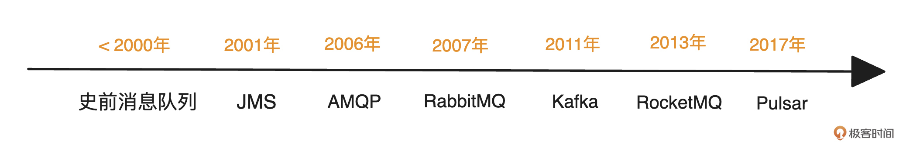
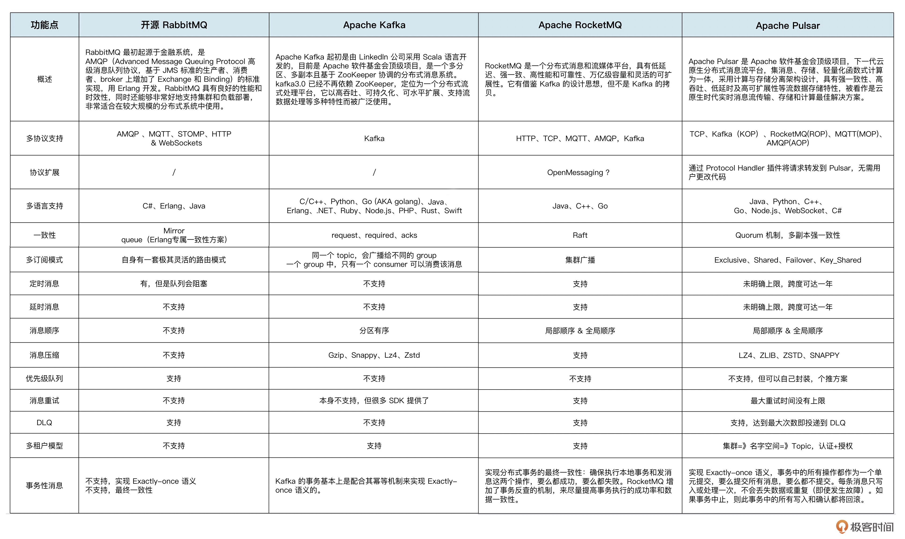
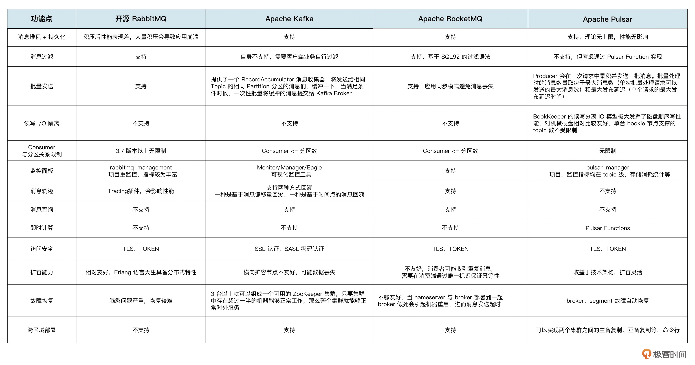

# 开篇词｜深度拆解核心原理，轻松掌握所有消息队列

##  怎么学习

从需求出发，理解设计原理、主流技术方案、方案之间的优劣、选型过程主要的思考点

----

# 01｜业界的主流消息队列是如何发展起来的？

## 真的需要标准消息队列吗

如果**没有大消息和大流量等复杂场景，是可以选用非标准消息队列产品的**。比如在用户状态审核的场景中，只需要向下游传递用户ID和审核结果，结构简单，数量有限。这时候选择非标准消息队列比如Redis和MySQL也是可以的。

**所以，是否选择使用标准消息队列产品，取决于你的数据和业务场景的需求。** 当数据量大、场景复杂后，才必须引入标准消息队列，因为它有高吞吐、持久化、长久堆积的特性。

从宏观上来讲，我会认为**具有缓冲作用、具备类发布和订阅能力的存储引擎**都可以称做消息队列。因为消息队列的最基本功能就是生产和消费，在发布订阅之上，扩展如死信队列、顺序消息、延时消息等高阶能力，并实现高吞吐、低延时、高可靠等特性，就成为了我们所熟知的功能齐全的标准消息队列。

## 业界都有哪些消息队列

>  RabbitMQ是2007年由国外一家叫做Rabbit的公司开源的，用Erlang 写成的消息队列。主要满足业务中消息总线的场景。特点是功能丰富，低流量下稳定性较高，基本具备消息队列所应该具备的所有功能。缺点是在大流量的情况下会有明显的瓶颈和稳定性风险。

基于JMS协议发展出来的ActiveMQ 因为功能和稳定性问题，用的人比较少。Kafka刚开源不久，功能只有生产和消费。AMQP协议的 Erlang 实现 RabbitMQ，因为功能丰富，稳定性较高，成为主流选择。

> ActiveMQ 项目最初是由 LogicBlaze 的创始人于 2004 年创建的，支持完成JMS规范的消息队列。因为生态、功能定位方面的原因，在国内用的人并不多。
>
> AMQP是一个消息队列协议规范，它不是一款具体的消息队列。因为不同消息队列的访问协议是不一样的，导致不同的消息队列需要用不同的SDK访问，客户的切换成本很高。2003年，多个金融服务机构希望制定一个消息队列的协议规范，希望不同的消息队列的协议都根据这个标准实现，这样就可以不需要重复开发SDK，不同的应用程序之间的交互和切换可以更简单、更方便。这就是AMQP的由来。

数据显示，到了2020 年 IBM MQ 每年在全球仍有近 10 亿美金的营收。现在国内各大云厂商消息队列的收入加起来，可能都不够IBM MQ的零头。

后来开源社区逐渐完善，阿里的 RocketMQ在2017年从Apache基金会毕业，Pulsar也在2018成为了Apache的顶级项目，开源社区生态逐渐繁荣，选择慢慢变多。

**RocketMQ 在定位上和 RabbitMQ 很像，功能丰富，在业务消息中经常会用到**。不过RocketMQ是在移动互联网浪潮下发展起来的，业务场景更加复杂，也支持更多功能，比如消息Tag、消息轨迹、消息查询等等。

除了功能层面，在架构和性能层面，RabbitMQ开发设计早，当时分布式的设计理念还不成熟，导致它在**架构层面的设计存在较大的缺陷，遇到大流量、高并发的时候，容易出现集群不可用、网络分区等情况无法解决**。而RocketMQ在分布式架构上实现得更合理优雅，在大流量、高并发的场景下表现优秀稳定。

> RocketMQ是2013年阿里研发，2016年开源，可满足大规模微服务场景的消息队列产品。可以理解为是RabbitMQ的高可用、分布式升级版。功能丰富，基本可以满足业务消息场景下的所有需求。**稳定性、数据可靠性方面的表现都较好。性能介于RabbitMQ和Kafka之间。**

**Pulsar和Kafka很像，主要定位在流领域，主打大吞吐的流式计算**。但Kafka的功能比较简单，支持基本的发布订阅、幂等、事务消息。Pulsar在满足这些功能的基础上，也希望支持RocketMQ和RabbitMQ的功能，所以功能最丰富

除了功能层面，在架构和性能层面上，Pulsar的架构设计比Kafka更符合当前云原生架构，它的定位是Kafka的升级版，主要解决Kafka当前的一些痛点问题，比如集群扩缩容慢、分区迁移需要Rebalance、无法支持超多分区等。性能目前没有特别大的差距。

不过Pulsar发展时间较短，架构较复杂，功能支持较多，当前阶段在稳定性上Kafka会比Pulsar好非常多。

> Pulsar 2017年由 Yahoo 开发的消息队列系统。一开始定位是流计算领域，可以理解为Kafka的升级版，近期希望同时发展消息和流两个方向。其架构上的设计理念较为优秀，比如计算存储分离、弹性、多租户。在功能上目前正在追赶RabbitMQ/RocketMQ。性能层面，和Kafka没有明显的差异。但当前阶段的稳定性还需要提升。

## 消息队列的发展脉络

发展脉络

1. 从需求发展路径上看，消息队列的发展趋势是： **消息 -> 流 -\> 消息和流融合**。
2. 从架构发展的角度来看，消息队列的发展趋势是： **单机 -> 分布式 -\> 云原生/Serverless**。

在90年代到21世纪初，以IBM MQ和AMQP为代表的消息队列主要满足业务上对消息的需求，**即异步通讯、架构解耦。**

2010年左右，移动互联网发展，大数据兴起，传统的消息队列在架构上无法满足大流量的吞吐需求，就发展出了以Kafka为代表的消息队列，**主打大吞吐、大流量**。我们也进入了分布式的时代，现在大家熟知的消息队列都是**分布式的架构，所以会有分区、副本、一致性概念**。

随着业务场景越来越复杂，业务消息的数据量也越来越大。基于开源AMQP的RabbitMQ在**性能和架构上已经无法满足消息场景的需求，从而发展出了RocketMQ。**

近几年随着云计算的发展、云原生和Serverless的理念兴起，在弹性、成本的驱动下，消息队列的架构往云原生/Serverless方向演变，简单来说，就是利用云上的弹性计算、存储等基础设施去实现架构的Serverless，按需使用、按量付费，最终达到使用端感受到的免运维、低成本。

基于云原生架构设计的Pulsar开始走向成熟，业界的MQ也出现了 **计算存储分离、分层存储、多租户、弹性计算等概念**。

##  什么是消息和流？

- 消息就是业务消息，在业务架构（比如微服务架构）中用来作消息传递，做系统的消息总线，比如用户提交订单的流程。
- 流，就是在大数据架构中用来做大流量时的数据削峰，比如日志的投递流转。

为什么会有消息和流融合的这个趋势呢?

虽然消息队列是基础组件，但是功能比较单一，主要是缓冲作用，在消息、流的方向上，功能需求一直是相对固定的，细分的市场也都有领头组件，**流领域目前是Kafka一家独大**，消息领域的头部玩家，国外是RabbitMQ，国内是RocketMQ。

对MQ厂商来说，如果希望扩大产品份额或者新品抢占市场，就需要有 **独特竞争力，核心就是自己产品的功能和成本，** 即功能更多更丰富、成本更低。这里的成本指的是能为客户，也就是消息队列使用者，节省多少资源、人力成本。

**如果有一款消息队列满足所有场景，只需要部署一款消息队列，就能满足所有业务的需求，这种设计思想是非常有商业价值的**。

现在我们也可以看到业界主流的4款消息队列，在消息和流的融合上各有动作。

- RabbitMQ因为开发语言、架构和社区的活跃度、定位的原因，基本不会走这条路。
- Kafka虽然也强调云原生，但目前主要工作在自身的架构优化上，比如去ZooKeeper，暂时在消息方向没有提出明确概念。但在我看来，未来Kafka应该会往这个方向转变，因为流的场景始终会有瓶颈，打通一个新方向在商业上肯定是有价值的。
- RocketMQ在消息领域已经非常成熟，社区也希望打通流的场景，扩展使用范围，提升竞争力，抢占市场，也在往这个方向努力。
- Pulsar是一个新兴架构，没有历史包袱，主打的就是云原生的消息和流的融合架构，希望满足更多场景，解决更多业务需求。

## 小结

现在你应该能解答我们开头提出的问题了，**广义上讲，消息队列是有缓冲作用、具备类发布和订阅能力的存储引擎**。而技术方案如何选择消息队列，**来源于业务场景和数据量**。如果只需要最基本的生产和消费功能，可以不用标准消息队列产品，大部分公司或业务的场景下，一款消息队列就能满足所有需求了。

**技术的演进都是商业驱动的**，消息队列的演进，无论是从需求发展路径上看是消息 -> 流 -> 消息和流融合，还是从架构发展角度的单机 -> 分布式 -\> 云原生/Serverless，本质其实都是在思考如何降低成本和吸引客户。

为了降低成本，弹性是最基础的要求。所以消息队列在技术上，对计算弹性的需求提出了计算存储分离架构，对低存储成本的需求提出了分层存储的概念，对资源复用的需求提出了多租户的概念。

为了吸引客户，各个消息队列都在尽量提高自己的竞争力，围绕着功能、容灾、多架构、生态建设展开。

不过要注意，消息和流只是业界的趋势，不是我们作为使用者必然的非此即彼的选择。在开发者实际使用的时候，我也发现很多人会将Kafka当做一个业务消息总线在用，也有人使用RocketMQ传递大流量的日志，当做大数据架构中的管道在用。

----

# 02｜消息队列在架构和功能层面都包含哪些概念？

消息队列的定位就是 **总线和管道**，主要起到解耦上下游系统、数据缓存的作用。它不像数据库，会有很多计算、聚合、查询的逻辑，它的主要操作就是 **生产和消费**。所以，我们在业务中不管是使用哪款消息队列，我们的核心操作永远是生产和消费数据。

一般情况下，我们会在需要**解耦上下游系统、对数据有缓冲缓存需求或者需要用到消息队列的某些功能（比如延时消息、优先级消息）的时候选择使用消息队列**，然后再根据实际需求选型。

## 架构层面的基本概念

1. **Broker** 
2. **Topic（主题）**
3. **Partition/Queue/MessageQueue（分区/分片）**
4. **Producer（生产者）**
5. **Consumer（消费者）**
6. **ConsumerGroup/Subscription（消费分组/订阅）**
7. **Message（消息）**
8. **Offset/ConsumerOffset/Cursor（位点/消费位点/游标)**
9. **ACK/OffsetCommit（确认/位点提交）**
10. **Leader/Follower（领导者/追随者，主副本/从副本**
11. **Segment（段/数据分段)**
12. **StartOffset/EndOffset（起始位点/结束位点）**
13. **ACL（访问控制技术）**

## 功能层面的基本概念

1. **顺序消息**
2. **延时消息/定时消息**
3. **事务消息**
4. **消息重试**
5. **消息回溯**
6. **广播消费**
7. **死信队列**
8. **优先级队列**
9. **消息过滤**
10. **消息过期/删除（TTL）**
11. **消息轨迹**
12. **消息查询**
13. **消息压缩**
14. **多租户**
15. **消息持久化**
16. **消息流控**

### 核心差异与选型参考

1. **RabbitMQ**：**成熟稳定，协议支持最广**，适合对AMQP、MQTT等协议有强需求，或需要复杂路由规则的业务。但其在**海量消息堆积、高吞吐、事务消息和云原生扩展性**方面是短板。
2. **Kafka**：**高吞吐、流处理的标杆**，生态极其成熟。适合**日志采集、大数据管道、实时流处理**等场景。但在**消息路由、延时消息、事务消息**等方面功能相对基础，扩容运维较复杂。
3. **RocketMQ**：**阿里巴巴出品，金融级稳定性**，在**事务消息、顺序消息、延时/定时消息、消息查询**等方面功能丰富且稳定。适合**电商、金融等对一致性、可靠性要求极高**的场景。
4. **Pulsar**：**云原生架构的新星**，**存储计算分离、无限主题、多租户、极致扩展性、IO隔离**是其核心优势。功能全面，支持多协议，是**追求云原生、多租户、未来扩展性**的首选，但社区和生态成熟度仍在追赶中。

**总结建议**：

- 追求**极简、稳定、协议多样** -> **RabbitMQ**
- 构建**大数据管道、日志流** -> **Kafka**
- 需要**强事务、高可靠、功能全面**的金融级应用 -> **RocketMQ**
- 面向**云原生、海量主题、多租户隔离、极致扩展**的未来架构 -> **Pulsar**

