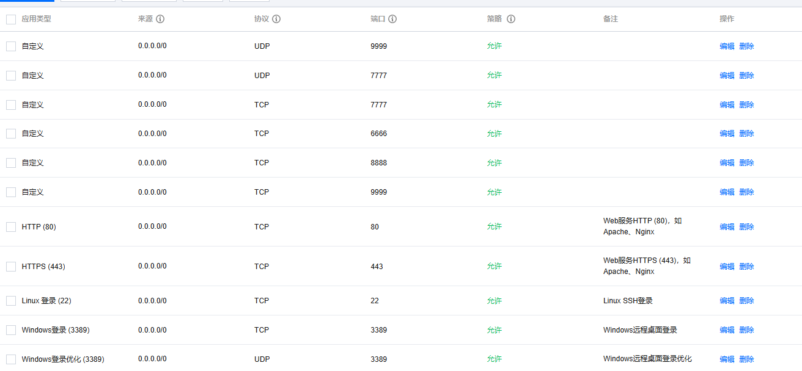
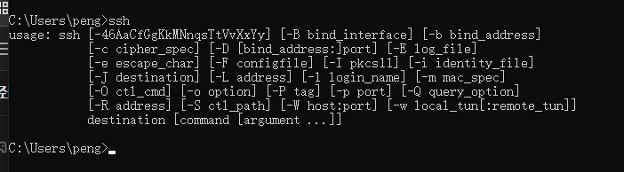

# SSH 反向代理搭建

## 需求

在公司电脑（Window A）想要远程家里的电脑（Window B）。

1. 使用过 ToDesk 、向日葵等类型的远程，发现网络带宽或者是画面清晰度不够，只能做兜底方案。

2. 使用过 ZeroTier （每个客户端都需要安装） 作为内网穿透，直接使用 Window 的远程桌面，能使用，但是在公司电脑主动安装这类软件不太放心，不建议使用，并且没有使用 Moon，在没有P2P的情况下，还是会很卡。不使用该方案。

3. 使用过 网穿云、贝锐花生壳中免费的内网穿透软件。这个只需要在家里电脑（Window B）上面安装，使用服务端（网穿云、贝锐花生壳）提供的代理隧道和公网地址访问，在公司电脑（Window A）中直接使用远程连接。

   个人觉得，这个在保证带宽稳定和画面清晰度情况下，最好用。缺点是，大部分只提供免费的1Mbps的带宽、有限的流量、有限的隧道数量。但是还是比 ToDesk清晰。

   

>  家里电脑同时开着  贝锐花生壳、ToDesk 作为方案兜底

----

## 方案

根据上面，想实现购买一个云服务器（公网地址）自己做一个代理隧道，类似上面的第三点的方案，就是自己使用云服务器搭建隧道。

目前发现 ssh 的实现简单，先参考网络材料一下实现，后面使用其他的协议做隧道。

## 购买云服务器

选择了腾讯云最便宜的包年的轻应用服务器，要有公网 IP（2C2G3M）,这里可以考虑带宽大一点就行。

## 服务器搭建

主要的一些配置

1. 选择了 CentOS  这个只要是Linux就行

2. 确保安装了 ssh 服务，基本都是自带的，没有就命令行更新一下

3. 一些必要配置 `/etc/ssh/sshd_config` 文件改一下参数

   1. **GatewayPorts yes**   监听端口可以绑定到任意其他IP,不然只有本机127.0.0.1可以访问

      重启一下ssdh服务 `sudo service sshd restart`

   2. **TCPKeepAlive yes** 

   3. **PubkeyAuthentication yes**  这个是后面使用公钥验证的时候方便一点

   4. **AuthorizedKeysFile .ssh/authorized_keys**  这个是后面使用公钥验证的时候方便一点

4. 服务的一些防火墙部分的，端口要开启部分，看个人需求配置就行

   ​	

## 家里电脑配置

1. 需要支持 ssh 连接

   

2. 使用 ssh -R 来使用远端代理，这个就是如果有流量到远端服务器指定端口，将这个转发到本地服务中处理。

   ```
   -R 远程主机端口:目标主机:目标主机端口
   -f 后台执行
   -N 不执行远程命令. 用于转发端
   ssh -f -N -R 9999:127.0.0.1:3389 root@1.1.1.1
   这里就是本地（127.0.0.1）的3389 端口 远程绑定到 服务器（1.1.1.1）的9999端口

3. ssh 认证中有两种密码和密钥
   1. 密码 
   2. 密钥
      1. 本地使用 `ssh-keygen` 生成公钥和私钥(不要给其他人)，然后把公钥加入到服务器中（sh-copy-id root@1.1.1.1 window不可用）放入到` ~/.ssh/authorized_keys`文件中
4. 这个时候执行刚刚的 ssh -R 就可以连接上，并且实现了ssh的代理了

> 注意服务器的防火墙，规则要配置好

5. 可以把对应的 命令写成 run.bat 方便一点

   ```
   @echo off
   
   ::setting
   
   set HOST=1.1.1.1(换成你的)
   
   set KEY_FILE=C:\Users\peng\.ssh\id_ed25519(换成你的)
   
   set MONITOR_PORT=9999(换成你的)
   
   set LOCAL_PORT=3389(换成你的)
   
   set AUTOSSH_PATH=C:\Users\peng\Desktop\autossh-cygwin\ssh.exe(换成你的)
   
   set LOG_PATH=C:\Users\peng\Desktop\autossh-cygwin\logfile.txt(换成你的)
   
   ::启动 SSH 隧道连接，并记录日志
   %AUTOSSH_PATH% -o ServerAliveInterval=60 -o StrictHostKeyChecking=no -i %KEY_FILE% root@%HOST% -p 22 -R %MONITOR_PORT%:localhost:%LOCAL_PORT% -f -N >> %LOG_PATH% 2>&1
   ```

   这里怕对应的错误在-f-N 看不到就用文件记录了

6. 把 bat 作为一个Window服务，更加方便使用，开机也可以自启（bat也可以设置定时任务启动）

   使用 nssm 把这个 run.bat 作为一个服务，然后启动

   

## 公司电脑连接测试

直接用 mstsc 使用 服务器的IP:端口  可用


## 参考

[Win10使用SSH反向隧道(端口转发)连接远程桌面](https://www.cnblogs.com/peakgrin/p/17020117.html)

[NSSM使用说明](https://juejin.cn/post/6981055330964733989)